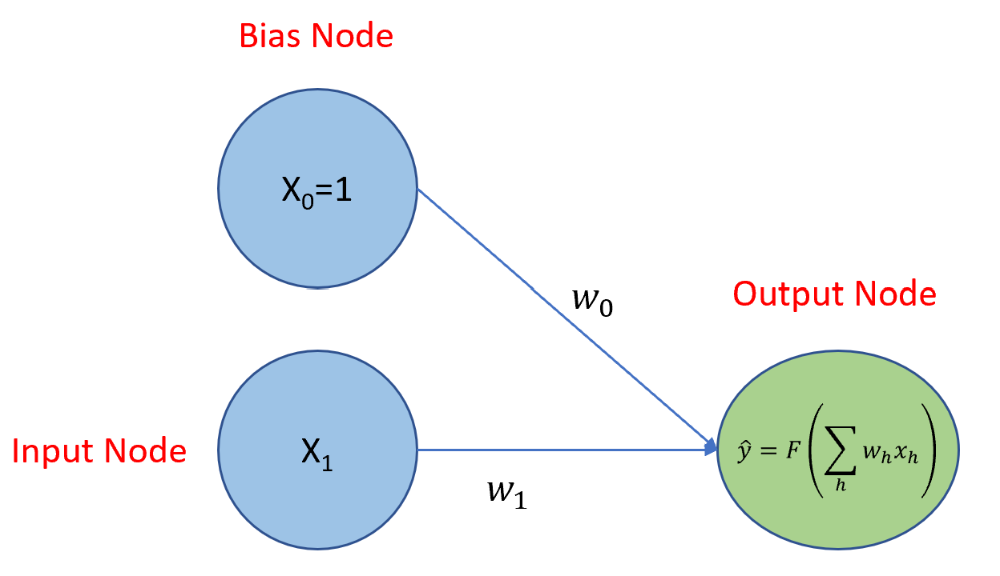
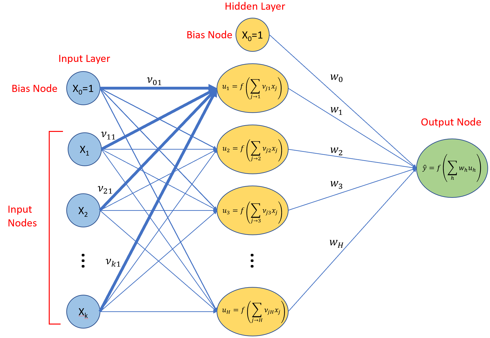

# Introduction to DOE for M&S

## Background.

This course was developed at the behest of the leadership of the Wargaming and Simulation Directorate (WSD) at TRAC Fort Leavenworth as a means of institutionalizing the use of design of experiments (DOE) for simulation in the directorate.  As part of an evolving mission, the organization found it prudent to develop and use this capability to support studies for Army Futures Command and others.

The primary authors of the course, Majors Steve Gillespie and John King have used DOE for simulation based on the curricula offered by the Naval Postgraduate School's Systems Engineering and Operations Research departments.  We do not claim to have originated any of these ideas, we are simply conveying them.  We make every attempt to properly cite the relevant authority for ideas.  Any and all errors are ours alone.

## Mission.

The purpose of this training is to educate and train analysts in the use of design of experiments (DOE) for simulation analysis.  It is intended to be approximately as in depth as a general college course in DOE, but focused specifically on the needs of military (uniformed and civilian) analysts using simualtion to inform senior military leaders.

This training has three major goals: 

1. Enable and support simulation analysis.
2. Serve as an enduring resource.
3. Build the community of simulation analyst practitioners.

### Simulation Analysis.

First and foremost, this training must enable the Wargaming and Simulation Directorate to support TRAC and Army Futures Command answer expansive, ill-defined, and quick turn problems using modern simulation techniques.  This means developing capable practitioners in the design and analysis of experiments and equipping them with the appropriate methodology, knowledge, experiments, and tools for this requirement.

This training is unapologetically focused on WSD requirements and the application of Design and Analysis of Experiments to simulation, but is broadly useful to others.

### Enduring Resource.

While distinct training events are useful, people change jobs, PCS, and forget.  As much as possible, this training will develop and consolidate resources for learning and applying the Design and Analysis of Experiments so that others may use it for their own purposes and analysts can refer back to it.

### Community.

Analysis is a team sport. This training is intended to bring the Design and Analysis of Experiments team together, across divisions, directorates, centers, and the wider ORSA community.  This enables knowledge sharing and innovation.

## Concept.

This project has two major, mutually supporting, efforts:  

+ The first is developing and executing the training itself. 
+ The second is building the community that can use the training and enabling community sharing and innovation.

## Training Concept

The training LOE is the most significant portion of this project.  The precise curriculum is defined below.  In general, the training consists of lessons, projects, and assessments.

### Lessons.

Lessons form the bulk of the curriculum.  We take an active learning approach, where instructors provide learning resources (readings, videos, and tutorials) for students who prepare ahead of the lesson meeting.  When students and instructors meet, they then use that time to answer any questions on the material and work through problems or projects by applying the material from the lesson.  This: 1) allows students to devote the appropriate amount of time toward preparing for their lesson based on their own background knowledge and learning style, 2) affords flexibility for basic knowledge acquisition at a time that is convenient to each person, and 3) maximizes "in class" time for learning by doing.

The general flow of each lesson follows the format below:

#### Develop lesson. (Instructor)

For each lesson, the instructor will do the following:

1. Identify lesson objectives.
2. Develop / provide resources.
3. Develop / provide practice problems.
4. Develop / provide assessment mechanism.

#### Prepare for lesson. (Student)

For each lesson students will (ahead of the lesson):

1. Study any assigned readings / videos.
2. Work through any assigned tutorials.
3. Prepare for the lesson lab (i.e., install appropriate software, download appropriate data).

#### Conduct lesson lab. (Student & Instructor)

For each lesson lab, the students and instructors will:

1. Review and answer any questions about the material.
2. Work through a set of problems.

<font color = 'red'> Lesson labs will **NOT** be a rehashing of the reading and videos.  Students who do not prepare ahead of time will likely not be able to work through the lab. </font>

#### Assess progress. (Student & Instructor)

For each lesson, the students and instructors will jointly assess their progress, either formally or through an informal discussion.  Instructors will then decide if and how to modify the curriculum to either provide additional instruction or speed up the pace of the instruction.

For each lesson, students will provide feedback on the reading, videos, and/or tutorial so that the final published version of the lesson captures any lessons learned.

### Projects.

We find that projects are the most useful means of learning.  Due to the nature of the course, most of the projects will involve the use of TRAC's internal simulations which reside on classified networks.  Unfortunately, we will not be able to share these openly.

### Assessments.

Each section will have a problem set with an associated solution set.  Students may work these problem sets and the course directors will provide feedback for local students.

### Curriculum.

The curriculum for this course is divided into sections.  Each section has multiple lessons, and each lesson has multiple objectives.  These are seen as follows:

#### Sections


```{=html}
<div id="htmlwidget-e54f36f10d958d7eb423" style="width:100%;height:auto;" class="datatables html-widget"></div>
<script type="application/json" data-for="htmlwidget-e54f36f10d958d7eb423">{"x":{"filter":"none","vertical":false,"data":[[1,2,3,4,5,6,7],["R Fundamentals","Statistics Review","Fundamentals of Design of Experiments (DOE)","Basic Regression","Applications","Advanced Topics","Optional Advanced Topics"]],"container":"<table class=\"display\">\n  <thead>\n    <tr>\n      <th>Number<\/th>\n      <th>Name<\/th>\n    <\/tr>\n  <\/thead>\n<\/table>","options":{"scrollX":true,"initComplete":"function(settings, json) {\n$(this.api().table().container()).css({'font-size': '50%'});\n}","columnDefs":[{"className":"dt-right","targets":0}],"order":[],"autoWidth":false,"orderClasses":false},"selection":{"mode":"multiple","selected":null,"target":"row","selectable":null}},"evals":["options.initComplete"],"jsHooks":[]}</script>
```

#### Lessons


```{=html}
<div id="htmlwidget-d22694381d9da172398b" style="width:100%;height:auto;" class="datatables html-widget"></div>
<script type="application/json" data-for="htmlwidget-d22694381d9da172398b">{"x":{"filter":"top","vertical":false,"filterHTML":"<tr>\n  <td data-type=\"number\" style=\"vertical-align: top;\">\n    <div class=\"form-group has-feedback\" style=\"margin-bottom: auto;\">\n      <input type=\"search\" placeholder=\"All\" class=\"form-control\" style=\"width: 100%;\"/>\n      <span class=\"glyphicon glyphicon-remove-circle form-control-feedback\"><\/span>\n    <\/div>\n    <div style=\"display: none;position: absolute;width: 200px;opacity: 1\">\n      <div data-min=\"1\" data-max=\"7\"><\/div>\n      <span style=\"float: left;\"><\/span>\n      <span style=\"float: right;\"><\/span>\n    <\/div>\n  <\/td>\n  <td data-type=\"factor\" style=\"vertical-align: top;\">\n    <div class=\"form-group has-feedback\" style=\"margin-bottom: auto;\">\n      <input type=\"search\" placeholder=\"All\" class=\"form-control\" style=\"width: 100%;\"/>\n      <span class=\"glyphicon glyphicon-remove-circle form-control-feedback\"><\/span>\n    <\/div>\n    <div style=\"width: 100%; display: none;\">\n      <select multiple=\"multiple\" style=\"width: 100%;\" data-options=\"[&quot;Advanced Topics&quot;,&quot;Applications&quot;,&quot;Basic Regression&quot;,&quot;Fundamentals of Design of Experiments (DOE)&quot;,&quot;Optional Advanced Topics&quot;,&quot;R Fundamentals&quot;,&quot;Statistics Review&quot;]\"><\/select>\n    <\/div>\n  <\/td>\n  <td data-type=\"number\" style=\"vertical-align: top;\">\n    <div class=\"form-group has-feedback\" style=\"margin-bottom: auto;\">\n      <input type=\"search\" placeholder=\"All\" class=\"form-control\" style=\"width: 100%;\"/>\n      <span class=\"glyphicon glyphicon-remove-circle form-control-feedback\"><\/span>\n    <\/div>\n    <div style=\"display: none;position: absolute;width: 200px;opacity: 1\">\n      <div data-min=\"1\" data-max=\"7\"><\/div>\n      <span style=\"float: left;\"><\/span>\n      <span style=\"float: right;\"><\/span>\n    <\/div>\n  <\/td>\n  <td data-type=\"factor\" style=\"vertical-align: top;\">\n    <div class=\"form-group has-feedback\" style=\"margin-bottom: auto;\">\n      <input type=\"search\" placeholder=\"All\" class=\"form-control\" style=\"width: 100%;\"/>\n      <span class=\"glyphicon glyphicon-remove-circle form-control-feedback\"><\/span>\n    <\/div>\n    <div style=\"width: 100%; display: none;\">\n      <select multiple=\"multiple\" style=\"width: 100%;\" data-options=\"[&quot;Aliasing&quot;,&quot;ANOVA&quot;,&quot;Assessing Designs&quot;,&quot;AWARS Project - Fundamentals&quot;,&quot;Basic Statistical Concepts&quot;,&quot;Blocking&quot;,&quot;Central Composite Designs&quot;,&quot;Classification and Regression Trees&quot;,&quot;Confounding&quot;,&quot;Decision Trees&quot;,&quot;Descriptive Statistics&quot;,&quot;Fractional Factorial Design&quot;,&quot;Full Factorial Design&quot;,&quot;Generalized Additive Model&quot;,&quot;Intro to DOE&quot;,&quot;Introduction to R&quot;,&quot;Lasso Regression&quot;,&quot;Latin Hypercubes&quot;,&quot;Logistic Regression&quot;,&quot;Markdown&quot;,&quot;Multiple Linear Regression&quot;,&quot;Nearly Orthogonal Latin Hypercubes&quot;,&quot;Neural Networks&quot;,&quot;Polynomial Regression&quot;,&quot;R for Data Science&quot;,&quot;Regression on Transformed Variables&quot;,&quot;Ridge Regression&quot;,&quot;Robust Design&quot;,&quot;Sequential Designs&quot;,&quot;Shifting &amp; Stacking&quot;,&quot;Simple Linear Regression&quot;,&quot;Statistical Inference&quot;,&quot;Support Vector Machines&quot;]\"><\/select>\n    <\/div>\n  <\/td>\n  <td data-type=\"character\" style=\"vertical-align: top;\">\n    <div class=\"form-group has-feedback\" style=\"margin-bottom: auto;\">\n      <input type=\"search\" placeholder=\"All\" class=\"form-control\" style=\"width: 100%;\"/>\n      <span class=\"glyphicon glyphicon-remove-circle form-control-feedback\"><\/span>\n    <\/div>\n  <\/td>\n<\/tr>","data":[[1,1,1,2,2,2,2,3,3,3,3,3,3,3,4,4,4,4,5,6,6,6,6,6,6,6,7,7,7,7,7,7,7],["R Fundamentals","R Fundamentals","R Fundamentals","Statistics Review","Statistics Review","Statistics Review","Statistics Review","Fundamentals of Design of Experiments (DOE)","Fundamentals of Design of Experiments (DOE)","Fundamentals of Design of Experiments (DOE)","Fundamentals of Design of Experiments (DOE)","Fundamentals of Design of Experiments (DOE)","Fundamentals of Design of Experiments (DOE)","Fundamentals of Design of Experiments (DOE)","Basic Regression","Basic Regression","Basic Regression","Basic Regression","Applications","Advanced Topics","Advanced Topics","Advanced Topics","Advanced Topics","Advanced Topics","Advanced Topics","Advanced Topics","Optional Advanced Topics","Optional Advanced Topics","Optional Advanced Topics","Optional Advanced Topics","Optional Advanced Topics","Optional Advanced Topics","Optional Advanced Topics"],[1,2,3,1,2,4,3,1,2,3,4,5,6,7,1,2,3,4,1,1,2,3,4,5,6,7,1,2,3,4,5,6,7],["Introduction to R","R for Data Science","Markdown","Descriptive Statistics","Basic Statistical Concepts","ANOVA","Statistical Inference","Intro to DOE","Full Factorial Design","Fractional Factorial Design","Blocking","Confounding","Aliasing","Assessing Designs","Simple Linear Regression","Multiple Linear Regression","Polynomial Regression","Regression on Transformed Variables","AWARS Project - Fundamentals","Central Composite Designs","Latin Hypercubes","Nearly Orthogonal Latin Hypercubes","Lasso Regression","Ridge Regression","Classification and Regression Trees","Generalized Additive Model","Shifting &amp; Stacking","Robust Design","Sequential Designs","Logistic Regression","Decision Trees","Support Vector Machines","Neural Networks"],["Introduce the programming language R, standard data types, basic functionality, and R resources.","Introduce R concepts for data science.","Introduce the concept of R markdown for analysis visualization.","Review foundational descriptive statistics and methods for conducting descriptive statistics in R.",null,null,null,"Montgomery Chapter 1",null,null,null,null,null,null,null,null,null,null,null,null,null,null,null,null,null,null,"TBP","TBP","TBP","TBP","TBP","TBP","TBP"]],"container":"<table class=\"display\">\n  <thead>\n    <tr>\n      <th>Section #<\/th>\n      <th>Section Name<\/th>\n      <th>Lesson Number<\/th>\n      <th>Lesson_Name<\/th>\n      <th>Lesson Description<\/th>\n    <\/tr>\n  <\/thead>\n<\/table>","options":{"scrollX":true,"pagelength":5,"initComplete":"function(settings, json) {\n$(this.api().table().container()).css({'font-size': '50%'});\n}","columnDefs":[{"className":"dt-right","targets":[0,2]}],"order":[],"autoWidth":false,"orderClasses":false,"orderCellsTop":true},"selection":{"mode":"multiple","selected":null,"target":"row","selectable":null}},"evals":["options.initComplete"],"jsHooks":[]}</script>
```

#### Objectives

The individual objectives for each lesson are listed in their corresponding chapter.

## Community Concept

Analytic skills and knowledge in of themselves are:

1. Useless in a vacuum.
2. Perishable.

As such, we believe it is important to build a self-sustaining community that innovates, shares, and includes others.  This course is purposefully being shared on the web (as opposed to a single organization's sharepoint) as it allows analysts from across the community to participate.  

As this project develops, we will advance the capacity to share DOE and simulation specific topics.  In the meantime, please contact us if you would like to participate.

## Admin

### Contact

If you need to contact us, please email us at stephen.e.gillespie.mil@mail.mil or john.f.king1.mil@mail.mil.

### Errors

If you identify errors:

1. The errors are ours alone and we sincerely apologize.
2. Please contact us and we will rectify them.

### Resources

As much as possible, we attempt to use freely available resources.  

+ In general, resources are cited as direct links to where the content is hosted.
+ We attempt to minimize the use of books with one exception:  *The Design and Analysis of Experiments* by Douglas Montgomery which is widely available.
+ Analytic resources:
    + We have opted to use *R* as it is 1) freely available and 2) widely used across the military analytic community.
    + We are developing this course using *R* on www.matrixds.com as it is 1) free and 2) free of the restrictions of NIPR.  
    + You are more than welcome to use other resources, programming languages, and other such things.  For example, the python package *pyDOE* is quite useful.  If you recreate any of our tutorials using a different language (or in R, but better), please share!
+ Simulation resources:
    + We will provide simple examples using toy simulations, but developing a large, open-source, easy to use simulation for everyone is beyond the scope of this project.  If someone has a good option, please share!
    + For analysts working at TRAC Fort Leavenworth, we will work examples for projects using the AWARS simulation.  Unfortunately, we cannot share this beyond TRAC Fort Leavenworth.


<!--chapter:end:index.Rmd-->

# Introduction to R


For any noted issues in this chapter (especially errors), please contact: <a href="mailto:john.f.king1.mil@mail.mil">John King</a> or <a href="jacob.s.sherman2.civ@mail.mil">Jacob Sherman</a>.

R is a programming language and free software environment widely used for statistical computing and graphics. R may be launched from Windows by selecting the Start menu, opening the R folder, and choosing R x64 3.6.0. This starts an R session and opens an R Console where you may interact with R via one-line commands. Many R users prefer a more full-featured environment to interact with R, and for this course of instruction we will use the popular R Studio Interactive Development Environment (IDE).

R Studio may be launched via Windows start menu, but there are also cloud-based options such as Amazon Web Services and MatrixDS. If you are launching R Studio for the first time, when it starts, you should see three panels. On the left is the console, and on the right are two panels with several tabs each that display charts, allow for file browsing, etc. To start a new R script, go to File >> New File >> R Script. This will open a fourth panel on the left that is essentially just a text editor where you write R code. For an R Studio IDE cheat sheet, click <a href = "https://github.com/rstudio/cheatsheets/raw/master/rstudio-ide.pdf"> here </a>. To interact with R in R Studio, simply type a command in the text editor panel, place the cursor anywhere on the command line, and press CTRL+ENTER (no need to select the text as in SQL). 

## Introduction to R - Part I

For this course, we will use the online tutorial <a href = "https://r4ds.had.co.nz"> R for Data Science </a> to develop your R skills. The tutorial assumes that users have no knowledge of R or any other programming language. When completing these exercises, write your code in an R Markdown file. Generally, one code block per question will be appropriate. You can either start your own R markdown file from R Studio, or you can download <a href = "/docsArchive/_Chapter2_ProblemSets/Chapter2_Questions.Rmd">Introduction to R Problem Set</a> to get started.

### Objectives

By the end of the Introduction to R - Part I, you will have:

+ A working version of R Studio.
+ Installed the `tidyverse` package.
+ An understanding of basic operations in R.
+ An understanding of the primary variable types and data structures used in R.

### Task 1 - Read Chapter 1 and Install Tidyverse

Click on the link to *R for Data Science* and read Chapter 1. Be sure to follow the instructions on installing the `tidyverse` package. After you finished reading Chapter 1, return here and continue.

### Basic Operations

R can be used as a fancy calculator, and mathematical operations are as you would expect. Run each of the commands below in your own R script. Note that you can add comments to your code with #.


```r
1 + 2          # Comments can be at the end of a line
```

```
## [1] 3
```

```r
1 - 2
```

```
## [1] -1
```

```r
# Or they can be on their own line
1 * 2
```

```
## [1] 2
```

```r
1 / 2
```

```
## [1] 0.5
```

```r
2^2            # exponent
```

```
## [1] 4
```

```r
5 %% 2         # division remainder
```

```
## [1] 1
```

```r
5 %/% 2        # division quotient
```

```
## [1] 2
```

```r
sqrt(2)
```

```
## [1] 1.414214
```

```r
exp(2)
```

```
## [1] 7.389056
```

```r
log(2)
```

```
## [1] 0.6931472
```

```r
sin(pi/6)      # Note that trig functions assume angles are in radians.
```

```
## [1] 0.5
```

```r
factorial(5)
```

```
## [1] 120
```

```r
choose(10, 2)
```

```
## [1] 45
```

```r
# order of operations is as you'd expect
1 + 2/3
```

```
## [1] 1.666667
```

```r
(1 + 2)/3
```

```
## [1] 1
```

R also has a number of useful built-in constants.


```r
pi
```

```
## [1] 3.141593
```

```r
letters
```

```
##  [1] "a" "b" "c" "d" "e" "f" "g" "h" "i" "j" "k" "l" "m" "n" "o" "p" "q" "r" "s"
## [20] "t" "u" "v" "w" "x" "y" "z"
```

```r
LETTERS
```

```
##  [1] "A" "B" "C" "D" "E" "F" "G" "H" "I" "J" "K" "L" "M" "N" "O" "P" "Q" "R" "S"
## [20] "T" "U" "V" "W" "X" "Y" "Z"
```

```r
month.abb
```

```
##  [1] "Jan" "Feb" "Mar" "Apr" "May" "Jun" "Jul" "Aug" "Sep" "Oct" "Nov" "Dec"
```

```r
month.name
```

```
##  [1] "January"   "February"  "March"     "April"     "May"       "June"     
##  [7] "July"      "August"    "September" "October"   "November"  "December"
```

We often want to assign a value to a variable so that we have access to that variable value at any time. Common R syntax for variable assignment is as follows, where the value of 1 is assigned to the variable x. When you assign the value to the variable, notice that the Environment panel in the upper right now shows the variable and its value.


```r
# variable assignment
x <- 1
```

The `<-` syntax is a graphical reminder of which direction the assignment is going. An alternative syntax is to use the equal sign.


```r
x = 2
```

If you want to print the value of x to the console, you can either use the print command or simply type the variable name.


```r
print(x)
```

```
## [1] 2
```

```r
x
```

```
## [1] 2
```

### Variable Types

There are different types of variables in R, and the most common types we'll encounter are numeric (integers and floats), strings, and factors. Integers are what you'd expect, floats are numeric non-integers, strings are text, and factors are categorical variables such as Likert scale responses. If you are unsure of a variable type, you can determine it using `class()`.


```r
class(x)  # numeric
```

```
## [1] "numeric"
```

```r
x = as.integer(x)
class(x)  # now specifically an integer
```

```
## [1] "integer"
```

```r
myWord = "Hello"
class(myWord) # character (aka string)
```

```
## [1] "character"
```

```r
myFactors = c("agree", "neutral", "disagree")
class(myFactors) # these variables are considered strings at this point
```

```
## [1] "character"
```

```r
# use as.factor to convert from character to factor
myFactors = as.factor(c("agree", "neutral", "disagree")) 
class(myFactors) # now a factor with 3 levels
```

```
## [1] "factor"
```

### Data Structures

When dealing with multiple variables, we'll often want to combine them into a data structure so that we can perform operations on the entire group. The data structures we'll use most are vectors, lists, and data frames.

#### Vectors

Vectors are one of the most common objects in R. They are a collection of values of the same type (e.g., the numbers 1 through 5, or a collection of unit names). To construct a vector from scratch, use the format `c(value1, value2, etc.)`. 


```r
x = c(1, 2, 3, 4, 5)
x
```

```
## [1] 1 2 3 4 5
```

If we use `class()` on a vector, R will return the class of the data in the vector. Another useful function is `length()`, which will return the number of values in a vector.


```r
class(x)   # class is referring to the class of the data in the vector
```

```
## [1] "numeric"
```

```r
length(x)  # the number of elements in the vector
```

```
## [1] 5
```

Recall that vector elements must be the same type. If they are not, R will coerce the elements to be consistent. For example, R will coerce a mix of characters and numbers into characters.


```r
x = c(1, "foo")
# note that the number 1 was coerced into a character as 
# indicated by the quotes around the number: "1"
x
```

```
## [1] "1"   "foo"
```

```r
class(x)
```

```
## [1] "character"
```

```r
is.numeric(x)    # this tests whether the vector contains numbers or not
```

```
## [1] FALSE
```

A benefit of having like elements in a vector is that you can then perform operations on the entire vector at once, rather than one element at a time. For example, say we have a vector containing the numbers 1 through 5. If we want to add 1 to each element, we do the following:


```r
x = c(1, 2, 3, 4, 5)
x + 1     # 1 is added to each vector element
```

```
## [1] 2 3 4 5 6
```

```r
x = x + 1 # if we want to update the value of x, we need to asign the result back to it
```

##### Vector Math

Having values in a vector allows us to quickly perform mathematical operations on the entire vector.


```r
sum(x)                 # sum up the values in x
```

```
## [1] 20
```

```r
mean(x)                # the mean of the values
```

```
## [1] 4
```

```r
median(x)              # the median value
```

```
## [1] 4
```

```r
sd(x)                  # standard deviation
```

```
## [1] 1.581139
```

```r
mean(x) + 2 * sd(x)    # upper bound of a 95% confidence interval
```

```
## [1] 7.162278
```

```r
max(x)                 # the maximum value in x
```

```
## [1] 6
```

```r
min(x)                 # the minimum value in x
```

```
## [1] 2
```

```r
summary(x)             # a statistical summary of the values in x
```

```
##    Min. 1st Qu.  Median    Mean 3rd Qu.    Max. 
##       2       3       4       4       5       6
```

If needed, vectors can also be sorted in either ascending or descending order. Sorting a vector of characters will put them in alphabetical order.


```r
x = c(2, 1, 4, 3, 5)
sort(x)                     # default behavior is ascending order
```

```
## [1] 1 2 3 4 5
```

```r
sort(x, decreasing = TRUE)  # to specify descending order
```

```
## [1] 5 4 3 2 1
```

```r
x                           # note that the original vector didn't change
```

```
## [1] 2 1 4 3 5
```

```r
x = sort(x)                 # to update the original vector, assign the results back to it
x
```

```
## [1] 1 2 3 4 5
```

##### Vector Indexing and Slicing

Often, we need to access one or more individual elements in a vector. Each element in a vector can be accessed using its index number. The first element in a vector has an index of 1, the second has an index of 2, etc. 


```r
x = c(2, 1, 4, 3, 5)
x[1]             # access the first element
```

```
## [1] 2
```

```r
x[2]             # access the second element
```

```
## [1] 1
```

```r
x[2:4]           # access the second through fourth elements
```

```
## [1] 1 4 3
```

```r
x[c(1, 3, 5)]    # the first, third, and fifth element
```

```
## [1] 2 4 5
```

```r
x[-1]            # remove the first element
```

```
## [1] 1 4 3 5
```

```r
x[-2]            # remove the second element
```

```
## [1] 2 4 3 5
```

```r
x[-length(x)]    # remove the last element
```

```
## [1] 2 1 4 3
```

```r
which.max(x)     # the index of the maximum value
```

```
## [1] 5
```

```r
x[which.max(x)]  # same as max(x)
```

```
## [1] 5
```

Indexing strings is slightly different than indexing a vector. Recall our variable `myWord`, which consists of the string "Hello". If we want to access the second letter in the string, we don't use `myWord[2]` because a string is not a vector of characters. Instead, use `substr()`, which returns a sub-string based on a starting and stopping position.


```r
myWord[2]                     # fail!
```

```
## [1] NA
```

```r
substr(myWord, 1, 1)          # the first letter
```

```
## [1] "H"
```

```r
substr(myWord, 1, 2)          # the first two letters
```

```
## [1] "He"
```

```r
substr(myWord, 2, 5)
```

```
## [1] "ello"
```

If we need to split a string based on a repeated character, we can use the `strsplit()` function and specify the character to split on. Note that we can also split on the space caracter, which allows us to split a sentence into individual words. `strsplit()` returns a list, which is a data type we'll discuss in more detail later.


```r
# Example 1
fiple = "platform:weapon:mount:munition:target"
strsplit(fiple, ":") 
```

```
## [[1]]
## [1] "platform" "weapon"   "mount"    "munition" "target"
```

```r
# Example 2
sentence = "this is an example sentence"
strsplit(sentence, " ")
```

```
## [[1]]
## [1] "this"     "is"       "an"       "example"  "sentence"
```

The reverse of parsing strings is pasting them back together with either `paste()` or `paste0()`. These methods can be combined with `print()` for console display.


```r
fiple = c('platform', 'weapon', 'mount', 'muntion', 'target')
fiple
```

```
## [1] "platform" "weapon"   "mount"    "muntion"  "target"
```

```r
paste(fiple, collapse=":")                 # use collapse to specify how to delimit the vector elements
```

```
## [1] "platform:weapon:mount:muntion:target"
```

```r
# combining print and paste
print(myWord)
```

```
## [1] "Hello"
```

```r
print(paste(myWord, "World!", sep = " "))  # use sep to specify how to separate the elements
```

```
## [1] "Hello World!"
```

##### Vector Construction Methods

R provides some useful methods for quickly creating long vectors.

+ `seq.int()` creates a sequence of integers 
+ `seq()` creates a sequence of floats
+ `rep()` replicates a pattern


```r
x = seq.int(from = 4, to = 12) # note: from and to are optional
x
```

```
## [1]  4  5  6  7  8  9 10 11 12
```

```r
# a shortcut to create a sequence of integers
x = 1:10
x
```

```
##  [1]  1  2  3  4  5  6  7  8  9 10
```

```r
# if you need breaks in the sequence
x = c(1:3, 7:10, 15)
x
```

```
## [1]  1  2  3  7  8  9 10 15
```

```r
# a sequence of floats
x = seq(from = 0.1, to = 1.0, by = 0.1)
x
```

```
##  [1] 0.1 0.2 0.3 0.4 0.5 0.6 0.7 0.8 0.9 1.0
```

```r
# replication
rep(1, 10)          # replicate 1, 10 times
```

```
##  [1] 1 1 1 1 1 1 1 1 1 1
```

```r
rep(1:4, 2)         # replicate 1:4, two times
```

```
## [1] 1 2 3 4 1 2 3 4
```

```r
rep(1:4, each = 2)  # replicate 1 twice, 2 twice, etc.
```

```
## [1] 1 1 2 2 3 3 4 4
```

##### Applying Regular Expressions To Character Vectors

A common task with character vectors is to detect, locate, extract, or replace strings based on a pattern. Using the base R `grep` methods, the syntax is `grep(pattern, string)`. Methods from other R packages (such as the `str_detect` method from the stringr package that we'll cover later) reverse the syntax: `str_detect(string, pattern)`. The *Basic Regular Expressions in R Cheatsheet* is a useful reference for a more complete list of methods and pattern matching options.


```r
# using base R
string = fiple  
pattern = "p"

# detect patterns
grep(pattern, string)                 # returns the index of words that contain the letter p
```

```
## [1] 1 2
```

```r
grep(pattern, string, value = TRUE)   # returns the matching words
```

```
## [1] "platform" "weapon"
```

```r
grepl(pattern, string)                # returns a logical vector of matches
```

```
## [1]  TRUE  TRUE FALSE FALSE FALSE
```

```r
stringr::str_detect(string, pattern)  # the stringr equivalent
```

```
## [1]  TRUE  TRUE FALSE FALSE FALSE
```

```r
# replace patterns
gsub(pattern, "XX", string)           # replace 'p' with 'XX'
```

```
## [1] "XXlatform" "weaXXon"   "mount"     "muntion"   "target"
```

#### Lists

As opposed to vectors which must contain elements of the same data type, lists can contain more than one data type. Indexing a list is slightly different than a vector: use double brackets instead. 


```r
myList = list(1, "foo")   # can contain different data types
myList                    # note the double brackets
```

```
## [[1]]
## [1] 1
## 
## [[2]]
## [1] "foo"
```

```r
myList[[1]]               # indexing a list
```

```
## [1] 1
```

```r
myList[[1]] + 2
```

```
## [1] 3
```

```r
myList = list(units = c("ADA", "EN", "FA", "MI"), x)   # can contain elements with different lengths
myList
```

```
## $units
## [1] "ADA" "EN"  "FA"  "MI" 
## 
## [[2]]
##  [1] 0.1 0.2 0.3 0.4 0.5 0.6 0.7 0.8 0.9 1.0
```

```r
myList[[1]]               # the units vector back
```

```
## [1] "ADA" "EN"  "FA"  "MI"
```

```r
myList[[1]][2]            # the second element in the first vector
```

```
## [1] "EN"
```

Lists are commonly used to pass paramters to a function (details in a later section). For example, I was recently exploring the `ReinforcementLearning` package. With this package, tuning parameters are passed to one of the functions with a list that contains names and values for the parameters. Values in the list can be accessed either by index numer or using its name preceeded by `$`.


```r
control = list(alpha = 0.2, gamma = 0.4, epsilon = 0.1)
control
```

```
## $alpha
## [1] 0.2
## 
## $gamma
## [1] 0.4
## 
## $epsilon
## [1] 0.1
```

```r
control[[1]]  
```

```
## [1] 0.2
```

```r
control$alpha  # equivalent to control[[1]]
```

```
## [1] 0.2
```

#### Matrices

Matrices are not commonly encountered in the WAD workflow, but they are worth mentioning for situational awareness. Matrix construction is column-wise by default, but that can be overwritten by specifying `byrow=TRUE` as shown below.


```r
M = matrix(c(1,2,3,4,5,6), ncol = 2)
M 
```

```
##      [,1] [,2]
## [1,]    1    4
## [2,]    2    5
## [3,]    3    6
```

```r
M = matrix(c(1,2,3,4,5,6), ncol = 2, byrow=TRUE)
M
```

```
##      [,1] [,2]
## [1,]    1    2
## [2,]    3    4
## [3,]    5    6
```

```r
dim(M) # dimensions in rows, columns
```

```
## [1] 3 2
```

R provides the ability to perform linear algebra. For example, to solve the system of equations:

$2x_{1} + x_{2} + 3x_{3} = 19$

$x_{1} + 2x_{2} + x_{3} = 12$

$3x_{1} + x_{2} + 2x_{3} = 17$

Solve $Ax = b$


```r
A = matrix(c(2, 1, 3,
             1, 2, 1, 
             3, 1, 2), ncol=3, byrow= TRUE)
b = c(19, 12, 17)
x = solve(A) %*% b
x                   # x[1] is x1, x[2] is x2, x[3] is x3
```

```
##      [,1]
## [1,]    2
## [2,]    3
## [3,]    4
```

#### Dataframes

Dataframes are one of the most common data structures you will encounter when working with AWARS data. Think of a dataframe as an Excel spreadsheet or an AWARS postprocessor table. Dataframes have one or more columns, typically with column names, and the length of the columns must be equal. The values in a dataframe column must be of the same type, but columns can be of different types. For example, column 1 can be a unit name (string) and column 2 can be strength (numeric). In this course of instruction, we will use a specific type of dataframe called a tibble, which is available in the tidyverse package.

To create a tibble from scratch, think of the columns as vectors and wrap them into the tibble function.


```r
library(tidyverse)
```

```
## Warning: replacing previous import 'ellipsis::check_dots_unnamed' by
## 'rlang::check_dots_unnamed' when loading 'tibble'
```

```
## Warning: replacing previous import 'ellipsis::check_dots_used' by
## 'rlang::check_dots_used' when loading 'tibble'
```

```
## Warning: replacing previous import 'ellipsis::check_dots_empty' by
## 'rlang::check_dots_empty' when loading 'tibble'
```

```
## Warning: replacing previous import 'ellipsis::check_dots_unnamed' by
## 'rlang::check_dots_unnamed' when loading 'pillar'
```

```
## Warning: replacing previous import 'ellipsis::check_dots_used' by
## 'rlang::check_dots_used' when loading 'pillar'
```

```
## Warning: replacing previous import 'ellipsis::check_dots_empty' by
## 'rlang::check_dots_empty' when loading 'pillar'
```

```
## Warning: replacing previous import 'ellipsis::check_dots_unnamed' by
## 'rlang::check_dots_unnamed' when loading 'hms'
```

```
## Warning: replacing previous import 'ellipsis::check_dots_used' by
## 'rlang::check_dots_used' when loading 'hms'
```

```
## Warning: replacing previous import 'ellipsis::check_dots_empty' by
## 'rlang::check_dots_empty' when loading 'hms'
```

```
## ── Attaching packages ─────────────────────────────────────── tidyverse 1.3.0 ──
```

```
## ✔ ggplot2 3.3.3     ✔ purrr   0.3.4
## ✔ tibble  3.0.6     ✔ dplyr   1.0.4
## ✔ tidyr   1.1.2     ✔ stringr 1.4.0
## ✔ readr   1.3.1     ✔ forcats 0.5.1
```

```
## ── Conflicts ────────────────────────────────────────── tidyverse_conflicts() ──
## ✖ dplyr::filter() masks stats::filter()
## ✖ dplyr::lag()    masks stats::lag()
```

```r
tb = tibble(
  x = 1:10,
  y = 5:14, 
  z = rep(month.name[1:5], 2))     # create a tibble with three columns
tb
```

```
## # A tibble: 10 x 3
##        x     y z       
##    <int> <int> <chr>   
##  1     1     5 January 
##  2     2     6 February
##  3     3     7 March   
##  4     4     8 April   
##  5     5     9 May     
##  6     6    10 January 
##  7     7    11 February
##  8     8    12 March   
##  9     9    13 April   
## 10    10    14 May
```

We'll cover dataframe operations in depth when we get to Chapter 5 of *R for Data Science*.

### Relational and Logical Operators

R uses relational and logical operators in addition to the arithmethic operators presented earlier (+, -, *, /, etc.). The following summarizes the primary relational and logical operators. When relational and logical operations are performed on vectors, the result is a logical vector of TRUE or FALSE. R treats a TRUE as a 1 and FALSE as a 0, which is useful for counting the number of matches. 


```{=html}
<div id="htmlwidget-1fd6f1fcb3d47377c49e" style="width:100%;height:auto;" class="datatables html-widget"></div>
<script type="application/json" data-for="htmlwidget-1fd6f1fcb3d47377c49e">{"x":{"filter":"none","vertical":false,"data":[["1","2","3","4","5","6"],["&lt;","&lt;=","&gt;","&gt;=","==","!="],["Less than","Less than or equal to","Greater than","Greater than or equal to","Equal to","Not equal to"]],"container":"<table class=\"display\">\n  <thead>\n    <tr>\n      <th> <\/th>\n      <th>Operator<\/th>\n      <th>Description<\/th>\n    <\/tr>\n  <\/thead>\n<\/table>","options":{"columnDefs":[{"orderable":false,"targets":0}],"order":[],"autoWidth":false,"orderClasses":false},"selection":{"mode":"multiple","selected":null,"target":"row","selectable":null}},"evals":[],"jsHooks":[]}</script>
```

Examples of relational operations.


```r
x = 1:10
x < 5
```

```
##  [1]  TRUE  TRUE  TRUE  TRUE FALSE FALSE FALSE FALSE FALSE FALSE
```

```r
x <= 5
```

```
##  [1]  TRUE  TRUE  TRUE  TRUE  TRUE FALSE FALSE FALSE FALSE FALSE
```

```r
x == 5
```

```
##  [1] FALSE FALSE FALSE FALSE  TRUE FALSE FALSE FALSE FALSE FALSE
```

```r
x != 5
```

```
##  [1]  TRUE  TRUE  TRUE  TRUE FALSE  TRUE  TRUE  TRUE  TRUE  TRUE
```

```r
sum(x == 5)
```

```
## [1] 1
```

Logical operations with examples.


```{=html}
<div id="htmlwidget-0dc7f27414dd58fc2bce" style="width:100%;height:auto;" class="datatables html-widget"></div>
<script type="application/json" data-for="htmlwidget-0dc7f27414dd58fc2bce">{"x":{"filter":"none","vertical":false,"data":[["1","2","3","4","5","6"],["&amp;","|","!","&amp;&amp;","||","%in%"],["Element-wise AND","Element-wise OR","Element-wise NOT","Operand-wise AND","Operand-wise OR","Is an element in a vector"]],"container":"<table class=\"display\">\n  <thead>\n    <tr>\n      <th> <\/th>\n      <th>Operator<\/th>\n      <th>Description<\/th>\n    <\/tr>\n  <\/thead>\n<\/table>","options":{"columnDefs":[{"orderable":false,"targets":0}],"order":[],"autoWidth":false,"orderClasses":false},"selection":{"mode":"multiple","selected":null,"target":"row","selectable":null}},"evals":[],"jsHooks":[]}</script>
```

Logical operations are often useful when comparing two vectors.


```r
x = 1:10
y = rep(5, 10)
x == y 
```

```
##  [1] FALSE FALSE FALSE FALSE  TRUE FALSE FALSE FALSE FALSE FALSE
```

```r
x != y 
```

```
##  [1]  TRUE  TRUE  TRUE  TRUE FALSE  TRUE  TRUE  TRUE  TRUE  TRUE
```

```r
which(x == y)     # the index where they are equal
```

```
## [1] 5
```

```r
x[which(x == y)]  # the value of x where they are equal
```

```
## [1] 5
```

```r
sum(x == y) 
```

```
## [1] 1
```

```r
# %in% operator
units = c("ADA", "EN", "FA", "MI")
myUnit = "EN"
myUnit %in% units
```

```
## [1] TRUE
```

```r
myUnit = "AR"
myUnit %in% units
```

```
## [1] FALSE
```

## Introduction to R - Part II

### Reading Tasks

Read *R for Data Science* Chapters 3 and 5. Each section of the reading has associated exercises. Follow the link to the problem set below for which exercises you should complete. After completing the exercises, briefly skim through *R for Data Science* Chapters 11, 13-15, and 18-21 to get an idea of what they contain. We'll revisit and apply these concepts later in the course. 

### Problem Set 

The problem set for this section is located <a href = '/docsArchive/_Chapter2_ProblemSets/Chapter2_Questions.html'>here</a>.

For your convenience, the R markdown version is <a href = '/docsArchive/_Chapter2_ProblemSets/Chapter2_Questions.Rmd'>here</a>.

The solutions are located <a href = '/docsArchive/_Chapter2_ProblemSets/Chapter2_Solutions.html'>here</a>.

<!--chapter:end:02-Intro_To_R.Rmd-->

# Statistics Review


## Introduction

In this section, we will briefly review the probability and statistics topics that are relevant to the design and analysis of experiments for modeling and simulation.  In particular, we will cover:

+ Descriptive Statistics
+ Statistical Concepts
+ Statistical Inference
+ Analysis of Variance

### Resources

The following are useful resources to review these topics:

+ <a href = "https://www.khanacademy.org/math/ap-statistics"> The Khan Academy AP Statistics Course </a>
+ <a href = "https://ocw.mit.edu/courses/mathematics/18-05-introduction-to-probability-and-statistics-spring-2014/index.htm"> The MIT Open Courseware *Introduction to Probability and Statistics* taught by Orloff and Bloom in Spring 2014 </a>
+ Any standard probability and statistics text, e.g.:
    + <a href = "https://www.cengage.com/c/probability-and-statistics-for-engineering-and-the-sciences-9e-devore/9781305251809PF/"> Devore's *Probability and Statistics for Engineering and the Sciences</a>
    + <a href="https://www.cengage.com/c/probability-and-statistics-for-engineers-and-scientists-4e-hayter/9781111827045/"> Hayter's Probability and Statistics for Engineers and Scientists </a>
    + Please note, there is no need to buy anything or especially the latest version.  Older versions are almost always perfectly accurate and significantly cheaper.
    + There are a variety of free texts, for example: <a href = "https://moderndive.com/">*Statistical Inference via Data Science*</a> hosted via <a href = 'https://bookdown.org'>Bookdown</a> is nice.  The <a href = "https://www.itl.nist.gov/div898/handbook/">*NIST Engineering Statistics*</a> from NIST is also incredibly useful.
    

Given the extensive coverage of these topics, most of this section will be terse and/or refer to external resources as anything I might write is likely redundant.  That stated, if you are familiar with these topics, try your hand at the problem sets if you're rusty or have not ever done statistics using *R*.

### Organization

The remainder of this chapter is organized as follows:

+ Lesson
    + Lesson Description
    + Lesson Tutorial
    + Lesson Problem Set
    
### POC

For any  noted issues (especially errors), please contact: Steve Gillespie at stephen.e.gillespie.mil@mail.mil or Emma Schlagenhauff at emma.schlagenhauff.civ@mail.mil.


## Descriptive Statistics

### Descriptive Statistics - Description

This section is a refresher for analysts on basic descriptive statistics including the following concepts:

+ Measures of central tendency: mean, median, mode.
+ Measures of dispersion: standard deviation and variance, interquartile range, and range.
+ Standard plots including: boxplots, histograms, density plots.
+ Empirical probability distributions and cumulative distribution functions.

### Descriptive Statistics - Tutorial

For this tutorial, we assume one is familiar with the measures identified above.  If not, please view the following videos:

+ <a href = "https://www.khanacademy.org/math/ap-statistics/quantitative-data-ap"> Khan Academy AP Statistics Displaying and Describing Quantitative Data </a>
+ <a href = "https://www.khanacademy.org/math/ap-statistics/summarizing-quantitative-data-ap"> Khan Academy AP Statistics Summarizing Quantitative Data </a>
+ <a href = "https://www.khanacademy.org/math/ap-statistics/density-curves-normal-distribution-ap"> Khan Academy AP Statistics Modeling Data Distributions </a>

The remainder of this tutorial is simply brief concept descriptions and examples in R.  

#### Measures of Central Tendency 

##### Mean

The mean of a set of $n$ numbers: ${a_1, a_2, ... a_n}$ is $\frac{\sum_{i=1}^na_i}{n}$

In *R* we can calculate the mean of a vector as follows:


```r
x <- 0:10
x
```

```
##  [1]  0  1  2  3  4  5  6  7  8  9 10
```

```r
mean(x)
```

```
## [1] 5
```

##### Median

The mean of a set of $n$ numbers as listed above is:

+ If the set is finite and has odd cardinality, the number "in the middle" of the set when ordered.
+ If the set is finite and has even cardinality, the average of the two numbers "in the middle" of the set when ordered.
+ If the set is infinite, the value of the 50 percentile.

Using the same data as above `x`, we can calculate the median as:


```r
median(x)
```

```
## [1] 5
```

##### Mean and Median Note - Treatment of NA

As you may have experienced, often data sets are incomplete.  In *R* these missing values are often represented as `NA`.  Both `mean()` and `median()` have an argument called `na.rm` that is defaulted to `FALSE`.  Let's see what happens:


```r
x <- c(x, NA) # Add an NA to the data set
x
```

```
##  [1]  0  1  2  3  4  5  6  7  8  9 10 NA
```

```r
# The mean and median will return NA
mean(x)
```

```
## [1] NA
```

```r
median(x)
```

```
## [1] NA
```

This is a logical result as it lets us know we really can't determine the mean (you can't sum an NA either).  If you want to drop the NAs and calculate the mean or median with only the values available (understanding that you are missing data), you can do this by changing the default for `na.rm` as follows:


```r
x
```

```
##  [1]  0  1  2  3  4  5  6  7  8  9 10 NA
```

```r
mean(x, na.rm = T)
```

```
## [1] 5
```

```r
median(x, na.rm = T)
```

```
## [1] 5
```

##### Mode

The mode of a discrete set of numbers is the number (or numbers) that occurs most frequently in the set.

Inexplicably, *R* does not have a base function for mode.  If you want to find the mode of a set, you can solve this problem in any number of ways.  Here is one approach, I recommend you trying to do this in a different way!


```r
y <- c(1:10, rep(c(2,3), 5))
y
```

```
##  [1]  1  2  3  4  5  6  7  8  9 10  2  3  2  3  2  3  2  3  2  3
```

```r
# Note that the mode is not what you would expect. It tells you something about the data type
mode(y)
```

```
## [1] "numeric"
```

```r
# Create a data frame with the values of y, then group by the individual values and count them.  I'll use dplyr to manipulate the dataframe
library(dplyr)
```

```
## Warning: replacing previous import 'ellipsis::check_dots_unnamed' by
## 'rlang::check_dots_unnamed' when loading 'tibble'
```

```
## Warning: replacing previous import 'ellipsis::check_dots_used' by
## 'rlang::check_dots_used' when loading 'tibble'
```

```
## Warning: replacing previous import 'ellipsis::check_dots_empty' by
## 'rlang::check_dots_empty' when loading 'tibble'
```

```
## Warning: replacing previous import 'ellipsis::check_dots_unnamed' by
## 'rlang::check_dots_unnamed' when loading 'pillar'
```

```
## Warning: replacing previous import 'ellipsis::check_dots_used' by
## 'rlang::check_dots_used' when loading 'pillar'
```

```
## Warning: replacing previous import 'ellipsis::check_dots_empty' by
## 'rlang::check_dots_empty' when loading 'pillar'
```

```r
myDF <- data.frame(Num = y)
myDF <- myDF %>% group_by(Num) %>% dplyr::summarise(Count = n(), .groups='drop') # We create a data frame that gives us the count of y 
myDF
```

```
## # A tibble: 10 x 2
##      Num Count
##  * <dbl> <int>
##  1     1     1
##  2     2     6
##  3     3     6
##  4     4     1
##  5     5     1
##  6     6     1
##  7     7     1
##  8     8     1
##  9     9     1
## 10    10     1
```

```r
myMode <- myDF$Num[myDF$Count == max(myDF$Count)]
myMode
```

```
## [1] 2 3
```

While that is a bit annoying, if one was frequently finding the mode of a set, we could define a function that does this and save it and reference it later.


#### Measures of Dispersion

##### Standard Deviation

The standard deviation $\sigma$ and variance $\sigma^2$ of a set of numbers measures the "spread" or "dispersion" of the set of data from its mean.  It is calculated as:

+ $\sigma = \sqrt{\frac{\sum(x_i - \mu)^2}{N}}$ where $\mu$ is the population mean.

Often we do not know the population mean and estimate it from the sample, so we must get the sample standard deviation as:

+ $s = \sqrt{\frac{\sum(x_i - x\bar)^2}{N-1}}$ where $\bar{x}$ is the sample mean.

*R* defaults to use the sample standard deviation and variance (i.e., the $N-1$ denominator), though for sufficiently large sample sizes, the effect of this is minimal.

Let's see how to do this:


```r
# Create a random set of data.  We'll use the function rnorm(n, mean, standard deviation) 
# which produces random numbers from a normal distribution with the provided mean and the 
# provided standard deviation.
x <- rnorm(30, mean = 10, sd = 2)
x
```

```
##  [1]  7.001136 12.036448 13.371289  8.085946  8.914458  7.283590  9.007353
##  [8]  8.237034 10.225710  6.942677 11.997215  8.796590 11.993938  5.863658
## [15] 13.335409 10.799811 11.061854  7.242809  8.957397  6.914881 10.520306
## [22]  7.597226  8.111124 13.060590  9.156892 11.969800 13.532999 10.344284
## [29]  8.159662  8.981349
```

```r
mean(x)
```

```
## [1] 9.650115
```

```r
sd(x)
```

```
## [1] 2.234235
```

```r
var(x)
```

```
## [1] 4.991805
```

Note that the provided (i.e., true) mean is 10 and the provided (i.e, true) standard deviation is 2, but our estimates are just that, statistical estimates.


##### Median Absolute Deviation

The median absolute deviation (MAD) is a robust measure of the spread of a set of data.  It is *robust* in the sense that it is not highly sensitive to outliers or non-normality.  The MAD is defined as the median of the absolute value of the difference between each observation in a set and the set's median:

$MAD = median(|Y_i - median(Y)|)$

Where $Y_i \in Y$ and Y is the set under question.

For example, consider the set: $Y = 1, 2, 3... 10$.  This set has a median of 5.5.  We can then make a new set, $W$, of the absolute value of the difference between the median and the observation, i.e.:

$W = {|1-5.5|, |2-5.5|,|3-5.5|, ... |10-5.5|} = {4.5, 3.5, 2.5, ..., 4.5}$

The MAD is then the median of $W$.  We can calculate this as follows:


```r
Y <- 1:10 # Define Y as the set 1, 2, .. 10
Y
```

```
##  [1]  1  2  3  4  5  6  7  8  9 10
```

```r
Y.median <- median(Y) # Calculate the median of Y
Y.median
```

```
## [1] 5.5
```

```r
# Note how R applies the operation below to each member of the vector
W <- abs(Y-Y.median) # Define W as the set of the absolute value of the difference between Y and its median
W
```

```
##  [1] 4.5 3.5 2.5 1.5 0.5 0.5 1.5 2.5 3.5 4.5
```

```r
W.median <- median(W)
W.median
```

```
## [1] 2.5
```
So, we see that the $MAD$ of {1, 2, ...10} is 2.5.  Of course, the above coding was onerous; fortunately, *R* has a function, `mad()` to do this for us; however, the default in *R* is to add a normalizing factor above and beyond the standard $MAD$ calculation.  What `mad()` returns is the $MAD$ as defined above times a constant.  In *R*, the default constant is 1.4826 (read the *R* help on `mad()` for an explanation as to why).  If you simply want the standard $MAD$, adjust the constant to 1 as seen below:


```r
mad(Y, constant = 1)
```

```
## [1] 2.5
```

##### Range

While not a typical statistic, it is often useful to know the maximum and minimum of a set, and, sometimes, their difference.  These numbers are self explanatory and can be quickly computed in *R* as follows:


```r
x <- 1:100 # Note the max is 100 and the minimum is 1

# Maximum
max(x)
```

```
## [1] 100
```

```r
# Minimum
min(x)
```

```
## [1] 1
```

```r
# Both
range(x) # note this returns a vector c(minimum, maximum)
```

```
## [1]   1 100
```

##### Interquartile Range (IQR)

The interquartile range of a set is the middle 50% of the set, or the difference between the value associated with the 75th percentile and the 25th percentile.  We can calculate this in a number of ways in *R*.


```r
# First define a set of numbers.  Let's take 100 samples of the normal distribution with a 
# mean of 0 and a standard deviation of 1.
x <- rnorm(100) # Note the defaults for rnorm are the mean and standard deviation as listed above.

# If you simply want the interquartile range, this function provides it:
IQR(x)
```

```
## [1] 1.263283
```

```r
# If you want to see the quartiles explicitly, you can use quantile:
quantile(x)
```

```
##         0%        25%        50%        75%       100% 
## -2.2725024 -0.5411030  0.1683209  0.7221801  2.7182670
```

```r
# You could do this and retype in the numbers explicitly, but that is not robust to 
# varying data sets. Understanding the output of quantile() is helpful.  We can see this 
# by saving the output
myQuantile <- quantile(x)
# You can see what myQuantile is by looking at its type (note, it's a double)
typeof(myQuantile)
```

```
## [1] "double"
```

```r
# If you noted in the output that as opposed to what happens when you output a normal 
# vector, you had associated names, you can see these names as follows
names(myQuantile)
```

```
## [1] "0%"   "25%"  "50%"  "75%"  "100%"
```

```r
# But, with this knowledge, you can call the specific indices you want (recall, R indexes vectors starting at 1!!!)
myQuantile[4]
```

```
##       75% 
## 0.7221801
```

```r
myQuantile[2]
```

```
##       25% 
## -0.541103
```

```r
# You could then subtract the two
myQuantile[4] - myQuantile[2] # note this preserves the names of the first result (annoying and inaccurate in this case)
```

```
##      75% 
## 1.263283
```

```r
# We can see that the two methods produce the same result:
IQR(x) == myQuantile[4] - myQuantile[2]
```

```
##  75% 
## TRUE
```

#### Standard Plots

This section assumes one is somewhat familiar with `ggplot()`.  If not, please refer to the introduction to *R* chapter.

##### Boxplot

A boxplot, or sometimes a box and whisker plot, shows dispersion of data according to its median, 75th and 25th percentiles (IQR) (which form the box), plus "whiskers that extend to 1.5 * IQR beyond the 25th and 75th percentiles and then any outliers. This picture from wikipedia shows it very well:


To plot a boxplot in R, use `geom_boxplot()` as described below:


```r
library(ggplot2) # We will use ggplot for all graphing 

# This plot uses mtcars and shows the dispersion of miles per gallon across all observations
# Note, since we consolidated all of our observations into a single category, 
# we have no need to have an x axis.
ggplot(data = mtcars) + geom_boxplot(aes(x = '', y = mpg))
```


Often we want to understand the variability by some other explanatory variable, in this case we can assess by the number of cylinders in a car


```r
# This plot uses mtcars and shows the dispersion of miles per gallon across all observations
# Note that in mtcars$cyl, the number of cylinders is numeric, but geom_boxplot will fail 
# with this input as an x, it needs a factor
ggplot(data = mtcars) + geom_boxplot(aes(x = as.factor(cyl), y = mpg)) 
```


##### Histograms & Density Plots

Histograms and density plots are useful to understanding how data is distributed across a variable (i.e., how frequently it occurs).  We can plot these by using `geom_histogram()` and `geom_density()` respectively.

Histogram:


```r
# Note you have many different options with geom_histogram such as binwidth.  I recommend 
# you spend some time playing with the options and understand what is occurring
ggplot(mtcars) + geom_histogram(aes(x = mpg)) 
```

```
## `stat_bin()` using `bins = 30`. Pick better value with `binwidth`.
```


```r
# You can also facet this, perhaps by cylinder
ggplot(mtcars) + geom_histogram(aes(x = mpg)) + facet_wrap(~cyl)
```

```
## `stat_bin()` using `bins = 30`. Pick better value with `binwidth`.
```


Density plots


```r
ggplot(mtcars) + geom_density(aes(x = mpg)) 
```


Often it is nice to look at density plots overlayed on each other across some aesthetic (e.g., cylinders)


```r
# note that aesthetics often do not work with numeric values, it's often better to term them a factor
ggplot(mtcars) + geom_density(aes(x = mpg, color = as.factor(cyl))) 
```


##### Bar or Column Charts

Sometimes we want to represent counts or means or other statistics for some set of data, `geom_col()` and `geom_bar()` both allow us to do this.  This is also a good exercise in grouping and summarizing data.


```r
myData <- mtcars %>% 
  group_by(cyl) %>% 
  summarise(Mean.MPG = mean(mpg), Number = n()) %>% 
  mutate(cyl = as.factor(cyl))
# Note this gives us a new data frame that makes cyl a factor and give us the mean miles 
# per gallon for each sized engine and the number of observations for each engine size.
myData 
```

```
## # A tibble: 3 x 3
##   cyl   Mean.MPG Number
## * <fct>    <dbl>  <int>
## 1 4         26.7     11
## 2 6         19.7      7
## 3 8         15.1     14
```

The column plot shows the mean miles per gallon.


```r
ggplot(myData) + 
    geom_col(aes(x = cyl, y = Mean.MPG)) + # This gives us a column chart with cylinders on the x axis and miles per gallon on the y
    xlab('Cylinders') + # It's a good idea to label your axes usefully
    ylab('Mean Miles Per Gallon')
```


This bar plot shows 


```r
ggplot(myData) + geom_bar(aes(x = cyl, y = Number), stat = 'identity') 
```


We can also turn this into a pie chart by changing coordinates:


```r
ggplot(myData) + geom_bar(aes(x = '', y = Number, fill = cyl), stat = 'identity') +
    coord_polar('y', start = 0)
```


#### Understanding, Calculating, and Plotting Distributions

Probability distributions are fundamental to statistics.  In this section, we'll cover three things:

1. How *R* produces standard probability distributions.
2. How *R* can be used to build an empirical distribution from a set of data.
3. How *R* can be used to plot any probability distribution.

##### Standard Probability Distributions

It is worth reviewing probability theory and probability distributions before beginning.  Please see the resources above.  Additionally:

+ This <a href = "http://www.math.wm.edu/~leemis/chart/UDR/UDR.html" > link from William and Mary </a> is really cool.  It shows the linkage of all univariate probability distributions!
+ This <a href = "https://www.stat.umn.edu/geyer/old/5101/rlook.html" > link from the University of Minnesota </a> is very useful.  It shows all the basic random variable functions in *R*.  I'll only show a few so as not to be redundant.

First, let's recall the normal (or Gaussian) <a href = "https://en.wikipedia.org/wiki/Gaussian_function" > distribution </a>.  This (or its approximation) is likely the most commonly used distribution in all of statistics.  


*R* has built in functions to get a random number from this distribution, `rnorm()`, which stands for random normal.  It works as follows:


```r
#rnorm(n, mean, sd) where n is the number of random numbers desired, mean is the mean 
# for your distribution, and sd is the standard deviation
rnorm(1, 0, 1)
```

```
## [1] 0.9629403
```

```r
# note that it is random
rnorm(1, 0, 1)
```

```
## [1] 0.04265833
```

```r
# Note that if you ask for a vector, it will return N independent, identically 
# distributed values
rnorm(10, 0, 1)
```

```
##  [1] -0.6772182  0.8597740  0.7058088  0.1725622  1.0553807 -0.5610732
##  [7] -1.3843984  0.7467779 -1.0009173 -1.7258682
```

As a side note, the `set.seed()` command is useful if you want to set the random number generator seed for *R* if you're concerned about replicability. As a side note, *R*, like nearly every (or perhaps all) other programming languages actually generates pseudorandom  numbers.  See the documentation <a href = "https://www.rdocumentation.org/packages/gsl/versions/2.1-6/topics/Rng" > here </a> if you're really concerned about it.  Back to `set.seed()`:


```r
# recall that rnorm() returns a random number, and invoking it twice will almost 
# assuredly return two different numbers.
rnorm(1) # recall that we can rely on the defaults for mean and standard deviation 
```

```
## [1] -2.390259
```

```r
# as 0 and 1 are OK for this
rnorm(1)
```

```
## [1] -1.123621
```

```r
# But, if we want to reproduce the same number every time **randomly** we can set the seed
set.seed(173)
rnorm(1)
```

```
## [1] 1.053903
```

```r
# If we do it again, we'll get the same result!!!
set.seed(173)
rnorm(1)
```

```
## [1] 1.053903
```

Now that we can create a random number or set of numbers from the normal distribution, we may ask ourselves other things, like, given a distribution, what's the probability that I'll randomly select a number in a given range.  *R*, conveniently provides us this with the `pnorm()` function.  It works as follows:


```r
# The syntax is: pnorm(q, mean, standard deviation)
# This returns P(X <= q) where X ~ N(mean, standard deviation)
# Recall the normal distribution is symmetric about its mean, so you have a 50% chance of 
# seeing a value less than the mean.
pnorm(0, 0, 1)
```

```
## [1] 0.5
```

```r
# To test it a little, let's vary the parameters
pnorm(10, 10, 5) # note that this should return .5
```

```
## [1] 0.5
```

```r
# And we know that we should get some number smaller than .5 if we choose a value less than the mean
pnorm(-1, 0, 1)
```

```
## [1] 0.1586553
```

```r
# Similarly we should see some number that is higher than .5 if we choose a value greater than the mean
pnorm(1, 0, 1)
```

```
## [1] 0.8413447
```

```r
# We can of course, find the probability that a number is between two values by taking the 
# differences, for example, the probability that a number drawn from N(0, 1) is between -.5 
# and .6 is calculated as:
pnorm(.6) - pnorm(-.5)
```

```
## [1] 0.4172093
```

```r
# Note, up until now, we have been operating with a default argument, lower.tail = TRUE
# This argument makes it so that we calculate P(X <= q).  If we switch it to false, we'll 
# calculate the inverse, P(X >= q). For example: we can say what is the probability that 
# a number randomly drawn from the standard normal is greater than 2:
pnorm(2, lower.tail = F)
```

```
## [1] 0.02275013
```

```r
# We could, of course be mathy and calculate this as 1 - P(X <= 2), X~N(0,1)
1 - pnorm(2) # Fortunately, this gives us the same result (which it should!!).
```

```
## [1] 0.02275013
```

```r
# Finally, pnorm has another argument, log.p = FALSE.  If you opt for this to be true, 
# it will return the log of the probability.  This can be useful, 
# see: https://en.wikipedia.org/wiki/Log_probability but I rarely, if ever do this.
# See for example what happens when we change the flag:
pnorm(0, log.p = T)
```

```
## [1] -0.6931472
```

```r
# This returns the same as:
log(pnorm(0))
```

```
## [1] -0.6931472
```

`pnorm()` returns the "probability" (i.e. the cumulative distribution function).  Sometimes we may want its inverse, that is, for a given percentile (or quantile), we want to know the value.  We get this with the `qnorm()` function.  Note that it has all of the same arguments as pnorm.


```r
# We know that the normal distribution is symmetric, so the 50th percentile should be at 
# the mean and we can validate that here:
qnorm(.5) # This returns 0 as we have a mean of 0
```

```
## [1] 0
```

```r
# We know that you can never get a 100 percentile as the normal distribution doesn't have 
# an upper limit
qnorm(1) # R returns infinite, though, the most appropriate thing to say here, is the limit 
```

```
## [1] Inf
```

```r
# of qnorm(x) as x goes to 1 is infinity!  Let's not be pedantic though.
# Similarly, we get an inverse result for a 0th percentile
qnorm(0)
```

```
## [1] -Inf
```

```r
# You can get standard quartiles in a similar fashion:
qnorm(.25)
```

```
## [1] -0.6744898
```

```r
qnorm(.75)
```

```
## [1] 0.6744898
```


Finally, sometimes we want the "density" (i.e., the values for the probability distribution function) or, colloquially, the y value for a given x on the distribution curve.  We get this with `dnorm()`:


```r
#dnorm(x value, mean, standard deviation)
dnorm(0)
```

```
## [1] 0.3989423
```

```r
# This implies that when one plots the height of the standard normal function, at 0, it 
# would be ~.39 (note, this does NOT mean you have a 40% chance of randomly selecting a 
# 0 out of the standard normal). There is no lower.tail argument as that is not meaningful 
# for this function, but the log argument defaults to FALSE
```


*R* has a similar standard set up of:

+ r[distribution handle] for random number from a distribution.
+ d[distribution handle] for density of a number from a distribution.
+ p[distribution handle] for the cumulative distribution function.
+ q[distribution handle] for the inverse cumulative distribution function.

I recommend you look up your favorite distribution and try it out.  <font color = 'red'> Be careful, </font> make sure you read the documentation!!! *R* (and any computer language) will return exactly what you ask of it.  Make sure you know what the parameters are asking for.  For example, if you assume that *R* wants the variance instead of the standard deviation, you will get results for a distribution with a much larger spread than you intended!

Finally, if base *R* does not have your preferred distribution, I recommend Googling it.  Many packages provide additional distributions.

Let's briefly look at a discrete distribution and then continue on.  Recall the <a href = "https://en.wikipedia.org/wiki/Binomial_distribution" > binomial distribution </a> which returns the number of successful results out of N trials where you have a probability P of success (you can only succeed or fail in this distribution).  `*binom()` (where * is r, d, p, or q) is what we want.


```r
# Please look at the documentation for the syntax, type the command: ?rbinom to view it
# in RStudio. Let's look at 10 random variables of 4 trials where we have a 50% chance 
# of succeeding
rbinom(16, 4, .5)
```

```
##  [1] 2 3 4 2 2 2 2 2 1 2 2 1 4 1 3 1
```

```r
# This likely makes sense, we could analytically think of the probabilities (think of your
# odds of flipping four fair coins), but we can take this to a few edge cases to test the
# results: Consider a guranteed success (i.e., probability of 1)
rbinom(10, 4, 1) # This will return all 4s as we can only win
```

```
##  [1] 4 4 4 4 4 4 4 4 4 4
```

```r
# Consider the opposite, it's impossible to win
rbinom(10, 4, 0)
```

```
##  [1] 0 0 0 0 0 0 0 0 0 0
```

```r
# Let's now consider the probabilities that we'll have n or fewer successes in 4 trials of 
# a 50-50 experiment where n is 0, 1, 2, 3, or 4
pbinom(0:4, 4, .5)
```

```
## [1] 0.0625 0.3125 0.6875 0.9375 1.0000
```

```r
# You can get the probability of getting exactly n successes as we did above.  For example, 
# the probability of seeing exactly 3 successes is:
pbinom(3, 4, .5) - pbinom(2, 4, .5)
```

```
## [1] 0.25
```

##### Build Empirical Distributions

Sometimes, we have a dataset and we want to build our own distribution out of it (for any number of reasons). *R* has a few functions that help us replicate the above type functions.

First, let's build a data set:


```r
# We'll build a dataset that is a sample of 100 random variables of two normal 
# distributions with differing means and standard deviations
myData <- c(rnorm(100, 20, 3), rnorm(100, 5, 5)) 
# note we can combine two or more vectors with the c() command
# Let's look at the data to get an idea of what we're working with
ggplot() + geom_density(aes(x = myData))
```


We can draw a random sample (from this data set!) using the sample function.


```r
# Note 1: This is not the same as a random sample from a probability distribution, this is # only sampling from the given data.
# Note 2: Please see the documentation on sample using ?sample to read about your 
# arguments.  For example, the default is that replace is FALSE
sample(myData, 5)
```

```
## [1]  5.702567  4.645398  7.479771 20.364705 20.308881
```

If we want to build a cumulative distribution function, we can use the command `ecdf()` (empirical cumulative distribution function).  This then gives us a function similar to `p[distro]()`.


```r
myCDF <- ecdf(myData)
# We can then use myCDF as a function. Note, it does not have the same optional arguments as p[distro]
myCDF(1:20)
```

```
##  [1] 0.105 0.125 0.145 0.160 0.185 0.235 0.265 0.315 0.375 0.410 0.440 0.460
## [13] 0.475 0.505 0.520 0.545 0.560 0.605 0.660 0.730
```

```r
# if we want to plot this, we can make up data points and assess them with this function
myX <- seq(floor(min(myData)), ceiling(max(myData)), by = .01) # Note here, we are nesting
# functions, we are getting the minimum of myData, which is about -7.6 and taking the
# floor, which rounds us down to -8, and doing a similar process for the maximum, then
# building a vector that is a sequence from -8 to 27 by .01
myY <- myCDF(myX) # we then calculate the cumulative distribution for each number in 'myX' 

# Now we can plot each of the assessed points
# Note the \n in the middle of the y label indicates a new line
ggplot() + 
    geom_line(aes(x = myX, y = myY)) + 
    xlab('X Value') + 
    ylab('Probability that a random variable drawn\nfrom this distribution is less than or equal to X') + 
    ggtitle('Example Empirical Cumulative Distribution Function')
```


Sometimes we want the inverse (i.e., the quantiles for a given data set).  The `quantile()` function gives us this, though it does not return a function.  You simply provide it the data set and the desired quantiles:


```r
# the defaults are to return 0%, 25%, 50%, 75%, and 100% (note that 0 & 100 percentiles
# are equivalent to the maximum and minimum values)  
quantile(myData) 
```

```
##        0%       25%       50%       75%      100% 
## -8.325318  6.178409 13.932411 20.314173 28.332020
```

```r
# If you want to return specific quantiles, you can pass a single value:
quantile(myData, .1)
```

```
##       10% 
## 0.8716211
```

```r
# Or you can pass a vector of values:
quantile(myData, seq(0, 1, by = .1))
```

```
##         0%        10%        20%        30%        40%        50%        60% 
## -8.3253183  0.8716211  5.2561141  7.6465339  9.8870812 13.9324113 17.9613913 
##        70%        80%        90%       100% 
## 19.6611832 20.9977018 22.8964485 28.3320200
```


If we want to turn this into a distribution we can use, however, we can build a probability distribution function with the `density()` command:


```r
# This outputs the density for a set of Xs (i.e. values) and their associated densities as
# Y's. Note that this is not a data frame, it is a list
myPDF <- density(myData)
myPDF
```

```
## 
## Call:
## 	density.default(x = myData)
## 
## Data: myData (200 obs.);	Bandwidth 'bw' = 2.626
## 
##        x                y            
##  Min.   :-16.20   Min.   :8.990e-06  
##  1st Qu.: -3.10   1st Qu.:1.849e-03  
##  Median : 10.00   Median :1.797e-02  
##  Mean   : 10.00   Mean   :1.906e-02  
##  3rd Qu.: 23.11   3rd Qu.:3.277e-02  
##  Max.   : 36.21   Max.   :5.153e-02
```

```r
# If we want to understand this object better, first note:
# It is a list: 
typeof(myPDF)
```

```
## [1] "list"
```

```r
# With a specific class called 'density"
class(myPDF)
```

```
## [1] "density"
```

```r
# With 7 elements
summary(myPDF)
```

```
##           Length Class  Mode     
## x         512    -none- numeric  
## y         512    -none- numeric  
## bw          1    -none- numeric  
## n           1    -none- numeric  
## call        2    -none- call     
## data.name   1    -none- character
## has.na      1    -none- logical
```

```r
# And note that it has a call that produces a nice summary when you call the object, the
# function is called density.default
myPDF$call
```

```
## density.default(x = myData)
```

```r
# If we want to plot the Xs and Ys, we can't treat this as a data frame, but we can access
# the set of Xs and Ys by calling them directly
# Note, this produces the same thing as a geom_density plot as described above
ggplot() + geom_line(aes(x = myPDF$x, y = myPDF$y))
```


##### Probability Distribution Conclusions

You should now be able to generate random variables, calculate probabilities, and plot probability distributions in a number of ways.  We specifically showed how to use the normal, binomial, and empirical distributions in *R*.  I recommend you try to do this for other common distributions (e.g., the uniform, the student t, $\chi^2$, etc.).  

Finally, ensure you understand the distribution you are using.  Many (perhaps most) have important parameters that are: 1) not necessarily intuitive, and 2) have specific meanings.  Often, the parameters are defined in a certain way in *R* that may or may not be your favorite way of doing it (e.g., using the variance vs. the standard deviation).


### Descriptive Statistics - Problem Set

+ You can view the problem set here <a href = "/_Chapter3_ProblemSets/2-1_Descriptive_Statistics.html"> Descriptive Statistics Problem Set </a>.
+ For your convenience, <a href = "/_Chapter3_ProblemSets/2-1_Descriptive_Statistics.Rmd">here is the problem set as an R Markdown.</a>
+ You can download the Ames Iowa data set here <a href = "/_Chapter3_ProblemSets/ames.csv"> Ames, Iowa Data Set </a>.
+ You can view the problem set solution <a href = "/_Chapter3_ProblemSets/2-1_Descriptive_Statistics_Answers.html"> here </a>.


## Statistical Concepts

### Statistical Concepts - Description

This section is a refresher for analysts on fundamental statistical concepts including the following:

+ Statistical terminology.
+ Sampling distributions and the central limit theorem.

### Statistical Concepts - Tutorial

#### Statistical Terminology.

When doing and discussing statistics, it is important to be precise in your use of language.  Here are a few terms we will use:


##### Random Sample

"A sample [i.e., a subset] that has been selected from the population in such a way that every possible sample has an equal probability of being selected." (Montgomery, 2012, pg. 30).

There are many sampling techniques (see, e.g., <a href = 'https://www.khanacademy.org/math/statistics-probability/designing-studies#sampling-methods-stats'> Khan Academy Sampling </a>), however, for us, there are two important points:

+ Many statistical tests assume a random sample.  We need to ensure we know which tests assume what *and* if the data we are using can be assumed to be a reasonably random sample.
+ We are largely concerned with computer simulation.  This means that we can generally look at the random variables we use.  That stated, we must be careful when we are assessing results of a simulation, because we may not have independent results (we will have more discussion on this in a future chapter).
+ We must be deliberate when sampling from a population to consider whether we want *with* or *without* replacement.^[Added 7 April 2020] 
    * With replacement means we allow for the possibility of selecting the same member of a set more than once when we sample.
    * Without replacement means we do not allow for the above possibility.
    * Drawing without replacement alters the underlying distribution from which we are sampling, thus negating the assumption that a sample is drawn from an independent, identically distributed population that is used in many statistical tests.
    * The default in *R* for `sample` and `sample_n` is to sample without replacement. Be aware of your choice.

##### Statistic

A statistic is "any function of the observations in a sample that does not contain unknown parameters" (Montgomery, 2012, pg. 31).

This is a precise way of saying a statistic is an unambiguous function of a sample.  Common statistics are the (sample) mean, (sample) standard deviation, etc.

Note that statistics are often used to estimate the *parameter* of a population.  The *parameter* of a population is a function of the entire population.  For example, I work in an organization of ~150 people.  Each of these people has an unambiguous age, and, if I were nosy enough, I could record all of the ages and get the mean for my organization (at that point in time).  This is the true mean.  Conversely, if I weren't so nosy, or did not have the resources, I could randomly sample a subset of the organization and estimate the (true) mean with the statistic the (sample) mean.  It will (almost assuredly) not be correct, but will likely be "close enough" for our purposes (we'll make "close enough" more precise in a future section).

As an example, we can see this visually by plotting the mean of several samples of the normal distribution and comparing that to the true mean:


```r
# create a useful function that returns the mean of a sample of size X of the standard
# normal distribution
myFunc <- function(X){return(mean(rnorm(X)))}

# Generate a vector of the mean of 10 random samples of 10 observations of the standard
# normal. It is beyond the scope of this section to discuss the various apply functions in
# R, but they are highly useful and I recommend learning about the apply functions.
myMeans <- sapply(rep(30, 10), myFunc)

# Plot the results:
ggplot() + 
  geom_point(aes(x = myMeans, y = rep(0, 10))) + # Plot each point
  geom_point(aes(x = 0, y = 0), color = 'red', fill = NA, size = 10, shape = 3) + # Plot the parameter mean and make it distinct
  theme_minimal() + # I prefer a minimal background
  xlab('Sample Means of 10 observations of the Standard Normal Distribution') + # Label our axes and title
  ylab('') + 
  ggtitle('Sample Means vs. the Mean Parameter\nStandard Normal Distribution') + 
  theme(axis.text.y = element_blank()) + # The y axis is meaningless, so remove it
  xlim(c(-1.1*max(abs(myMeans)), 1.1*max(abs(myMeans)))) # Choose a symmetric x axis 
```


##### Estimator

As discussed above, many (perhaps all) statistics are estimations of some true population parameter.  An estimator is defined as:
  
  "An estimator of an unknown parameter is a statistic that corresponds to that parameter.  Note that a point estimator is a random variable." (Montgomery, 2012, pg. 31).  We can see this randomness in the plot above of the ten random samples and corresponding point estimates of the mean of the standard normal distribution.

Statisticians have done much work to identify the *best* estimators for various population parameters.  In general, estimators should be:
  
  + **Unbiased.** That is, the expected value of the estimator should equal the parameter.  You can read more about this <a href = "https://en.wikipedia.org/wiki/Bias_of_an_estimator">here</a>.
  + **Minimum Variance.** The estimator should have variance that is smaller than any other possible estimator of that parameter.  You can read more about this <a href = "https://en.wikipedia.org/wiki/Minimum-variance_unbiased_estimator">here</a>.

There are many different ways to estimate a parameter

##### Degrees of Freedom

Related to the discussion of estimators is the concept of "degrees of freedom".  Degrees of freedom are the number of values in the calculation of a statistic that are free to vary.  This is generally related to the sample size and the statistic(s) one is calculating.  You can read more about degrees of freedom <a href = "https://en.wikipedia.org/wiki/Degrees_of_freedom_(statistics)">here</a>.

We'll cover the calculation of degrees of freedom for specific instances (e.g., regression, ANOVA) as required.

#### Sampling Distribution

Finally, the concept of a sampling distribution is highly important in the understanding of statistics.  <a href = "https://www.khanacademy.org/math/ap-statistics/sampling-distribution-ap">Khan Academy</a> has a good overview of the sampling distribution, so we will not repeat the entire discussion here.  That stated, there are a few important things to note:

+ Recall that a statistic is, in and of itself, a random variable.
+ This random variable has a probability distribution (i.e., the *sampling distribution*).
+ If the statistic is a *good* estimator, it has a mean centered on the value of the population parameter and minimal variance.
+ For a statistic with a well defined mean and standard deviation, the sampling distribution of that statistic converges on the normal distribution with a mean centered on the parameter value associated with that statistic as defined by the Central Limit Theorem.

##### Central Limit Theorem

The Central Limit Theorem is a highly important concept in statistics, particularly as it relates to sampling distributions.  <a href = "https://www.khanacademy.org/math/ap-statistics/sampling-distribution-ap/sampling-distribution-mean/v/central-limit-theorem">Khan Academy</a> has a good overview of it that is worth watching.  

It is sometimes useful to observe the central limit theorem in action.  We can plot the sampling distribution for the mean of an arbitrary population using multiple sample sizes as an example.  Let's do that here:


```r
# Let's look at the population as described by the exponential distribution with lambda = 2
# Recall what this distribution looks like

ggplot() + 
    geom_density(aes(x = rexp(100000, rate = 2))) + # We'll take a large random sample using rexp() (i.e. random exponential)
    geom_vline(xintercept = 1/2, lty = 2) + # We'll plot the mean which is defined as 1/lambda
    ggtitle('Exponential Distribution - Lambda = 2') + 
    xlab('X') + ylab('Density')
```


```r
# Now, let's look at the sampling distribution of the mean of the random exponential for a
# given sample size. 
# First, let's write a function that returns the mean of a sample of a the variable
# note, writing functions is beyond the scope of this section.  Just understand that what
# this function does is return the mean of a random sample of size `Sample.Size` from the
# population described by the random exponential with lambda = 2
mySampleMeanFunction <- function(Sample.Size){mean(rexp(Sample.Size, rate = 2))}

## Second, let's build a data frame that contains many observations of this mean for
# varying sample sizes
mySampleDF <- data.frame() #define an empty data frame

# This builds a data frame of 1000 sample mean observations with varying sample sizes 
# (5, 10, ... 35)
for(n in seq(5, 35, by = 5)){
  mySampleMeanObservations <- sapply(rep(n, 1000), mySampleMeanFunction)
  mySampleDF <- rbind(mySampleDF, data.frame(SampleObservations = mySampleMeanObservations, SampleSize = n))
}
mySampleDF$SampleSize <- as.factor(mySampleDF$SampleSize) # It's helpful to have these as a factor

ggplot(data = mySampleDF) + 
  geom_density(aes(x = SampleObservations, color = SampleSize)) + 
  geom_vline(xintercept = 1/2, lty = 2, color = 'black') + 
  facet_wrap(~SampleSize) + 
  xlab('Sample Mean') + ylab('Density') + 
  ggtitle('Sampling Distribution of the Mean of\nthe Exponential Distribution with Lambda = 2\nfor Varying Sample Sizes')
```


Note how the above plots become more normal as the sample size increases and their mean converges on the population mean.


### Statistical Concepts - Problem Set

No problem set for this section.  If you desire:

+ Prove the central limit theorem.  Here are some solutions from <a href = "http://mathworld.wolfram.com/CentralLimitTheorem.html">Math World </a>.
+ Prove that the sample mean is an unbiased estimator of the population mean.


##  Statistical Inference

### Statistical Inference - Description

Statistical inference is a large field focused on the desire to describe the properties of a population from a sample such as the population distribution and associated parameters.  There are different types of inference with different underlying philosophies and assumptions (e.g., parametric vs. non-parametric, frequentist vs. Bayesian).  We do not claim to, nor do we have the time to cover all (or even most) types of statistical inference in this section.  We will only review the typical, foundational types of inference seen in any general statistics course and/or as required for our specific analysis.


### Statistical Inference - Tutorial


#### Confidence Intervals

In this section, we review standard confidence intervals.  Since they are so commonly taught and used and because we will not make great use of them in this course, this section will be highly terse.  For a reasonable treatment, please see the resources at <a href='https://www.khanacademy.org/math/ap-statistics/estimating-confidence-ap'>Khan Academy</a> or your other preferred statistics resource.

##### What is a Confidence Interval?

A confidence interval is a range for an estimate of an unknown parameter of a distribution and an associated plausibility that the unknown parameter falls in that range.  For example, we can estimate the mean of a distribution and develop a number of confidence intervals to estimate the mean and picture it as seen below:


```r
# First, let's choose a known population - the standard normal distribution N(0, 1)
# The pdf of N(0,1) is well known
x <- seq(from = -4, to = 4, by = .01)
prob.x <- (1/sqrt(2*pi))*exp(-.5*(x^2))
# We can see what this looks like.  We'll plot the mean as a red vertical line
ggplot() + geom_line(aes(x = x, y = prob.x)) + geom_vline(xintercept = 0, color = 'red')
```


We know that for this distribution, the true (population) mean is 0 and the true (population) standard deviation is 1.  We can sample from the distribution (using, `rnorm()`) and build confidence intervals.  Note that in this example, we see that one of the confidence intervals does not contain the mean. (Note that the code is not shown as we'll review how to calculate the interval in the next section).


##### How do I calculate a Confidence Interval?

As previously stated, a confidence interval is a range of values that are thought to contain the true population parameter with some level of plausibility.  If our parameter is $\theta$, we want to find a lower, $L$, and an upper, $U$, bound such that the following statement is true:

$P(L <= \theta <= U) = 1 - \alpha$

Where $\alpha$ is a generally small percentage, often 1, 5, or 10 percent such that we can have 99, 95, or 90 percent confidence respectively.

We can see this graphically if, for example, our parameter $\theta$ can be described by the standard normal distribution and we want 95% confidence that theta is between an upper and lower bound:


If we know, or can reasonably assume, the distribution for our parameter of interest, $\theta$ we can then solve for this explicitly. Often times, we can assume that our population is *approximately* normally distributed; if that is the case we can use the T-Distribution with an appropriate number of degrees of freedom.

<!--
Fortunately for us, recall the *Central Limit Theorem* that tells us for a sufficiently large sample size, our sampling distribution (i.e., the distribution of the estimate of the parameter) tends toward the normal distribution for as the sample size tends toward infinity (assuming the variance is finite).  For smaller sizes, we typically use the T-Distribution with an appropriate number of degrees of freedom.
-->

For further, detailed treatment of how confidence intervals work, see, e.g., <a href = 'https://www.youtube.com/playlist?list=PLdxWrq0zBgPXeOw0XI6c5TIRjbzEoHUE2'>Confidence Intervals Using Normality</a> or <a href = 'https://www.youtube.com/playlist?list=PLdxWrq0zBgPXA5gIL7DJBki6lHs70-jzc'>Confidence Intervals Using the T-Distribution</a>.  As a side note, <a href = 'https://www.youtube.com/channel/UCjknLK_siVSCY14qfDu-f-w'>this channel ("Professor Knudson")</a> seems to have pretty useful videos.

Finally, there are a number of standard (i.e., pre-solved) equations for confidence intervals of various parameters.  You can generally find them in any statistics book, though <a href = 'http://www.mathcs.duq.edu/larget/math225/equations2.pdf'>here is a handy reference from Duquesne</a>.


#### Hypothesis Tests

##### What is a Hypothesis Test?

A hypothesis test is a statistical means of stating whether or not it is plausible that a claim is true.  These claims are typically questions like:

- It is likely that these two samples have the same parameter (e.g., the mean, mode, etc.).
- It is likely that this data came from a certain type of distribution (e.g., this data is normally distributed).

Answering a hypothesis test is one of the ways we can say a result is "statistically significant."  **Having a solid, foundational understanding of hypothesis testing is requisite for understanding all of our future analysis.**  It comes up, in various forms, in all of our analysis including ANOVA and regression.

Understanding how hypothesis testing works in general is most important, followed by understanding specific hypothesis tests.  Khan Academy has a good overview of hypothesis testing across three sets of videos:

- <a href = "https://www.khanacademy.org/math/ap-statistics/tests-significance-ap">Khan  Academy Significance Tests (Hypothesis Testing)</a>.
- <a href = "https://www.khanacademy.org/math/ap-statistics/two-sample-inference">Khan Academy Inference Comparing Two Groups or Populations</a>.
- <a href = "https://www.khanacademy.org/math/ap-statistics/chi-square-tests">Khan Academy Chi-Square Tests for Categorical Data</a>.

##### Hypothesis Test "Standard Operating Procedure" (SOP)

In the text, *Applied Statistics and Probability for Engineers* by Montgomery and Runger, the authors provide a seven step SOP for hypothesis testing:

1. Identify the parameter of interest.
2. State the null hypothesis.
3. State the alternative hypothesis.
4. Give the formula for the test statistic (based upon the assumptions).
5. State the rejection region for the selected significance level (i.e., find the critical value(s)).
6. Compute the test statistic.
7. Draw conclusions.
    - Decide to reject or fail to reject $H_0$.
    - State conclusion in the appropriate problem context.

The first step, "Identify the parameter of interest," is most important.  As with any study, clearly defining your question is vital, because if you answer the wrong question perfectly, you still have a wrong answer.  Along with identifying the parameter of interest, an analyst should also identify the reasonable assumptions he or she is willing to make to answer this question.

The second and third steps, "Identify the null and alternative hypothesis" are merely formalizing the question.  These are typically formulated as:

$H_0: Claim$

$H_A: Opposite$

Where $H_0$ (sometimes listed as $H_1$) is the "null hypothesis".  This is the hypothesis that you believe to be true and, if your hypothesis test results in a *plausible* value, it is the claim you will say is likely true.  $H_A$ is the "alternative hypothesis" which is what you are claiming is likely true if you come up with a highly unlikely value for your test.  It is typically framed as the inverse of $H_0$.

The fourth step involves choosing the appropriate "test statistic."  In many (perhaps most) cases, statisticians have developed these statistics along with the appropriately identified assumptions and the analyst merely needs to choose the most appropriate test for his or her purposes.  **This choice, particularly, the assumptions you are making about this is significant.**

The fifth and sixth steps involve identifying, *a priori*, what the significance level is (e.g., 95%, 99%, etc.), then calculating the "rejection region" and then calculating the statistic, and seeing if the result falls in or out of the rejection region.

Finally, the analyst draws the appropriate conclusions based on the results of the tests.  A few things to consider:

- It is not good statistical practice, assuming you set up the test appropriately, to adjust your critical values (i.e. your level) because you do not *like* your results.  Similarly, one should not re-sample data to do the same test repeatedly.  This so called "p-hacking" puts you at risk of eventually finding a false-positive or false-negative that will tell you what you want if you ignore all of the error you've introduced by doing the same test repeatedly.
- The p-value (i.e., the probability that your observed statistic falls in the distribution of interest) does not come with varying levels of significance.  Significance is stated up front (i.e., testing for a 90% significance, and then is binary - your results are significant or not).
- Do not confuse statistical significance with practical significance.  For example, consider two machines that produce widgets.  You have identified that the mean weight of the widgets produced by the two machines is different by .01g to the 99.9% significance level.  This *is* a statistically significant result, for sure, but the difference of .01g likely makes no *practical* difference if these widgets are used for all but the most precise machines. 
- Finally, recall that we are either *rejecting* or *failing to reject* the null hypothesis.  When we reject the null hypothesis, we are saying it is unlikely 

##### Example Hypothesis Test Using *R*

All of the above information has thus far (unfortunately) been largely theoretical.  Let's look at an example where we compare the mean of two samples of a population to see if they have the same mean.  We will use the built in *R* data set, `iris`.


```r
# First, let's take two samples of size n from iris
n <- 30

# the dplyr function sample_n is a nice function that samples n rows of a data frame.  
# We have opted to replace (i.e., you can select the same row more than once)

set.seed(212) # Setting the seed is not good practice in general, but for consistency of
# production and pedagogical purposes, we're setting it here
sample.1 <- sample_n(iris, n, replace = T)
set.seed(112)
sample.2 <- sample_n(iris, n, replace = T)
# For convenience, we'll only look at the vector of the associated sepal lengths
sample.1 <- sample.1$Sepal.Length
sample.2 <- sample.2$Sepal.Length

# Let's visualize our data, we'll use green for sample 1 and blue for sample 2
# The means are the solid lines
# I like using density plots as they're a quick way to approximately visualize the distribution
ggplot() + 
  geom_density(aes(x = sample.1), color = 'green', fill = 'green', alpha = .25) + #, binwidth = .2) + 
  geom_density(aes(x = sample.2), color = 'blue', fill = 'blue', alpha = .25) + 
  theme_minimal() + xlab('Sepal Length') + ylab('Density') + ggtitle('Density Plot and Sample Means\nGreen is Sample 1\nBlue is Sample 2') + 
  geom_vline(xintercept = mean(sample.1), color = 'green', size = 1.5) +
  geom_vline(xintercept = mean(sample.2), color = 'blue', size = 1.5) 
```


Clearly we know two things: 

1. We sampled these from the same population.
2. Despite that, they produced somewhat different results in terms of the sample means and the distribution. 

The question for our hypothesis test is then, do these two samples "have the same mean"? i.e., do they come from the same population?  We can therefore follow our hypothesis testing SOP.

**SOP Step 1:** State the parameter of interest.  In our case, the parameter of interest is the mean.

**SOP Step 2 & 3:** State the null and alternate hypotheses.  In our case we can state these as:

$H_0: \mu_1 = \mu_2$

$H_A: \mu_1 \neq \mu_2$

Where $\mu_i$ is the mean of the ith sample.

**SOP Step 4:** Give the formula for the test statistic.  In this case, we can refer to any standard statistics text and identify the appropriate test statistic.  In our case, we know that we have a sample size of `n = 30`, and we do not know the variance of our underlying population or even its distribution.  However, our sample distributions are *approximately* normal (as we see from the plot above), and it is commonly accepted that the T-Test is appropriate for samples from approximately normal distributions as long as the sample size of ~30 or more.  We'll therefore use the T-Test.

The T-Test has the following statistic (note, you can read more about this test on the <a href = "https://www.itl.nist.gov/div898/handbook/eda/section3/eda353.htm#:~:text=">NIST Engineering Statistics Handbook</a>):

$T = \frac{\bar{x_1} - \bar{x_2}}{\sqrt{s_1^2/N_1 + s_2^2/N_2}}$

Where $\bar{x_i}$ is the mean of the ith sample, $s_i^2$ is the sample variance of the ith sample, and $N_i$ is the ith sample size.

**SOP Step 5:** State the chosen significance level and define the rejection region.  Let's assume our significance level is 95%.  For convenience, we typically say this as the $1-\alpha$ level, so we have $\alpha = .05$.  What we are really saying is::

1. The distribution of our test statistic is the T distribution with the appropriate degrees of freedom for our sample size.
2. We will accept any test statistic that falls into the "middle 95%" of our distribution.
3. We will reject that our test statistic plausibly came from this distribution if the result is outside of this "middle 95%".

We can visualize this as follows:


```r
x <- seq(from = -4, to = 4, by = .01)

# First show the distribution
myPlot <- ggplot() + 
  geom_line(aes(x = x, y = dt(x, (n*2) - 2))) + # Plot the t distribution with 58 degrees of freedom
  xlab('X') + ylab('Probability of X') + xlim(c(-5, 5))

myPlot
```


We can then identify the areas of this t-distribution where the probability of being above or below the number is 2.5% (as the distribution is symmetrical and we want to exclude $\alpha = .05$ from our plausible region).


```r
# We can calculate the plausible region using the qt() function.  Recall from the
# probability discussion that q[distro name] is the quantile for that distribution. 
# Please read about the qt() function with ?qt  

lower.crit.value <- qt(.025, 58)
upper.crit.value <- qt(.975, 58)

# We can then plot these on our graph to show the regions where the test statistic might
# fall and we would reject the null hypothesis
myPlot + 
  geom_vline(xintercept = lower.crit.value, lty = 2, color = 'red') + 
  geom_vline(xintercept = upper.crit.value, lty = 2, color = 'red') + 
  geom_area(aes(seq(-4,lower.crit.value, by = .01), dt(seq(-4,lower.crit.value, by = .01), 38)), fill = 'red', color = 'red', alpha = .25) +
  geom_area(aes(seq(upper.crit.value,4, by = .01), dt(seq(upper.crit.value,4, by = .01), 38)), fill = 'red', color = 'red', alpha = .25) + 
  geom_label(aes(x = 3, y = .3, label = 'Upper Critical Region\nIf our Test Statistic falls in here,\nwe reject the null.')) + 
  geom_label(aes(x = -3, y = .3, label = 'Lower Critical Region\nIf our Test Statistic falls in here,\nwe reject the null.')) + 
  geom_label(aes(x = 0, y = .15, label = 'Plausible Region\nIf our Test Statistic falls in here,\nwe fail to reject the null.')) 
```


**SOP Step 6:** Calculate the test statistic.
We can solve for this using the following *R* code:


```r
T.value <- (mean(sample.1) - mean(sample.2))/(((sd(sample.1)^2)/20)+((sd(sample.2)^2)/20))^.5
T.value
```

```
## [1] 0.835691
```

**SOP Step 7:**

As we calculated our test statistic to be 0.836, we see it falls squarely in the "plausible region."  We can see that here:


```r
myPlot + 
  geom_vline(xintercept = lower.crit.value, lty = 2, color = 'red') + 
  geom_vline(xintercept = upper.crit.value, lty = 2, color = 'red') + 
  geom_area(aes(seq(-4,lower.crit.value, by = .01), dt(seq(-4,lower.crit.value, by = .01), 38)), fill = 'red', color = 'red', alpha = .25) +
  geom_area(aes(seq(upper.crit.value,4, by = .01), dt(seq(upper.crit.value,4, by = .01), 38)), fill = 'red', color = 'red', alpha = .25) + 
  geom_vline(xintercept = T.value, color = 'blue') + 
  geom_label(aes(x = T.value, y = .3, label = 'Observed Value'))
```


As we see, we observed a value squarely in the "plausible region".  It is, therefore highly likely (95% level) that these two samples have the same mean.  Of course, we already knew this since we drew are samples from the same population!

##### That Was Annoying, Can't *R* Make my Life Easier

Of course, that was a lot of work just to get to the right critical values and test statistic.  *R* has many built in functions that allow us to do this same sort of analysis.  In our case, the `t.test()` function is what we want.  We just have to set up our data slightly differently:


```r
# t.test requires data to be set up in a manner that looks something like this:
myDF <- data.frame(sepal.length = c(sample.1, sample.2), sample.number = c(rep('Sample 1', n), rep('Sample 2', n)))
head(myDF)
```

```
##   sepal.length sample.number
## 1          6.1      Sample 1
## 2          7.0      Sample 1
## 3          5.7      Sample 1
## 4          6.1      Sample 1
## 5          5.5      Sample 1
## 6          5.0      Sample 1
```

```r
# We then run the test 
t.test(sepal.length ~ sample.number, data = myDF)
```

```
## 
## 	Welch Two Sample t-test
## 
## data:  sepal.length by sample.number
## t = 1.0235, df = 57.983, p-value = 0.3103
## alternative hypothesis: true difference in means is not equal to 0
## 95 percent confidence interval:
##  -0.1879648  0.5812982
## sample estimates:
## mean in group Sample 1 mean in group Sample 2 
##               5.920000               5.723333
```

```r
# We can also store the results:
myT.Test <- t.test(sepal.length ~ sample.number, data = myDF)
```

This gives us a nice summary of the test.  You'll note a few things:

1. We get the same test statistic result. Our hand result was: t = 0.835691 and the t.test() was t = 1.0235083.
2. The `t.test()` function had a slightly more accurate assessment of degrees of freedom of 57.983 vs. my estimate of 58.  We could have calculated the degrees of freedom more exactly manually (see the calculation in the NIST handbook link above), but the rough estimate was sufficiently good.
3. The `t.test()` gives us the alternative hypothesis, the confidence interval, the p-value, etc... all rather conveniently.

Finally, if you look at the documentation for `t.test()` you'll see you have a number of options, e.g., what your alternative is, what the difference between the two means is (equality implies the difference is 0, sometimes you may want some different distinction, etc.).


##### Standard Tests in *R*

*R* has a number of very useful tests pre-built in.  Here are a few:

- `t.test()`: 
    - Description: This function allows one to do the standard T-Test of the mean.  It has options to do one or two sided, paired or not, equal or unequal variance.  
    - Assumptions: The T-Test assumes one's sample(s) are independent, identically distributed, and come from a normal distribution.  That stated, the T-Test is generally accepted for data where we know the population is not normally distributed so long as we: 1) have "approximately normal" conditions and 2) have a sufficiently large sample size (generally ~N = 30).
- `prop.test()`:
    - Description: This function considers the Pearson's Chi Squared test as a proportion test.  It is slightly more onerous to do this by hand than the large sample proportion test commonly taught in most statistics classes, but it's a bit more powerful!  Also, it's not onerous in *R*.  It has options for being a one or two sided test and various ways to input data.  It also has the option to use "Yate's Continuity Correction", which is a way of correcting for bias introduced by small samples.  
    - Assumptions: It assumes that the samples are independent and identically distributed.  A general rule of thumb is that one should have at least five observations for each of the proportions (i.e., one cannot have too small of a count).  
- `chisq.test()`:
    - Description: This test does a standard chi squared test for goodness of fit.  It is very similar to `prop.test` though used in a slightly different manner.  Look closely at the documentation to see the differences.
    - Assumptions: These are the same as prop.test.
- `binom.test()`: 
    - Description: This is an "exact test" of a simple null hypothesis about the probability of success in a Bernoulli experiment (recall, a Bernoulli trial is an experiment where one can only have a success with probability p or failure with probability 1-p).  One provides the number of success `x`, the number of trials `n`, the probability `p`, and if one wants a one or two sided test.
    - Assumptions: This assumes that one is doing 1) Bernoulli trials, 2) they are independent of each other, and 3) they are from the same distribution (i.e., the p for each trial is consistent).  
- `shapiro.test()`:
    - Description: This function performs the Shapiro Wilk test of normality.  It's null hypothesis is that the data is normally distributed (it does not say anything about the mean or variance).  A low p-value for this (e.g., < 0.01) implies one should reject the null hypothesis and conclude the data is not normally distributed.
    - Assumptions: No significant assumptions. 

There are many other built in tests, these are simply a few.  As a reminder, before doing a test:

1.  Ensure you understand the test itself: what the null and alternative hypotheses are; what assumptions are necessary to make the test valid; what the test is sensitive to.  
2.  Ensure you understand the function that is doing the test: read the documentation; format your data correctly; choose the appropriate parameters.  I often find myself checking *R* functions with toy problems that I can calculate by hand to understand what is actually occurring in the test if I'm not familiar with it.

##### Error

The above discussion of inference focuses on *plausibility* of some hypothesis or event as defined by the likelihood of seeing a result given a presumed distribution.  

For example, presume we have an absolutely fair coin.  If we flip the coin ten times, we can count the proportion of heads and do a hypothesis test to assess if it is plausible that this coin is truly fair.  In general, we'll likely see about five heads, though it would not be unexpected to see 3, 4, 5, 6, or 7.  That stated, we would certainly start questioning the fairness of the coin if we observed 10 heads.  It *is* a possible outcome of flipping a fair coin 10 times, but a highly unlikely one (1 in 1024) and we would almost certainly reject the null hypothesis (erroneously) that the coin is fair.  We call this an *error*.

More specifically, there are four possible states of the world based on absolute truth of $H_0$ and the decision based on the hypothesis test. Two of the states result in no error and the other two result in an error. We can see this as:

- $H_0$ is true and we fail to reject $H_0$: No error.
- $H_0$ is true and we reject $H_0$: <font color = 'red'>Type I Error</font>
- $H_0$ is false and we fail to reject $H_0$: <font color = 'red'>Type II Error</font>
- $H_0$ is false and reject $H_0$: No error.

If you recall from our discussion of hypothesis testing, we had a $1 - \alpha$ level of significance.  The $\alpha$ is specifically the probability of making a Type I error.  The probability of making a Type II Error is generally termed as $\beta$ and the power of a test is known as the power of the test.  

**There is an intrinsic and unavoidable trade-off between the significance of a test and the power of a test.**  The specific trade that an analyst makes in this trade-off is not of general importance; what is important is that the analyst understands the trade and makes a decision that is appropriate and acceptable for the problem at hand.

We can visualize this error as follows: 


In the above figure we can really see what is occurring with a hypothesis test.  First, note that our null hypothesis (depicted as the curve in black) is really asking us whether or not our observed value likely comes from a distribution (as we identified by our test statistic).  Second, we see that in reality our sample comes from some population described by a probability distribution (shown as the curve in green).  Ideally, this distribution is either closely aligned with our hypothesis so that we can fail to reject or very distinct from our hypothesis so that we can correctly reject the null.  We see our critical value as the vertical blue line.  We choose to reject or fail to reject the null hypothesis based on where our observation falls on the X axis.  If it is to the "left" of the critical value, we fail to reject.  If it so happens that our true alternative is not aligned with our null hypothesis, we may still observe a value that causes us to fail to reject and get a Type II error.  Conversely, if our true alternative is the same as the null hypothesis (not depicted), we may observe an unlikely X value and reject anyway as seen in the Type I error.  You can see then, that as you vary your critical value you are trading Type I errors for Type II errors and Significance for Power.


<!--  Not ready to show this - we'll cover it in a future iteration of the advanced topics section of the course.

#### Randomization Tests

This may not be a familiar topic, but it is highly powerful.  David Howell of the University of Vermont has a really useful overview <a href = "https://www.uvm.edu/~statdhtx/StatPages/Randomization%20Tests/RandomizationTestsOverview.html">here</a>.  His main page is <a href = "https://www.uvm.edu/~statdhtx/StatPages/">here</a>.

-->

### Statistical Inference - Conclusion

Statistical inference is an expansive field^[One may say it is a minefield!].  This tutorial assumes some initial familiarity with hypothesis testing, and reviewed a few of the common methods and tests.  At the end of the day, it is important to recall three things:

1.  Understand what a statistical test is asking.  It is asking if it is plausible to observe one's sample given a set of conditions (i.e., one's assumptions and the test one is doing).  There is always an inherent possibility of error (both Type I and II).
2.  Understand the conditions for a given test - what the parameters are, what the assumptions are, etc.  This holds true for both the mathematics of it (i.e., what you would find in a text book) and the computational aspects of it (i.e., how one codes it in a computer).
3.  If you don't know a test, it is entirely worth researching it, working to understand it, and talking with others about it.  

### Statistical Inference - Problem Set

+ You can view the problem set here <a href = "/_Chapter3_ProblemSets/Chapter_2-3_Problem_Set_Questions.html"> Statistical Inference Problem Set </a>.
+ The problem set as an R Markdown is here for your convenience: <a href = "/_Chapter3_ProblemSets/Chapter_2-3_Problem_Set_Questions.Rmd"> Statistical Inference Problem Set </a>.
+ You can download the Ames Iowa data set here <a href = "/_Chapter3_ProblemSets/ames.csv"> Ames, Iowa Data Set </a>.
+ You can download the the sample simulation data <a href = '/_Chapter3_ProblemSets/Chap2_DataSet.csv'> here (Chap2_DataSet.csv)</a>.
+ You can view the problem set solution here <a href = "/_Chapter3_ProblemSets/Chapter_2-3_Problem_Set_Answers.html"> Here </a>.


<!--chapter:end:03-Statistics_Review.Rmd-->

# Analysis of Variance (ANOVA)


## Introduction

This chapter introduces the idea of Analysis of Variance (ANOVA).  ANOVA is a powerful analytic technique in its own right and important to understanding DOE.

- **POC:** For any comments or identified errors, please contact Steve Gillespie at stephen.e.gillespie.mil@mail.mil or Emma Schlagenhauff at emma.schlagenhauff.civ@mail.mil.
- This section was rendered using R version 3.6.0 (2019-04-26) on 15 Aug 2023.
- The chapter is organized into 8 sections.  Each section includes a description, a tutorial, and a problem set.

## ANOVA Overview

### Motivation

In the previous sections, we had done hypothesis tests to estimate parameters for either a single sample (e.g., estimating the mean of a population from a single sample) or compared two samples to see if they likely came from the same population (e.g., comparison of two means).  Often we have more than two samples that we want to compare.  In particular, we often know something distinguishing about these samples and want to see if that distinction makes a difference.  

For example, consider a simulation where we were testing to see if variations on a system had an effect on the simulation outcome.  If we only had two systems, say A and B, we could do any number of hypothesis tests, e.g., a T-test for comparison on the means.  If we have three systems: say A, B, and C, we run into a problem.  We don't have a three-way hypothesis test.  We could do multiple hypothesis tests, say A vs. B, A vs. C, and B vs. C, but we run into a problem.  Recall that each time we conduct a hypothesis test we have a probability of a Type I error, $\alpha$ for a test with a $1-\alpha$ confidence level.  When we run multiple hypothesis tests for effectively the same question (i.e., does the system make a difference on our outcome), we start to see that our confidence level goes down rather rapidly.  That is, if our $\alpha$ levels are: $\alpha_{A vs. B}, \alpha_{A vs. C}, \alpha_{B vs. C}$, our confidence level is the product of our individual confidence levels, i.e. $(1-\alpha_{A vs. B})*(1-\alpha_{A vs. C})*(1-\alpha_{B vs. C})$.  This number decreases rapidly.  For example, if we have $\alpha = .05$ in our example, we would have a confidence of $(1-.05)*(1-.05)*(1-.05)\approx .86$.  In fact, for a consistent $\alpha$, this number scales by $N \choose 2$, where N is the number of factors.  For $\alpha=.05$ this scales down quickly.


```
## Warning: Continuous limits supplied to discrete scale.
## Did you mean `limits = factor(...)` or `scale_*_continuous()`?
```


This clearly won't do as we need a test that can tell us if there is an effect caused by a change to a factor in a set of observations.

### Broad Concept

Analysis of Variance (ANOVA) solves this exact problem.  It does this by assessing the variance observed in the total population (i.e., all of the observations from all samples) and comparing this variance to the variance observed between the different groups and the variance internal to each group.  This sounds somewhat esoteric, but <a href = 'https://www.khanacademy.org/math/statistics-probability/analysis-of-variance-anova-library'> this set of videos from Khan Academy explain it very clearly.</a>

### Terminology

There is a variety of terminology used in the ANOVA literature.  To aid in communication, we'll adopt the following definitions:

+ **(Treatment) Effect**: A change to the mean response based on a changing level of a factor.
+ **Factor**: An independent variable with two or more levels that may have an effect on the mean response. 
+ **Level**: A value a factor may take.
+ **Replicate**: An observation for a given factor or set of factors in an experiment.
+ **Response**: A dependent variable whose mean we value we would like to measure.

More concretely, consider a simple combat simulation that assesses an indirect fire (IDF) system.  Assume the simulation has a variety of possible inputs, but we are only going to vary the the munition the system fires.  Further, the simulation has multiple possible outputs, but we will only measure the number of armored vehicle kills achieved.  In this situation:

+ The munition the system fires is the **factor**.
+ The various types of munitions (e.g., high explosive, hit-to-kill, etc.) are the **levels** for that factor (this is sometimes called a **treatment**).
+ Each simulation run is a **replicate**.
+ The output, the number of armored vehicle kills achieved is the **response**.
+ The (treatment) effect is a change in the average number of kills based on the choice of munition.

## Single Factor, Fixed Effects ANOVA

### Example

Consider the IDF simulation described above and imagine you are an analyst charged with telling the Army what the best type of ammunition to buy for killing armored vehicles is.  You have four possible munitions:

+ Dual Purpose, Improved Conventional Munition (DPICM).
+ High Explosive, Anti-Tank (HEAT).
+ Hit to Kill (HTK).
+ Precision Guided Munition (PGM).

You ran your simulation using the data for each of these munitions five times and recorded the number of armored vehicle kills achieved and got the following results^[Note: All numbers are notional.  They were made using a random number generator.] ^[Note - you will often see data for ANOVA problems written in this way, particularly in textbooks.  This is perfectly accurate, but not how *R* needs to read the data.  We'll cover how to convert this into a useful manner.]:


```{=html}
<div id="htmlwidget-4094207bda44d8502e79" style="width:100%;height:auto;" class="datatables html-widget"></div>
<script type="application/json" data-for="htmlwidget-4094207bda44d8502e79">{"x":{"filter":"none","vertical":false,"caption":"<caption>Armored Vehicle Kills For Each of Five Replicates for Each Munition<\/caption>","data":[["DPICM","HEAT","HTK","PGM"],[23,19,28,29],[10,17,28,32],[13,31,34,27],[27,15,38,26],[27,13,30,19]],"container":"<table class=\"display\">\n  <thead>\n    <tr>\n      <th>Round<\/th>\n      <th>1<\/th>\n      <th>2<\/th>\n      <th>3<\/th>\n      <th>4<\/th>\n      <th>5<\/th>\n    <\/tr>\n  <\/thead>\n<\/table>","options":{"columnDefs":[{"className":"dt-right","targets":[1,2,3,4,5]}],"order":[],"autoWidth":false,"orderClasses":false},"selection":{"mode":"none","selected":null,"target":"row","selectable":null}},"evals":[],"jsHooks":[]}</script>
```

Before analyzing this data, it is important to note a few things:

+ Your **factor** is the munition.
+ You have four **levels** (or treatments) for the munition factor are: DPICM, HEAT, HTK, PGM.  The number of levels is typically represented as $a$, so we say $a = 4$.
+ You had five **replicates** for each level (i.e., $n = 5$).  You had a total of 20 observations as you had four levels each with five observations.
+ As each level has the same number of replicates, we say this is balanced.
+ Your **response** was the number of armored vehicles killed.  Each response is typically represented mathematically as $y_{ij}$ where $i$ is the level number and $j$ is the replicate number.  For example, in the above table, $y_{12}$ is the value for the 2nd replicate of the first level (DPICM) and it has a value of 14 kills, so $y_{12} = $ 10.


The first question we might have is, does the choice of round even make a difference?  We will do this mathematically with ANOVA!  Often time, however, it is also good to visualize the data.  For these types of problems, boxplots are often useful:


### Model

Consider the following generic description of data for an experiment (i.e., a simulation) with a **single factor** with $a$ levels, and $n$ replicates at each level.  The results for each observation can be described as $y_{ij}$ where $i \in {1, 2, ... a}$ and $j \in {1, 2, ... n}$ are the indices for the treatments and replicates respectively.  This can be seen as a table such as this:

<br>
<center>
<style type="text/css">
.tg  {border-collapse:collapse;border-spacing:0;}
.tg td{font-family:Arial, sans-serif;font-size:14px;padding:10px 16px;border-style:solid;border-width:1px;overflow:hidden;word-break:normal;border-color:black;}
.tg th{font-family:Arial, sans-serif;font-size:14px;font-weight:normal;padding:10px 16px;border-style:solid;border-width:1px;overflow:hidden;word-break:normal;border-color:black;}
.tg .tg-cly1{text-align:left;vertical-align:middle}
.tg .tg-yla0{font-weight:bold;text-align:left;vertical-align:middle}
.tg .tg-0lax{text-align:left;vertical-align:top}
</style>
<table class="tg">
  <tr>
    <th class="tg-cly1"><span style="font-weight:bold">Level (Treatment)</span></th>
    <th class="tg-yla0" colspan="4">Replicates (Observations)</th>
  </tr>
  <tr>
    <td class="tg-cly1">1</td>
    <td class="tg-cly1">$y_{11}$</td>
    <td class="tg-cly1">$y_{12}$</td>
    <td class="tg-cly1">...</td>
    <td class="tg-cly1">$y_{1n}$</td>
  </tr>
  <tr>
    <td class="tg-cly1">2</td>
    <td class="tg-cly1">$y_{21}$</td>
    <td class="tg-cly1">$y_{22}$</td>
    <td class="tg-cly1">...</td>
    <td class="tg-cly1">$y_{1n}$</td>
  </tr>
  <tr>
    <td class="tg-cly1">...</td>
    <td class="tg-cly1">...</td>
    <td class="tg-cly1">...</td>
    <td class="tg-cly1">...</td>
    <td class="tg-cly1">...</td>
  </tr>
  <tr>
    <td class="tg-0lax">a</td>
    <td class="tg-0lax">$y_{a1}$</td>
    <td class="tg-0lax">$y_{a2}$</td>
    <td class="tg-0lax">...</td>
    <td class="tg-0lax">$y_{an}$</td>
  </tr>
</table>
</center>
<br>

We want to be able to say something about the **effect** of the treatment.  We can do that by *modeling* the data.

One possible model is:

<center> $y_{ij} = \mu + \tau_i + \epsilon_{ij}$ </center>

In this model:  

+ $\mu$ is the mean of all the observations from all of the treatments (In the IDF example above, the mean is (486/20)=24.3.  Note that there are 20 *total* observations, 486 happens to be the sum of the kills of armored vehicles).
+ $\tau_i$ is the (treatment) effect^[The terms "treatment effect" and "effect" are often used interchangeably] of the $i^{th}$ level.
+ $\epsilon_{ij}$ is the error associated with the $ij^{th}$ observation.  Note that $\epsilon_{ij} = y_{ij} - (\mu + \tau_i)$ by the model above.

The idea of the **treatment effect** is that by applying a specific level of a factor (i.e., a treatment), there is an overall change to the mean for observations where this treatment.  More concretely, consider this toy example:

Imagine you have selected two people each from two "treatments."^[Note, it may sound odd to call this a treatment as you are not doing anything to the person.  The treatment is that you are selecting from a specific population.] The first treatment is that the person is a professional basketball player.  The second treatment is that the person is an elite gymnast.  You measure the height of each of the people and get the following heights:

+ Basketball Player 1:  7'2"
+ Basketball Player 2:  6'10"
+ Gymnast 1: 5'2"
+ Gymnast 2: 4'10"

We can see the overall mean of these four people is 6'0".  The treatment effect of being a professional basketball player is to add an additional foot of height (i.e., $\tau_{basketball} = +1'$).  The treatment effect of being an elite gymnast is to substract a foot of height (i.e., $\tau_{gymnastics} = -1'$).  The errors associated for each athlete are +/- 2".  For example, for basketball player 1, we can say: $\mu = 6'0"$, $\tau_{basketball} = +1'$, and $\epsilon_{basketball,1}=+2"$.

The above example is a merely a toy problem and generally impractical to calculate by hand.  However, it is the simply the result of a linear statistical model.  For ANOVA, however, we are not attempting to calculate specific $\tau_{i}$, rather the question is: **Are any of the $\tau_i$ non-zero?**  That is, do any of the treatments have an effect?

At this point, we have a hypothesis test, where:

<center> 

$H_0: \tau_1=\tau_2=...=\tau_a=0$ 

$H_A: \tau_i\neq0$ for at least one $i\in{1, 2, ... a}$

</center>

To do this, we must satisfy several assumptions:


### Single Factor ANOVA Assumptions

1. You are only testing a single factor with $a>2$ treatments.  You *can* run an ANOVA with 2 factors, but you really should choose a more explicit hypothesis test (e.g., a t-test).
2. The experiments were performed in a random order to minimize the effect of environmental factors.  In simulation, this is largely a moot point as one can fix the environmental conditions and the stochasticity comes not from changing time (i.e., order) and associated changes to the environment, rather it comes from the selection of random variables.  That stated, be aware of this requirement and ensure the simulation meets the intent.  This is called a **completely randomzied design**.
3. The model errors, $\epsilon_{ij}$ are assumed to be normally and independently distributed with a mean of 0 and constant variance.
4. The observations are assumed to be mutually independent, i.e., there is no connection between the outcome of one simulation run and the next one.
5. The levels are **fixed**.  By this, we mean we (the researcher) have identified specific levels for the factor and are only attempting to make inferences on the observed levels.  Using the IDF example, we are only making inferences about the four round types and not attempting to learn anything about an untested round.  Similarly, with the athlete example, we are only attempting to hypothesize about being a basketball player or gymnast, not being an athlete in general.  This is called the **fixed effects model**.  In a future section, we'll address the **random effects model** where we assess a random sample of levels from a larger population of levels.

### Conducting Single Factor (Fixed Effects) ANOVA

There is a significant amount of math and explanation as to exactly how the ANOVA test works.  For a more detailed understanding, please see any of the following:

+ <a href = 'https://www.khanacademy.org/math/statistics-probability/analysis-of-variance-anova-library'> The set of Khan Academy videos (linked earlier in the chapter) provide a good overview.</a>
+ <a href = 'https://en.wikipedia.org/wiki/One-way_analysis_of_variance'>The wikipedia article has a good overview and example of the actual math </a>^[As of 27 March 2020].
+ Most standard statistics texts explain the calculations, e.g.:^[Note, these are simply examples, any reputable probability and statistics book will have this]
    + Montgomery's *Design and Analysis of Experiments, 8th Edition* Section 3.3.
    + Devore's *Probability and Statistics for Engineering and the Sciences, 7th Edition* Section 10.1.
    + Hayter's *Probability and Statistics for Engineers and Scientists, 4th Edition* Section 11.1.
+ Many *R* books will cover the discussion as well, e.g. Crawley's *The R Book, 2nd Edition* Section 11.1.

Given this wealth of resources, we will only discuss how to actually conduct and interpret the single factor, fixed effects ANOVA in *R* here.

#### Single Factor, Fixed Effects ANOVA: Step 0 - Assumptions

Ensure you have met the required assumptions as listed above.  At this point, we won't worry about the normality and constant variance assumption, we'll assess for it after the fact.

#### Single Factor, Fixed Effects ANOVA: Step 1 - Prepare the data.

Often data is provided in a variety of formats, particularly the format seen in the tables above, where the levels are the rows and the columns are the replicates.  *R*, however needs the data in the form of 2 vectors. This typically looks like a table (i.e., a data frame) where one column is the level and one column is the observation value.  The data should look like:


```
##    Replicate Round Kills
## 1          1 DPICM    23
## 2          5   PGM    19
## 3          5 DPICM    27
## 4          2   PGM    32
## 5          5   HTK    30
## 6          5  HEAT    13
## 7          3   PGM    27
## 8          3   HTK    34
## 9          2  HEAT    17
## 10         4 DPICM    27
```

Note three things:

+ This is only a sample of the data from our IDF example, obviously you need all of the data to actually conduct the ANOVA.
+ We have three columns, the replicate number (not really necessary for this analysis, but maybe for good record keeping), the round (i.e., the level), and the kills (i.e., the response).  In *R*, the levels can be identified as characters or numbers, but the response must be numeric.
+ There is no requirement to order the data in some way.  The analysis occurs the same regardless of order.

If your data is formatted correctly, you can proceed to the next step.  If not, you will have to do some data cleaning.  This is a classic example of why the Tidyverse functions `pivot_wider()` and `pivot_longer()` (formerly `spread()` and `gather()`) exist.  Please read about them in <a href = 'https://r4ds.had.co.nz/tidy-data.html'> *R For Data Scince Chapter 12, Tidy Data* </a>.  Below is an example:


```r
# Suppose your orignal data looks like this:
Original.Data
```

```
##   Round  1  2  3  4  5
## 1 DPICM 23 10 13 27 27
## 2  HEAT 19 17 31 15 13
## 3   HTK 28 28 34 38 30
## 4   PGM 29 32 27 26 19
```

```r
# To convert this to a data frame in a manner you need, use pivot_longer()

Formatted.Data <- Original.Data %>% # We will save our new data in 'Formatted.Data'
                                    # We sart with 'Original.Data' and pipe it to 'pivot_longer'
    pivot_longer(cols = c('1', '2', '3', '4', '5'), 
                 # The first argument is what columns are you gathering together
                 # Note that the names of the columns are 1, 2, ..., but column names are characters
                 # so you have to put the names in quotes or else R will think you are referring to a 
                 # column number
                 names_to = 'Replicate', 
                 # The second argument 'names_to' is asking what do you want to call the column that
                 # will hold the names of the former columns.  We chose 'Replicate'
                 values_to = 'Kills'
                 # The third argument asks for the name of the new column that will hold the values
                 # We chose Kills as that is what the values are in each of columns 1, 2, ... 5
                 # Finally, there are more arguments in pivot_longer that are optional.  
                 # Please read the help `?pivot_longer` for more information
                 )

# View how our Formatted.Data turned out
Formatted.Data
```

```
## # A tibble: 20 x 3
##    Round Replicate Kills
##    <fct> <chr>     <dbl>
##  1 DPICM 1            23
##  2 DPICM 2            10
##  3 DPICM 3            13
##  4 DPICM 4            27
##  5 DPICM 5            27
##  6 HEAT  1            19
##  7 HEAT  2            17
##  8 HEAT  3            31
##  9 HEAT  4            15
## 10 HEAT  5            13
## 11 HTK   1            28
## 12 HTK   2            28
## 13 HTK   3            34
## 14 HTK   4            38
## 15 HTK   5            30
## 16 PGM   1            29
## 17 PGM   2            32
## 18 PGM   3            27
## 19 PGM   4            26
## 20 PGM   5            19
```

```r
# This looks good, so we can progress to the next step.
```

#### Single Factor, Fixed Effects ANOVA: Step 2 - Conduct the ANOVA

In *R*, the function `aov()` is built to calculate a wide variety of ANOVA situations.  We'll use it for our single factor, fixed effects model.  In `aov()`, *R* uses a format the will become quite familiar to you as you progress through the course.  This format is:

<center> `Response ~ Input` </center>

In this, we are saying we want to assess something about the response as a function of (or an effect of) the given input (in our case, levels).  It's best to see this with a concrete example:


```r
# Using our IDF data, we want to conduct a single factor, fixed effects ANOVA.
# We have identified Kills as the response and Round as the factor.
# Round has 4 levels, DPICM, HEAT, HTK, PGM.

# R generally need the factor to be of type 'factor'.  While on the surface a character string
# and factor look similar, R treats them differently.  Sometimes you will still get results
# if you don't change your variable to a factor, but sometimes they won't be fully accurate.
# You can change the variable type as follows:

Formatted.Data$Round <- as.factor(Formatted.Data$Round)
# This takes the column 'Round' in the data frame Formatted.Data and stores the values for the 
# vector as.factor(Formatted.Data$Round)

# We assess the ANOVA as:
aov(Kills ~ Round, data = Formatted.Data)
```

```
## Call:
##    aov(formula = Kills ~ Round, data = Formatted.Data)
## 
## Terms:
##                 Round Residuals
## Sum of Squares  525.8     624.4
## Deg. of Freedom     3        16
## 
## Residual standard error: 6.246999
## Estimated effects may be unbalanced
```

Note two things: 

1) For convenience, we just use the column names in the formula, but then have to identify the data we want for the column names.  We could have done the call `aov(Formatted.Data$Kills ~ Formatted.Data$Round)` but that becomes cumbersome.
2) The output does not look that useful (yet).

The reason the output is not that useful is because `aov()` actually outputs quite a bit of information, but you actually have to save the analysis to a new variable to access the information.  We do this as follows:


```r
myAOV <- aov(Kills ~ Round, data = Formatted.Data)
```

At this point, we're done *doing* the ANOVA, we can move on to the analysis.

#### Single Factor, Fixed Effects ANOVA: Step 3 - Assess the Ouput.

The first thing we want to look at is something called the ANOVA table.  We can access this with the `summary()` function.


```r
summary(myAOV)
```

```
##             Df Sum Sq Mean Sq F value Pr(>F)  
## Round        3  525.8  175.27   4.491 0.0181 *
## Residuals   16  624.4   39.02                 
## ---
## Signif. codes:  0 '***' 0.001 '**' 0.01 '*' 0.05 '.' 0.1 ' ' 1
```

This table has six columns:

+ The first column (unnamed in *R*) identifies the factor in the model.  In our case we have `Round` as that is the factor we assessed, the residuals (i.e., the $\epsilon_{ij}$) as there is always some error.  In some texts, you may see an ANOVA table with `total` as the final row.  *R* does not do this, but it is easy enough to calculate as the total in the DF, Sum Sq, and Mean Sq columns is just the sum of the other rows.
+ The second column, `Df`, is the Degrees of Freedom column.  It tells you how many degrees of freedom are associated with that factor.
+ The third column, `Sum Sq`, is your "Sum of Squares".  See the Khan Academy videos or external text for an explanation.
+ The fourth column, `Mean Sq`, is your "Mean Sum of Squares". See the same resources for a more thorough explanation.
+ The fifth column, `F value`, and the sixth column, `Pr(>F)` is what we are ultimately after.  These are your test statistic and p-value respectively.
+ Finally note, there are relationships among the degrees of freedom, sum of squares, mean sum of squares, and F statistic.  Please see any standard text if you care to calculate these by hand.

Recall that, ultimately, ANOVA is conducting a special kind of hypothesis test that compares the ratio of variation seen in the data across the entire data set vs. internally to each level.  If the assumptions are met, this can be modeled according to the F distribution with the appropriate parameters.  Recall, then, our original hypothesis:

<center>

$H_0: \tau_1=\tau_2=...=\tau_a=0$

$H_A: \tau_i\neq0$ for at least one $i\in{1, 2, ... a}$

</center>

If the F-value is below your chosen $\alpha$ (generally either .01 or .05), we can reject the null hypothesis and say that at least one of the effects is non-zero.  That is, we can say that the factor actually matters in our outcomes.  In our case, if we set $\alpha = .05$, we reject $H_0$ and do say that the choice of round matters in the number of kills achieved.

Before we get too excited, we want to check our assumptions.  Fortunately, `aov()` helps us with that by enabling us to plot several things.


```r
# Plot results of model to check ANOVA assumptions
# Set plotting parameters
# This is a plotting parameter that tells R to plot the next several plots on a 2 x 2 grid
par(mfrow = c(2,2)) 
# Plot the standard ANOVA assessment graphs
plot(myAOV)
```


These four graphs will come up rather frequently both in ANOVA and linear regression.  <a href = 'https://data.library.virginia.edu/diagnostic-plots/'> The University of Virginia has a good explanation of these graphs </a>.  It is in the context of linear regression, but the assessment is the same.


The first (top-left) is the "Residuals vs. Fitted" plot.  It helps us check the assumption that our observations are **independent**.We should see no major pattern in the data and indeed we don't.

The second (top-right) is the "Normal Q-Q" plot.  This plots the residuals (i.e., the $\epsilon_{ij}$) against a normal curve (the residual values are normalized to the standard normal distribution).  If the residuals were froma perfectly normal distribution, they would all fall exactly on the straight line indicated.  Our data looks very well behaved in this case, so we can say we satisfy the assumption of **normally distributed residuals**.

The third (bottom-left) is the "Scale-Location" plot. It is very similar to the first, except the y-axis is the square root of the standardized residuals (standardized to a normal distribution) vs. the actual residual values.  This allows us to check for **constant variance** (homoskedasticity).  We look to meet that assumption.

The fourth (bottom-right) is the "Residuals vs. Levels Plot" that helps us identify influential points that significantly skew our analysis.  We do not see any significant issues so we can continue.

Finally, though this should not be a factor in most simulation experiments, it is often useful to plot the residuals vs. run order or time.  This allows one to identify potential dependence among the runs (this often occurs with physical experiments where test subjects' skills either improve or degrade) or violations to the requirements of constant variance.  The plots above do not show this, but they are easy enough to produce.  The vector `myAOV$residuals` is ordered in the same manner as the initial input.  If one has the time or order in which each response was calculated, one can plot this.  For example:


```r
# In our example above, assume that the order of `Formatted.Data` is the order 
# in which we collected the data.  I.e. Formatted.Data$Kills[1] was 
# the first observation, Formatted.Data$Kills[2] was the second, etc...

# We then create a vector, run order that is simply 1, 2, 3.... 20 and plot that as "time"
# Against the residuals.

ggplot() + 
  geom_point(aes(x = 1:20, y = myAOV$residuals)) + # Plot the residuals
  geom_hline(yintercept = 0, lty = 2) + # Note that your residuals are centered on 0
  xlab("'Observation Order'") + ylab('Residual') + 
  theme_minimal()
```


There does not appear to be any significant patter of residual vs. time, so this appears to meet our assumption.

In addition to the graphic checks, we can check the assumptions mathematically:

*Normality of Residuals*

To assess if the residuals are normally distributed, we can use the Shapiro Wilk test:


```r
shapiro.test(myAOV$residuals)
```

```
## 
## 	Shapiro-Wilk normality test
## 
## data:  myAOV$residuals
## W = 0.98153, p-value = 0.9523
```

Since our p-value is larger than 0.10, we fail-to-reject our null hypothesis that the residuals are normally distributed.

To assess if the residuals have constant variance, we can use the <a href = 'https://www.itl.nist.gov/div898/handbook/eda/section3/eda357.htm'> Bartlett test </a>:^[Note, we have not used the Bartlett test for homoscedasticity yet.  If you are unfamiliar, please read about it at the link provided.]


```r
# we use `bartlett.test()
# You can equivalently check the Kills as a function of Round from your
# original data as follows:
bartlett.test(Kills ~ Round, data = Formatted.Data)
```

```
## 
## 	Bartlett test of homogeneity of variances
## 
## data:  Kills by Round
## Bartlett's K-squared = 1.8243, df = 3, p-value = 0.6097
```

```r
# Or you can check the residuals vs. their associated level
bartlett.test(myAOV$residuals, Formatted.Data$Round)
```

```
## 
## 	Bartlett test of homogeneity of variances
## 
## data:  myAOV$residuals and Formatted.Data$Round
## Bartlett's K-squared = 1.8243, df = 3, p-value = 0.6097
```

```r
# Or check the residuals vs. their fitted values
bartlett.test(myAOV$residuals, myAOV$fitted.values)
```

```
## 
## 	Bartlett test of homogeneity of variances
## 
## data:  myAOV$residuals and myAOV$fitted.values
## Bartlett's K-squared = 1.8243, df = 3, p-value = 0.6097
```

The null hypothesis in the Bartlett test is that the variance among groups is constant.  In the above case, we fail to reject the null and conclude that we have met our assumption.

Finally, we can test for independence of the residuals from time or collection order in a number of ways.  One way is to check for a correlation using `cor()`.  Recall that <a href = 'https://en.wikipedia.org/wiki/Correlation_and_dependence'> correlation </a> measures vary between -1 and 1, where 1 means a perfect correlation and -1 means a completely inverse correlation.  A correlation close to 0 means there is very little correlation.  We can test this as follows:


```r
# Recall we assumed that our data is listed in the order in which the observations were made
cor(myAOV$residuals, 1:20)
```

```
## [1] -0.001551879
```

It appears there is no order dependence.

Having met our assumptions, we can safely conclude two things:

1. Single Factor, Fixed Effects ANOVA was the right sort of analysis for our data.
2. We can reject the null hypothesis and say that the choice of round does have an effect on kills achieved.

We cannot, at this point, say what the effect is, or which round type it was, etc.

### Single Factor, Fixed Effects ANOVA Problem Set

The problem set for this section is located <a href = '/_Chapter3_1_ProblemSets/Single_Factor_ANOVA_ProblemSet_Questions.html'> here </a>.  Note that there are two data sets used in the problem set, tank.csv and soldier.csv.  The links to the data set are in the problem set.

For your convenience, the problem set as an R markdown is located <a href = '/_Chapter3_1_ProblemSets/Single_Factor_ANOVA_ProblemSet_Questions.Rmd'> here </a>

The answers for this problem set are <a href = '/_Chapter3_1_ProblemSets/Single_Factor_ANOVA_ProblemSet_Answers.html'> here </a>.


## Single Factor, Random Effects Model

In the previous section, we assumed that the experimenter had defined set levels for the factor of interest.  For example, in the IDF example above, there were four fixed levels of round type: DPICM, HEAT, HTK, PGM.  Accordingly, our model:  $y_{ij} = \mu + \tau_i + \epsilon_{ij}$ only had one random variable, $\epsilon_{ij}$.  In some cases, we have too many possible levels to assess all of them, but we still want to know if the factor has an effect on our response.  In this case, we use the single factor, **random effects** model.

The random effects model looks the same as the fixed effects model:

<center> $y_{ij} = \mu + \tau_i + \epsilon_{ij}$ </center>

The difference here is that in the random effects model, we are taking both $\epsilon_{ij}$ *and* $\tau_i$ to be random variables (both normally and independently distributed with mean of 0 and constant variances $\sigma_{\tau}^2$ and $\sigma_{\epsilon}^2$ respectively).  This has a few implications:

1. Unlike the fixed effects model, the sum of the effects is not necessarily zero.
2. The distribution of the response $y_{ij}$ is normal as it is the sum of two normal distributions.^[Read more about this fact <a href = 'https://mathworld.wolfram.com/NormalSumDistribution.html'> here </a>]
3. The observations are independent except when drawn from the same level as they have a covariance equal to the variance of $\tau$.  This largely doesn't affect the analysis, however.
4. **The hypothesis test you are conducting is different** relative to the hypothesis test for single factor, fixed effect ANOVA.
    
This last point is the most important.  Recall that in a fixed effect model, recall your null hypothesis is: $H_0: \tau_1 = \tau_2 = ... = \tau_a = 0$.  We were looking to see if at least one of the levels had a (non-zero) effect.  Our question now is, does the population of the levels have an effect.  We address this with the following hypotheses:

<center>

$H_0: \sigma_{\tau}^2 = 0$

$H_A: \sigma_{\tau}^2 > 0$

</center>

Specifically, what we are asking is: are the treatment effects all the same (i.e., is there no variability)?^[Recall, the variance of a set of the same numbers is 0.] Alternatively, is there some variation meaning that there is an effect from the treatment.  Somewhat surprisingly, the computational procedures for the random effects model are the same as for the fixed effects model, but do not forget that the conclusions are different!  Let's do an example:

Consider the IDF situation again as above, but this time, let's consider what happens when we vary the range of the projectile (and fix the choice of munition and all other inputs to the simulation).  Assume we have been told that the range of potential ranges is between 15km and 50km.  Clearly, even if we fixed the levels at every kilometer we'd have 36 levels to check so $36n$ simulations to run if we did $n$ replicates per simulation.  At some point, detailed analysis may be important, but if we simply want to know if range matters, it's superior to randomly sample a few levels from the population of possible treatments.  Let's choose four random ranges in the 15km to 50km range:


```r
# Randomly choose ranges from 15 to 50 using a uniform distribution.
# We can round these to an appropriate level of precision for our simulation
set.seed(8474623)
km.levels <- round(runif(4, 15, 50), 0)  
km.levels
```

```
## [1] 33 15 20 34
```

We can now simulate our results replicating each run five times and get output as follows:


```{=html}
<div id="htmlwidget-b4cf0cb6ab5bfc0325ee" style="width:100%;height:auto;" class="datatables html-widget"></div>
<script type="application/json" data-for="htmlwidget-b4cf0cb6ab5bfc0325ee">{"x":{"filter":"none","vertical":false,"data":[["1","2","3","4"],["15","20","33","34"],[23,25,26,21],[23,25,24,25],[23,25,27,25],[26,23,27,25],[22,23,27,25]],"container":"<table class=\"display\">\n  <thead>\n    <tr>\n      <th> <\/th>\n      <th>Range<\/th>\n      <th>1<\/th>\n      <th>2<\/th>\n      <th>3<\/th>\n      <th>4<\/th>\n      <th>5<\/th>\n    <\/tr>\n  <\/thead>\n<\/table>","options":{"columnDefs":[{"className":"dt-right","targets":[2,3,4,5,6]},{"orderable":false,"targets":0}],"order":[],"autoWidth":false,"orderClasses":false},"selection":{"mode":"multiple","selected":null,"target":"row","selectable":null}},"evals":[],"jsHooks":[]}</script>
```

We can then conduct our ANOVA as normal and get an ANOVA table:


```r
summary(aov(Kills ~ Range, data = myDF))
```

```
##             Df Sum Sq Mean Sq F value Pr(>F)  
## Range        3   21.4   7.133   3.397 0.0437 *
## Residuals   16   33.6   2.100                 
## ---
## Signif. codes:  0 '***' 0.001 '**' 0.01 '*' 0.05 '.' 0.1 ' ' 1
```

```r
# Note the data in myDF is formatted as the same way as seen in the previous section
```

From this, if we take $\alpha = .05$ we have a significant p-value and can reject our null hypothesis that says $H_0: \sigma_{\tau}^2=0$ meaning there is variation in the effects, meaning the factor of range does have an impact on kills.

You can of course then check your assumptions as previously indicated.

### Single Factor, Random Effects Problem Set

The problem set for this section is located <a href = '/_Chapter3_1_ProblemSets/Single_Factor_RE_ANOVA_ProblemSet_Questions.html'> here </a>.  Note that there is one data set used in the problem set, commo.csv. The link to the data set is in the problem set.

For your convenience, the problem set as an R markdown is located <a href = '/_Chapter3_1_ProblemSets/Single_Factor_RE_ANOVA_ProblemSet_Questions.Rmd'> here </a>

The answers for this problem set are <a href = '/_Chapter3_1_ProblemSets/Single_Factor_RE_ANOVA_ProblemSet_Answers.html'> here </a>.


## Two Factor, Fixed Effects ANOVA

Having done one factor ANOVA, the natural question is, "What if I have multiple factors?"  The answer is, we can still do ANOVA, we just extend our model for the additional factor.

First, consider our original model:

<center> $y_{ij} = \mu + \tau_i + \epsilon_{ij}$ </center>

If we have two factors, A and B, we can extend this with an effect for each factor:

<center> $y_{ijk} = \mu + \tau_i + \beta_j + \epsilon_{ijk}$ </center>

Where:

* $y_{ijk}$ is the $k^{th}$ observation of $y$ at the $i^{th}$ level of Factor A and $j^{th}$ level of Factor B; $\epsilon_{ijk}$ is the corresponding error.
* $\mu$ is the mean of all observations.
* $\tau_i$ is the effect for the $i^{th}$ level of factor A, where $i \in {1, 2, ...a}$
* $\beta_j$ is the effect for the $j^{th}$ level of factor B, where $j \in {1, 2, ...b}$

We make a few assumptions about this model:

* The levels of the factors A and B are fixed.
* $\sum_1^a \tau_i = \sum_1^b \beta_j = 0$, that is, the sum of the effects is 0 in both cases.
* $\epsilon_{ijk}$ are Normally, Independently Distributed with a $\mu = 0$ and a constant variance $\sigma^2$

Let's look at an example:

Consider our IDF example where our response is the number of kills achieved, but now we have two factors: the round used and the maximum range.  We will fix our levels as:

* Factor A: Round with levels DPICM, HEAT, HTK, and PGM as defined above.  This implies that $a = 4$ as there are four levels.
* Factor B: Range with levels: 15km, 30km, 50km.  This implies that $b = 3$.  Note, in this case we have fixed our levels.

If we do $n$ replicates of each combination of level from Factor A and Factor B, we will have $nab$ observations.  Assume we run 5 replicates of each combination of the two factors and have the following output:


```{=html}
<div id="htmlwidget-641ef5d5b1987d4affef" style="width:100%;height:auto;" class="datatables html-widget"></div>
<script type="application/json" data-for="htmlwidget-641ef5d5b1987d4affef">{"x":{"filter":"none","vertical":false,"data":[["1","2","3","4","5","6","7","8","9","10","11","12","13","14","15","16","17","18","19","20","21","22","23","24","25","26","27","28","29","30","31","32","33","34","35","36","37","38","39","40","41","42","43","44","45","46","47","48","49","50","51","52","53","54","55","56","57","58","59","60"],[1,2,3,4,5,1,2,3,4,5,1,2,3,4,5,1,2,3,4,5,1,2,3,4,5,1,2,3,4,5,1,2,3,4,5,1,2,3,4,5,1,2,3,4,5,1,2,3,4,5,1,2,3,4,5,1,2,3,4,5],["DPICM","DPICM","DPICM","DPICM","DPICM","DPICM","DPICM","DPICM","DPICM","DPICM","DPICM","DPICM","DPICM","DPICM","DPICM","HEAT","HEAT","HEAT","HEAT","HEAT","HEAT","HEAT","HEAT","HEAT","HEAT","HEAT","HEAT","HEAT","HEAT","HEAT","HTK","HTK","HTK","HTK","HTK","HTK","HTK","HTK","HTK","HTK","HTK","HTK","HTK","HTK","HTK","PGM","PGM","PGM","PGM","PGM","PGM","PGM","PGM","PGM","PGM","PGM","PGM","PGM","PGM","PGM"],["15km","15km","15km","15km","15km","30km","30km","30km","30km","30km","50km","50km","50km","50km","50km","15km","15km","15km","15km","15km","30km","30km","30km","30km","30km","50km","50km","50km","50km","50km","15km","15km","15km","15km","15km","30km","30km","30km","30km","30km","50km","50km","50km","50km","50km","15km","15km","15km","15km","15km","30km","30km","30km","30km","30km","50km","50km","50km","50km","50km"],[11.24983105041852,12.33887023050679,10.93797345278701,12.34792351083315,10.30204850589829,17.73557248343453,20.86238519069308,16.50061953062279,18.11731742381735,16.70470330093911,20.57080505079227,21.34674071924472,21.21769893760298,22.71118776125287,20.77942480224742,17.51712326777098,17.11231364417038,16.42815697214942,16.39739293871664,20.08135258346172,23.76212994582905,23.87291693029189,24.0585823143933,19.80330049381267,24.26087683406583,29.16792919955477,25.3255219620382,24.94563004220853,25.95752666762709,28.56836957701444,28.55686685072776,30.03218547334807,23.30747833164396,25.19692727799227,29.97514589500275,29.10702908762441,31.25163057077817,31.82578500164688,30.53920879588543,33.00196391352047,36.77653946435184,40.8273460803057,38.68919720861919,34.03336437180621,34.4442316745893,24.87079467614861,22.2256565877545,24.51782495494739,26.5344821559483,27.20898504075688,29.53898491762534,31.83122414212031,30.44393556209819,28.40042080956957,26.42151260660589,32.48741838428882,34.27881199779814,33.15399405075357,33.14645240696252,29.74553248248771]],"container":"<table class=\"display\">\n  <thead>\n    <tr>\n      <th> <\/th>\n      <th>Replicate<\/th>\n      <th>Round<\/th>\n      <th>Range<\/th>\n      <th>Kills<\/th>\n    <\/tr>\n  <\/thead>\n<\/table>","options":{"columnDefs":[{"className":"dt-right","targets":[1,4]},{"orderable":false,"targets":0}],"order":[],"autoWidth":false,"orderClasses":false},"selection":{"mode":"multiple","selected":null,"target":"row","selectable":null}},"evals":[],"jsHooks":[]}</script>
```

First, let's plot this.  Note that we either have to look at these points three dimensionally (which gets confusing) or the values against a factor at a time.


```r
ggplot(data = IDF2) + 
  geom_boxplot(aes(x = Round, y = Kills)) + 
  ggtitle('Kills vs. Round Type in 2-Factor ANOVA')
```


```r
ggplot(data = IDF2) + 
  geom_boxplot(aes(x = Range, y = Kills)) + 
  ggtitle('Kills vs. Range in 2-Factor ANOVA')
```


With these box plots, we can clearly see that that there is some variation caused by each factor, but it's not exactly clear how much variation is caused by the each factor.  One way to view this is with trace plots (also called interaction plots).  A trace plot is simply a line plot that has one factor on the X axis, the mean of the response on the Y axis, and a different line or color for each of the second factors.  It looks like:


```r
ggplot(
  # We mutate our data to give us a table of mean responses
  IDF2 %>% group_by(Round, Range) %>% mutate(Mean.Response = mean(Kills)), 
  # We then set our aesthetic for all plots.  
  # Note we have to use the aesthetic 'group' with a value of range for geom_line to work
  aes(x = Round, y = Mean.Response, color = Range, group = Range)) + 
  # We can then plot the mean observations as points of size 3
  geom_point(size = 3) + 
  # We can plot lines between each observation to aid in understanding
  geom_line() + 
  ggtitle('Two Factor ANOVA Trace Plot\nFactor A on X Axis')
```


```r
# This plot is set up the same, except we are now using the Range on the x-axis
ggplot(IDF2 %>% group_by(Round, Range) %>% mutate(Mean.Response = mean(Kills)), 
       aes(x = Range, y = Mean.Response, color = Round, group = Round)) + 
  geom_point(size = 3) + 
  geom_line() + 
  ggtitle('Two Factor ANOVA Trace Plot\nFactor B on X Axis')
```


```r
# There are at least two other ways to produces these plots

## ggplot using stat_summary:
# ggplot(data = IDF2, aes(x = Round, y = Kills, color = Range, group = Range)) +
#   stat_summary(fun = 'mean', geom = 'point') +
#   stat_summary(fun = 'mean', geom = 'line')

## The stats package interaction.plot also does this
# stats::interaction.plot(x.factor = IDF2$Round, trace.factor = IDF2$Range, response = IDF2$Kills)
```

One thing you may immediately notice from these two plots is that the trace lines never cross.  This is indicative of the fact that two factors are independent and do not interact.  If the lines crossed (on either plot), it would indicate that you have an interaction.  

We can now compute the actual ANOVA table in the same way we did for single factor ANOVA.  The actual computations are analogous to single factor ANOVA but will not be covered here.  For more in depth treatment, please refer to any standard probability and statistics text (e.g., Devore's *Probability and Statistics for Engineering and the Sciences* Chapter 11 (7th Edition) or the <a href = 'https://www.itl.nist.gov/div898/handbook/prc/section4/prc427.htm'>*NIST Engineering Statistics Handbook* </a>).

The *R* computations are as follows:


```r
# Note the Response ~ FactorA + FactorB format.  
# This is a common format in ANOVA, Regression, and other statistical 
# functions in R.  
my.2Factor.ANOVA <- aov(Kills ~ Round + Range, data = IDF2)
summary(my.2Factor.ANOVA)
```

```
##             Df Sum Sq Mean Sq F value Pr(>F)    
## Round        3 2015.1   671.7   181.9 <2e-16 ***
## Range        2  822.9   411.5   111.4 <2e-16 ***
## Residuals   54  199.4     3.7                   
## ---
## Signif. codes:  0 '***' 0.001 '**' 0.01 '*' 0.05 '.' 0.1 ' ' 1
```

You'll note this looks very similar to the single factor, fixed effects ANOVA, and it is!  The only major difference is we now have two factors listed as rows in the table, `Round` and `Range`.  This is indicative of the fact that we now have two hypothesis tests occuring.  They are:

* Factor A: $H_{0-A}: \tau_1 = \tau_2 = ... \tau_a = 0$ and its corresponding alternate.
* Factor B: $H_{0-B}: \beta_1 = \beta_2 = ... \beta_b = 0$ and its corresponding alternate.

If we have p-values for either of these that are below our desired $\alpha$ generally $<.05$ or $<.01$, we can reject the null and conclude that the relevant does have an effect.  In our case, in the table above, we can safely reject the null for both factors and say that it is plausible that at least one level of each factor has an effect on the response.

We still have to check our assumptions.  We can do this in the same manner as single factor ANOVA:


```r
par(mfrow = c(2,2))
plot(my.2Factor.ANOVA)
```


We can see that our residuals are normally and independently distributed with a mean of 0 and constant variance. We can further check the residuals vs. order to check for time dependence (assuming our data set is written in order of the observations we gathered).


```r
ggplot() + 
  geom_point(aes(x = 1:60, y = my.2Factor.ANOVA$residuals)) + 
  geom_hline(yintercept = 0, color ='red', lty = 2)
```


There does not appear to be any time dependence to our observations, so we further validate our independence assumption.

### Including Interaction Effects

We can extend this sort of analysis arbitrarily, to include the potential for interaction effects.  Let's assume we have the same IDF simulation scenario, but now we've got a different set of data:


```{=html}
<div id="htmlwidget-06a61acfff7e31cd2d7a" style="width:100%;height:auto;" class="datatables html-widget"></div>
<script type="application/json" data-for="htmlwidget-06a61acfff7e31cd2d7a">{"x":{"filter":"none","vertical":false,"data":[["1","2","3","4","5","6","7","8","9","10","11","12","13","14","15","16","17","18","19","20","21","22","23","24","25","26","27","28","29","30","31","32","33","34","35","36","37","38","39","40","41","42","43","44","45","46","47","48","49","50","51","52","53","54","55","56","57","58","59","60"],[1,2,3,4,5,1,2,3,4,5,1,2,3,4,5,1,2,3,4,5,1,2,3,4,5,1,2,3,4,5,1,2,3,4,5,1,2,3,4,5,1,2,3,4,5,1,2,3,4,5,1,2,3,4,5,1,2,3,4,5],["DPICM","DPICM","DPICM","DPICM","DPICM","DPICM","DPICM","DPICM","DPICM","DPICM","DPICM","DPICM","DPICM","DPICM","DPICM","HEAT","HEAT","HEAT","HEAT","HEAT","HEAT","HEAT","HEAT","HEAT","HEAT","HEAT","HEAT","HEAT","HEAT","HEAT","HTK","HTK","HTK","HTK","HTK","HTK","HTK","HTK","HTK","HTK","HTK","HTK","HTK","HTK","HTK","PGM","PGM","PGM","PGM","PGM","PGM","PGM","PGM","PGM","PGM","PGM","PGM","PGM","PGM","PGM"],["15km","15km","15km","15km","15km","30km","30km","30km","30km","30km","50km","50km","50km","50km","50km","15km","15km","15km","15km","15km","30km","30km","30km","30km","30km","50km","50km","50km","50km","50km","15km","15km","15km","15km","15km","30km","30km","30km","30km","30km","50km","50km","50km","50km","50km","15km","15km","15km","15km","15km","30km","30km","30km","30km","30km","50km","50km","50km","50km","50km"],[12.06517235220101,15.40866878218906,14.03116522369201,13.50176763459989,14.3861301932103,21.08895331488005,17.5809496445142,15.76815923684487,13.68223365220703,18.52921713977181,23.29729957420163,17.16741717780355,23.67044438487138,21.84877771886546,21.16815493394079,28.51830099383,26.71045518563145,28.94517046713431,25.45401258195736,28.00320568335438,19.4564995042399,17.75529702605085,21.11311651792704,20.94713703874831,23.12703180973472,25.97009987178092,24.71251117596578,23.47634547126901,26.62770803819308,23.80450967442454,27.54385507938652,26.16987739666781,26.9946787212988,27.32977427064359,23.7018323210466,28.94241095821996,30.98774976245273,30.56072531585965,30.90572715074706,27.84025329887707,31.8577050660973,37.29428779198447,34.4776837624896,37.54967701653548,34.26155345742224,23.80993099901728,28.83088917521826,24.77686286766208,24.38324779457895,27.83598942785652,28.10174994600359,30.61349744581565,29.03210113988945,27.65145539925063,28.56984184744865,34.43068208227044,33.92705782575359,32.86743062865825,34.18875308682844,28.22617392394043]],"container":"<table class=\"display\">\n  <thead>\n    <tr>\n      <th> <\/th>\n      <th>Replicate<\/th>\n      <th>Round<\/th>\n      <th>Range<\/th>\n      <th>Kills<\/th>\n    <\/tr>\n  <\/thead>\n<\/table>","options":{"columnDefs":[{"className":"dt-right","targets":[1,4]},{"orderable":false,"targets":0}],"order":[],"autoWidth":false,"orderClasses":false},"selection":{"mode":"multiple","selected":null,"target":"row","selectable":null}},"evals":[],"jsHooks":[]}</script>
```

We can initially plot our data, first as boxplots, and then as trace plots as we did earlier:


```r
ggplot(data = IDF2.Interaction) + 
  geom_boxplot(aes(x = Round, y = Kills)) + 
  ggtitle('Kills vs. Round Type in 2-Factor ANOVA\nInteraction Effect')
```


```r
ggplot(data = IDF2.Interaction) + 
  geom_boxplot(aes(x = Range, y = Kills)) + 
  ggtitle('Kills vs. Range in 2-Factor ANOVA\nInteraction Effect')
```


As you can see, it is challenging to identify an interaction effect with boxplots, but it becomes much more apparent in trace plots:


```r
ggplot(IDF2.Interaction %>% group_by(Round, Range) %>% mutate(Mean.Response = mean(Kills)), 
       aes(x = Round, y = Mean.Response, color = Range, group = Range)) + 
  geom_point(size = 3) + 
  geom_line() + 
  ggtitle('Two Factor ANOVA Trace Plot (Interaction)\nFactor A on X Axis')
```


```r
ggplot(IDF2.Interaction %>% group_by(Round, Range) %>% mutate(Mean.Response = mean(Kills)), 
       aes(x = Range, y = Mean.Response, color = Round, group = Round)) + 
  geom_point(size = 3) + 
  geom_line() + 
  ggtitle('Two Factor ANOVA Trace Plot (Interaction)\nFactor B on X Axis')
```


The interaction effect is much more apparent as indicated by the crossing lines.  This is because the shape of the traces is not solely dependent on the each individual Factor, but their interaction.  Our model now becomes:

<center> $y_{ijk} = \mu + \tau_i + \beta_j + (\tau \beta)_{ij} + \epsilon_{ijk}$ </center>

In this case, all the terms have the same meanings and bounds as in the previous model and we have simply added a new term, $(\tau \beta)_{ij}$, that indicates the interaction of the $i^{th}$ level of Factor A with the $j^{th}$ level of Factor B.  We calculate the ANOVA in *R* as follows:


```r
my.2Factor.Interaction.ANOVA <- aov(Kills ~ Round + Range + Round:Range, data = IDF2.Interaction)
summary(my.2Factor.Interaction.ANOVA)
```

```
##             Df Sum Sq Mean Sq F value   Pr(>F)    
## Round        3 1533.1   511.0  130.28  < 2e-16 ***
## Range        2  308.8   154.4   39.36 7.61e-11 ***
## Round:Range  6  271.1    45.2   11.52 6.03e-08 ***
## Residuals   48  188.3     3.9                     
## ---
## Signif. codes:  0 '***' 0.001 '**' 0.01 '*' 0.05 '.' 0.1 ' ' 1
```

You'll note the formula format here is `Response ~ FactorA + FactorB + FactorA:FactorB`.  The `A:B` format in R is how we indicate the interaction effect.  

We can interpret these results in the same way as before, noting that there are now three hypothesis tests, one for if Factor A has a non-zero effect, one for Factor B, and one for the interaction.

As a helpful note, in *R*, if your data frame is set up such that you have a single column as the response, and the rest of the columns indicate factors (i.e., no extraneous columns), you can indicate you want to use all of the non-response columns as factors by indicating a single `.` and every pair of interactions by `.:.`.  You can see this here (note it produces the same result as above):


```r
summary(aov(Kills ~ . + .:., data = select(IDF2.Interaction, c(Kills, Round, Range))))
```

```
##             Df Sum Sq Mean Sq F value   Pr(>F)    
## Round        3 1533.1   511.0  130.28  < 2e-16 ***
## Range        2  308.8   154.4   39.36 7.61e-11 ***
## Round:Range  6  271.1    45.2   11.52 6.03e-08 ***
## Residuals   48  188.3     3.9                     
## ---
## Signif. codes:  0 '***' 0.001 '**' 0.01 '*' 0.05 '.' 0.1 ' ' 1
```

Finally, we still should do our standard tests to check our assumptions:


```r
par(mfrow = c(2,2))
plot(my.2Factor.Interaction.ANOVA)
```


```r
ggplot() + 
  geom_point(aes(x = 1:60, y = my.2Factor.Interaction.ANOVA$residuals)) + 
  #Recall here, we are making an assumption that the data order is 
  # equivalent to the run order; really we should have some sort of time data
  # to plot this
  geom_hline(yintercept = 0, lty = 2, color = 'red')
```


As these plots look reasonable, we can safely use our analysis.

In both the example with no interaction effects and the example with interaction effects, we assumed the levels for the factors were fixed.  If, on the other hand, they were randomly selected from a larger population of possible levels, our hypothesis test would change in the same manner as indicated in single factor ANOVA.  If all factors' levels are chosen randomly, the ANVOA becomes a random-effects model.  If some factors are fixed and some are random, we call the model a "mixed-effects" model.

### Two Factor ANOVA Problem Set

The problem set for this section is located <a href = '/_Chapter3_1_ProblemSets/Two_Factor_ANOVA_ProblemSet_Questions.html'> here </a>.  Note that there is one data set used in the problem set, commo.csv. The link to the data set is in the problem set.

For your convenience, the problem set as an R markdown is located <a href = '/_Chapter3_1_ProblemSets/Two_Factor_ANOVA_ProblemSet_Questions.Rmd'> here </a>

The answers for this problem set are <a href = '/_Chapter3_1_ProblemSets/Two_Factor_ANOVA_ProblemSet_Answers.html'> here </a>.

## ANOVA For More Than Two Factors

In some cases, we will have 3+ factors along with 2nd, 3rd, and even higher order interactions.  We can continue to do ANOVA by simply extending our model and method in the same manner as before.  For example, consider the same IDF experiment, but with a third factor: the color of the artillery piece with the levels 'Blue' or 'Green'. 

Let's assume our data is as follows:


```{=html}
<div id="htmlwidget-3122f64f8cc833451606" style="width:100%;height:auto;" class="datatables html-widget"></div>
<script type="application/json" data-for="htmlwidget-3122f64f8cc833451606">{"x":{"filter":"none","vertical":false,"data":[["1","2","3","4","5","6","7","8","9","10","11","12","13","14","15","16","17","18","19","20","21","22","23","24","25","26","27","28","29","30","31","32","33","34","35","36","37","38","39","40","41","42","43","44","45","46","47","48","49","50","51","52","53","54","55","56","57","58","59","60","61","62","63","64","65","66","67","68","69","70","71","72","73","74","75","76","77","78","79","80","81","82","83","84","85","86","87","88","89","90","91","92","93","94","95","96","97","98","99","100","101","102","103","104","105","106","107","108","109","110","111","112","113","114","115","116","117","118","119","120"],[1,2,3,4,5,1,2,3,4,5,1,2,3,4,5,1,2,3,4,5,1,2,3,4,5,1,2,3,4,5,1,2,3,4,5,1,2,3,4,5,1,2,3,4,5,1,2,3,4,5,1,2,3,4,5,1,2,3,4,5,1,2,3,4,5,1,2,3,4,5,1,2,3,4,5,1,2,3,4,5,1,2,3,4,5,1,2,3,4,5,1,2,3,4,5,1,2,3,4,5,1,2,3,4,5,1,2,3,4,5,1,2,3,4,5,1,2,3,4,5],["DPICM","DPICM","DPICM","DPICM","DPICM","DPICM","DPICM","DPICM","DPICM","DPICM","DPICM","DPICM","DPICM","DPICM","DPICM","HEAT","HEAT","HEAT","HEAT","HEAT","HEAT","HEAT","HEAT","HEAT","HEAT","HEAT","HEAT","HEAT","HEAT","HEAT","HTK","HTK","HTK","HTK","HTK","HTK","HTK","HTK","HTK","HTK","HTK","HTK","HTK","HTK","HTK","PGM","PGM","PGM","PGM","PGM","PGM","PGM","PGM","PGM","PGM","PGM","PGM","PGM","PGM","PGM","DPICM","DPICM","DPICM","DPICM","DPICM","DPICM","DPICM","DPICM","DPICM","DPICM","DPICM","DPICM","DPICM","DPICM","DPICM","HEAT","HEAT","HEAT","HEAT","HEAT","HEAT","HEAT","HEAT","HEAT","HEAT","HEAT","HEAT","HEAT","HEAT","HEAT","HTK","HTK","HTK","HTK","HTK","HTK","HTK","HTK","HTK","HTK","HTK","HTK","HTK","HTK","HTK","PGM","PGM","PGM","PGM","PGM","PGM","PGM","PGM","PGM","PGM","PGM","PGM","PGM","PGM","PGM"],["15km","15km","15km","15km","15km","30km","30km","30km","30km","30km","50km","50km","50km","50km","50km","15km","15km","15km","15km","15km","30km","30km","30km","30km","30km","50km","50km","50km","50km","50km","15km","15km","15km","15km","15km","30km","30km","30km","30km","30km","50km","50km","50km","50km","50km","15km","15km","15km","15km","15km","30km","30km","30km","30km","30km","50km","50km","50km","50km","50km","15km","15km","15km","15km","15km","30km","30km","30km","30km","30km","50km","50km","50km","50km","50km","15km","15km","15km","15km","15km","30km","30km","30km","30km","30km","50km","50km","50km","50km","50km","15km","15km","15km","15km","15km","30km","30km","30km","30km","30km","50km","50km","50km","50km","50km","15km","15km","15km","15km","15km","30km","30km","30km","30km","30km","50km","50km","50km","50km","50km"],["Blue","Blue","Blue","Blue","Blue","Blue","Blue","Blue","Blue","Blue","Blue","Blue","Blue","Blue","Blue","Blue","Blue","Blue","Blue","Blue","Blue","Blue","Blue","Blue","Blue","Blue","Blue","Blue","Blue","Blue","Blue","Blue","Blue","Blue","Blue","Blue","Blue","Blue","Blue","Blue","Blue","Blue","Blue","Blue","Blue","Blue","Blue","Blue","Blue","Blue","Blue","Blue","Blue","Blue","Blue","Blue","Blue","Blue","Blue","Blue","Green","Green","Green","Green","Green","Green","Green","Green","Green","Green","Green","Green","Green","Green","Green","Green","Green","Green","Green","Green","Green","Green","Green","Green","Green","Green","Green","Green","Green","Green","Green","Green","Green","Green","Green","Green","Green","Green","Green","Green","Green","Green","Green","Green","Green","Green","Green","Green","Green","Green","Green","Green","Green","Green","Green","Green","Green","Green","Green","Green"],[18.04008886820858,10.9321693295539,12.77162410087599,17.13570072535698,13.61343400709251,15.79137512723215,19.3993406998379,20.75526226081117,18.86561948758692,19.11814054773539,18.82148023101235,23.23741666497305,19.92232591347164,20.9694600855999,21.25028476843069,25.69070922067548,27.39315446524764,27.74274510286909,25.56448424578475,25.48769140358614,23.02254052632879,22.47722047846791,20.22781011793366,22.042088751365,22.79614493143544,27.75511738287027,27.30924228573689,24.55917426124974,29.72934603447649,22.67251054358598,27.30339459489408,30.14934377700439,24.13907370146385,26.47829523192281,27.28902750701745,30.88784822203915,30.96943142455807,32.51773452893761,27.73164288527921,28.71896782923788,37.20717403543701,35.30604606982539,35.00211390515079,33.15866897991464,35.98271820514364,24.86644558212853,24.56421430723136,24.90721857070747,26.8603659665849,23.77271395673538,31.54930229197497,27.55747202465519,31.0755436605901,31.50820773191815,26.96165510048593,30.45422018738716,33.9307084500721,32.59653588944686,31.59980028008498,32.3555773494279,15.03675423391088,13.86572259897635,12.99088483666118,13.39247797135839,14.64005568035587,17.53747178826239,16.54756295162194,19.44763016509727,17.03889441174525,18.874851332556,21.20222978674068,23.40184462050536,20.51420642926995,22.4684099798784,19.29033904447229,26.61944014426243,25.19727319135535,25.39684523067237,26.82822941737117,23.54487634920768,21.42836874608954,20.20018505505087,19.83215235953459,17.31460957783492,20.39613273392199,24.58117341271237,26.40645241995009,26.13793919258159,25.90849070249667,26.38069074492391,28.03744583813029,28.79093575358639,23.43669093983279,26.89139527593282,28.34073741304124,31.59947435821424,29.67459222208134,32.47563090977309,33.78810236609993,32.11058387030592,35.06749720871598,30.1797635492003,34.08876427558354,33.24312722264582,38.04734049687335,24.98298691110564,23.23454246275196,23.29100856496826,25.17748953766322,25.83223505502897,30.92755758698488,26.157548083391,24.7303573095921,26.91363738412814,29.84542898531935,31.88878642598737,29.42619870007495,32.39127128286431,33.649992837802,33.06394575246267]],"container":"<table class=\"display\">\n  <thead>\n    <tr>\n      <th> <\/th>\n      <th>Replicate<\/th>\n      <th>Round<\/th>\n      <th>Range<\/th>\n      <th>Color<\/th>\n      <th>Kills<\/th>\n    <\/tr>\n  <\/thead>\n<\/table>","options":{"columnDefs":[{"className":"dt-right","targets":[1,5]},{"orderable":false,"targets":0}],"order":[],"autoWidth":false,"orderClasses":false},"selection":{"mode":"multiple","selected":null,"target":"row","selectable":null}},"evals":[],"jsHooks":[]}</script>
```

We can then do our analysis in the typical manner:


```r
my.3Factor.ANOVA <- aov(Kills ~ . + .:. + .:.:., data = select(IDF3, c(Kills, Round, Range, Color)))
summary(my.3Factor.ANOVA)
```

```
##                   Df Sum Sq Mean Sq F value   Pr(>F)    
## Round              3 2942.4   980.8 297.318  < 2e-16 ***
## Range              2  636.6   318.3  96.494  < 2e-16 ***
## Color              1    9.0     9.0   2.716    0.103    
## Round:Range        6  339.2    56.5  17.138 2.26e-13 ***
## Round:Color        3    8.8     2.9   0.889    0.450    
## Range:Color        2    1.5     0.8   0.232    0.793    
## Round:Range:Color  6   21.8     3.6   1.102    0.367    
## Residuals         96  316.7     3.3                     
## ---
## Signif. codes:  0 '***' 0.001 '**' 0.01 '*' 0.05 '.' 0.1 ' ' 1
```

From this we can see a few things:

1. We still see that Round and Range are significant.  Color is not (as one would expect).
2. We see the interaction between Round and Range is significant, but the interactions between Round and Color and Range and Color is not significant.
3. The third order interaction is not significant.  
4. With increasing numbers of factors, the number of interactions increases significantly.

To this last point, the number of combinations of first and higher order interactions scales as $2^K - 1$ where $K$ is the number of factors.  It is generally untenable to test this number of hypotheses and interpret that many.  Fortunately, a common heuristic is that very high order interactions can generally be considered insignificant unless one has good reason to believe otherwise.^[Recall, this is just a heuristic; there is no math to state this definitively]  

Of course, we need to check our assumptions, though for the sake of space, we will ignore that for this portion of the tutorial. We check our assumptions in the same manner as in previous sections.

### Multi-Factor ANOVA Problem Set

The problem set for this section is located <a href = '/_Chapter3_1_ProblemSets/Multi_Factor_ANOVA_ProblemSet_Questions.html'> here </a>.  Note that there is one data set used in the problem set, commo.csv. The link to the data set is in the problem set.

For your convenience, the problem set as an R markdown is located <a href = '/_Chapter3_1_ProblemSets/Multi_Factor_ANOVA_ProblemSet_Questions.Rmd'> here </a>

The answers for this problem set are <a href = '/_Chapter3_1_ProblemSets/Multi_Factor_ANOVA_ProblemSet_Answers.html'> here </a>.

## Multiple Comparisons

We have now done ANOVA in many ways, and, if we have found at least one factor significant, we may want to understand which levels of that factor are different from each other.  

If we have just two levels, this problem simply resolves to a T-Test for the comparison of two means as previously done.  If we have $a > 3$ levels, however, we have $a\choose{2}$ possible pairings.  Given that, for the T-Test, we have a $1 - \alpha$ confidence, if we do $a\choose2$ tests, our confidence in not making an error in all of these these tests scales like $(1 - \alpha)^{a\choose2}$, which decreases rather rapidly.

To do avoid this problem, statisticians have come up with multiple methods depending on the situation.  You can read more about this in some different situations <a href = 'http://www.biostathandbook.com/multiplecomparisons.html'> here </a>.  For our current situation, we will use a test called "Tukey's Test" You can read more about it <a href = 'https://en.wikipedia.org/wiki/Tukey%27s_range_test'> here </a>.  A very nice thing about this test is that it holds the same assumptions as ANOVA, so if you've met those assumptions, you can use the test.

### Tukey Test Example

Let's look at our original problem, the single factor, fixed effects ANOVA, where the factor was the Round and it had four levels:


```
##   Round  1  2  3  4  5
## 1 DPICM 23 10 13 27 27
## 2  HEAT 19 17 31 15 13
## 3   HTK 28 28 34 38 30
## 4   PGM 29 32 27 26 19
```
We did our ANOVA and got the following result:


```r
summary(myAOV)
```

```
##             Df Sum Sq Mean Sq F value Pr(>F)  
## Round        3  525.8  175.27   4.491 0.0181 *
## Residuals   16  624.4   39.02                 
## ---
## Signif. codes:  0 '***' 0.001 '**' 0.01 '*' 0.05 '.' 0.1 ' ' 1
```

From this, we concluded that at least one of the levels of Round has a non-zero effect.

Let's calculate this by hand, first to get an idea of what we are doing:

First, let's plot the mean of each level:


```r
# Note we're getting the means of the data and arranging it by the mean
ggplot(Formatted.Data %>% group_by(Round) %>% summarise(mu = mean(Kills)) %>% arrange(mu)) + 
  # The y = 1 is just for convenience to plot on a graph.  It has no meaning
  geom_point(aes(x = mu, y = 1, color = Round)) + 
  xlab('Mean Kills') + 
  # There is no y value
  ylab('') + 
  theme_minimal() + 
  # We remove the y axis text as it is not meaningful and leaving it could cause confusion
  theme(axis.text.y = element_blank())
```


Now we'll want to find a range, `w` that is defined as: $w = Q_{\alpha, a, a(n-1)}\sqrt{\frac{MS_E}{n}}$ where:

* $Q_{\alpha, a, a(n-1)}$ is the Studentized Range Distribution with $alpha$ as normal, $a$ indicating the number of levels, and $n$ indicating the number of replicates.
* $MS_E$ is our Mean Square Error derived from our ANOVA table.

We can calculate this w as follows:


```r
# First, `qtukey()` is the command to look up the critical value
# It takes a probability, p as its first argument.  
# If you provide the alpha you will need to set lower.tail to F
# If you provide 1 - alpha you will need to set lower.tail to T (the default)
# nmeans is the number of levels you have (i.e., a)
# and df is the degrees of freedom, this is defined as a(n-1)

# our nmeans (a) is 4 as we have four levels:  DPICM, HEAT, HTK, PGM
# our df is 16 as we have a = 4 and n = 5, so 4*(5-1) = 16
# we'll choose alpha = .05

q.1Factor <- qtukey(.05, 4, 16, lower.tail = F)

# We can look at the ANOVA table above and find our MSE = 39.03

w.1Factor <- q.1Factor * sqrt(39.03/5)
```

This gives us a range akin to a confidence interval.  If the difference of any two means is less than this $w$, we cannot, statistically, say that they are different (i.e., it is plausible they are drawn from the same population with the same true mean).  We can see this graphically:


```r
# This first part is the same as the original plot
ggplot(Formatted.Data %>% group_by(Round) %>% summarise(mu = mean(Kills)) %>% arrange(mu)) + 
  # We plot each level on its own value so we can avoid overlaps
  geom_point(aes(x = mu, y = 1:4, color = Round), size = 4) + 
  xlab('Mean Kills') + 
  ylab('') + 
  theme_minimal() + 
  theme(axis.text.y = element_blank()) + 
  # We now add a segment that extends from the mean observation to the mean +/- our W
  geom_segment(aes(x = mu, xend = mu + w.1Factor, y = 1:4, yend = 1:4, color = Round)) + 
  geom_segment(aes(x = mu, xend = mu - w.1Factor, y = 1:4, yend = 1:4, color = Round)) + 
  # The vertical lines help us clearly see the mean value for each level
  geom_vline(aes(xintercept = mu, color = Round), lty = 2) +
  ylim(c(-2, 7)) 
```


This is in initially a somewhat confusing graph, but it shows us a few things:

* The sample mean for each level is plotted with the large circle and its corresponding color.
* The dashed vertical lines are simply there for clearly seeing the sample mean of each round type.
* The solid horizontal lines are the mean of each level plus or minus the $w$ value we calculated.  

What the Tukey test tells us, is that if two means are within $w$ of each other (i.e. $|\mu_i - \mu_j| <= w$), we cannot tell if their difference is do to an effect of the level or simply due to random variation.  We can see this graphically in the plot above.  For example:

The HEAT round (in green) cannot be said to have an effect different than the DPICM (in red) or PGM (in purple), but definitely is different than the HTK (in teal).  Note that this is not a binary distinction, it's not that all of HEAT, DPICM, and PGM are potentially the same, but HTK is different, rather its a grouping per level.  For example, in our case above, PGM is utterly ambiguous as the mean of every other level falls within $w$ of it.

### Tukey Test in R

While the above was certainly do-able, it was somewhat annoying.  Fortunately, *R* has a built in Tukey test, `TukeyHSD()`.  We can use it as follows:


```r
# TukeyHSD has several arguments:
# x: this is your ANOVA model
# which: this is the factor you want to consider
# conf.level: this is the confidence level you want (1 - alpha)
# you can store it as a variable
tukey.1Factor <- TukeyHSD(myAOV, which = 'Round', conf.level = .95)
```

The output of `TukeyHSD` is a little bit harder to interpret than as described above, but it is doable:


```r
tukey.1Factor
```

```
##   Tukey multiple comparisons of means
##     95% family-wise confidence level
## 
## Fit: aov(formula = Kills ~ Round, data = Formatted.Data)
## 
## $Round
##            diff         lwr       upr     p adj
## HEAT-DPICM -1.0 -12.3037441 10.303744 0.9940787
## HTK-DPICM  11.6   0.2962559 22.903744 0.0432762
## PGM-DPICM   6.6  -4.7037441 17.903744 0.3701994
## HTK-HEAT   12.6   1.2962559 23.903744 0.0263523
## PGM-HEAT    7.6  -3.7037441 18.903744 0.2574848
## PGM-HTK    -5.0 -16.3037441  6.303744 0.5965234
```

What we are saying here is:

* `95% family-wise confidence level` just says you're using a 95% confidence level.
* `Fit: aov ...` just repeats what your original ANOVA calculated
* `$Round` indicates we are looking at the Factor Round
* Each of the combinations in the left hand column are the various pairings between the different levels of the factor
* The `diff` column is the difference in means of the observed values of the two levels.
* The `lwr` and `upr` are the ranges for the possible value of the differences.
* The `p adj` is the p-value for the hypothesis: the difference in means is 0.

For example, consider the first row (HEAT-DPICM):

* We are comparing the mean kills when the Round is HEAT vs. when the Round is DPICM.
* The mean kills are (not depicted in this) 19 and 20 respectively.
* The difference is 19-20 = -1.
* The 95% confidence interval on the difference of the means is -12.3 to 10.3; which includes 0.
* This has a p-value of .994, meaning we fail-to-reject the null that the difference of the means is 0 (for those two levels).

Now consider the fourth row (HTK-HEAT):

* We are comparing the means when the Round is at HTK and when it is at HEAT.
* The mean kills are: 31.6 and 19 respectively (again, not shown).
* The difference is 31.6 - 19 = 12.6.
* The 95% confidence interval on this difference is 1.30 to 23.90; which does not include 0.
* This has a p-value of .026, meaning, for $\alpha = .05$, we reject the null that the difference is 0, and conclude the treatment effect of the HTK and HEAT rounds is different.

We can also plot these results:


```r
# the par function sets parameters for a base R plot
par(mar=c(5,6,4,2) + .1)
# the las = 1 option ensures we plot the value for each level:level combination
plot(tukey.1Factor, las = 1)
```


This says a very similar thing as the plot we made above, but in a slightly different way.  It shows the difference between the means for each of the level:level pairs.  Having a confidence interval that does not include 0 indicates that there is a difference between the effects of those two levels (at the provided confidence level).

### Tukey Test, Multiple Factors

If we have a problem with multiple factors, to include interactions, we can run the test in the same manner.  Using the 2-Factor, with Interactions example from above, we can run the `TukeyHSD` test:


```r
TukeyHSD(my.2Factor.Interaction.ANOVA, conf.level = .95)
```

```
##   Tukey multiple comparisons of means
##     95% family-wise confidence level
## 
## Fit: aov(formula = Kills ~ Round + Range + Round:Range, data = IDF2.Interaction)
## 
## $Round
##                 diff       lwr        upr     p adj
## HEAT-DPICM  6.761793  4.837093  8.6864926 0.0000000
## HTK-DPICM  12.881552 10.956852 14.8062519 0.0000000
## PGM-DPICM  11.603410  9.678710 13.5281101 0.0000000
## HTK-HEAT    6.119759  4.195059  8.0444593 0.0000000
## PGM-HEAT    4.841618  2.916918  6.7663174 0.0000001
## PGM-HTK    -1.278142 -3.202842  0.6465581 0.3014139
## 
## $Range
##               diff        lwr      upr     p adj
## 30km-15km 0.692656 -0.8220624 2.207374 0.5151298
## 50km-15km 5.121164  3.6064459 6.635883 0.0000000
## 50km-30km 4.428508  2.9137899 5.943227 0.0000000
## 
## $`Round:Range`
##                              diff         lwr        upr     p adj
## HEAT:15km-DPICM:15km   13.6476481   9.3465008 17.9487955 0.0000000
## HTK:15km-DPICM:15km    12.4694227   8.1682753 16.7705701 0.0000000
## PGM:15km-DPICM:15km    12.0488032   7.7476558 16.3499506 0.0000000
## DPICM:30km-DPICM:15km   3.4513218  -0.8498256  7.7524692 0.2319147
## HEAT:30km-DPICM:15km    6.6012355   2.3000882 10.9023829 0.0001861
## HTK:30km-DPICM:15km    15.9687925  11.6676451 20.2699399 0.0000000
## PGM:30km-DPICM:15km    14.9151483  10.6140009 19.2162957 0.0000000
## DPICM:50km-DPICM:15km   7.5518379   3.2506905 11.8529853 0.0000138
## HEAT:50km-DPICM:15km   11.0396540   6.7385066 15.3408014 0.0000000
## HTK:50km-DPICM:15km    21.2096006  16.9084532 25.5107480 0.0000000
## PGM:50km-DPICM:15km    18.8494387  14.5482913 23.1505861 0.0000000
## HTK:15km-HEAT:15km     -1.1782254  -5.4793728  3.1229220 0.9982467
## PGM:15km-HEAT:15km     -1.5988449  -5.8999923  2.7023025 0.9783288
## DPICM:30km-HEAT:15km  -10.1963264 -14.4974738 -5.8951790 0.0000000
## HEAT:30km-HEAT:15km    -7.0464126 -11.3475600 -2.7452652 0.0000556
## HTK:30km-HEAT:15km      2.3211443  -1.9800031  6.6222917 0.7806976
## PGM:30km-HEAT:15km      1.2675002  -3.0336472  5.5686476 0.9966740
## DPICM:50km-HEAT:15km   -6.0958102 -10.3969576 -1.7946628 0.0007097
## HEAT:50km-HEAT:15km    -2.6079941  -6.9091415  1.6931533 0.6371633
## HTK:50km-HEAT:15km      7.5619524   3.2608050 11.8630998 0.0000134
## PGM:50km-HEAT:15km      5.2017905   0.9006431  9.5029379 0.0066943
## PGM:15km-HTK:15km      -0.4206195  -4.7217669  3.8805279 0.9999999
## DPICM:30km-HTK:15km    -9.0181010 -13.3192484 -4.7169536 0.0000002
## HEAT:30km-HTK:15km     -5.8681872 -10.1693346 -1.5670398 0.0012786
## HTK:30km-HTK:15km       3.4993697  -0.8017777  7.8005171 0.2152565
## PGM:30km-HTK:15km       2.4457256  -1.8554218  6.7468730 0.7212162
## DPICM:50km-HTK:15km    -4.9175848  -9.2187322 -0.6164374 0.0130503
## HEAT:50km-HTK:15km     -1.4297687  -5.7309161  2.8713787 0.9909058
## HTK:50km-HTK:15km       8.7401779   4.4390305 13.0413253 0.0000005
## PGM:50km-HTK:15km       6.3800160   2.0788686 10.6811633 0.0003359
## DPICM:30km-PGM:15km    -8.5974815 -12.8986288 -4.2963341 0.0000007
## HEAT:30km-PGM:15km     -5.4475677  -9.7487151 -1.1464203 0.0036839
## HTK:30km-PGM:15km       3.9199892  -0.3811581  8.2211366 0.1049285
## PGM:30km-PGM:15km       2.8663451  -1.4348023  7.1674925 0.4982802
## DPICM:50km-PGM:15km    -4.4969653  -8.7981127 -0.1958179 0.0332096
## HEAT:50km-PGM:15km     -1.0091492  -5.3102966  3.2919982 0.9995769
## HTK:50km-PGM:15km       9.1607974   4.8596500 13.4619448 0.0000002
## PGM:50km-PGM:15km       6.8006355   2.4994881 11.1017828 0.0001086
## HEAT:30km-DPICM:30km    3.1499138  -1.1512336  7.4510612 0.3559315
## HTK:30km-DPICM:30km    12.5174707   8.2163233 16.8186181 0.0000000
## PGM:30km-DPICM:30km    11.4638266   7.1626792 15.7649739 0.0000000
## DPICM:50km-DPICM:30km   4.1005162  -0.2006312  8.4016636 0.0745816
## HEAT:50km-DPICM:30km    7.5883322   3.2871849 11.8894796 0.0000125
## HTK:50km-DPICM:30km    17.7582788  13.4571314 22.0594262 0.0000000
## PGM:50km-DPICM:30km    15.3981169  11.0969695 19.6992643 0.0000000
## HTK:30km-HEAT:30km      9.3675569   5.0664095 13.6687043 0.0000001
## PGM:30km-HEAT:30km      8.3139128   4.0127654 12.6150602 0.0000017
## DPICM:50km-HEAT:30km    0.9506024  -3.3505450  5.2517498 0.9997603
## HEAT:50km-HEAT:30km     4.4384185   0.1372711  8.7395659 0.0376009
## HTK:50km-HEAT:30km     14.6083650  10.3072176 18.9095124 0.0000000
## PGM:50km-HEAT:30km     12.2482031   7.9470557 16.5493505 0.0000000
## PGM:30km-HTK:30km      -1.0536441  -5.3547915  3.2475032 0.9993664
## DPICM:50km-HTK:30km    -8.4169545 -12.7181019 -4.1158071 0.0000012
## HEAT:50km-HTK:30km     -4.9291385  -9.2302858 -0.6279911 0.0127076
## HTK:50km-HTK:30km       5.2408081   0.9396607  9.5419555 0.0060958
## PGM:50km-HTK:30km       2.8806462  -1.4205012  7.1817936 0.4906997
## DPICM:50km-PGM:30km    -7.3633104 -11.6644578 -3.0621630 0.0000233
## HEAT:50km-PGM:30km     -3.8754943  -8.1766417  0.4256531 0.1138126
## HTK:50km-PGM:30km       6.2944523   1.9933049 10.5955997 0.0004213
## PGM:50km-PGM:30km       3.9342904  -0.3668570  8.2354377 0.1021977
## HEAT:50km-DPICM:50km    3.4878161  -0.8133313  7.7889635 0.2191824
## HTK:50km-DPICM:50km    13.6577627   9.3566153 17.9589101 0.0000000
## PGM:50km-DPICM:50km    11.2976008   6.9964534 15.5987481 0.0000000
## HTK:50km-HEAT:50km     10.1699466   5.8687992 14.4710940 0.0000000
## PGM:50km-HEAT:50km      7.8097847   3.5086373 12.1109321 0.0000068
## PGM:50km-HTK:50km      -2.3601619  -6.6613093  1.9409855 0.7626748
```

You'll note two things:

1. This does the test across all factors.
2. This quickly becomes cumbersome as the numbers of levels increase, which is particularly true for interactions.

If you have multiple factors, but only want to see the results for one or some smaller subset of the number of factors, you can use the argument `which` in `TukeyHSD` as follows:


```r
# Note the argument which takes a string with the name of the factor.
# If you are looking for an interaction, the string is of the form: 'FactorA:FactorB'
TukeyHSD(my.2Factor.Interaction.ANOVA, which = 'Range', conf.level = .95)
```

```
##   Tukey multiple comparisons of means
##     95% family-wise confidence level
## 
## Fit: aov(formula = Kills ~ Round + Range + Round:Range, data = IDF2.Interaction)
## 
## $Range
##               diff        lwr      upr     p adj
## 30km-15km 0.692656 -0.8220624 2.207374 0.5151298
## 50km-15km 5.121164  3.6064459 6.635883 0.0000000
## 50km-30km 4.428508  2.9137899 5.943227 0.0000000
```

```r
# Alternatively, if you want multiple factors, but not all of them,
# you can pass a character vector with the selected Factors:
TukeyHSD(my.2Factor.Interaction.ANOVA, which = c('Range', 'Round'), conf.level = .95)
```

```
##   Tukey multiple comparisons of means
##     95% family-wise confidence level
## 
## Fit: aov(formula = Kills ~ Round + Range + Round:Range, data = IDF2.Interaction)
## 
## $Range
##               diff        lwr      upr     p adj
## 30km-15km 0.692656 -0.8220624 2.207374 0.5151298
## 50km-15km 5.121164  3.6064459 6.635883 0.0000000
## 50km-30km 4.428508  2.9137899 5.943227 0.0000000
## 
## $Round
##                 diff       lwr        upr     p adj
## HEAT-DPICM  6.761793  4.837093  8.6864926 0.0000000
## HTK-DPICM  12.881552 10.956852 14.8062519 0.0000000
## PGM-DPICM  11.603410  9.678710 13.5281101 0.0000000
## HTK-HEAT    6.119759  4.195059  8.0444593 0.0000000
## PGM-HEAT    4.841618  2.916918  6.7663174 0.0000001
## PGM-HTK    -1.278142 -3.202842  0.6465581 0.3014139
```

### Multiple Comparisons Problem Set

The problem set for this section is located <a href = '/_Chapter3_1_ProblemSets/Multi_Comparison_ProblemSet_Questions.html'> here </a>.  Note that there is one data set used in the problem set, commo.csv. The link to the data set is in the problem set.

For your convenience, the problem set as an R markdown is located <a href = '/_Chapter3_1_ProblemSets/Multi_Comparison_ProblemSet_Questions.Rmd'> here </a>

The answers for this problem set are <a href = '/_Chapter3_1_ProblemSets/Multi_Comparison_ProblemSet_Answers.html'> here </a>.

## ANOVA Summary

In this section we covered ANOVA.  Recall that ANOVA is a means of assessing if there is a difference in means of observations where the observations are grouped together by their corresponding levels of a factor.  ANOVA assesses this difference by comparing the variability within the groups relative to the total variability.  We did not spend much time to understand the theoretical basis or manual methods of calculating an ANOVA table as, for simulation, it is most important to understand how to use a tool (e.g., *R*) to calculate the ANOVA, understand the assumptions we must check, and how to interpret the results.

### How to Calculate ANOVA

We can calculate ANOVA using the `aov` function in *R*.  This is a fairly robust function.  It accounts for unbalanced observations (i.e., data where the various treatment combinations have differing numbers of replicates), and other similar challenges that become tricky when calculating and ANOVA by hand.

### ANOVA Hypothesis Test(s)

In a fixed effects model, for any factor, or interaction, whose effect is represented as $\tau_i$, where $i \in {1, 2, ... a}$ represents the level of the factor, the hypothesis test is:

$H_0: \tau_1 = \tau_2 = ... = \tau_a = 0$

$H_A: \tau_i \neq 0$ for at least one $i \in {1, 2, ... a}$

In a random effects model, for any factor whose effect is represented by $\tau_i$, where $i \in A$, where A is some large population of levels (it may be continuous or discrete), we say the variance in the random variable $\tau$ is zero, i.e.:

$H_0: \sigma^2(\tau) = 0$

$H_A: \sigma^2(\tau) > 0$

### ANOVA Assumptions

For ANOVA, we must make the following assumption: The residuals in our model are normally, and independently distributed, with a mean of 0 and a constant variance.  We check this by:

1. Assessing if the residuals are normally distributed (QQ Plots, Shapiro Wilk Test).
2. Assessing if the residuals are homoscedastic (constant variance), we assess this with residuals vs. fitted values or residuals vs. levels plots.  We can also check this with a hypothesis test such as the <a href = 'https://www.itl.nist.gov/div898/handbook/eda/section3/eda357.htm'> Bartlett Test </a> or <a href = 'https://www.itl.nist.gov/div898/handbook/eda/section3/eda35a.htm'> Levene Test </a>.
3. Assessing the independence of the sample.  We can see this graphically if we note patterns in our data on any of our standard plots.  We can also plot our residuals vs. other potential explanatory variables, e.g., the time each observation was made or the collection order. 

### Multiple Comparisons

Having done ANOVA, and identified significant factors, we can compare means using the Tukey Test.  This helps us avoid the problem of increasing likelihood of making a Type-I error with multiple T-Tests.

### Further Extensions of ANOVA

This section did not cover non-parametric ANOVA (the Kruskal-Wallis Test), randomized, complete block designs, transforming variables, or estimating the effects.  These are further extensions on ANOVA that will be discussed at a future point in the course as required.


<!--chapter:end:031-ANOVA.Rmd-->

# Fundamentals of Design of Experiments


<!-- SEG Colinearity, vif,  & fractional, blocking, aliasing confounding, replication-->

## Introduction

>All experiments are designed experiments. The important issue is whether they are well designed or not.

<p style = "text-align: right;"> Douglas C. Montgomery @montgomery2017 </p>

<br>

This chapter introduces the fundamentals of Design of Experiments (DOE).  An experiment, as we shall discuss, is simply the configuration of one or more tests that we conduct with the intention to learn something. Tests are discrete events where we supply inputs and measure outputs in some manner.  These tests take many forms, including the physical (e.g., mixing some quantities of chemicals and measuring the properties of the resulting solution) and the virtual (e.g., providing some inputs to a computer simulation and recording the outputs). As noted by Montgomery in the quote above, any time we conduct an experiment^[There are, of course, other ways to gain knowledge.  For example, observing the social and natural world cannot truly be considered an experiment in the sense that there is no design or observer input.] we, by definition, have designed it.  The quality of the experiment is whether it 1) can answer our question(s) and 2) do so in an economical manner. The statistical design of experiments helps us with both.


### Admin

- **POC:** For any comments or identified errors, please contact Steve Gillespie at stephen.e.gillespie.mil@mail.mil or Emma Schlagenhauff at emma.schlagenhauff.civ@mail.mil.
- This section was rendered using R version 3.6.0 (2019-04-26) on 15 Aug 2023.
- The chapter is organized into sections that each include a description, a tutorial, and a problem set.

## DOE Overview

### What is Design of Experiments?

The (statistical) design of experiments is the choice of tests for an experiment such that the resulting data may be analyzed using statistical methods in a valid, objective way.  A well designed experiment can:

* Help researchers distinguish between causation and correlation.
* Help researchers ensure they have covered an appropriate area of the "experimental space."
* Help researchers minimize the number of tests they need to run.
* Help researchers model the nature of the relationship between their inputs and their outputs.

To discuss DOE, we must introduce a few terms:

* Experiment: An experiment is a set of tests that are intended to answer some question about the relationship between inputs (i.e., factors) and outputs (i.e., responses).  
* Test: A test is an activity that one conducts to measure a response for some set of inputs. This may be physical (e.g., a chemical experiment), or in our case, a simulation.  A test can be done with multiple replicates.
* Factor: An input variable that may take two or more values (i.e., levels).
* Level: The value a factor takes.
* Treatment Combination: This is the set of inputs (i.e., factors) and their values (i.e., levels) that a test takes.
* (Experimental or Design) Space: A theoretical space that is the set of all possible treatment combinations.  This may be considered either within only the scope of the studied factors or the set of all theoretical factors. <font color = 'red'> <a href = ''> Read more about design and trade spaces here (TBP). </a> </font>
* Controllable or Uncontrollable: Factors may be controllable if their level may be varied at will by the experimenter.  They are uncontrollable if they cannot be varied at will by the experimenter.
* Nuisance Factor: A factor that has an impact on the outcome of a test, but is not something the experimenter is directly concerned with.

This <a href = 'https://www.youtube.com/watch?v=-3ZBjmL_fME'> short video provides a nice overview on DOE.^[Note that this video was made by a company called EMS Consulting.  I know nothing of them and am not endorsing the company, I simply like easy videos.  Also, as noted by John King, we don't think Einstein had a British accent.]

<!--
Embed the EMS DOE Cartoon Video directly in site.
<center>
<iframe width="560" height="315" src="https://www.youtube.com/embed/-3ZBjmL_fME" frameborder="0" allow="accelerometer; autoplay; encrypted-media; gyroscope; picture-in-picture" allowfullscreen></iframe>
</center><br>


Stuart Hunter video 1 of 2
<iframe width="560" height="315" src="https://www.youtube.com/embed/NoVlRAq0Uxs" frameborder="0" allow="accelerometer; autoplay; encrypted-media; gyroscope; picture-in-picture" allowfullscreen></iframe>

Stuart Hunter video 2 of 2 
<iframe width="560" height="315" src="https://www.youtube.com/embed/hTviHGsl5ag" frameborder="0" allow="accelerometer; autoplay; encrypted-media; gyroscope; picture-in-picture" allowfullscreen></iframe>

-->

JMP^[JMP (pronounced "jump" is a statistical software produced by SAS.  It is powerful, but costs money. I do not know if it has the capability to do anything *R* cannot, but I doubt it.)] has two older videos of J. Stuart Hunter^[<a href = 'https://asq.org/about-asq/honorary-members/hunter'> J. Stuart Hunter </a> was a professor and well known statistician who was influential in the DOE community.  He is known for, among other things, authoring <a href = 'https://www.wiley.com/en-us/Statistics+for+Experimenters%3A+Design%2C+Innovation%2C+and+Discovery%2C+2nd+Edition-p-9780471718130'> *Statistics for Experimenters* </a> with George Box and William Hunter (no relation).] introducing design of experiments: <a href = 'https://www.youtube.com/watch?v=NoVlRAq0Uxs'> Part I </a>, <a href = 'https://www.youtube.com/watch?v=hTviHGsl5ag'> Part II </a>. They are about 30 minutes total, but well worth watching.^[Note: These videos were produced in the 1960s and assume, among other things, that all engineers are men, etc. Obviously, this is incorrect, but the math and explanations are still correct.]


### Why Design Experiments?

When discussing DOE, a natural question arises: why?  There are at least three answers to this question:

**Analysis:** Data and information do not equal knowledge. While all experiments will produce data, the question of whether or not that data can be transformed into knowledge is not a given.  As one of the most common and powerful techniques for turning data into knowledge is statistics, data that has been acquired and structured such that it can be used by statistical tests and models is of much greater value than data that has not been.

**Breadth:** Good experimental design helps one from inadvertently missing a significant portion of the experimental space and finding local extremes.   

**Economy:** Experiments are, among other things, expensive. They cost resources, time, and money. All other things being equal, the experiment that uses less, is done faster, and costs less but delivers the same, or a very close approximation to the same knowledge is better than a more resource-intensive, time consuming, and expensive one.

**Fun:** Finally, designing experiments is fun! I'm not sure I can think of a better reason than that!

<hr> 

Finally, one may say all of the above is well and good, but I'm doing computer simulation and computer simulations are fast and cheap.  I should simply design an experiment to test all possibilities.  Consider the following situation:

Imagine you are an analyst designing a system that has 100 parameters, e.g., the length of the system, or the system's maximum range, etc.  Further imagine that for each one of these parameters you have only two values, a high and a low.  The set of all possibilities is therefore: $2^{100} \approx 1.3 \times 10^{30}$.

$10^{30}$ is a fantastically large number.  Consider the age of the universe in seconds by comparison.  The universe is approximately: 13.8 Billion years old.

$$13.8 \times 10^{9} years * 365 \frac{days}{year} * 24 \frac{hours}{day} * 60 \frac{minutes}{hour} * 60 \frac{seconds}{minute} \approx 4.4 \times 10^{17} seconds$$

Even if your computer simulation could run in a single second, you would still need $\approx 2.9^{12}$ simultaneous processes running to calculate all the possibilities for this system of the course of the universe's lifespan.  This of course assumes you have room for all of that data!

While this is an obviously extreme example to make a point, situations like this can easily exist, and we need strategies to deal with them appropriately. DOE provides us with a way.

### Strategies for Experimental Design

There are a number of strategies an analyst may take in designing experiments.  Some have more merit than others.

+ **Subject Matter Experts**:  One may rely on subject matter experts (SMEs) to choose the appropriate tests for an experiment.  While one should always employ non-statistical knowledge in designing an experiment (this is a foremost principle), solely using SME judgment is generally a flawed approach.  First, it assumes that one has the most appropriate expert for the study.^[This is a particular problem in the military where there is a tendency to conflate rank and expertise.].   Of course, this is never quite true as one is generally conducting experiments to gain new knowledge and an SME has expertise in existing knowledge.  Second, it assumes that the selected SME is without bias or other limitations.^[This is often a flaw not only in the military, but in many industries where there are competing interests that may cause people to desire a particular result.]. 
+ **One Factor at a Time**:  Another approach is to vary one factor at a time (OFAT).  This is a more systematic approach than SME judgment, but it has several flaws.  The most notable flaw is that it ignores the potential for interaction effects between two or more factors.  Second, its success depends heavily on the initial fixed levels of the non-varying factors.  J. Stuart Hunter covered the challenges well in his <a href = 'https://youtu.be/hTviHGsl5ag?t=364'>video (note this is the same as the video linked above, but starting at his discussion of OFAT)</a>.  Of course, in good experimental design, we do need to vary the levels, so we will carry this forward.
+ **Random Design**: Another strategy for experimentation may be to randomly choose the treatment combinations.  This of course has the advantage that it reduces the potential for bias and allows for interactions.  It has the problem, however, that it can introduce colinearity and does not guarantee an appropriate coverage of the experimental space.  Of course, randomization is necessary for many statistical tests, so we will carry this forward.
+ **Statistical DOE** Finally, we can look at statisitcal DOE as a strategy. In this strategy, we begin with the end in mind.  That is, we design the experiment such that the results can be subject to appropriate analysis and maximize objectivity. 

### History and Applications of Experimental Design

Statistical experimental design traces its roots to <a href = 'https://en.wikipedia.org/wiki/Ronald_Fisher'> Sir Ronald Fisher </a> in the first half of the 20th century.  This work focused primarily on applications to agriculture. It has subsequently been expanded on and developed by a many statisticians including George E.P. Box^[The same George Box who said "All models are wrong..." that gets quoted at all modeling disucssions.] among <a href = 'https://en.wikipedia.org/wiki/Design_of_experiments#Experimental_designs_after_Fisher'> others </a>. 

Applications of DOE include:^[This is not an exhaustive list.]

* Agriculture.
* Biology.
* Medicine.
* Psychology.
* Manufacturing.
* Quality control.
* Requirements and capability engineering.

<!-- may want to write more on this -->

### Principles

Montgomery @montgomery2017 (§ 1.3) offers three principles for experimental design: randomization, replication, and blocking.  We will treat each in turn:

**Randomization:** Randomization is generally necessary to avoid the introduction of dependency among the data.  This is most often considered within the context of test order.  For example, consider an experiment where the test is boiling temperature of various solutions.  Boiling temperature is affected by the air pressure, and air pressure can vary even at a static location according to the weather.  If one were conducting tests while the weather system changed, the tests would be affected.  Randomizing helps us mitigate that variation when we cannot otherwise control for it.  In the context of computer simulations we are in a fortunate situation in that we control this type of noise and so things like run order are not generally consequential for simulations.

**Replication:** We typically need to replicate our tests, that is conduct the same test multiple times, so that we can get an estimate of the variability that occurs for a single level of the test such that we can estimate if differences observed are a function of a true distinction between two or more levels or simply a function of experimental error (note this is the same concept as discussed in the ANOVA chapter).

**Blocking:** Finally, we can block to account for controllable, but undesired factors.  That is, we can set groups of tests into relatively similar experimental conditions, so that we can focus on the effects of the factors we care about.  Similar to the consideration of randomization, blocking is relatively easy for computer simulation.  That stated, we may want to block in a computer simulation for factors that may arise in reality.  For example, if we are designing a system, we may want to block on the scenario in which we place the system, as we can never fully know what scenario it may be used in.

### Guidelines

This course was purposefully titled, "The Design *and* Analysis of Experiments for Simulation" as we consider both the design of the experiment and the subsequent analysis equally important.  We will attempt to follow a set of guidelines in designing experiments.  These follow Montgomery's @montgomery2017 (§1.4) guidelines, though they are similar to many other problem defining / solving techniques, for example the Army's TRAC's Measurement Space methodology closely aligns to the first three steps of the guidelines.  We will only cover a brief review of these guidelines, but recommend analysts read the full treatment in @montgomery2017.

There are seven guidelines for designing an experiment:

1. Recognition and statement of the problem.
2. Selection of the response variable.
3. Choice of factors, levels, and ranges.
4. Choice of experimental design.
5. Performing the experiment.
6. Statistical analysis of the data.
7. Conclusions and recommendations.

**Steps 1-3:** The first three steps can variously be called measurement space analysis, problem definition and scoping, or simply good critical thinking.  In any event, they require a combination of subject matter expertise in 1) the nature and domain of the problem itself, 2) the nature and domain of the experiment.  The actual statistical knowledge required for these steps is relatively minimal; however, it can help one categorize variables and the nature of what is possible within experimental design.  In particular, one must consider design factors, held constant factors, nuissance factors (both controllable and uncontrollable), and response variables.  Statistical knowledge also helps in determining the purpose of the study, whether it is to screen factors for effects or to help build detailed models for optimization.  **While these steps are vitally important, conducting them is situation, domain, and organization dependent.  We will not cover them in great detail in this course.**

**Step 4:** The world of experimental designs is not homogeneous.  The choice of design is dependent on the nature of the varying factors (e.g., quantitative vs. qualitative), the desired response model, and the resources available to conduct the experiment.  Similar to knowing a wide variety of hypothesis tests, understanding the set of possible designs and their various attributes is important such that analysts may choose the most appropriate design for their problem.

**Step 5:** Actually performing the experiment is highly important.  One must ensure it is conducted correctly and that the measured responses are both appropriate and measured correctly.  Of course, performing the tests is highly domain dependent; accordingly, we will not cover how to build simulations in this course or conduct other tests. That stated, recall that it is important to validate that the tests were conducted correctly and that the data is accurate before moving on to subsequent steps.

**Steps 6-7:** Finally, one must actually analyze the data, interpret the results, and provide recommendations.  This analysis and its associated interpretation and recommendations are covered in later sections of this course.  One important note, however, is that experimentation and the development of knowledge is iterative.  The results of one experiment generally can and should inform future experiments.

Finally, recall the purpose of any study is generally to develop knowledge and inform a decision.  As such, remember, **do not let the math cloud your judgment.** By that, we mean: ensure you bring your or your team's non-statistical knowledge of the problem to bear; distinguish between statistical and practical significance; opt for a simplest design and analysis that sufficiently answers the question; recall that you are almost assuredly going to have to 1) explain your results to a non-statistician (or even non-quantitative person) and 2) defend your results as reasonable.

### Problem Set

There is no formal problem set for this section. That stated, think of a problem on which you have worked on or may work on and consider how the problem can be related to experimental design.  Be prepared to discuss this in a group setting.


<!--------------------------------------------------------------------------------------------------------------------------->


## Factorial Designs 

### Introduction

Factorial designs are some of the most common experimental designs out there and highly useful.  In a sense we have already seen these with our discussions on ANOVA, so if this feels familiar that's a good thing.  The basic idea of a factorial design is as follows:

A researcher has identified two or more factors that can each take two or more levels (where the definition of factor and level are the same as in ANOVA).  These factors and levels can be of any variety, quantitative, ordinal, qualitative, etc.  We then take the Cartesian product of the sets of levels to produce all possible "treatment combinations."  A treatment combination is simply the set of levels for each factor for a given test.  The cardinality of the set of treatment combinations for a factorial experiment is then simply the product of the cardinality of the set of levels for each factor.^[Note: for a factorial experiment, we must have a finite number of levels for each factor.]

We can see this more concretely with an example.  Consider a researcher who is designing a tank main gun and is considering two factors: the caliber, which may be set to either 105mm or 120m and the type of round used, which may be set to High Explosive (HE) or Armor Piercing (AP).  In this case, we have:

* Two factors: Caliber (A) and Round (B).
* Each factor has two levels:
    * A: 105mm or 120mm.
    * B: HE or AP.
* We have four treatment combinations:
    * 105mm and HE ((1)).
    * 120mm and HE (a).
    * 105m and AP (b).
    * 120mm and HE (ab).
* Note that by convention we typically indicate factors with capital letters and treatment combinations with lower case letters (more to follow on exactly how we do this).

Often times, it is helpful to see this geometrically:

<center> 


</center>

This, of course, should familiar from the discussion of two factor ANOVA.  Moreover we can generalize these concepts to any number of factors with any number of levels; however for the next several sections, we will limit our discussion to experiments where there are only two levels per factor, and, in the next section, to experiments with only two factors.

There are a few other concepts to recall (from our ANOVA discussion) before we move forward:

* Effect: A change in the response (i.e., your output) based on a change in the level of a factor.
    * Main Effect: This is the change in the response based on changing a single factor.
    * Interaction Effect: This is the change in the response based on changing two or more factors.
* Interaction: An interaction occurs when "the effect of one factor on the response depends on the levels of the others". That is, the combined effects of two factors are not additive @law2015. 
    * Recall we can see this interaction effect visually.  Consider the following plots that use the same scenario as above.  Assume we have measured some response as indicated by the numbers in the geometric view:

<center>

<!--
Personally, I [John] prefer this definition of interaction effects from Law (2015): interaction effects occur when "the effect of one factor on the response depends on the levels of the others". That is, the combined effects of two factors are not additive.

Steve's definition:  An interaction between two or more factors occurs when their interaction effect is non-zero.
-->

Examle **Without** Interaction:


Example **With** Interaction


</center>

As we have seen before, interaction is generally indicated through a change in the slope of the trace lines (i.e., the lines intersect).  More concretely, we see this interaction being "non-additive" in the following sense:

* In the first example, we have two factors: Caliber and Round Type.
    * When we increase the caliber from 105mm to 120mm (and hold round constant) we have an effect of ~20, going from 20 to 40.
    * When we change the round from HE to AP (and hold caliber constant) we have an effect of ~10, going from 20 to 30.
    * When we change both the caliber and round, we have an effect of 32, going from 20 to 52.  
        * We see very little interaction because we can explain the change in response of 32 by the change of each factor independently as 32 ~ 10 + 20.
        * We might say there is an interaction effect of 2 to explain the difference, but in reality, that is so small and subject to experimental error that we generally do not consider such small effects (we'll make this more precise later).
* In the second example, we have the same two factors:
    * When we increase the caliber from 105mm to 120mm (and hold round constant) we have an effect of ~30, going from 20 to 50.
    * When we change the round from HE to AP (and hold caliber constant) we have an effect of ~20, going from 20 to 40.
    * When we change both the caliber and round, we have an effect of ~-8 going from 20 to 12.
        * We cannot explain this change based solely on the effects of each individual factor, as we would assume, if there were no interaction effect between the round and caliber, we would assume a 120mm with AP would be our base level + the effect of caliber + the effect of round or 20 + 30 + 20 = 70.  
        * Instead we see a large distinction between what we would expect and what we observed and that is the interaction effect of round and caliber at the levels 120mm and AP, of 70 - 12 = 58.  We apparently have a large interaction effect.
* Finally, note all the above numbers are indicated to get an intuitive understanding of interaction effects, we'll make estimating effects more precise in a future section.

**Coding Variables:** There is a new concept to consider: coding variables.

We often find ourselves in situations where the levels of a factor can either not be described quantitatively or it is inconvenient to do so.  In these cases, we often provide levels a coded, quantitative scale.  Very commonly, we have experiments where we have a "low" and "high" level for each factor and we can code the levels as either:
* Low = -1 and High = 1.
* Low = 0 and High = 1.

This coding allows us to model non-quantitative levels and often makes the math easier for levels with quantitative, but unruly^[Unruly, of course is not a technical term, but I like to use it when talking about numbers that are annoying to work with] levels.

We will discuss in future sections how we use this coding to model effects and understand different aspects of our designs.

**Advantages of Factorial Designs:** Finally, it is important to consider why factorial designs are advantageous.  There are at least two reasons:

1. **Breadth:** A factorial experiment ensures that you test every combination.  This ensures that you do not miss out on interaction effects as you may in an OFAT type strategy.
2. **Efficiency:** While it might sound odd given that factorial experiments test every treatment combination exhaustively, one can gain some efficiency compared to other possible designs, e.g. an OFAT type design.  This occurs from the need for replication:
    * Recall that to test the mean effect of a factor and account for experimental error, one must do at least two replicates for each level.  
    * What is useful in a factorial experiment is that one does not necessarily have to test each treatment combination with multiple replicates, as one gets multiple data points for each level of a given factor across all the treatment combinations of which it is a member.  For example, in the above scenario, one tests the effect of having a 120mm caliber main gun in both the 'a' and the 'ab' treatment combination.
    * There are further in depth arguments on this, but we will stop at this point.  For further reading, see, e.g. @montgomery2017 §5.2.

<!--
### Estimating Effects

Up until this point in the course we have not discussed actually estimating the effects of a given factor.  Consider the example above where we were varying a tank main gun caliber and round type and had some results without interaction:

| A | B | Response | TC | TC |
|---|---|---|---|
|105mm|HE|20| $A^- B^-}$ | (1) |
|120mm|HE|40| $A^+ B^-}$ | a |
|105mm|AP|30| $A^- B^+$ | b | 
|120mm|AP|52| $A^+ B^+$ | ab |

Note that we have indicated the treatment combination by two different names, but they say the same thing.  One is in the format $Factor^{Level}$, where '-' for the level indicates the low level and '+' the high. The other is in the lower case letter format previously discussed.  They are equivalent, though the former format makes things more concrete.

We can estimate the effects of each factor by taking the average result whenever the factor is at its high level and subtracting that from the average result when the factor is at its low level.  For example:

* The effect of moving from $A^-$ to $A^+$ is:  $\frac{52 + 40}{2} - \frac{30 + 20}{2} = 21$
* The effect of moving from $B^-$ to $B^+$ is: $\frac{52 + 30}{2} - \frac{40 + 20}{2} = 11$
* The interaction effect is 52 - 20 + 21 + 11
-->

### Assessing and Estimating Effects

If much of the discussion has looked familiar, it should, as in our ANOVA section, we covered analyzing the output of factorial designs (even though we didn't explicitly say that).  Recall, for example, our two factor, fixed effects ANOVA effects model:

$$y_{ijk} = \mu + \tau_i + \beta_j + (\tau\beta)_{ij} + \epsilon_{ijk}$$

Where:

* $y_{ijk}$ is the response for the $k^{th}$ replicate of the $i^{th}$ level of Factor A and $j^{th}$ level of Factor B.
* $\mu$ is the overall mean.
* $\tau_i$ is the effect of Factor A at the $i^{th}$ level.
* $\beta_j$ is the effect of Factor B at the $j^{th}$ level.
* $(\tau\beta)_{ij}$ is the interaction effect of Factors A and B at their respective levels.
* $\epsilon_{ijk}$ is the error associated with that response.

Further recall that the sum of the treatments effects is 0 for all factors or interactions.

We can then conduct an ANOVA and multiple comparisons test (e.g., Tukey HSD) as conducted in the ANOVA section of this course.  We may further extimate these effects using the following equations:

* $\hat{\mu} = \bar{y_{...}}$, i.e., the estimate for the mean effect is the mean of all observations.
* $\hat{\tau_i} = \bar{y_{i..}} - \bar{y_{...}}$, i.e., the estimate for the effect of the $i^{th}$ level of Factor A is the mean for all observations at that level less the mean of all observations.
* $\hat{\beta_j} = \bar{y_{.j.}} - \bar{y_{...}}$, i.e., the same as above but for Factor B.
* $\hat{(\tau\beta)_{ij}} = \bar{y_{ij.}} - \bar{y_{i..}} - \bar{y_{.j.}} +  \bar{y_{...}}$, i.e., the estimate for the interaction effect at the $ij^{th}$ level is the mean at that level less the means at only the $i^{th}$ and $j^{th}$ levels respectively plus the grand mean.
* These derivations are shown in @montgomery2017. 

Note that the $\hat{}$ symbol indicates an estimated parameter, the $\bar{}$ indicates the mean of a set and $y_{...}$ indicates the observed value at the indicated levels where the first dot is for Factor A, the second for Factor B, and the third for the replicate.  If there is a dot, it indicates across all levels of the factor or replicates.  For example, $\bar{y_{...}}$ is the mean of all observations and $\bar{y_{1..}}$ is the mean for all observations where Factor A is on the first level.

We can do this more concretely with an example:


```r
# We will use the weapon range data set from a previous two factor ANOVA homework
# Recall there were two factors:
#  Factor A was Weapon which could be 1, 2, or 3
#  Factor B was range which could be 50, 150, or 200m
#  The response was number of targets engaged
#  There were 6 replciates for each combination

weapon_range <- read.csv('../docsArchive/_Chapter3_1_ProblemSets/weapon_range.csv')
weapon_range$Range <- as.factor(weapon_range$Range)
weapon_range$Weapon <- as.factor(weapon_range$Weapon)

# In the previous homework, we had found that weapon, range, and their interaction were significant.
# We can now estimate their parameters

# this gives us our y_{...}
grand.mean <- mean(weapon_range$Targets)

# We can calculate our means by subsetting the data frame to the levels we desire and following
# the above equations
tau.1 <- mean(weapon_range$Targets[weapon_range$Weapon == '1']) - grand.mean
tau.2 <- mean(weapon_range$Targets[weapon_range$Weapon == '2']) - grand.mean
tau.3 <- mean(weapon_range$Targets[weapon_range$Weapon == '3']) - grand.mean
beta.50 <- mean(weapon_range$Targets[weapon_range$Range == '50']) - grand.mean
beta.150 <- mean(weapon_range$Targets[weapon_range$Range == '150']) - grand.mean
beta.200 <- mean(weapon_range$Targets[weapon_range$Range == '200']) - grand.mean

# There are 9 interaction levels, these are left as an exercise to the reader to calculate
```

We then see:

* $\mu \approx  31.9$
* $\tau_1 \approx = -2.8$
* $\tau_2 \approx = 3.2$
* $\tau_3 \approx = -0.3$
* $\beta_{50} \approx = -1.4$
* $\beta_{150} \approx = 3.6$
* $\beta_{200} \approx = -2.2$

This of course, can extend to any number of factors, both in terms of the ANOVA and the estimation of effects.

We can also (and perhaps more commonly) model effects using regression, though we will reserve that discussion for our regression modeling chapter.  This is generally called modeling a **"response surface."**  This is particularly useful when the levels are quantitative.

### Blocking

We are now going to introduce the concept of a **block.**  Recall that a factor is a variable input to one's experiment, e.g., the choice of caliber or round in the example of the experiment for a main tank gun.  These are factors of interest for us as experimenters.  In some cases, there are what we call **nuissance factors**.  These are factors that affect the outcome of a test, but are not of interest to us.  Nuissance factors can be either **uncontrollable** or **controllable.** 

**Uncontrollable factors** generally occur in physical experiments and are simply the vagaries of life - e.g. the exact amount of wind present or the exact level of humidity, etc.  These are often very hard to control precisely.  We attempt to avoid issues associated with this by randomly choosing the order for our experiments.  We have encountered this in our ANOVA examples.  Recall, for example, the single factor, fixed effects ANOVA problem where we considered the effect of soldier's load on ruck march times.  We randomized their starting order to account for the uncontrollable factors that may occur on a ruck march such as wind, temperature, etc.

**Controllable factors** also occur in physical experiments, but are ones where we can choose the level of the nuissance factor.  For example, if we had been testing soldier ruck march times over several days, we could have blocked by the day that a soldier conducted the experiment.  

When we block, we assign replicates to a specific level of the controllable nuissance factor.  For example, assume we were doing a physical test of shooting a new tank main gun at a physical target and we had two factors: caliber at either 105mm or 120mm and round at HE or AP.  Further assume we had 3 rounds each type of material and we were testing the penetration by shooting at steel plates and had three steel plates that we could shoot at.  We could cut each plate into 4 parts, randomly assign one of those parts to each of the treatment combinations, then shoot it and measure our result.  We would then be blocking by metal sheet.

Generally when we block, we make an assumption that there is no interaction between the levels of the block and the factors of interest^[This may or may not be a good assumption.]  We then do our analysis in a similar manner to everything we have done before, simply treating the block as a separate factor in our ANOVA and estimation fo the effects.

**Fortunately for simulation:**^[Specifically constructive, computer simulations.] we can largely control everything. This is a great advantage of simulation when it comes to experimental design: many of the issues such as run order and blocking become moot.  It is imporant to consider blocking and nuissance factors (e.g., scenarios), but the subsequent analysis ultimately becomes the same.

<!-- I think this is important, but I don't know enough about it... Need to ask John 
### Number of Replications

The last question in a general factorial experiment is, "How many replicates should I do."  A snarky answer would be, do as many as you can afford.  That is, however, generally unuseful and uneconomical.  The more correct answer is dependent upon the required confidence in one's estimates.  

-->

### Problem Set

The problem set for this section is located <a href = '/_Chapter4_ProblemSets/Factorial_Design_PS_Questions.html'> here </a>.  

For your convenience, the problem set as an R markdown is located <a href = '/_Chapter4_ProblemSets/Factorial_Design_PS_Questions.Rmd'> here </a>

The answers for this problem set are <a href = '/_Chapter4_ProblemSets/Factorial_Design_PS_Answer.html'> here </a>.


## $2^K$ Factorial Design

### Introduction

Very often, we find ourselves working with a particular class of factorial designs we call $2^K$ Factorial designs.  These are designs where we have $K$ factors, and each factor has two levels, typically called the low and the high level.  As there are only two levels for each of the $K$ factors, there are $2\times 2 \times 2 \times ... \times 2 = 2^K$ treatment combinations in this design.

**Factors and Levels:** In a $2^K$ design, we generally assume that the levels of each factor are fixed.  Moreoever, we generally code the values as either $\langle 0, 1 \rangle$ or $\langle -1, +1 \rangle$.  This allows us to consider both purely quantitative measures (e.g., weapon caliber), qualitative measures (e.g., camoglauge color), or even groups of changes (e.g. scenario or entire units).

**Assumptions:** We both assume and design the experiment such that the tests are independent and randomized (up to any blocking we choose) and that we meet the usual normality assumptions (as we have required for ANOVA).  We further assume that the response to a factor is approximately linear (if it exists), as when we do our analysis, we can only interpolate in a linear manner between two points.

**Applications:** Often $2^K$ designs are used in **screening experiments**.  A screening experiment is an experiment in which one is attempting to simply understand which factors or combination of factors have an effect on the response in any fashion.  Often times, experimenters do not know this *a priori* and simply being able to identify an effect without over-concern on the precision of its estimate allows one to select the most significant factors and then use a more fine-grained approach (i.e., a different design) to understanding the experimental space.^[At this point, it is worth noting that there is a very useful <a href = 'https://nps.edu/documents/106696734/108129281/UserGuideSimExpts.pdf/6bf10d35-b507-4554-b77a-6f4a443e4025?t=1475088085000'> paper </a> by Kleijnen, et al. discussing the various considerations for design choice in simulation.  This will be required reading later in the course, but it is worth perusing in your spare time.]

**Limitations:** Beyond any limitations associated with the assumptions, the major limitation to a $2^K$ design is that it is resource intensive and the requisite numbers of tests scales exponentially by $K$.  This means the number of factors you can consider scales logarithmically as a function of your maximum number of tests, i.e., if your maximum number of tests is $N$, your maximum number of factors is of order $log_2(N)$.

### Coding Variables and Effects Signs

As discussed in the section on general factorial designs, we often find it convenient to code variables to help us 1) understand something about the design itself, 2) represent categorical levels, and 3) "normalize" the values associated with the effects so that we can understand relative effects size.  For the time being, we will represent our $2^K$ designs using **orthogonal coding** which is representing the low level as `-1` and the high level as `1`.  First, consider how we can represent our $2^K$ design with this coding:

Consider a $2^2$ design.  First, we build a table where the factors are listed as the columns.  We then list the treatment combinations as the rows.  The level for each factor is then shown as a +/- as we can see here:

<center>

| TC | A | B |
| --- | --- | --- |
| (1) | -1 | -1 | 
| a | 1 | -1 |
| b | -1 | 1 | 
| ab | 1 | 1 |

</center>

This should look familiar from the previous section.  Note that we adopt two conventions.  The first is that we permute the levels of the factors in increasing order.^[This order is sometimes called standard order or Yate's order]  That is, for our first factor, we vary the level every single time; i.e., the levels of A go -1, 1, -1, 1.  For our second level, we vary the level every second time, i.e., the levels of B go -1, -1, 1, 1.  If we had a third factor, we would vary the levels every 4th time, and so forth.  The second convention is that we name the treatment combinations by the "product" of the lower case letter associated with the Factor in that treatment combination that is at the high level.  That is, if we have A = -1 and B = 1, we name that treatment combination b.  There is nothing sacrosanct about these conventions, but it is typical.  The most important thing, of course, is to ensure that we capture every treatment combination correctly.

The next thing we often see is an additional column for the interaction effects.  In our above example, this would mean we include the AB interaction as follows:

<center>

| TC | A | B | AB |
| --- | --- | --- | --- |
| (1) | -1 | -1 | 1 |
| a | 1 | -1 | -1 |
| b | -1 | 1 | -1 |
| ab | 1 | 1 | 1 |

</center>

You'll note two things here.  First, this does not add any additional treatment combinations, it merely adds a column for the interaction effect.  Second, the value for the interaction effect is the product of the values for the factors that are interacting.  For example: for treatment combination $(1)$, $A = -1$ and $B = -1$, so $AB = -1*-1 = 1$.  Similarly, for treatment combination $a$, $A = 1$ and $B = -1$, so $AB = 1*-1 = -1$.  This helps us later in understanding ideas about orthoginality and contrast.

We can expand this concept to arbitrarily large $K$.  For example, consider $K = 3$:

<center>

| TC | A | B | AB | C | AC | BC | ABC |
| --- | --- | --- | --- | --- | --- | --- | --- |
| (1) | -1 | -1 | 1 | -1 | 1 | 1 | -1 |
| a | 1 | -1 | -1 | -1 | -1 | 1 | 1 |
| b  | -1 | 1 | -1 | -1 | 1 | -1 | 1 |
| ab | 1 | 1 | 1 | -1 | -1 | -1 | -1 |
| c | -1 | -1 | 1 | 1 | -1 | -1 | 1 |
| ac | 1 | -1 | -1 | 1 | 1 | -1 | -1 |
| bc | -1 | 1 | -1 | 1 | -1 | 1 | -1 |
| abc | 1 | 1 | 1 | 1 | 1 | 1 | 1 |

</center>

A note on **orthogonality**: an astute observer may notice something about the columns in these matrices.  That is, the columns are <a href = 'https://en.wikipedia.org/wiki/Orthogonality'> orthogonal </a>.  <a href = 'https://mathworld.wolfram.com/Orthogonal.html'> Orthoginality </a> is a general mathematical and physical concept that, in elementary geometry, orthoginality can be equated to perpendicularity.  More generally, if we have two vectors of the same length, we say they are orthogonial if their dot product is 0.  For example, in the above table, we see column 'A' as: $ A = \langle -1, 1, -1, 1, -1, 1, -1, 1 \rangle$ and column 'B' as $B = \langle -1, -1, 1, 1, -1, -1, 1, 1 \rangle$.  Their dot product can be calculated either manually or in *R*:


```r
# Define our two vectors
A <- c(-1, 1, -1, 1, -1, 1, -1, 1)
B <- c(-1, -1, 1, 1, -1, -1, 1, 1)

# You can get the dot product in R in any number of ways.  Here are two:

# You can sum the product of each vector multiplied element by element.
sum(A*B)
```

```
## [1] 0
```

```r
# You can use the matrix multiplication in base R of `%*%`.
A%*%B
```

```
##      [,1]
## [1,]    0
```

```r
# There are various packages that have a built in dot product function.
# Of course, you can always define your own!
```

<a href = 'https://support.minitab.com/en-us/minitab/18/help-and-how-to/modeling-statistics/doe/supporting-topics/basics/orthogonal-designs/'> Orthoginality is important in experimental design </a>^[Note this link is from Minitab a proprietary statistical software.  Their explanation of orthoginality is useful, and Minitab is a good tool, but we are not using it in this course.] as it tells us something about the independence of the effects we are measuring.  That is, if two factors or interaction of factors are orthogonal, we can estimate their effects independently.  If they are not, we cannot estimate their effects as such.  In a $2^K$ design, all of our factors and their interactions are orthogonal, so, if we have sufficient tests, we can estimate the effects independently.

Finally, note that these tables have several interesting properties:

1. The sum of any factor column is zero (e.g., in the above table, $A = \langle -1, 1, -1, 1, -1, 1, -1, 1 \rangle$.  One can easily verify that the sum of this column is 0.)
2. The element-by-element product of any two columns results in another column in the table.  Specifically, it yields the column that is the product of the two factors where the exponent of each factor is assessed modulo 2.  This is best seen with an example.
    * Consider $A \times AB$.  One "multiplies" the two names to get: $A^2B^1$.  We then take the exponent of A modulo 2 and see $2 mod 2 = 0$ and the exponent of B modulo 2 and see $1 mod 2 = 1$, so we have: $A^2B^1 = A^0B^1 = 1 \cdot B = B$.
    * We can confirm this: $A = \langle -1, 1, -1, 1, -1, 1, -1, 1 \rangle$, $AB = \langle 1, -1, -1, 1, 1, -1, -1, 1 \rangle$ and the pairwise product of these two is: $\langle -1*1, 1*-1, -1*-1, 1*1, -1*1, 1*-1, -1*-1, 1*1 \rangle = \langle -1, -1, 1, 1, -1, -1, 1, 1 \rangle = B$.
3. We will sometimes include an identity column, $I = \langle 1, 1, ... 1 \rangle$ (i.e., all positives) that is not a factor, but allows for consistent multiplication.

### Estimating Effects and Contrasts

The point of an experimental design, of course, is to identify the effects of a factor <!--or?--> some interaction.  We introduced a means to estimate effects in the general factorial design for two factors at any number of levels, we can generalize that here for $K$ factors at two levels.  We will do this through the idea of contrasts.  Let us consider an example:

Recall our tank main gun example from the previous section.  We had Factor A as the round type, either HE or AP and Factor B as the caliber, either 105mm or 120mm.  This is a $2^2$ design.  Let HE and 105mm be the low levels and AP and 120mm be the high levels. We can visualize it as follows:


Further assume we have been able conduct the experiment and run each test 3 times (i.e., $n = 3$ replicates) and we had the following results:


```{=html}
<div id="htmlwidget-5b75b54e196a6f9d56c0" style="width:100%;height:auto;" class="datatables html-widget"></div>
<script type="application/json" data-for="htmlwidget-5b75b54e196a6f9d56c0">{"x":{"filter":"none","vertical":false,"data":[["(1)","(1)","(1)","a","a","a","ab","ab","ab","b","b","b"],["run.1","run.2","run.3","run.1","run.2","run.3","run.1","run.2","run.3","run.1","run.2","run.3"],["-1: HE","-1: HE","-1: HE","1: AP","1: AP","1: AP","1: AP","1: AP","1: AP","-1: HE","-1: HE","-1: HE"],["-1: 105mm","-1: 105mm","-1: 105mm","-1: 105mm","-1: 105mm","-1: 105mm","1: 120mm","1: 120mm","1: 120mm","1: 120mm","1: 120mm","1: 120mm"],[20,18,21,40,37,42,52,53,48,30,31,28]],"container":"<table class=\"display\">\n  <thead>\n    <tr>\n      <th>tc<\/th>\n      <th>Replicate<\/th>\n      <th>A<\/th>\n      <th>B<\/th>\n      <th>Response<\/th>\n    <\/tr>\n  <\/thead>\n<\/table>","options":{"columnDefs":[{"className":"dt-right","targets":4}],"order":[],"autoWidth":false,"orderClasses":false},"selection":{"mode":"multiple","selected":null,"target":"row","selectable":null}},"evals":[],"jsHooks":[]}</script>
```

We can visualize these results geometrically:


We will take the convention here that (for a balanced design, i.e., we have the same number of replicates per treatment combination), the value of a treatment combination is the sum of the response of the treatment combination as assessed in each replicate.  That is, for example, (1) = 59 because we assessed the response of (1) as 20, 18, and 21.  We then say that the effect of a factor is the difference between the average response when the factor is at its high level and the average response when the factor is at its low level.  This becomes very apparent in our notation, as we can say, for example the effect of is: $A = \frac{ab + a}{2n} - \frac{b + (1)}{2n} = \frac{1}{2n}[ab + a - b - (1)]$ where $n$ is the number of replicates and the values of $(1), a, b, and ab$ are as indicated above.  

In our example, we can then say that $A = \frac{1}{2\cdot3} [153 + 119 - 89 - 59] \approx 20.7$.  Similarly, we can say that $B = \frac{1}{2\cdot3} [153 + 89 - 119 - 59] \approx 10.7$ and $ \frac{1}{2\cdot3} [153 + 59 - 119 - 89] \approx 0.7$.  

You may notice two things about these equations:

1. The form (for a $2&K$ design) of these factor effects is $\frac{1}{2^{K-1} \cdot n} \times [Something]$
2. That $[Something]$ has a generally common form.  Two things on this:
    * This is called the **contrast** for a given factor.
    * The value of the contrast is: $\bf{tc} \cdot \bf{factor}$.  Where, $\bf{tc}$ is the vector of values for the treatment combinations, e.g. $\bf{tc} = \langle (1), a, b, ab \rangle = \langle 59, 119, 89, 153 \rangle$ (in the above example) and $\bf{factor}$ is the vector of +/-1 associated with that factor's treatment combinations, e.g., $A = \langle -1, 1 -1, 1 \rangle$ in the above example.  We generally call this $Contrast_{Factor}$, e.g. $Contrast_A = -1 \cdot 59 + 1 \cdot 119 + -1 \cdot 89 + 1 \cdot 153 = 124$.
    
Given this set up, it's relatively easy to calculate contrasts using a data frame, for example:


```r
# Define our data frame
myDF  <- myDF <- data.frame(A = (c(-1, -1, 1, 1)), B = c(-1, 1, -1, 1), tc = c('(1)', 'b', 'a', 'ab'), run.1 = c(20, 30, 40, 52), run.2 = c(18, 31, 37, 53), run.3 = c(21, 28, 42, 48))

# Modify the data to add the AB column and sum the runs; drop unnecessary additional info and order the data
myDF <- myDF %>% mutate(Run.Total = run.1 + run.2 + run.3, AB = A*B) %>% select(tc, A, B, AB, Run.Total)
myDF
```

```
##    tc  A  B AB Run.Total
## 1 (1) -1 -1  1        59
## 2   b -1  1 -1        89
## 3   a  1 -1 -1       119
## 4  ab  1  1  1       153
```

```r
# We can then calculate the contrasts:
Contrast.A = sum(myDF$A * myDF$Run.Total)
Contrast.B = sum(myDF$B * myDF$Run.Total)
Contrast.AB = sum(myDF$AB * myDF$Run.Total)

Contrast.A
```

```
## [1] 124
```

```r
Contrast.B
```

```
## [1] 64
```

```r
Contrast.AB
```

```
## [1] 4
```

```r
# Further, we can then show the effects:
Contrast.A / (2*3)
```

```
## [1] 20.66667
```

```r
Contrast.B / (2*3)
```

```
## [1] 10.66667
```

```r
Contrast.AB / (2*3)
```

```
## [1] 0.6666667
```

```r
# This of course matches what we showed above
```

There is further a nice relationship between these contrasts and the Sum of Squares that you see on an ANOVA table.  That is, the sum of squares for a factor F is: $SS_F = \frac{Contrast_F^2}{2^K \cdot n}$.  We can see this explicitly with our above example


```
##             Df Sum Sq Mean Sq F value   Pr(>F)    
## A            1 1281.3  1281.3 284.741 1.54e-07 ***
## B            1  341.3   341.3  75.852 2.36e-05 ***
## A:B          1    1.3     1.3   0.296    0.601    
## Residuals    8   36.0     4.5                     
## ---
## Signif. codes:  0 '***' 0.001 '**' 0.01 '*' 0.05 '.' 0.1 ' ' 1
```

And using the contrasts we see: 

* $SS_A = \frac{Contrast_A^2}{2^2 \cdot 3} = 1281.3333333$
* $SS_B = \frac{Contrast_B^2}{2^2 \cdot 3} = 341.3333333$
* $SS_{AB} = \frac{Contrast_{AB}^2}{2^2 \cdot 3} = 1.3333333$

These numbers of course match the numbers we see in our ANOVA table.  In our ANOVA discussion, we did not dive deeply into the discussion of sum of squares, but in general its useful to note that, all things being equal, if one has a larger sum of squares, one will have a relatively larger F Value which implies a lower p-value which implies the factor is more significant.  This is a long way of saying a larger contrast implies greater statistical significance.

While both contrast and the sum of squares gives one an idea on the magnitude of the effect, contrast also provides an idea of the direction of the effect that sum of squares does not (as it is always positive).  If a contrast is positive, the effect of moving from the low level to the high level is positive; conversely, if it is negative, the effect of moving from the low level to the high level is negative.

### Unreplicated $2^K$ Designs

Often we find that we only have the ability to conduct a single replicate of a $2^K$ design (especially as $K$ grows).  As has been noted before, there are two major challenges to an unreplicated design.  First, it does not provide us enough degrees of freedom to assess the residual standard error and thus insufficient degrees of freedom to conduct an ANOVA against every factor and every interaction.  Second, there is a possibility that we may erroneously assess a factor as significant or not due to the noise inherent in each test.  We can address these problems in several ways.

**Choice of levels**: Montgomery @montgomery2017 recommends an "aggressive" spacing in levels.  That is, we are less likely to make errors due to response variation if the levels are far apart.  This is best seen graphically (recreated from @montgomery2017):

<center>


</center>


As we can see, in both cases, the measured response was slightly greater than the true response at the low level and slightly lower than the true response at the higher level.  However, in the left graph, with a distance between the levels less than our response error, we can see that it is possible to get test results that indicate no effect of the factor (i.e., a response with zero slope) as indicated by the purple line.  Conversely, with a larger distance between the levels, while we will not perfectly model the effect, we will be significantly more accurate and less likely to make an error.

**Sparsity of Effects Principle**: Another approach to assessing unreplicated designs is to make a (generally reasonable) assumption that higher order (e.g., third+ level) interactions are negligible.  This, in effect, provides more degrees of freedom for estimating error and thus the significance of main and lower order interaction effects.  While there is no mathematical reason why higher order interactions may be insignficant, this is a commonly used heuristic that has been found to hold up in a variety of situations.

**Normal Probability Plot:** Normal probability plots have been used to identify factors that are significant, with the idea that the points that are off of the "normal line" likely have non-zero effect.  <a href = 'http://www.stat.yale.edu/Conferences/Stats2009/GOSLIDES.pdf'> This presentation </a> discusses in greater detail this methodology.  You can also read more about this in @montgomery2017 §6.5.

**Projection of Design:** In an unreplicated design, it is likely that after some initial analysis, you may identify one or more factors that have approximately zero effect.  If you do find this, you can disregard the factor with no effect and subsequently "gain replicates."  For example, consider an unreplicated $2^3$ design with Factors A, B, and C.  You initially have the following design:

| A | B | C | TC | 
| --- | --- | --- | --- | 
| -1 | -1 | -1 | (1) |
| 1 | -1 | -1 | a |
| -1 | 1 | -1 | b |
| 1 | 1 | -1 | ab |
| -1 | -1 | 1 | c |
| 1 | -1 | 1 | ac |
| -1 | 1 | 1 | bc |
| 1 | 1 | 1 | abc |

Now imagine you have identified C as not having an effect.  You can then consider that any treatment combination with a c as an additional replicate for that "residual treatment combination."  For example, ac can now be considered as a replicate of a.

| A | B | C | TC | "Residual TC" | 
| --- | --- | --- | --- | 
| -1 | -1 | -1 | (1) | (1) |
| 1 | -1 | -1 | a | a |
| -1 | 1 | -1 | b | b |
| 1 | 1 | -1 | ab | ab |
| -1 | -1 | 1 | c | (1) (2nd Replicate) |
| 1 | -1 | 1 | ac | a (2nd Replicate) |
| -1 | 1 | 1 | bc | b (2nd Replicate) |
| 1 | 1 | 1 | abc | ab (2nd Replicate) |

You now have an additional replicate to do more thorough analysis.


**Normal Probability Plots**:  In unreplicated designs, it is possible that we may see significant effects from higher order interactions.  One way to identify these is through the use of normal probability plots.  We have seen these when analyzing residuals in an ANOVA; you can read more about them <a href = 'https://www.itl.nist.gov/div898/handbook/eda/section3/normprpl.htm'> here (NIST Engineering Statistics Handbook) </a>.  The key difference here is that we are plotting the effects we have observed from an experiment, not residuals.  The assumption we are making with this analysis is that if effects are non-signfiicant, they are generally small, average to zero, and any variation is due to random, normal variation.  Therefore, any effects that fall outside of what would be expected with this distribution are significant.  That is, any points on the plot that fall off of the straight line.  We can see this using *R*:

Consider a $2^4$ experiment that had the following effects (data taken from @montgomery2017, Example 6.2):


```r
myDF <- data.frame(Factor = c('A', 'B', 'C', 'D', 'AB', 'AC', 'AD', 'BC', 'BD', 'CD', 'ABC', 'ABD', 'ACD', 'BCD', 'ABCD'),
                   Effect = c(21.625, 3.125, 9.875, 14.625, 0.125, -18.125, 16.625, 2.375, -.375, 1.125, 1.875, 4.125, -1.625, -2.625, 1.375))
DT::datatable(myDF, rownames = F, options = list(pageLength = 16))
```

```{=html}
<div id="htmlwidget-aa148f2d71bd0739d66e" style="width:100%;height:auto;" class="datatables html-widget"></div>
<script type="application/json" data-for="htmlwidget-aa148f2d71bd0739d66e">{"x":{"filter":"none","vertical":false,"data":[["A","B","C","D","AB","AC","AD","BC","BD","CD","ABC","ABD","ACD","BCD","ABCD"],[21.625,3.125,9.875,14.625,0.125,-18.125,16.625,2.375,-0.375,1.125,1.875,4.125,-1.625,-2.625,1.375]],"container":"<table class=\"display\">\n  <thead>\n    <tr>\n      <th>Factor<\/th>\n      <th>Effect<\/th>\n    <\/tr>\n  <\/thead>\n<\/table>","options":{"pageLength":16,"columnDefs":[{"className":"dt-right","targets":1}],"order":[],"autoWidth":false,"orderClasses":false,"lengthMenu":[10,16,25,50,100]},"selection":{"mode":"multiple","selected":null,"target":"row","selectable":null}},"evals":[],"jsHooks":[]}</script>
```

We can look at this and certainly say some of the effects are significant, for example, $A$ has the largest effect and is signficantly larger than most (in absolute value).  Conversely, $AB$ has an effect that is almost 0 and is almost certainly not significant.  The question is where is the cut off for significant.  For example, one would certainly include $AD$ and $D$ as significant, but then, what about $C$, or do we continue to $ABD$?  It is easier to visualize this data with a normal probability plot.  One way we can do this is with `qqnorm`:


```r
# Use the functions qqnorm and qqline to produce a normal probability plot
# Note, various texts will use differing forms of this plot, but the results
# are functionally the same
qqnorm(myDF$Effect)
qqline(myDF$Effect)
```


```r
# This shows us there are several points that are significant
# Unfortunately, this does not actually label the points for us

# We can add labels (in probably many ways, this is just one):

# First, calculate the qqnorm x and y coordinates and save as "points"
# The argument plot.it = F, prevents the qqnorm from plotting an additional plot
points <- qqnorm(myDF$Effect, plot.it = F)

# Next plot the same plot as before
qqnorm(myDF$Effect, ylim = c(-20, 25)) # modify the y limit to see all labels
qqline(myDF$Effect)
# add text where the labels are plotted at the corresponding points
# of the qqnorm.  Note, qqnorm preserves the order of the orginal data
# to avoid some overlap, add a small delta to the y coordinate
text(points$x, points$y + 2, labels = myDF$Factor)
```


```r
# This lets us clearly see that A, AD, D, C, and AC are significant factors 


# Sometimes people prefer to flip the axes so that the effect is seen on the x axis
# you can simply use the datax = T argument for qqnorm and qqline
# Note that you can also change labels, and so forth using various arguments
# but this is functionally the same sort of plotting as above
points <- qqnorm(myDF$Effect, datax = T, plot.it = F)
qqnorm(myDF$Effect, datax = T, ylab = 'Effect') # Note the labeling on this does not presume the flipped axis
qqline(myDF$Effect, datax = T)
text(points$x, points$y + .15, labels = myDF$Factor)
```


```r
# If one prefers to have more control over the graph, one can do this in ggplot either by making a dataframe out of the 
# given data or using stat_qq
# This stack exachange discussion is highly useful:
# https://stackoverflow.com/questions/14958814/how-can-i-label-the-points-of-a-quantile-quantile-plot-composed-with-ggplot2
```

One can also do a half-normal probability plot in a similar manner.  One can read about it <a href = 'https://www.itl.nist.gov/div898/handbook/pri/section5/pri598.htm'> here </a>.  The main difference is that we are plotting the absolute values of effects.


### Problem Set

The problem set for this section is located <a href = '/_Chapter4_ProblemSets/2K_Factorial_Design_PS_Question.html'> here </a>.  

For your convenience, the problem set as an R markdown is located <a href = '/_Chapter4_ProblemSets/2K_Factorial_Design_PS_Question.Rmd'> here </a>

The answers for this problem set are <a href = '/_Chapter4_ProblemSets/2K_Factorial_Design_PS_Answer.html'> here </a>.


<!--chapter:end:04-DOE_Fundamentals.Rmd-->

# Fractional Factorial Designs


<!-- SEG Colinearity, vif,  & fractional, blocking, aliasing confounding, replication-->

## Introduction

### Admin

For any errors associated with this section, please contact Steve Gillespie at stephen.e.gillespie.mil@mail.mil or Emma Schlagenhauff at emma.schlagenhauff.civ@mail.mil.


This chapter was published using the following software:

* R version 3.6.0 (2019-04-26).
* On x86_64-pc-linux-gnu (64-bit) running Ubuntu 18.04.2 LTS.
* Packages are explicitly shown in the code snippets with the exception of the `tidyverse` version 1.3.0.

### Overview

Often, doing a full factorial design, even a $2^K$ design is too resource intensive making that choice of an experimental design either impractical or impossible.  However, at the trade-off of a slight loss of fidelity in our understanding of the nature of the effects^[We'll formalize what we mean by this later in the section.], we can learn much about our system (i.e., the relationship between factors and responses) with significantly fewer tests by choosing to test only certain treatment combinations in a smart way (i.e., a way that allows for good subsequent statistical analysis).  The way we make and analyze these designs, their appropriate use, and their relative merits is how we will spend much of the remainder of this course.

One common and powerful class of designs are "fractional factorial" designs.  These are designs where we only take some portion of all the treatment combinations available for a full factorial design.  In particular, we are going to look at $2^{K-P}$ designs, where we consider some $\frac{1}{2^P}$ fraction of a $2^K$ design.  These types of designs are highly useful for screening experiments with a large number of factors.

## $\frac{1}{2}$ Fractional Factorial Design ($2^{K-1}$)

Note, this section may be accompanied by reading from Montgomery's §8.2 @montgomery2017 or the <a href = 'https://www.itl.nist.gov/div898/handbook/pri/section3/pri3.htm'> NIST Engineering Statistics Handbook §3.4 </a>.

### Motivation and Example

Assume you are running a high fidelity, physics based simulation to assess a tank's survivability.  You are varying three factors, the armor thickness (A), the material (B), and the slope of the armor (C).  You have assigned each two levels, a high and a low.  You had initially planned to do a full factorial design and assess all eight treatment combinations.  Unfortunately, high fidelity, physics based simulations are resource intensive and your boss cut your budget and timeline in half.  You can now only run four tests.  The question is, which four do you choose.

Recall your original run matrix and the table of effects and interaction effects:


```{=html}
<div id="htmlwidget-afcd48f685106a71e5db" style="width:100%;height:auto;" class="datatables html-widget"></div>
<script type="application/json" data-for="htmlwidget-afcd48f685106a71e5db">{"x":{"filter":"none","vertical":false,"data":[["(1)","a","b","ab","c","ac","bc","abc"],[1,1,1,1,1,1,1,1],[-1,1,-1,1,-1,1,-1,1],[-1,-1,1,1,-1,-1,1,1],[1,-1,-1,1,1,-1,-1,1],[-1,-1,-1,-1,1,1,1,1],[1,-1,1,-1,-1,1,-1,1],[1,1,-1,-1,-1,-1,1,1],[-1,1,1,-1,1,-1,-1,1]],"container":"<table class=\"display\">\n  <thead>\n    <tr>\n      <th>TC<\/th>\n      <th>I<\/th>\n      <th>A<\/th>\n      <th>B<\/th>\n      <th>AB<\/th>\n      <th>C<\/th>\n      <th>AC<\/th>\n      <th>BC<\/th>\n      <th>ABC<\/th>\n    <\/tr>\n  <\/thead>\n<\/table>","options":{"columnDefs":[{"className":"dt-right","targets":[1,2,3,4,5,6,7,8]}],"order":[],"autoWidth":false,"orderClasses":false},"selection":{"mode":"multiple","selected":null,"target":"row","selectable":null}},"evals":[],"jsHooks":[]}</script>
```

Note that: 

1. Every factor effect or interaction effect is distinct from every other.  Specifically, they are orthogonal to eachother.
2. We are including every treatment combination.

Unfortunately, as we can only run four tests, we must choose only four of the treatment combinations.  The question is which ones.  One option might be to just choose the first four:


```{=html}
<div id="htmlwidget-3611ca9a2e7368da14f7" style="width:100%;height:auto;" class="datatables html-widget"></div>
<script type="application/json" data-for="htmlwidget-3611ca9a2e7368da14f7">{"x":{"filter":"none","vertical":false,"data":[["(1)","a","b","ab"],[1,1,1,1],[-1,1,-1,1],[-1,-1,1,1],[1,-1,-1,1],[-1,-1,-1,-1],[1,-1,1,-1],[1,1,-1,-1],[-1,1,1,-1]],"container":"<table class=\"display\">\n  <thead>\n    <tr>\n      <th>TC<\/th>\n      <th>I<\/th>\n      <th>A<\/th>\n      <th>B<\/th>\n      <th>AB<\/th>\n      <th>C<\/th>\n      <th>AC<\/th>\n      <th>BC<\/th>\n      <th>ABC<\/th>\n    <\/tr>\n  <\/thead>\n<\/table>","options":{"columnDefs":[{"className":"dt-right","targets":[1,2,3,4,5,6,7,8]}],"order":[],"autoWidth":false,"orderClasses":false},"selection":{"mode":"multiple","selected":null,"target":"row","selectable":null}},"evals":[],"jsHooks":[]}</script>
```

This is not a good choice.  As we can see by inspection, we never assess C at its high level, so we cannot learn anything about what happens as we vary C.

Alternatively, we might choose the tests randomly, for example, we might get:


```{=html}
<div id="htmlwidget-70bc52823ccf541f1459" style="width:100%;height:auto;" class="datatables html-widget"></div>
<script type="application/json" data-for="htmlwidget-70bc52823ccf541f1459">{"x":{"filter":"none","vertical":false,"data":[["(1)","abc","c","ab"],[1,1,1,1],[-1,1,-1,1],[-1,1,-1,1],[1,1,1,1],[-1,1,1,-1],[1,1,-1,-1],[1,1,-1,-1],[-1,1,1,-1]],"container":"<table class=\"display\">\n  <thead>\n    <tr>\n      <th>TC<\/th>\n      <th>I<\/th>\n      <th>A<\/th>\n      <th>B<\/th>\n      <th>AB<\/th>\n      <th>C<\/th>\n      <th>AC<\/th>\n      <th>BC<\/th>\n      <th>ABC<\/th>\n    <\/tr>\n  <\/thead>\n<\/table>","options":{"columnDefs":[{"className":"dt-right","targets":[1,2,3,4,5,6,7,8]}],"order":[],"autoWidth":false,"orderClasses":false},"selection":{"mode":"multiple","selected":null,"target":"row","selectable":null}},"evals":[],"jsHooks":[]}</script>
```

It is perhaps a little less clear, but we might note that we never vary the AB interaction as we see all "+1" in that column.  This is because we can see that A and B are always set to the same level for each treatment combination.  The implication of this is that we won't know if an observed effect is caused by a or caused by B.

To an extent, the challenges we see are inherent in this type of problem.  By limiting ourselves to some fraction of the full factorial set of treatment combinations, we *are* going to lose some information, but losing all information about C or information about A and B independently of each other is not generally a good choice.  To choose the fraction of treatment combinations smartly, we rely on design *generators*.

### Design Generator

Consider the option where we choose only those treatment combinations where ABC = +1:


```{=html}
<div id="htmlwidget-6ee459ed93fcc2ef300e" style="width:100%;height:auto;" class="datatables html-widget"></div>
<script type="application/json" data-for="htmlwidget-6ee459ed93fcc2ef300e">{"x":{"filter":"none","vertical":false,"data":[["a","b","c","abc"],[1,1,1,1],[1,-1,-1,1],[-1,1,-1,1],[-1,-1,1,1],[-1,-1,1,1],[-1,1,-1,1],[1,-1,-1,1],[1,1,1,1]],"container":"<table class=\"display\">\n  <thead>\n    <tr>\n      <th>TC<\/th>\n      <th>I<\/th>\n      <th>A<\/th>\n      <th>B<\/th>\n      <th>AB<\/th>\n      <th>C<\/th>\n      <th>AC<\/th>\n      <th>BC<\/th>\n      <th>ABC<\/th>\n    <\/tr>\n  <\/thead>\n<\/table>","options":{"columnDefs":[{"className":"dt-right","targets":[1,2,3,4,5,6,7,8]}],"order":[],"autoWidth":false,"orderClasses":false},"selection":{"mode":"multiple","selected":null,"target":"row","selectable":null}},"evals":[],"jsHooks":[]}</script>
```

Now, as we look at this, we can note a few things:

* With the exception of ABC and I, every column has exactly two +1 and two -1.
* Columns A, B, and C are orthogonal to each other (proof left to the reader).
* Some of the columns are identical to each other.  Specifically:
    * A = BC
    * B = AC
    * C = AB
    * I = ABC

We can make this explicit with some color:
    

```{=html}
<div id="htmlwidget-818d4766b463ecf2b48a" style="width:100%;height:auto;" class="datatables html-widget"></div>
<script type="application/json" data-for="htmlwidget-818d4766b463ecf2b48a">{"x":{"filter":"none","vertical":false,"data":[["a","b","c","abc"],[1,1,1,1],[1,-1,-1,1],[-1,1,-1,1],[-1,-1,1,1],[-1,-1,1,1],[-1,1,-1,1],[1,-1,-1,1],[1,1,1,1]],"container":"<table class=\"display\">\n  <thead>\n    <tr>\n      <th>TC<\/th>\n      <th>I<\/th>\n      <th>A<\/th>\n      <th>B<\/th>\n      <th>AB<\/th>\n      <th>C<\/th>\n      <th>AC<\/th>\n      <th>BC<\/th>\n      <th>ABC<\/th>\n    <\/tr>\n  <\/thead>\n<\/table>","options":{"columnDefs":[{"className":"dt-right","targets":[1,2,3,4,5,6,7,8]}],"order":[],"autoWidth":false,"orderClasses":false,"rowCallback":"function(row, data, displayNum, displayIndex, dataIndex) {\nvar value=data[2]; $(this.api().cell(row, 2).node()).css({'background-color':'red'});\nvar value=data[7]; $(this.api().cell(row, 7).node()).css({'background-color':'red'});\nvar value=data[3]; $(this.api().cell(row, 3).node()).css({'background-color':'blue'});\nvar value=data[6]; $(this.api().cell(row, 6).node()).css({'background-color':'blue'});\nvar value=data[5]; $(this.api().cell(row, 5).node()).css({'background-color':'green'});\nvar value=data[4]; $(this.api().cell(row, 4).node()).css({'background-color':'green'});\nvar value=data[1]; $(this.api().cell(row, 1).node()).css({'background-color':'yellow'});\nvar value=data[8]; $(this.api().cell(row, 8).node()).css({'background-color':'yellow'});\nvar value=data[0]; $(this.api().cell(row, 0).node()).css({'font-weight':'bold'});\nvar value=data[1]; $(this.api().cell(row, 1).node()).css({'font-weight':'bold'});\nvar value=data[2]; $(this.api().cell(row, 2).node()).css({'font-weight':'bold'});\nvar value=data[3]; $(this.api().cell(row, 3).node()).css({'font-weight':'bold'});\nvar value=data[4]; $(this.api().cell(row, 4).node()).css({'font-weight':'bold'});\nvar value=data[5]; $(this.api().cell(row, 5).node()).css({'font-weight':'bold'});\nvar value=data[6]; $(this.api().cell(row, 6).node()).css({'font-weight':'bold'});\nvar value=data[7]; $(this.api().cell(row, 7).node()).css({'font-weight':'bold'});\nvar value=data[8]; $(this.api().cell(row, 8).node()).css({'font-weight':'bold'});\n}"},"selection":{"mode":"multiple","selected":null,"target":"row","selectable":null}},"evals":["options.rowCallback"],"jsHooks":[]}</script>
```

What we have done now, is not avoided the problems shown above, but mitigated them.  Specifically, we have done a few things:

* We have chosen $ABC$ as the **generator** for our design.  
* This is equivalent to saying that $I = ABC$ is the **defining relation**.
* We have further **aliased** a number of main and interaction effects.  Specifically, the following pairs are aliases of each other:
    * A and BC.
    * B and AC.
    * C and AB.
    * I and ABC.
    * An **alias**, is therefore, two factors whose effects cannot be distinguished from eachother, and whose levels are equivalent in every treatment combination.
* We chose this structure: the design generator, defining relation, and set of aliases based on the heuristic known as the **sparsity of effects**.  This is the idea that higher order interactions generally have smaller or negligible effects such that we can assume that the observed effect is a result of the main or lower order effect.

There are a few points to note here:

"**Alias Multiplication**": As discussed in the previous chapter, we can "multiply" factor columns together to get the values of another column.  This remains true.  One useful aspect of this is that we can multiply columns together to identify the alias structure.  Recall we have stated that $I = ABC$ and that $I$ is the identity column.  We can use that fact to say that any two columns that are aliased, when multiplied are equivalent to the identity column, or, more simply, a column multiplied by the identity column identifies its alias.  This is best seen as an example:

$$A = I \cdot A = ABC \cdot A = A^2BC = BC$$

This shows us that $A$ and $BC$ are aliased in this design.  The reader can use this to validate the other aliases seen above.

**Principle and Alternate Fraction**: In the above example, we chose all of the treatment combinations where $ABC = +1$.  This is called the principle fraction.  We could have alternatively chosen $ABC = -1$. This is called the alternative (or complementary) fraction.  We could see this here:


```{=html}
<div id="htmlwidget-9041ce7a82a817551815" style="width:100%;height:auto;" class="datatables html-widget"></div>
<script type="application/json" data-for="htmlwidget-9041ce7a82a817551815">{"x":{"filter":"none","vertical":false,"data":[["(1)","ab","ac","bc"],[1,1,1,1],[-1,1,1,-1],[-1,1,-1,1],[1,1,-1,-1],[-1,-1,1,1],[1,-1,1,-1],[1,-1,-1,1],[-1,-1,-1,-1]],"container":"<table class=\"display\">\n  <thead>\n    <tr>\n      <th>TC<\/th>\n      <th>I<\/th>\n      <th>A<\/th>\n      <th>B<\/th>\n      <th>AB<\/th>\n      <th>C<\/th>\n      <th>AC<\/th>\n      <th>BC<\/th>\n      <th>ABC<\/th>\n    <\/tr>\n  <\/thead>\n<\/table>","options":{"columnDefs":[{"className":"dt-right","targets":[1,2,3,4,5,6,7,8]}],"order":[],"autoWidth":false,"orderClasses":false,"rowCallback":"function(row, data, displayNum, displayIndex, dataIndex) {\nvar value=data[2]; $(this.api().cell(row, 2).node()).css({'background-color':'red'});\nvar value=data[7]; $(this.api().cell(row, 7).node()).css({'background-color':'red'});\nvar value=data[3]; $(this.api().cell(row, 3).node()).css({'background-color':'blue'});\nvar value=data[6]; $(this.api().cell(row, 6).node()).css({'background-color':'blue'});\nvar value=data[5]; $(this.api().cell(row, 5).node()).css({'background-color':'green'});\nvar value=data[4]; $(this.api().cell(row, 4).node()).css({'background-color':'green'});\nvar value=data[1]; $(this.api().cell(row, 1).node()).css({'background-color':'yellow'});\nvar value=data[8]; $(this.api().cell(row, 8).node()).css({'background-color':'yellow'});\nvar value=data[0]; $(this.api().cell(row, 0).node()).css({'font-weight':'bold'});\nvar value=data[1]; $(this.api().cell(row, 1).node()).css({'font-weight':'bold'});\nvar value=data[2]; $(this.api().cell(row, 2).node()).css({'font-weight':'bold'});\nvar value=data[3]; $(this.api().cell(row, 3).node()).css({'font-weight':'bold'});\nvar value=data[4]; $(this.api().cell(row, 4).node()).css({'font-weight':'bold'});\nvar value=data[5]; $(this.api().cell(row, 5).node()).css({'font-weight':'bold'});\nvar value=data[6]; $(this.api().cell(row, 6).node()).css({'font-weight':'bold'});\nvar value=data[7]; $(this.api().cell(row, 7).node()).css({'font-weight':'bold'});\nvar value=data[8]; $(this.api().cell(row, 8).node()).css({'font-weight':'bold'});\n}"},"selection":{"mode":"multiple","selected":null,"target":"row","selectable":null}},"evals":["options.rowCallback"],"jsHooks":[]}</script>
```

Here we see that our alias structure is not exactly the same, rather our aliases are inverses of each other.  For example, $A = -BC$.  We can calculate these in the same manner as before, e.g.:

$$ A = I \cdot A = -ABC \cdot A = -A^2BC = -BC$$

When we are estimating the effects in this case, we are going to see that our estimation includes the difference between the effect of A and BC, for example (the next section covers estimating effects).

**Choice of Generator**:  We are not bound to choose ABC or -ABC as our generator.  This is a common choice based on the principle of sparsity of effects, but sometimes alternative generators make sense if we know something about our system.  For example, consider a system where we strongly believe that $A$ and $B$ alone have negligible effects, but we believe that the interactions $AB$ and $BC$ likely do, we might choose $I = A$ as our defining relation and see a design matrix and alias structure like this:


```{=html}
<div id="htmlwidget-051f1221a3dd9eabcc8c" style="width:100%;height:auto;" class="datatables html-widget"></div>
<script type="application/json" data-for="htmlwidget-051f1221a3dd9eabcc8c">{"x":{"filter":"none","vertical":false,"data":[["a","ab","ac","abc"],[1,1,1,1],[1,1,1,1],[-1,1,-1,1],[-1,1,-1,1],[-1,-1,1,1],[-1,-1,1,1],[1,-1,-1,1],[1,-1,-1,1]],"container":"<table class=\"display\">\n  <thead>\n    <tr>\n      <th>TC<\/th>\n      <th>I<\/th>\n      <th>A<\/th>\n      <th>B<\/th>\n      <th>AB<\/th>\n      <th>C<\/th>\n      <th>AC<\/th>\n      <th>BC<\/th>\n      <th>ABC<\/th>\n    <\/tr>\n  <\/thead>\n<\/table>","options":{"columnDefs":[{"className":"dt-right","targets":[1,2,3,4,5,6,7,8]}],"order":[],"autoWidth":false,"orderClasses":false,"rowCallback":"function(row, data, displayNum, displayIndex, dataIndex) {\nvar value=data[8]; $(this.api().cell(row, 8).node()).css({'background-color':'red'});\nvar value=data[7]; $(this.api().cell(row, 7).node()).css({'background-color':'red'});\nvar value=data[3]; $(this.api().cell(row, 3).node()).css({'background-color':'blue'});\nvar value=data[4]; $(this.api().cell(row, 4).node()).css({'background-color':'blue'});\nvar value=data[5]; $(this.api().cell(row, 5).node()).css({'background-color':'green'});\nvar value=data[6]; $(this.api().cell(row, 6).node()).css({'background-color':'green'});\nvar value=data[1]; $(this.api().cell(row, 1).node()).css({'background-color':'yellow'});\nvar value=data[2]; $(this.api().cell(row, 2).node()).css({'background-color':'yellow'});\nvar value=data[0]; $(this.api().cell(row, 0).node()).css({'font-weight':'bold'});\nvar value=data[1]; $(this.api().cell(row, 1).node()).css({'font-weight':'bold'});\nvar value=data[2]; $(this.api().cell(row, 2).node()).css({'font-weight':'bold'});\nvar value=data[3]; $(this.api().cell(row, 3).node()).css({'font-weight':'bold'});\nvar value=data[4]; $(this.api().cell(row, 4).node()).css({'font-weight':'bold'});\nvar value=data[5]; $(this.api().cell(row, 5).node()).css({'font-weight':'bold'});\nvar value=data[6]; $(this.api().cell(row, 6).node()).css({'font-weight':'bold'});\nvar value=data[7]; $(this.api().cell(row, 7).node()).css({'font-weight':'bold'});\nvar value=data[8]; $(this.api().cell(row, 8).node()).css({'font-weight':'bold'});\n}"},"selection":{"mode":"multiple","selected":null,"target":"row","selectable":null}},"evals":["options.rowCallback"],"jsHooks":[]}</script>
```

To make this choice is unconventional and requires some reasonable knowledge of the system at hand, but it *can* be a good choice under the right circumstances.

### Estimating Effects

As in full factorial designs, the point of designing an experiment and doing testing is such that we can estimate effects.  In the case of a half fractional factorial design, we can estimate the effects in a manner similar to how we estimated with a full factorial design, with the use of contrasts.  Recall that we use the name of the treatment combination to represent the sum of the responses for that given treatment combination.  We then take the dot product of the treatment combination column and the effect column to get the contrast and multiply by $\frac{1}{n \cdot 2^{K-P-1}}.  

For example, if we have $I = ABC$, we have the following design: 


```{=html}
<div id="htmlwidget-240071306dce5669befb" style="width:100%;height:auto;" class="datatables html-widget"></div>
<script type="application/json" data-for="htmlwidget-240071306dce5669befb">{"x":{"filter":"none","vertical":false,"data":[["a","b","c","abc"],[1,1,1,1],[1,-1,-1,1],[-1,1,-1,1],[-1,-1,1,1],[-1,-1,1,1],[-1,1,-1,1],[1,-1,-1,1],[1,1,1,1]],"container":"<table class=\"display\">\n  <thead>\n    <tr>\n      <th>TC<\/th>\n      <th>I<\/th>\n      <th>A<\/th>\n      <th>B<\/th>\n      <th>AB<\/th>\n      <th>C<\/th>\n      <th>AC<\/th>\n      <th>BC<\/th>\n      <th>ABC<\/th>\n    <\/tr>\n  <\/thead>\n<\/table>","options":{"columnDefs":[{"className":"dt-right","targets":[1,2,3,4,5,6,7,8]}],"order":[],"autoWidth":false,"orderClasses":false,"rowCallback":"function(row, data, displayNum, displayIndex, dataIndex) {\nvar value=data[2]; $(this.api().cell(row, 2).node()).css({'background-color':'red'});\nvar value=data[7]; $(this.api().cell(row, 7).node()).css({'background-color':'red'});\nvar value=data[3]; $(this.api().cell(row, 3).node()).css({'background-color':'blue'});\nvar value=data[6]; $(this.api().cell(row, 6).node()).css({'background-color':'blue'});\nvar value=data[5]; $(this.api().cell(row, 5).node()).css({'background-color':'green'});\nvar value=data[4]; $(this.api().cell(row, 4).node()).css({'background-color':'green'});\nvar value=data[1]; $(this.api().cell(row, 1).node()).css({'background-color':'yellow'});\nvar value=data[8]; $(this.api().cell(row, 8).node()).css({'background-color':'yellow'});\nvar value=data[0]; $(this.api().cell(row, 0).node()).css({'font-weight':'bold'});\nvar value=data[1]; $(this.api().cell(row, 1).node()).css({'font-weight':'bold'});\nvar value=data[2]; $(this.api().cell(row, 2).node()).css({'font-weight':'bold'});\nvar value=data[3]; $(this.api().cell(row, 3).node()).css({'font-weight':'bold'});\nvar value=data[4]; $(this.api().cell(row, 4).node()).css({'font-weight':'bold'});\nvar value=data[5]; $(this.api().cell(row, 5).node()).css({'font-weight':'bold'});\nvar value=data[6]; $(this.api().cell(row, 6).node()).css({'font-weight':'bold'});\nvar value=data[7]; $(this.api().cell(row, 7).node()).css({'font-weight':'bold'});\nvar value=data[8]; $(this.api().cell(row, 8).node()).css({'font-weight':'bold'});\n}"},"selection":{"mode":"multiple","selected":null,"target":"row","selectable":null}},"evals":["options.rowCallback"],"jsHooks":[]}</script>
```

We then see: 

* $[A] = [BC] = \frac{1}{2}(a - b - c + abc)$
* $[B] = [AC] = \frac{1}{2}(-a + b - c + abc)$
* $[C] = [AB] = \frac{1}{2}(-a - b + c + abc)$
* We cannot estimate the effect of ABC as it never varies in value (i.e., it is all 1s).
* Note the notation [effect] is used to indicate that linear combination as indicated above.

Further, what we are really estimating with each of these linear combinations is the sum of the effect of the two aliases.  That is $[A] = [BC] \to A + BC$, meaning this value is really the effect of A plus the effect of BC.  Of course, if we assume $BC \approx 0$, we can reduce this to say, $[A] \to A + BC \approx A + 0 = A$ or that the effect of $A$ is about $[A]$.

Similarly, when we take the alternate fraction, where $I = -ABC$, we are saying $[A]' = [BC]' \to A - BC$, where the $[effect]'$ indicates the inverse of $[A]$.  For example, $[A] = \frac{1}{2}(a - b - c + abc)$ and $[A]' = \frac{1}{2}(-(1) + ab + ac - bc)$

### Geometric View

As with a full factorial design, one can view a fractional factorial design geometrically.  Consider a $2^{3-1}$ design with $ABC$ as the generator.  We can view this in at least two ways:


We can look at multiple 2D Perspectives as such:


Note that the Principle Fraction (represented in red) includes: (1), ab, ac, and bc, and the Alternate Fraction (repreented in blue) includes: a, b, c, and abc.  We can further see that the choices on each "plane" of C the choices of treatment combinations are opposite of each other.

We can also view these in a 3D manner as such:^[Note this uses the `plotly` package for 3D graphing.  This is beyond the scope of this section but you can read more about it <a href = 'https://plotly-r.com'> here </a> fore example]


```{=html}
<div id="htmlwidget-2e9ead0aa7534092d1f2" style="width:672px;height:480px;" class="plotly html-widget"></div>
<script type="application/json" data-for="htmlwidget-2e9ead0aa7534092d1f2">{"x":{"visdat":{"33ac4831cca8":["function () ","plotlyVisDat"]},"cur_data":"33ac4831cca8","attrs":{"33ac4831cca8":{"x":{},"y":{},"z":{},"alpha_stroke":1,"sizes":[10,100],"spans":[1,20],"text":{},"type":"scatter3d","mode":"text","inherit":true},"33ac4831cca8.1":{"x":{},"y":{},"z":{},"alpha_stroke":1,"sizes":[10,100],"spans":[1,20],"type":"scatter3d","mode":"markers","color":{},"inherit":true}},"layout":{"margin":{"b":40,"l":60,"t":25,"r":10},"scene":{"xaxis":{"title":"A"},"yaxis":{"title":"B"},"zaxis":{"title":"C"}},"xaxis":{"type":"category","categoryorder":"array","categoryarray":["-1","1"]},"yaxis":{"type":"category","categoryorder":"array","categoryarray":["-1","1"]},"hovermode":"closest","showlegend":true},"source":"A","config":{"showSendToCloud":false},"data":[{"x":["-1","1","-1","1","-1","1","-1","1"],"y":["-1","-1","1","1","-1","-1","1","1"],"z":["-1","-1","-1","-1","1","1","1","1"],"text":["(1)","a","b","ab","c","ac","bc","abc"],"type":"scatter3d","mode":"text","marker":{"color":"rgba(31,119,180,1)","line":{"color":"rgba(31,119,180,1)"}},"error_y":{"color":"rgba(31,119,180,1)"},"error_x":{"color":"rgba(31,119,180,1)"},"line":{"color":"rgba(31,119,180,1)"},"frame":null},{"x":["-1","1","1","-1"],"y":["-1","1","-1","1"],"z":["-1","-1","1","1"],"type":"scatter3d","mode":"markers","name":"Alternate","marker":{"color":"rgba(102,194,165,1)","line":{"color":"rgba(102,194,165,1)"}},"textfont":{"color":"rgba(102,194,165,1)"},"error_y":{"color":"rgba(102,194,165,1)"},"error_x":{"color":"rgba(102,194,165,1)"},"line":{"color":"rgba(102,194,165,1)"},"frame":null},{"x":["1","-1","-1","1"],"y":["-1","1","-1","1"],"z":["-1","-1","1","1"],"type":"scatter3d","mode":"markers","name":"Principle","marker":{"color":"rgba(141,160,203,1)","line":{"color":"rgba(141,160,203,1)"}},"textfont":{"color":"rgba(141,160,203,1)"},"error_y":{"color":"rgba(141,160,203,1)"},"error_x":{"color":"rgba(141,160,203,1)"},"line":{"color":"rgba(141,160,203,1)"},"frame":null}],"highlight":{"on":"plotly_click","persistent":false,"dynamic":false,"selectize":false,"opacityDim":0.20000000000000001,"selected":{"opacity":1},"debounce":0},"shinyEvents":["plotly_hover","plotly_click","plotly_selected","plotly_relayout","plotly_brushed","plotly_brushing","plotly_clickannotation","plotly_doubleclick","plotly_deselect","plotly_afterplot","plotly_sunburstclick"],"base_url":"https://plot.ly"},"evals":[],"jsHooks":[]}</script>
```

Again, we see the nice symmetry in the choice of treatment combinations for each fraction.

### Example $2^{4-1}$ Design

*Note this example has been modified from Example 8.1 in §8.2 of @montgomery2017.*

Consider an experiment with four factors: A, B, C, and D that each take a high and low level and return a response.  A full factorial experiement would require: $2^4 = 16$ tests minimum to test all treatment combinations.  Unfortunately, we only have the resources to conduct 8 tests.  Accordingly, we have opted to conduct a half fractional factorial ($2^{4-1}$) experiment.  We take $ABCD = I$ as the defining relation (with $ABCD$ as the generator); we will choose the principle fraction (i.e., where $ABCD = 1$).

First, let us identify the appropriate treatment combinations.  We can do this in at least two ways.  The first is manually:


```r
# First let us create a full factorial design
# This clearly gets very annoying beyond K = 3
myExample <- data.frame(
  TC = c('(1)', 'a', 'b', 'ab', 'c', 'ac', 'bc', 'abc', 'd', 'ad', 'bd', 'abd', 'cd', 'acd', 'bcd', 'abcd'),
  I = rep(1, 16),
  A = rep(c(-1, 1), 8),
  B = rep(c(-1, -1, 1, 1), 4),
  C = rep(c(rep(-1, 4), rep(1, 4)), 2), 
  D = c(rep(-1, 8), rep(1, 8))
)

myExample
```

```
##      TC I  A  B  C  D
## 1   (1) 1 -1 -1 -1 -1
## 2     a 1  1 -1 -1 -1
## 3     b 1 -1  1 -1 -1
## 4    ab 1  1  1 -1 -1
## 5     c 1 -1 -1  1 -1
## 6    ac 1  1 -1  1 -1
## 7    bc 1 -1  1  1 -1
## 8   abc 1  1  1  1 -1
## 9     d 1 -1 -1 -1  1
## 10   ad 1  1 -1 -1  1
## 11   bd 1 -1  1 -1  1
## 12  abd 1  1  1 -1  1
## 13   cd 1 -1 -1  1  1
## 14  acd 1  1 -1  1  1
## 15  bcd 1 -1  1  1  1
## 16 abcd 1  1  1  1  1
```

```r
# Show interaction effects columns
myExample <- myExample %>% 
  mutate(AB = A*B,
         AC = A*C,
         AD = A*D,
         BC = B*C,
         BD = B*D,
         CD = C*D,
         ABC = A*B*C,
         ABD = A*B*D,
         ACD = A*C*D,
         BCD = B*C*D,
         ABCD = A*B*C*D)

# We can see what a full factorial design would look like
# note that datatable from the DT package is a nice way for outputting 
# tables.  It is quite extensible and you can format your tables in many 
# convenient ways.
datatable(myExample, rownames = F, options = list(pageLength = 16))
```

```{=html}
<div id="htmlwidget-5219b41c45e7d1f7bead" style="width:100%;height:auto;" class="datatables html-widget"></div>
<script type="application/json" data-for="htmlwidget-5219b41c45e7d1f7bead">{"x":{"filter":"none","vertical":false,"data":[["(1)","a","b","ab","c","ac","bc","abc","d","ad","bd","abd","cd","acd","bcd","abcd"],[1,1,1,1,1,1,1,1,1,1,1,1,1,1,1,1],[-1,1,-1,1,-1,1,-1,1,-1,1,-1,1,-1,1,-1,1],[-1,-1,1,1,-1,-1,1,1,-1,-1,1,1,-1,-1,1,1],[-1,-1,-1,-1,1,1,1,1,-1,-1,-1,-1,1,1,1,1],[-1,-1,-1,-1,-1,-1,-1,-1,1,1,1,1,1,1,1,1],[1,-1,-1,1,1,-1,-1,1,1,-1,-1,1,1,-1,-1,1],[1,-1,1,-1,-1,1,-1,1,1,-1,1,-1,-1,1,-1,1],[1,-1,1,-1,1,-1,1,-1,-1,1,-1,1,-1,1,-1,1],[1,1,-1,-1,-1,-1,1,1,1,1,-1,-1,-1,-1,1,1],[1,1,-1,-1,1,1,-1,-1,-1,-1,1,1,-1,-1,1,1],[1,1,1,1,-1,-1,-1,-1,-1,-1,-1,-1,1,1,1,1],[-1,1,1,-1,1,-1,-1,1,-1,1,1,-1,1,-1,-1,1],[-1,1,1,-1,-1,1,1,-1,1,-1,-1,1,1,-1,-1,1],[-1,1,-1,1,1,-1,1,-1,1,-1,1,-1,-1,1,-1,1],[-1,-1,1,1,1,1,-1,-1,1,1,-1,-1,-1,-1,1,1],[1,-1,-1,1,-1,1,1,-1,-1,1,1,-1,1,-1,-1,1]],"container":"<table class=\"display\">\n  <thead>\n    <tr>\n      <th>TC<\/th>\n      <th>I<\/th>\n      <th>A<\/th>\n      <th>B<\/th>\n      <th>C<\/th>\n      <th>D<\/th>\n      <th>AB<\/th>\n      <th>AC<\/th>\n      <th>AD<\/th>\n      <th>BC<\/th>\n      <th>BD<\/th>\n      <th>CD<\/th>\n      <th>ABC<\/th>\n      <th>ABD<\/th>\n      <th>ACD<\/th>\n      <th>BCD<\/th>\n      <th>ABCD<\/th>\n    <\/tr>\n  <\/thead>\n<\/table>","options":{"pageLength":16,"columnDefs":[{"className":"dt-right","targets":[1,2,3,4,5,6,7,8,9,10,11,12,13,14,15,16]}],"order":[],"autoWidth":false,"orderClasses":false,"lengthMenu":[10,16,25,50,100]},"selection":{"mode":"multiple","selected":null,"target":"row","selectable":null}},"evals":[],"jsHooks":[]}</script>
```

```r
# We can then select our principle freaction of ABCD = I by filtering for ABCD = 1 in the table
datatable(myExample %>% filter(ABCD == 1), rownames = F, options = list(pageLength = 8))
```

```{=html}
<div id="htmlwidget-22d99a54201bb9d57ce5" style="width:100%;height:auto;" class="datatables html-widget"></div>
<script type="application/json" data-for="htmlwidget-22d99a54201bb9d57ce5">{"x":{"filter":"none","vertical":false,"data":[["(1)","ab","ac","bc","ad","bd","cd","abcd"],[1,1,1,1,1,1,1,1],[-1,1,1,-1,1,-1,-1,1],[-1,1,-1,1,-1,1,-1,1],[-1,-1,1,1,-1,-1,1,1],[-1,-1,-1,-1,1,1,1,1],[1,1,-1,-1,-1,-1,1,1],[1,-1,1,-1,-1,1,-1,1],[1,-1,-1,1,1,-1,-1,1],[1,-1,-1,1,1,-1,-1,1],[1,-1,1,-1,-1,1,-1,1],[1,1,-1,-1,-1,-1,1,1],[-1,-1,-1,-1,1,1,1,1],[-1,-1,1,1,-1,-1,1,1],[-1,1,-1,1,-1,1,-1,1],[-1,1,1,-1,1,-1,-1,1],[1,1,1,1,1,1,1,1]],"container":"<table class=\"display\">\n  <thead>\n    <tr>\n      <th>TC<\/th>\n      <th>I<\/th>\n      <th>A<\/th>\n      <th>B<\/th>\n      <th>C<\/th>\n      <th>D<\/th>\n      <th>AB<\/th>\n      <th>AC<\/th>\n      <th>AD<\/th>\n      <th>BC<\/th>\n      <th>BD<\/th>\n      <th>CD<\/th>\n      <th>ABC<\/th>\n      <th>ABD<\/th>\n      <th>ACD<\/th>\n      <th>BCD<\/th>\n      <th>ABCD<\/th>\n    <\/tr>\n  <\/thead>\n<\/table>","options":{"pageLength":8,"columnDefs":[{"className":"dt-right","targets":[1,2,3,4,5,6,7,8,9,10,11,12,13,14,15,16]}],"order":[],"autoWidth":false,"orderClasses":false,"lengthMenu":[8,10,25,50,100]},"selection":{"mode":"multiple","selected":null,"target":"row","selectable":null}},"evals":[],"jsHooks":[]}</script>
```

We can calculate our alias structure using effect multiplication:

* $A = A \cdot ABCD = BCD$
* $B = B \cdot ABCD = ACD$
* $C = C \cdot ABCD = ABD$
* $D = D \cdot ABCD = ABC$
* $AB = AB \cdot ABCD = CD$
* $AC = AC \cdot ABCD = BD$
* $AD = AD \cdot ABCD = BC$

With this, we see every main effect is aliased with a third-order interaction effect, and every second-order interaction effect is aliased with another second-order interaction effect.

We can see this on our run matrix by color coding the aliased columns:


```r
datatable(myExample %>% filter(ABCD == 1), rownames = F, options = list(pageLength = 8)) %>% 
  formatStyle(c('I', 'ABCD'), backgroundColor = 'red') %>% 
  formatStyle(c('A', 'BCD'), backgroundColor = 'orange') %>% 
  formatStyle(c('B', 'ACD'), backgroundColor = 'yellow') %>% 
  formatStyle(c('C', 'ABD'), backgroundColor = 'green') %>% 
  formatStyle(c('D', 'ABC'), backgroundColor = 'blue') %>% 
  formatStyle(c('AB', 'CD'), backgroundColor = 'purple') %>% 
  formatStyle(c('AC', 'BD'), backgroundColor = 'grey') %>% 
  formatStyle(c('AD', 'BC'), backgroundColor = 'white')
```

```{=html}
<div id="htmlwidget-74512635a6d6a4ab2546" style="width:100%;height:auto;" class="datatables html-widget"></div>
<script type="application/json" data-for="htmlwidget-74512635a6d6a4ab2546">{"x":{"filter":"none","vertical":false,"data":[["(1)","ab","ac","bc","ad","bd","cd","abcd"],[1,1,1,1,1,1,1,1],[-1,1,1,-1,1,-1,-1,1],[-1,1,-1,1,-1,1,-1,1],[-1,-1,1,1,-1,-1,1,1],[-1,-1,-1,-1,1,1,1,1],[1,1,-1,-1,-1,-1,1,1],[1,-1,1,-1,-1,1,-1,1],[1,-1,-1,1,1,-1,-1,1],[1,-1,-1,1,1,-1,-1,1],[1,-1,1,-1,-1,1,-1,1],[1,1,-1,-1,-1,-1,1,1],[-1,-1,-1,-1,1,1,1,1],[-1,-1,1,1,-1,-1,1,1],[-1,1,-1,1,-1,1,-1,1],[-1,1,1,-1,1,-1,-1,1],[1,1,1,1,1,1,1,1]],"container":"<table class=\"display\">\n  <thead>\n    <tr>\n      <th>TC<\/th>\n      <th>I<\/th>\n      <th>A<\/th>\n      <th>B<\/th>\n      <th>C<\/th>\n      <th>D<\/th>\n      <th>AB<\/th>\n      <th>AC<\/th>\n      <th>AD<\/th>\n      <th>BC<\/th>\n      <th>BD<\/th>\n      <th>CD<\/th>\n      <th>ABC<\/th>\n      <th>ABD<\/th>\n      <th>ACD<\/th>\n      <th>BCD<\/th>\n      <th>ABCD<\/th>\n    <\/tr>\n  <\/thead>\n<\/table>","options":{"pageLength":8,"columnDefs":[{"className":"dt-right","targets":[1,2,3,4,5,6,7,8,9,10,11,12,13,14,15,16]}],"order":[],"autoWidth":false,"orderClasses":false,"lengthMenu":[8,10,25,50,100],"rowCallback":"function(row, data, displayNum, displayIndex, dataIndex) {\nvar value=data[1]; $(this.api().cell(row, 1).node()).css({'background-color':'red'});\nvar value=data[16]; $(this.api().cell(row, 16).node()).css({'background-color':'red'});\nvar value=data[2]; $(this.api().cell(row, 2).node()).css({'background-color':'orange'});\nvar value=data[15]; $(this.api().cell(row, 15).node()).css({'background-color':'orange'});\nvar value=data[3]; $(this.api().cell(row, 3).node()).css({'background-color':'yellow'});\nvar value=data[14]; $(this.api().cell(row, 14).node()).css({'background-color':'yellow'});\nvar value=data[4]; $(this.api().cell(row, 4).node()).css({'background-color':'green'});\nvar value=data[13]; $(this.api().cell(row, 13).node()).css({'background-color':'green'});\nvar value=data[5]; $(this.api().cell(row, 5).node()).css({'background-color':'blue'});\nvar value=data[12]; $(this.api().cell(row, 12).node()).css({'background-color':'blue'});\nvar value=data[6]; $(this.api().cell(row, 6).node()).css({'background-color':'purple'});\nvar value=data[11]; $(this.api().cell(row, 11).node()).css({'background-color':'purple'});\nvar value=data[7]; $(this.api().cell(row, 7).node()).css({'background-color':'grey'});\nvar value=data[10]; $(this.api().cell(row, 10).node()).css({'background-color':'grey'});\nvar value=data[8]; $(this.api().cell(row, 8).node()).css({'background-color':'white'});\nvar value=data[9]; $(this.api().cell(row, 9).node()).css({'background-color':'white'});\n}"},"selection":{"mode":"multiple","selected":null,"target":"row","selectable":null}},"evals":["options.rowCallback"],"jsHooks":[]}</script>
```

This of course becomes overwhelming as $K$ increases, both from a visualization perspective and from a practical recording the data perspective.  There a variety of computer programs and packages that can do much of this for us.  One is the `FrF2` package in *R*.  We will demonstrate it here:


```r
#install.packages('FrF2') # Install the package if you have not already done so.
library(FrF2)

# The FrF2 function in FrF2 produces a data frame with some additional information:

myDesign <- FrF2(
  # Choose the total number of treatment combinations you desire.  Must be a power of 2
  nruns = 8, 
  # Choose the number of factors
  nfactors = 4, 
  # The default is to name factors A, B, C...; you can choose other names, however
  # with a character vector of the same length as the number of factors
  factor.names = LETTERS[1:4], 
  # There are a variety of options.  One is to include alias info up to aliases of 3rd order interactions
  alias.info = 3)

# We can view the design by calling it
myDesign
```

```
##    A  B  C  D
## 1  1  1  1  1
## 2  1 -1  1 -1
## 3 -1 -1 -1 -1
## 4 -1  1  1 -1
## 5 -1  1 -1  1
## 6  1 -1 -1  1
## 7  1  1 -1 -1
## 8 -1 -1  1  1
## class=design, type= FrF2
```

```r
# Note two things: 
# 1) the factors are a factor data type.  This is useful, though if you want to multiply columns, you'll have to convert
# the data type
# 2) This is not strictly a data frame, it is an object of class design
# We can see this with its structure

# If we call the structure of `myDesign` we can learn a lot about it
str(myDesign)
```

```
## Classes 'design' and 'data.frame':	8 obs. of  4 variables:
##  $ A: Factor w/ 2 levels "-1","1": 2 2 1 1 1 2 2 1
##   ..- attr(*, "contrasts")= num [1:2, 1] -1 1
##   .. ..- attr(*, "dimnames")=List of 2
##   .. .. ..$ : chr  "-1" "1"
##   .. .. ..$ : NULL
##  $ B: Factor w/ 2 levels "-1","1": 2 1 1 2 2 1 2 1
##   ..- attr(*, "contrasts")= num [1:2, 1] -1 1
##   .. ..- attr(*, "dimnames")=List of 2
##   .. .. ..$ : chr  "-1" "1"
##   .. .. ..$ : NULL
##  $ C: Factor w/ 2 levels "-1","1": 2 2 1 2 1 1 1 2
##   ..- attr(*, "contrasts")= num [1:2, 1] -1 1
##   .. ..- attr(*, "dimnames")=List of 2
##   .. .. ..$ : chr  "-1" "1"
##   .. .. ..$ : NULL
##  $ D: Factor w/ 2 levels "-1","1": 2 1 1 1 2 2 1 2
##   ..- attr(*, "contrasts")= num [1:2, 1] -1 1
##   .. ..- attr(*, "dimnames")=List of 2
##   .. .. ..$ : chr  "-1" "1"
##   .. .. ..$ : NULL
##  - attr(*, "desnum")= num [1:8, 1:4] 1 1 -1 -1 -1 1 1 -1 1 -1 ...
##   ..- attr(*, "dimnames")=List of 2
##   .. ..$ : chr  "1" "2" "3" "4" ...
##   .. ..$ : chr  "A" "B" "C" "D"
##  - attr(*, "run.order")='data.frame':	8 obs. of  3 variables:
##   ..$ run.no.in.std.order: Factor w/ 8 levels "1","2","3","4",..: 8 6 1 7 3 2 4 5
##   ..$ run.no             : int  1 2 3 4 5 6 7 8
##   ..$ run.no.std.rp      : Factor w/ 8 levels "1","2","3","4",..: 8 6 1 7 3 2 4 5
##  - attr(*, "design.info")=List of 13
##   ..$ type        : chr "FrF2"
##   ..$ nruns       : num 8
##   ..$ nfactors    : num 4
##   ..$ factor.names:List of 4
##   .. ..$ A: num  -1 1
##   .. ..$ B: num  -1 1
##   .. ..$ C: num  -1 1
##   .. ..$ D: num  -1 1
##   ..$ catlg.name  : chr "catlg"
##   ..$ catlg.entry :List of 1
##   .. ..$ 4-1.1:List of 9
##   .. .. ..$ res           : int 4
##   .. .. ..$ nfac          : num 4
##   .. .. ..$ nruns         : num 8
##   .. .. ..$ gen           : num 7
##   .. .. ..$ WLP           : num  0 0 0 1 0 0 0
##   .. .. ..$ nclear.2fis   : num 0
##   .. .. ..$ clear.2fis    : num 
##   .. .. ..$ all.2fis.clear: num 
##   .. .. ..$ dominating    : logi FALSE
##   .. ..- attr(*, "class")= chr  "catlg" "list"
##   ..$ aliased     :List of 4
##   .. ..$ legend: chr  "A=A" "B=B" "C=C" "D=D"
##   .. ..$ main  : chr  "A=BCD" "B=ACD" "C=ABD" "D=ABC"
##   .. ..$ fi2   : chr  "AB=CD" "AC=BD" "AD=BC"
##   .. ..$ fi3   : chr 
##   ..$ FrF2.version: chr "2.3-2"
##   ..$ replications: num 1
##   ..$ repeat.only : logi FALSE
##   ..$ randomize   : logi TRUE
##   ..$ seed        : NULL
##   ..$ creator     : language FrF2(nruns = 8, nfactors = 4, factor.names = LETTERS[1:4], alias.info = 3)
```

```r
# We see the main columns $A, $B, $C, $D
# We can also see that the data frame has a number of attributes

# We can call information about the attributes using the `attr` command
# For example, we can call the attribute 'design.info'  using the command below
attr(myDesign, 'design.info')
```

```
## $type
## [1] "FrF2"
## 
## $nruns
## [1] 8
## 
## $nfactors
## [1] 4
## 
## $factor.names
## $factor.names$A
## [1] -1  1
## 
## $factor.names$B
## [1] -1  1
## 
## $factor.names$C
## [1] -1  1
## 
## $factor.names$D
## [1] -1  1
## 
## 
## $catlg.name
## [1] "catlg"
## 
## $catlg.entry
## Design:  4-1.1 
##    8  runs,  4  factors,  
##    Resolution  IV 
##    Generating columns:  7 
##    WLP (3plus):  0 1 0 0 0 ,  0  clear 2fis
## 
## $aliased
## $aliased$legend
## [1] "A=A" "B=B" "C=C" "D=D"
## 
## $aliased$main
## [1] "A=BCD" "B=ACD" "C=ABD" "D=ABC"
## 
## $aliased$fi2
## [1] "AB=CD" "AC=BD" "AD=BC"
## 
## $aliased$fi3
## character(0)
## 
## 
## $FrF2.version
## [1] "2.3-2"
## 
## $replications
## [1] 1
## 
## $repeat.only
## [1] FALSE
## 
## $randomize
## [1] TRUE
## 
## $seed
## NULL
## 
## $creator
## FrF2(nruns = 8, nfactors = 4, factor.names = LETTERS[1:4], alias.info = 3)
```

```r
# We can "dig into" this in our normal indexing manner, for example, we can learn about our aliases and the gnerators
attr(myDesign, 'design.info')$aliased
```

```
## $legend
## [1] "A=A" "B=B" "C=C" "D=D"
## 
## $main
## [1] "A=BCD" "B=ACD" "C=ABD" "D=ABC"
## 
## $fi2
## [1] "AB=CD" "AC=BD" "AD=BC"
## 
## $fi3
## character(0)
```

```r
# This shows us the main effects aliases, the 2nd order interaction aliases, 
# and if there third order interactions aliased with higher order ones, you would see that here

# If we want to really dig into this, we can call the elements of this list.
# This would, for example, allow you to state the main interactions in a report
attr(myDesign, 'design.info')$aliased$main
```

```
## [1] "A=BCD" "B=ACD" "C=ABD" "D=ABC"
```

```r
# We can view the generators
attr(myDesign, 'design.info')$catlg.entry
```

```
## Design:  4-1.1 
##    8  runs,  4  factors,  
##    Resolution  IV 
##    Generating columns:  7 
##    WLP (3plus):  0 1 0 0 0 ,  0  clear 2fis
```

```r
# We can dig even deeper into this to get the numeric vector of generators
attr(myDesign, 'design.info')$catlg.entry[[1]]$gen
```

```
## [1] 7
```

```r
# This is somewhat cryptic
# FrF2 uses an internal vector of generator names that correspond to its vector "Yates"
# We can see this by:
names(Yates)[7]
```

```
## [1] "ABC"
```

```r
# We also have to remember that FrF2 does not provide generators in the form I = [My Generator]
# They are in the form Factor = [My Generator]
# Where the factor is identified by the order in the provided vector and the size of the fraction
# For example, if you have P generators and K factors, the first value corresponds to the (K-P+1) letter
# In our case we have four factors, A, B, C, and D
# We have one generator, so we have ABC = D as ABC is our only generator and K - 1 + 1 = 4 and D is the 4th letter

# Finally, if you wanted to write the design to a file, you can do this in the normal manner 
# and it will write what you see in the main data frame.  For example:
write.csv(myDesign, '../docsArchive/_Chapter4_ProblemSets/myDesign.csv', row.names = F)
```

Regardless of how you choose to build a design, once you have the design and the responses, you can use the information available to assess the effects.  Consider the following results:


```r
exampleData <- data.frame(
  TC = c('(1)', 'ad', 'bd', 'ab', 'cd', 'ac', 'bc', 'abcd'),
  A = rep(c(-1, 1), 4),
  B = rep(c(-1, -1, 1, 1), 2),
  C = c(rep(-1, 4), rep(1, 4)), 
  D = c(-1, 1, 1, -1, 1, -1, -1, 1),
  Response = c(45, 100, 45, 65, 75, 60, 80, 96)
)

exampleData <- exampleData %>% 
  mutate(AB = A*B, AC = A*C, AD = A*D, BC = B*C, BD = B*D, CD = C*D)

exampleData
```

```
##     TC  A  B  C  D Response AB AC AD BC BD CD
## 1  (1) -1 -1 -1 -1       45  1  1  1  1  1  1
## 2   ad  1 -1 -1  1      100 -1 -1  1  1 -1 -1
## 3   bd -1  1 -1  1       45 -1  1 -1 -1  1 -1
## 4   ab  1  1 -1 -1       65  1 -1 -1 -1 -1  1
## 5   cd -1 -1  1  1       75  1 -1 -1 -1 -1  1
## 6   ac  1 -1  1 -1       60 -1  1 -1 -1  1 -1
## 7   bc -1  1  1 -1       80 -1 -1  1  1 -1 -1
## 8 abcd  1  1  1  1       96  1  1  1  1  1  1
```

```r
# Note that in our data frame, the factors and response are listed as doubles (i.e., numeric)
# This is advantageous to us to calculate the effects
```

**Visualize the data**:  It is always a good practice to visualize the data.  We can do that as follows:

Main effects visualization:


```r
ggpubr::ggarrange(
  ggplot(exampleData) + 
    geom_boxplot(aes(x = as.factor(A), y = Response)) + 
    xlab('Factor A'),
  ggplot(exampleData) + 
    geom_boxplot(aes(x = as.factor(B), y = Response)) + 
    xlab('Factor B'),
  ggplot(exampleData) + 
    geom_boxplot(aes(x = as.factor(C), y = Response)) + 
    xlab('Factor C'),
  ggplot(exampleData) + 
    geom_boxplot(aes(x = as.factor(D), y = Response)) + 
    xlab('Factor D')
)
```


It appears that C and D are almost certainly significant, and probably A.  It is unlikely that B is.  It is also possible that these effects could be from the corresponding aliased third order interactions, though we assess that as unlikely given the sparsity of effects principle.  Keep in mind, there are only four data points in each of the "boxes."

Interaction effects:


```r
ggpubr::ggarrange(
  # These plots are created in the same way as we have done other plots
  # Just note it is convenient to convert the factors to factor types for visualization
  ggplot(exampleData %>% mutate(A = as.factor(A), B = as.factor(B), C = as.factor(C), D = as.factor(D)), 
         aes(x = A, y = Response, group = B, color = B)) + 
    stat_summary(fun = 'mean', geom = 'point') + 
    stat_summary(fun = 'mean', geom = 'line') + 
    ggtitle('AB Interaction'), 

  ggplot(exampleData %>% mutate(A = as.factor(A), B = as.factor(B), C = as.factor(C), D = as.factor(D)), 
         aes(x = A, y = Response, group = C, color = C)) + 
    stat_summary(fun = 'mean', geom = 'point') + 
    stat_summary(fun = 'mean', geom = 'line') + 
    ggtitle('AC Interaction'),
  
  ggplot(exampleData %>% mutate(A = as.factor(A), B = as.factor(B), C = as.factor(C), D = as.factor(D)), 
         aes(x = A, y = Response, group = D, color = D)) + 
    stat_summary(fun = 'mean', geom = 'point') + 
    stat_summary(fun = 'mean', geom = 'line') +
    ggtitle('AD Interaction'),
  
  ggplot(exampleData %>% mutate(A = as.factor(A), B = as.factor(B), C = as.factor(C), D = as.factor(D)), 
         aes(x = B, y = Response, group = C, color = C)) + 
    stat_summary(fun = 'mean', geom = 'point') + 
    stat_summary(fun = 'mean', geom = 'line') + 
    ggtitle('BC Interaction'),

  ggplot(exampleData %>% mutate(A = as.factor(A), B = as.factor(B), C = as.factor(C), D = as.factor(D)), 
         aes(x = B, y = Response, group = D, color = D)) + 
    stat_summary(fun = 'mean', geom = 'point') + 
    stat_summary(fun = 'mean', geom = 'line') + 
    ggtitle('BD Interaction'),
  
  ggplot(exampleData %>% mutate(A = as.factor(A), B = as.factor(B), C = as.factor(C), D = as.factor(D)), 
    aes(x = C, y = Response, group = D, color = D)) + 
    stat_summary(fun = 'mean', geom = 'point') + 
    stat_summary(fun = 'mean', geom = 'line') + 
    ggtitle('CD Interaction')
)
```


We can say from this that there is an interaction effect between either AC or BD (as they are aliased) and also between AD or BC (as they are aliased).  It does not appear that there is much of an interaction occuring between AB or CD.

**Calculate the Effects**:  We can calculate the effects using our formula:

* $[A] = [BCD] \to A + BCD =$ 19.  
    * We calculate this using the contrasts: `(2^-(4-1-1))*sum(exampleData$A * exampleData$Response)`
* $[B] = [ACD] \to B + ACD =$ 1.5.  
    * We calculate this using the contrasts: `(2^-(4-1-1))*sum(exampleData$B * exampleData$Response)`
* $[C] = [ABD] \to C + ABD =$ 14.  
    * We calculate this using the contrasts: `(2^-(4-1-1))*sum(exampleData$C * exampleData$Response)`
* $[D] = [ABC] \to D + ABC =$ 16.5.  
    * We calculate this using the contrasts: `(2^-(4-1-1))*sum(exampleData$D * exampleData$Response)`
* $[AB] = [CD] \to AB + CD =$ -1.  
    * We calculate this using the contrasts: `(2^-(4-1-1))*sum(exampleData$AB * exampleData$Response)`
* $[AC] = [BD] \to AC + BD =$ -18.5.  
    * We calculate this using the contrasts: `(2^-(4-1-1))*sum(exampleData$AC * exampleData$Response)`
* $[AD] = [BC] \to AD + BC =$ 19.  
    * We calculate this using the contrasts: `(2^-(4-1-1))*sum(exampleData$AD * exampleData$Response)`

From this, we can generally conclude that, if we assume third order interaction effects are negligible, (i.e. $ABC \approx ABD \approx ACD \approx BCD \approx 0$), we can conclude that $A$, $C$, and $D$ are significant.  The second-order interaction effects require a somewhat more nuance approach:

* For the $AB$ / $CD$ interaction, we see the effect is close to zero. We can interpret this as $AB \approx CD \approx 0$.  Alternatively, it is possible that $AB \approx -CD$ and that both are significant but in opposite ways.
* For the $AC$ / $BD$ and the $AD$ / $BD$ interactions we can interpret that either both have moderate effects or that a single one of the interactions has a large effect.  
* In both instances above, it is impossible to know for certain what the absolutely correct interpretation is without additional testing.  However we may make some reasonable assumptions:
    * We have good reason to believe that $B$ is negligible.  We can therefore, most simply assume that the interactions without $B$ are likely to be more significant.  That is, if, for example, $A$ is significant, we can say an interaction with $A$, e.g., $AC$, is more likely to be significant as this is the most simple explanation.
    * This **does not** conclusively say that the above statements are true, it simply is a reasonable logic in absence of other information.  One should use their system specific subject matter expertise and / or conduct additional testing if this is important.

**ANOVA:** We can conduct an ANOVA to confirm mathematically what we have already observed.  As we have already shown that $B$ is likely not signficant, we can gain some information by dropping it as a factor and effectively gaining design points to have an unreplicated $2^3$ design (i.e., projecting our design onto that design).  


```r
summary(aov(Response ~ A + C + D + A:C + A:D + C:D, data = exampleData %>% mutate(A = as.factor(A), C = as.factor(C), D = as.factor(D))))
```

```
##             Df Sum Sq Mean Sq F value Pr(>F)  
## A            1  722.0   722.0 160.444 0.0502 .
## C            1  392.0   392.0  87.111 0.0680 .
## D            1  544.5   544.5 121.000 0.0577 .
## A:C          1  684.5   684.5 152.111 0.0515 .
## A:D          1  722.0   722.0 160.444 0.0502 .
## C:D          1    2.0     2.0   0.444 0.6257  
## Residuals    1    4.5     4.5                 
## ---
## Signif. codes:  0 '***' 0.001 '**' 0.01 '*' 0.05 '.' 0.1 ' ' 1
```

We see through this that what we stated in our effects analysis appears to be generally true.  $A$, $C$, $D$, $AC$, and $AD$ all are potentially significant (though we get realitvely weak p-values given the lack of replication).

Finally, through this example, it is important to note a few things when doing statistics:

* Look at the results through multiple "lenses."  For example, here we used graphs, effects, and ANOVA to understand something about the problem.
* Use logic to think through most likely results in absence of other information.  We did this with the discussion of second-order effects.  All things being equal, a simpler model is generally better than a more complex one.
* Use non-statistical knowledge about the problem.  We did this problem "in the blind" here, but the reality is that we should have subject matter experts help us to interpret the data in a meaningful way.
* Use the knowledge gained in one experiment to inform future experiments.  In this case, we could use the knowledge we have to conduct another experiment with more runs with perhaps just A, C, and D to gain more information.  

### $\frac{1}{2}$ Fractional Factorial Design ($2^{K-1}$) Problem Set

The problem set for this section is located <a href = '/_Chapter4_ProblemSets/Half_Fractional_Factorial_Design_PS_Questions.html'> here </a>.  

For your convenience, the problem set as an R markdown is located <a href = '/_Chapter4_ProblemSets/Half_Fractional_Factorial_Design_PS_Questions.Rmd'> here </a>

The answers for this problem set are <a href = '/_Chapter4_ProblemSets/Half_Fractional_Factorial_Design_PS_Answer.html'> here </a>.

<!--------------------------------------------------------------------------------------------------------------------------------------------------------------------------------------------------------------------------------------------------------------------------------------------------->

## General $2^{K-P}$ Designs

### Introduction

Often even half fractional factorial designs do not sufficiently reduce the number of requiste tests relative to the resources available.  Fortuntately, we can continue the concepts we introduced in a half fractional factorial design by considering fractions of the form $\frac{1}{2^P}$ - i.e., half, quarter, eighth, etc.

### Quarter Fractional Design

Consider an experiment with six factors ($A, B, C, D, E, F$), each with a high $+1$ and low $-1$ level.  If one executed this as a full factorial design, there would be $2^6 = 64$ treatment combinations to test.  A $2^{6-1}$ design would have 32 treatment combinations.  This may, however, even be too much.  We can opt for even fewer runs, with a $2^{6-2}$ quarter fractional factorial design.  To do this, we must identify two generators.  Consider the choice of $I = ABCE$ and $I = BCDF$ as generators for this design.  We can learn a few things:

1. With multiple generators, we have a generalized interaction.  As $I = ABCE = BCDF$ and $I \cdot I = I$, we can also say $I = ABCE \cdot BCDF = AB^2C^2DEF = ADEF$.
2. We can then identify the alias structure by multiplying any factor or interaction by these generators.  For example:
    * $A = A \cdot ABCE = BCE$
    * $A = A \cdot BCDF = ABCDF$
    * $A = A \cdot ADEF = DEF$
    * Thus, when we are estimating the effect of $A$ with $[A]$ we are really estimating $A + BCE + ABCDF + DEF$.
3. By inspection, we can see that every main effect is aliased with third or higher order interactions, and every 2nd order effect is aliased with either 2nd or higher order interactions.

We can see the complete alias structure in the following table:

<center>

|  | |  |
| --- | --- | --- |
| $A = BCE = DEF = ABCDF$ | &nbsp; &nbsp; &nbsp; &nbsp; &nbsp; | $AB = CE = ACDF = BDEF$ |
| $B = ACE = CDF = ABDEF$ |  | $AC = BE = ABDF = CDEF$ |
| $C = ABE = BDF = ACDEF$ |  | $AD = EF = BCDE = ABCF$ |
| $D = BCF = AEF = ABCDE$ |  | $AE = BC = DF = ABCDEF$ |
| $E = ABC = ADF = BCDEF$ |  | $AF = DE = BCEF = ABCD$ |
| $F = BCD = ADE = ABCEF$ |  | $BD = CF = ACDE = ABEF$ |
|  |  | $BF = CD = ACEF = ABDE$ |
|  |  |
| $ABD = CDE = ACF = BEF$ |  | $ACD = BDE = ABF = CEF$ |

</center>

We can also see this in *R* as follows:

We can do it manually:


```r
# ID the table
myData <- data.frame(
  A = rep(c(-1,1), 32),
  B = rep(c(-1, -1, 1, 1), 16),
  C = rep(c(rep(-1, 4), rep(1, 4)), 8),
  D = rep(c(rep(-1, 8), rep(1, 8)), 4),
  E = rep(c(rep(-1, 16), rep(1, 16)), 2),
  F = c(rep(-1, 32), rep(1, 32))
)

myDesign <- myData %>% filter(A*B*C*E == 1 & B*C*D*F == 1 & A*D*E*F == 1)
myDesign
```

```
##     A  B  C  D  E  F
## 1  -1 -1 -1 -1 -1 -1
## 2  -1  1  1 -1 -1 -1
## 3   1  1 -1  1 -1 -1
## 4   1 -1  1  1 -1 -1
## 5   1 -1 -1 -1  1 -1
## 6   1  1  1 -1  1 -1
## 7  -1  1 -1  1  1 -1
## 8  -1 -1  1  1  1 -1
## 9   1  1 -1 -1 -1  1
## 10  1 -1  1 -1 -1  1
## 11 -1 -1 -1  1 -1  1
## 12 -1  1  1  1 -1  1
## 13 -1  1 -1 -1  1  1
## 14 -1 -1  1 -1  1  1
## 15  1 -1 -1  1  1  1
## 16  1  1  1  1  1  1
```

This of course starts to become laborious and does not immediately show us the alias structure.  Alternatively, we can use a package like `FrF2`


```r
# To get a fractional factorial design using FrF2 we must specify a number of things:
# First, we specify the number of factors: `nfactors`.  This is straight forward.
# Second we specify the number of runs: `nruns`.  This must be some power of 2.  In particular, 
#   it is 2^(K-P)
# Third we specify the generators.  This is (IMHO) not intuitive.  It works as follows (as best I can see):
# you supply it with a a vector of P generators, where you are giving it the short hand for
# a main factor is aliased with xyz... this is best seen through an example
# In our example, we had I = ABCE and I = BCDF
# FrF2 wants a vector that corresponds to: c(E = ..., F = ...)
# We get that by saying: E*I = E*ABCE = ABC and
#   F*I = F*BCDF = BCD
# So we supply the function the vector as seen below

# Finally, note that we opted for randomize as false, as we want to be able to directly compare our results
# and we choose alias.info to go to third order interactions
myDesign.FrF2 <- FrF2::FrF2(nfactors = 6, nruns = 16, generators = c('ABC', 'BCD'), randomize = F, alias.info = 3)

myDesign.FrF2
```

```
##     A  B  C  D  E  F
## 1  -1 -1 -1 -1 -1 -1
## 2   1 -1 -1 -1  1 -1
## 3  -1  1 -1 -1  1  1
## 4   1  1 -1 -1 -1  1
## 5  -1 -1  1 -1  1  1
## 6   1 -1  1 -1 -1  1
## 7  -1  1  1 -1 -1 -1
## 8   1  1  1 -1  1 -1
## 9  -1 -1 -1  1 -1  1
## 10  1 -1 -1  1  1  1
## 11 -1  1 -1  1  1 -1
## 12  1  1 -1  1 -1 -1
## 13 -1 -1  1  1  1 -1
## 14  1 -1  1  1 -1 -1
## 15 -1  1  1  1 -1  1
## 16  1  1  1  1  1  1
## class=design, type= FrF2.generators
```

```r
# When we view this we can see that this is the same design as we produced manually, 

# We can further ascertain the alias structure from this design as shown in the previous section:
attr(myDesign.FrF2, "design.info")
```

```
## $type
## [1] "FrF2.generators"
## 
## $nruns
## [1] 16
## 
## $nfactors
## [1] 6
## 
## $factor.names
## $factor.names$A
## [1] -1  1
## 
## $factor.names$B
## [1] -1  1
## 
## $factor.names$C
## [1] -1  1
## 
## $factor.names$D
## [1] -1  1
## 
## $factor.names$E
## [1] -1  1
## 
## $factor.names$F
## [1] -1  1
## 
## 
## $generators
## [1] "E=ABC" "F=BCD"
## 
## $aliased
## $aliased$legend
## [1] "A=A" "B=B" "C=C" "D=D" "E=E" "F=F"
## 
## $aliased$main
## [1] "A=BCE=DEF" "B=ACE=CDF" "C=ABE=BDF" "D=AEF=BCF" "E=ABC=ADF" "F=ADE=BCD"
## 
## $aliased$fi2
## [1] "AB=CE"    "AC=BE"    "AD=EF"    "AE=BC=DF" "AF=DE"    "BD=CF"    "BF=CD"   
## 
## $aliased$fi3
## [1] "ABD=ACF=BEF=CDE" "ABF=ACD=BDE=CEF"
## 
## 
## $FrF2.version
## [1] "2.3-2"
## 
## $replications
## [1] 1
## 
## $repeat.only
## [1] FALSE
## 
## $randomize
## [1] FALSE
## 
## $seed
## NULL
## 
## $creator
## FrF2::FrF2(nfactors = 6, nruns = 16, generators = c("ABC", "BCD"), 
##     randomize = F, alias.info = 3)
```

```r
# Again, we can compare this to our earlier results and see that our alias structure is the same
# Though the function does not calculate fourth or higher interactions as they are assumed to be irrelevant
# If necessary, you can clearly calculate these by hand
```

With this information, we can analyze the results of an experiment in a manner similar to previous analyses.  For example, we will use this same design and data from @montgomery2017 Example 8.4.


```r
# This is the response data from our experiment
myDesign$Response <- c(6, 26, 60, 5, 10, 60, 34, 16, 60, 15, 8, 37, 32, 4, 12, 52)

# We can visualize our data:

ggpubr::ggarrange(
  ggplot(myDesign, aes(x = as.factor(A), y = Response)) + 
    geom_boxplot() + xlab('A'), 
  ggplot(myDesign, aes(x = as.factor(B), y = Response)) + 
    geom_boxplot() + xlab('B'), 
  ggplot(myDesign, aes(x = as.factor(C), y = Response)) + 
    geom_boxplot() + xlab('C'), 
  ggplot(myDesign, aes(x = as.factor(D), y = Response)) + 
    geom_boxplot() + xlab('D'), 
  ggplot(myDesign, aes(x = as.factor(E), y = Response)) + 
    geom_boxplot() + xlab('E'), 
  ggplot(myDesign, aes(x = as.factor(F), y = Response)) + 
    geom_boxplot() + xlab('F')
)
```


```r
# We can see that its quite apparent that B has an effect, and also likely A

# We can visualize 2-way interactions:
# I broke these into two groups, b/c there are so many.  

ggpubr::ggarrange(
  ggplot(myDesign, aes(x = as.factor(A), y = Response, color = as.factor(B), group = as.factor(B))) + 
    stat_summary(fun = 'mean', geom = 'line') + stat_summary(fun = 'mean', geom = 'point'),
  ggplot(myDesign, aes(x = as.factor(A), y = Response, color = as.factor(C), group = as.factor(C))) + 
    stat_summary(fun = 'mean', geom = 'line') + stat_summary(fun = 'mean', geom = 'point'),
  ggplot(myDesign, aes(x = as.factor(A), y = Response, color = as.factor(D), group = as.factor(D))) + 
    stat_summary(fun = 'mean', geom = 'line') + stat_summary(fun = 'mean', geom = 'point'),
  ggplot(myDesign, aes(x = as.factor(A), y = Response, color = as.factor(E), group = as.factor(E))) + 
    stat_summary(fun = 'mean', geom = 'line') + stat_summary(fun = 'mean', geom = 'point'),
  ggplot(myDesign, aes(x = as.factor(A), y = Response, color = as.factor(F), group = as.factor(F))) + 
    stat_summary(fun = 'mean', geom = 'line') + stat_summary(fun = 'mean', geom = 'point'),
  ggplot(myDesign, aes(x = as.factor(B), y = Response, color = as.factor(C), group = as.factor(C))) + 
    stat_summary(fun = 'mean', geom = 'line') + stat_summary(fun = 'mean', geom = 'point'),
  ggplot(myDesign, aes(x = as.factor(B), y = Response, color = as.factor(D), group = as.factor(D))) + 
    stat_summary(fun = 'mean', geom = 'line') + stat_summary(fun = 'mean', geom = 'point'),
  ggplot(myDesign, aes(x = as.factor(B), y = Response, color = as.factor(E), group = as.factor(E))) + 
    stat_summary(fun = 'mean', geom = 'line') + stat_summary(fun = 'mean', geom = 'point')
)
```


```r
ggpubr::ggarrange(
  ggplot(myDesign, aes(x = as.factor(B), y = Response, color = as.factor(F), group = as.factor(F))) + 
    stat_summary(fun = 'mean', geom = 'line') + stat_summary(fun = 'mean', geom = 'point'),
  ggplot(myDesign, aes(x = as.factor(C), y = Response, color = as.factor(D), group = as.factor(D))) + 
    stat_summary(fun = 'mean', geom = 'line') + stat_summary(fun = 'mean', geom = 'point'),
  ggplot(myDesign, aes(x = as.factor(C), y = Response, color = as.factor(E), group = as.factor(E))) + 
    stat_summary(fun = 'mean', geom = 'line') + stat_summary(fun = 'mean', geom = 'point'),
  ggplot(myDesign, aes(x = as.factor(C), y = Response, color = as.factor(F), group = as.factor(F))) + 
    stat_summary(fun = 'mean', geom = 'line') + stat_summary(fun = 'mean', geom = 'point'),
  ggplot(myDesign, aes(x = as.factor(D), y = Response, color = as.factor(E), group = as.factor(E))) + 
    stat_summary(fun = 'mean', geom = 'line') + stat_summary(fun = 'mean', geom = 'point'),
  ggplot(myDesign, aes(x = as.factor(D), y = Response, color = as.factor(F), group = as.factor(F))) + 
    stat_summary(fun = 'mean', geom = 'line') + stat_summary(fun = 'mean', geom = 'point'),
  ggplot(myDesign, aes(x = as.factor(E), y = Response, color = as.factor(F), group = as.factor(F))) + 
    stat_summary(fun = 'mean', geom = 'line') + stat_summary(fun = 'mean', geom = 'point')
)
```


```r
# We see potential interactions among the following: AB, AD, CE, DE, DF, EF

# We can estimate the effects in the same way we have been doing:
# Recall we can estimate effects with the following formula (1/(n*2^(K-P-1)))([Factor Column]*[Column of response])
Effect.A <- (1/8)*sum(myDesign$A*myDesign$Response)
Effect.B <- (1/8)*sum(myDesign$B*myDesign$Response)
Effect.C <- (1/8)*sum(myDesign$C*myDesign$Response)
Effect.D <- (1/8)*sum(myDesign$D*myDesign$Response)
Effect.E <- (1/8)*sum(myDesign$E*myDesign$Response)
Effect.F <- (1/8)*sum(myDesign$F*myDesign$Response)
Effect.AB.CE <- (1/8)*sum(myDesign$A*myDesign$B*myDesign$Response)
Effect.AC.BE <- (1/8)*sum(myDesign$A*myDesign$C*myDesign$Response)
Effect.AD.EF <- (1/8)*sum(myDesign$A*myDesign$D*myDesign$Response)
Effect.AE.BC.DF <- (1/8)*sum(myDesign$A*myDesign$E*myDesign$Response)
Effect.AF.DE <- (1/8)*sum(myDesign$A*myDesign$F*myDesign$Response)
Effect.BD.CF <- (1/8)*sum(myDesign$B*myDesign$D*myDesign$Response)
Effect.BF.CE <- (1/8)*sum(myDesign$B*myDesign$F*myDesign$Response)
```

Recall that these estimates are really estimates of the sums of effects.  For example `Effect.A` is really:

$$[A] = [BCE] = [DEF] = [ABCDF] = A + BCE + DEF + ABCDF$$

Which, if we assume higher order (3rd plus) effects are negligible (i.e., about 0), we can say:

$$[A] = A + BCE + DEF + ABCDF \approx A + 0 + 0 + 0 = A$$

Using our alias structure and analysis above, we can then say:


```r
# This is not strictly necessary - we've already identified the alias structure and should know this from that
# In doing this, we are simply attempting to make it explict what the measured effects really are showing

DT::datatable(
  data.frame(Effect.1 = c('A', 'B', 'C', 'D', 'E', 'F', 'AB', 'AC', 'AD', 'AE', 'AF', 'BD', 'BF', 'ABD', 'ACD' ),
           Effect.2 = c('BCE', 'ACE', 'ABE', 'BCF', 'ABC', 'BCD', 'CE', 'BE', 'EF', 'BC', 'DE', 'CF', 'CD', 'CDE', 'BDE'),
           Effect.3 = c('DEF', 'CDF', 'BDF', 'AEF', 'ADF', 'ADE', 'ACDF', 'ABDF', 'BCDE', 'DF', 'BCEF', 'ACDE', 'ACEF', 'ACF', 'ABF'),
           Effect.4 = c('ABCDF', 'ABDEF', 'ACDEF', 'ABCDE', 'BCDEF', 'ABCEF', 'BDEF', 'CDEF', 'ABCF', 'ABCDEF', 'ABCD', 'ABEF', 'ABDE', 'BEF', 'CEF'),
           Effect = c(Effect.A, Effect.B, Effect.C, Effect.D, Effect.E, Effect.F, Effect.AB.CE, Effect.AC.BE, Effect.AD.EF, Effect.AE.BC.DF, Effect.AF.DE, Effect.BD.CF, Effect.BF.CE, NA, NA)),
  rownames = F, options = list(pageLength = 16)) 
```

```{=html}
<div id="htmlwidget-0e08208428e535a3590a" style="width:100%;height:auto;" class="datatables html-widget"></div>
<script type="application/json" data-for="htmlwidget-0e08208428e535a3590a">{"x":{"filter":"none","vertical":false,"data":[["A","B","C","D","E","F","AB","AC","AD","AE","AF","BD","BF","ABD","ACD"],["BCE","ACE","ABE","BCF","ABC","BCD","CE","BE","EF","BC","DE","CF","CD","CDE","BDE"],["DEF","CDF","BDF","AEF","ADF","ADE","ACDF","ABDF","BCDE","DF","BCEF","ACDE","ACEF","ACF","ABF"],["ABCDF","ABDEF","ACDEF","ABCDE","BCDEF","ABCEF","BDEF","CDEF","ABCF","ABCDEF","ABCD","ABEF","ABDE","BEF","CEF"],[13.875,35.625,-0.875,1.375,0.375,0.375,11.875,-1.625,-5.375,-1.875,0.625,-0.125,-0.125,null,null]],"container":"<table class=\"display\">\n  <thead>\n    <tr>\n      <th>Effect.1<\/th>\n      <th>Effect.2<\/th>\n      <th>Effect.3<\/th>\n      <th>Effect.4<\/th>\n      <th>Effect<\/th>\n    <\/tr>\n  <\/thead>\n<\/table>","options":{"pageLength":16,"columnDefs":[{"className":"dt-right","targets":4}],"order":[],"autoWidth":false,"orderClasses":false,"lengthMenu":[10,16,25,50,100]},"selection":{"mode":"multiple","selected":null,"target":"row","selectable":null}},"evals":[],"jsHooks":[]}</script>
```

```r
# We can see from this that A, B and AB all have very apparent effects.  
# We may also consider AD, though its effect is somewhat less
    
# We can also view this via an ANOVA
# We can consider first the entire set of 2 factor interactions
summary(aov(Response ~ (.)^2, data = myDesign))  
```

```
##             Df Sum Sq Mean Sq F value  Pr(>F)   
## A            1    770     770  16.191 0.05657 . 
## B            1   5077    5077 106.735 0.00924 **
## C            1      3       3   0.064 0.82339   
## D            1      8       8   0.159 0.72862   
## E            1      1       1   0.012 0.92333   
## F            1      1       1   0.012 0.92333   
## A:B          1    564     564  11.859 0.07496 . 
## A:C          1     11      11   0.222 0.68387   
## A:D          1    116     116   2.430 0.25939   
## A:E          1     14      14   0.296 0.64112   
## A:F          1      2       2   0.033 0.87288   
## B:D          1      0       0   0.001 0.97438   
## B:F          1      0       0   0.001 0.97438   
## Residuals    2     95      48                   
## ---
## Signif. codes:  0 '***' 0.001 '**' 0.01 '*' 0.05 '.' 0.1 ' ' 1
```

```r
# We can also project this as a replicated design onto an experiment with just A and B as factors:
summary(aov(Response ~ A + B + A:B, data = myDesign))
```

```
##             Df Sum Sq Mean Sq F value   Pr(>F)    
## A            1    770     770   37.15 5.38e-05 ***
## B            1   5077    5077  244.90 2.39e-09 ***
## A:B          1    564     564   27.21 0.000216 ***
## Residuals   12    249      21                     
## ---
## Signif. codes:  0 '***' 0.001 '**' 0.01 '*' 0.05 '.' 0.1 ' ' 1
```

```r
# This makes it seem quite apparent that A, B and their interaction are significant
```

At this point, we have done a fairly reasonably screening experiment.  An analyst can then opt to do further experimentation with just varying A and B at different levels and building more detailed statistical models of the results.^[Note, at this point, we have not done too much statistical modeling.  We will return to these types of results when we begin regression in this course.]

### General $2^{K-P}$ Design

Of course, a quarter fraction is often not sufficient.  Fortunately, we can continue the process we saw for half and quarter fractional factorial designs arbitrarily.  We simply must have $P$ generators to to make a $\frac{1}{2^P}$ fractional design.  These generators must be independent.  That is, when the design is chosen, the generators cannot be aliased.  

Doing this manually is certainly an option, however, it is more common to either look up a table of generators.  These are typically contained in textbooks.  There is alaso a useful example on the <a href = 'https://www.itl.nist.gov/div898/handbook/pri/section3/pri3347.htm'> NIST Engineering Statistics Handbook </a>.  Just note that various sources may use differing notations.

Further, you can use computer packages to generate designs.  For example, we have used `FrF2`.  In the previous example, we specified our generators; however, that is not required.  For example, consider an experiment with 10 factors at two levels each.  That would require 1024 treatment combinations in a full design.  Consider the case where we might only be able to do $2^6 = 64$ tests.  We would then want a $2^{10-4}$ design.  We could use `FrF2` as follows:


```r
# Note that we do not have to assign generators
my.10.minus.4.design <- FrF2::FrF2(nfactors = 10, nruns = 64, randomize = F, alias.info = 3)

# We can view the design:
my.10.minus.4.design
```

```
##     A  B  C  D  E  F  G  H  J  K
## 1  -1 -1 -1 -1 -1 -1 -1  1  1  1
## 2   1 -1 -1 -1 -1 -1  1 -1 -1 -1
## 3  -1  1 -1 -1 -1 -1  1 -1 -1  1
## 4   1  1 -1 -1 -1 -1 -1  1  1 -1
## 5  -1 -1  1 -1 -1 -1  1  1  1 -1
## 6   1 -1  1 -1 -1 -1 -1 -1 -1  1
## 7  -1  1  1 -1 -1 -1 -1 -1 -1 -1
## 8   1  1  1 -1 -1 -1  1  1  1  1
## 9  -1 -1 -1  1 -1 -1 -1 -1 -1  1
## 10  1 -1 -1  1 -1 -1  1  1  1 -1
## 11 -1  1 -1  1 -1 -1  1  1  1  1
## 12  1  1 -1  1 -1 -1 -1 -1 -1 -1
## 13 -1 -1  1  1 -1 -1  1 -1 -1 -1
## 14  1 -1  1  1 -1 -1 -1  1  1  1
## 15 -1  1  1  1 -1 -1 -1  1  1 -1
## 16  1  1  1  1 -1 -1  1 -1 -1  1
## 17 -1 -1 -1 -1  1 -1 -1 -1  1 -1
## 18  1 -1 -1 -1  1 -1  1  1 -1  1
## 19 -1  1 -1 -1  1 -1  1  1 -1 -1
## 20  1  1 -1 -1  1 -1 -1 -1  1  1
## 21 -1 -1  1 -1  1 -1  1 -1  1  1
## 22  1 -1  1 -1  1 -1 -1  1 -1 -1
## 23 -1  1  1 -1  1 -1 -1  1 -1  1
## 24  1  1  1 -1  1 -1  1 -1  1 -1
## 25 -1 -1 -1  1  1 -1 -1  1 -1 -1
## 26  1 -1 -1  1  1 -1  1 -1  1  1
## 27 -1  1 -1  1  1 -1  1 -1  1 -1
## 28  1  1 -1  1  1 -1 -1  1 -1  1
## 29 -1 -1  1  1  1 -1  1  1 -1  1
## 30  1 -1  1  1  1 -1 -1 -1  1 -1
## 31 -1  1  1  1  1 -1 -1 -1  1  1
## 32  1  1  1  1  1 -1  1  1 -1 -1
## 33 -1 -1 -1 -1 -1  1 -1  1 -1 -1
## 34  1 -1 -1 -1 -1  1  1 -1  1  1
## 35 -1  1 -1 -1 -1  1  1 -1  1 -1
## 36  1  1 -1 -1 -1  1 -1  1 -1  1
## 37 -1 -1  1 -1 -1  1  1  1 -1  1
## 38  1 -1  1 -1 -1  1 -1 -1  1 -1
## 39 -1  1  1 -1 -1  1 -1 -1  1  1
## 40  1  1  1 -1 -1  1  1  1 -1 -1
## 41 -1 -1 -1  1 -1  1 -1 -1  1 -1
## 42  1 -1 -1  1 -1  1  1  1 -1  1
## 43 -1  1 -1  1 -1  1  1  1 -1 -1
## 44  1  1 -1  1 -1  1 -1 -1  1  1
## 45 -1 -1  1  1 -1  1  1 -1  1  1
## 46  1 -1  1  1 -1  1 -1  1 -1 -1
## 47 -1  1  1  1 -1  1 -1  1 -1  1
## 48  1  1  1  1 -1  1  1 -1  1 -1
## 49 -1 -1 -1 -1  1  1 -1 -1 -1  1
## 50  1 -1 -1 -1  1  1  1  1  1 -1
## 51 -1  1 -1 -1  1  1  1  1  1  1
## 52  1  1 -1 -1  1  1 -1 -1 -1 -1
## 53 -1 -1  1 -1  1  1  1 -1 -1 -1
## 54  1 -1  1 -1  1  1 -1  1  1  1
## 55 -1  1  1 -1  1  1 -1  1  1 -1
## 56  1  1  1 -1  1  1  1 -1 -1  1
## 57 -1 -1 -1  1  1  1 -1  1  1  1
## 58  1 -1 -1  1  1  1  1 -1 -1 -1
## 59 -1  1 -1  1  1  1  1 -1 -1  1
## 60  1  1 -1  1  1  1 -1  1  1 -1
## 61 -1 -1  1  1  1  1  1  1  1 -1
## 62  1 -1  1  1  1  1 -1 -1 -1  1
## 63 -1  1  1  1  1  1 -1 -1 -1 -1
## 64  1  1  1  1  1  1  1  1  1  1
## class=design, type= FrF2
```

```r
# Further, we can look at some useful 
attr(my.10.minus.4.design, "design.info")
```

```
## $type
## [1] "FrF2"
## 
## $nruns
## [1] 64
## 
## $nfactors
## [1] 10
## 
## $factor.names
## $factor.names$A
## [1] -1  1
## 
## $factor.names$B
## [1] -1  1
## 
## $factor.names$C
## [1] -1  1
## 
## $factor.names$D
## [1] -1  1
## 
## $factor.names$E
## [1] -1  1
## 
## $factor.names$F
## [1] -1  1
## 
## $factor.names$G
## [1] -1  1
## 
## $factor.names$H
## [1] -1  1
## 
## $factor.names$J
## [1] -1  1
## 
## $factor.names$K
## [1] -1  1
## 
## 
## $catlg.name
## [1] "catlg"
## 
## $catlg.entry
## Design:  10-4.1 
##    64  runs,  10  factors,  
##    Resolution  IV 
##    Generating columns:  7 27 43 53 
##    WLP (3plus):  0 2 8 4 0 ,  33  clear 2fis
##  Factors with all 2fis clear:  D K
## 
## $aliased
## $aliased$legend
##  [1] "A=A" "B=B" "C=C" "D=D" "E=E" "F=F" "G=G" "H=H" "J=J" "K=K"
## 
## $aliased$main
## [1] "A=BCG" "B=ACG" "C=ABG" "E=FHJ" "F=EHJ" "G=ABC" "H=EFJ" "J=EFH"
## 
## $aliased$fi2
##  [1] "AB=CG=DEH=DFJ" "AC=BG=EFK=HJK" "AD=BEH=BFJ"    "AE=BDH=CFK"   
##  [5] "AF=BDJ=CEK"    "AG=BC"         "AH=BDE=CJK"    "AJ=BDF=CHK"   
##  [9] "AK=CEF=CHJ"    "BD=AEH=AFJ"    "BE=ADH=FGK"    "BF=ADJ=EGK"   
## [13] "BH=ADE=GJK"    "BJ=ADF=GHK"    "BK=EFG=GHJ"    "CD=EGH=FGJ"   
## [17] "CE=AFK=DGH"    "CF=AEK=DGJ"    "CH=AJK=DEG"    "CJ=AHK=DFG"   
## [21] "CK=AEF=AHJ"    "DE=ABH=CGH"    "DF=ABJ=CGJ"    "DG=CEH=CFJ"   
## [25] "DH=ABE=CEG"    "DJ=ABF=CFG"    "EF=HJ=ACK=BGK" "EG=BFK=CDH"   
## [29] "EH=FJ=ABD=CDG" "EJ=FH"         "EK=ACF=BFG"    "FG=BEK=CDJ"   
## [33] "FK=ACE=BEG"    "GH=BJK=CDE"    "GJ=BHK=CDF"    "GK=BEF=BHJ"   
## [37] "HK=ACJ=BGJ"    "JK=ACH=BGH"   
## 
## $aliased$fi3
##  [1] "ABK=CGK"         "ACD=BDG"         "ADG=BCD=EJK=FHK" "ADK=EGJ=FGH"    
##  [5] "AEG=BCE=DJK"     "AEJ=AFH=DGK"     "AFG=BCF=DHK"     "AGH=BCH=DFK"    
##  [9] "AGJ=BCJ=DEK"     "AGK=BCK=DEJ=DFH" "BDK=CEJ=CFH"     "BEJ=BFH=CDK"    
## [13] "DEF=DHJ"         "EHK=FJK"        
## 
## 
## $FrF2.version
## [1] "2.3-2"
## 
## $replications
## [1] 1
## 
## $repeat.only
## [1] FALSE
## 
## $randomize
## [1] FALSE
## 
## $seed
## NULL
## 
## $creator
## FrF2::FrF2(nfactors = 10, nruns = 64, randomize = F, alias.info = 3)
```

```r
# In particular, we get our alias structure which is useful
```

We can, of course, then run our tests and do our analysis in the same manner as we have done previously.

### Resolution

In the output of FrF2, you may have noticed that there is a reference to the "Resolution" of a design.  The resolution of a design is a useful way of categorizing the alias structure of designs.  In particular, we generally talk about Resolution III, IV, and V designs.  They are defined as:

* Resolution III: No main factor is aliased with any other main factor, but may be aliased with 2nd order interactions.
* Resolution IV: No main factor is aliased with any main or 2nd order interaction, but 2nd order interactions may be aliased with eachother.
* Resolution V: No  main factor or 2nd order interaction is aliased with any other main or 2nd order interaction.

If we consider the design above, we can note that FrF2 said our $2^{10-4}$ design was "Resolution IV" and we can see that in the alias structure as:

* Main Factors: A=BCG, B=ACG, C=ABG, E=FHJ, F=EHJ, G=ABC, H=EFJ, J=EFH
* 2nd Order: AB=CG=DEH=DFJ, AC=BG=EFK=HJK, AD=BEH=BFJ, AE=BDH=CFK, AF=BDJ=CEK, AG=BC, AH=BDE=CJK, AJ=BDF=CHK, AK=CEF=CHJ, BD=AEH=AFJ, BE=ADH=FGK, BF=ADJ=EGK, BH=ADE=GJK, BJ=ADF=GHK, BK=EFG=GHJ, CD=EGH=FGJ, CE=AFK=DGH, CF=AEK=DGJ, CH=AJK=DEG, CJ=AHK=DFG, CK=AEF=AHJ, DE=ABH=CGH, DF=ABJ=CGJ, DG=CEH=CFJ, DH=ABE=CEG, DJ=ABF=CFG, EF=HJ=ACK=BGK, EG=BFK=CDH, EH=FJ=ABD=CDG, EJ=FH, EK=ACF=BFG, FG=BEK=CDJ, FK=ACE=BEG, GH=BJK=CDE, GJ=BHK=CDF, GK=BEF=BHJ, HK=ACJ=BGJ, JK=ACH=BGH

We can see that there are no main factors aliased with anything less than a third order interaction.  However, we see second order interactions aliased with eachother, for example, `AB = CG`

We can also use packages to build designs of certain resolutions.  For example, we could use `FrF2` to give us a Resolution V design for 10 factors as follows:


```r
my.Res5.10Factor.Design <- FrF2::FrF2(nfactors = 10, resolution = 5, randomize = F, alias.info = 3)

# We can view the design:
my.Res5.10Factor.Design
```

```
##      A  B  C  D  E  F  G  H  J  K
## 1   -1 -1 -1 -1 -1 -1 -1 -1 -1  1
## 2    1 -1 -1 -1 -1 -1 -1  1  1 -1
## 3   -1  1 -1 -1 -1 -1 -1  1  1 -1
## 4    1  1 -1 -1 -1 -1 -1 -1 -1  1
## 5   -1 -1  1 -1 -1 -1 -1  1  1  1
## 6    1 -1  1 -1 -1 -1 -1 -1 -1 -1
## 7   -1  1  1 -1 -1 -1 -1 -1 -1 -1
## 8    1  1  1 -1 -1 -1 -1  1  1  1
## 9   -1 -1 -1  1 -1 -1 -1  1 -1 -1
## 10   1 -1 -1  1 -1 -1 -1 -1  1  1
## 11  -1  1 -1  1 -1 -1 -1 -1  1  1
## 12   1  1 -1  1 -1 -1 -1  1 -1 -1
## 13  -1 -1  1  1 -1 -1 -1 -1  1 -1
## 14   1 -1  1  1 -1 -1 -1  1 -1  1
## 15  -1  1  1  1 -1 -1 -1  1 -1  1
## 16   1  1  1  1 -1 -1 -1 -1  1 -1
## 17  -1 -1 -1 -1  1 -1 -1  1 -1  1
## 18   1 -1 -1 -1  1 -1 -1 -1  1 -1
## 19  -1  1 -1 -1  1 -1 -1 -1  1 -1
## 20   1  1 -1 -1  1 -1 -1  1 -1  1
## 21  -1 -1  1 -1  1 -1 -1 -1  1  1
## 22   1 -1  1 -1  1 -1 -1  1 -1 -1
## 23  -1  1  1 -1  1 -1 -1  1 -1 -1
## 24   1  1  1 -1  1 -1 -1 -1  1  1
## 25  -1 -1 -1  1  1 -1 -1 -1 -1 -1
## 26   1 -1 -1  1  1 -1 -1  1  1  1
## 27  -1  1 -1  1  1 -1 -1  1  1  1
## 28   1  1 -1  1  1 -1 -1 -1 -1 -1
## 29  -1 -1  1  1  1 -1 -1  1  1 -1
## 30   1 -1  1  1  1 -1 -1 -1 -1  1
## 31  -1  1  1  1  1 -1 -1 -1 -1  1
## 32   1  1  1  1  1 -1 -1  1  1 -1
## 33  -1 -1 -1 -1 -1  1 -1 -1  1 -1
## 34   1 -1 -1 -1 -1  1 -1  1 -1  1
## 35  -1  1 -1 -1 -1  1 -1  1 -1  1
## 36   1  1 -1 -1 -1  1 -1 -1  1 -1
## 37  -1 -1  1 -1 -1  1 -1  1 -1 -1
## 38   1 -1  1 -1 -1  1 -1 -1  1  1
## 39  -1  1  1 -1 -1  1 -1 -1  1  1
## 40   1  1  1 -1 -1  1 -1  1 -1 -1
## 41  -1 -1 -1  1 -1  1 -1  1  1  1
## 42   1 -1 -1  1 -1  1 -1 -1 -1 -1
## 43  -1  1 -1  1 -1  1 -1 -1 -1 -1
## 44   1  1 -1  1 -1  1 -1  1  1  1
## 45  -1 -1  1  1 -1  1 -1 -1 -1  1
## 46   1 -1  1  1 -1  1 -1  1  1 -1
## 47  -1  1  1  1 -1  1 -1  1  1 -1
## 48   1  1  1  1 -1  1 -1 -1 -1  1
## 49  -1 -1 -1 -1  1  1 -1  1  1 -1
## 50   1 -1 -1 -1  1  1 -1 -1 -1  1
## 51  -1  1 -1 -1  1  1 -1 -1 -1  1
## 52   1  1 -1 -1  1  1 -1  1  1 -1
## 53  -1 -1  1 -1  1  1 -1 -1 -1 -1
## 54   1 -1  1 -1  1  1 -1  1  1  1
## 55  -1  1  1 -1  1  1 -1  1  1  1
## 56   1  1  1 -1  1  1 -1 -1 -1 -1
## 57  -1 -1 -1  1  1  1 -1 -1  1  1
## 58   1 -1 -1  1  1  1 -1  1 -1 -1
## 59  -1  1 -1  1  1  1 -1  1 -1 -1
## 60   1  1 -1  1  1  1 -1 -1  1  1
## 61  -1 -1  1  1  1  1 -1  1 -1  1
## 62   1 -1  1  1  1  1 -1 -1  1 -1
## 63  -1  1  1  1  1  1 -1 -1  1 -1
## 64   1  1  1  1  1  1 -1  1 -1  1
## 65  -1 -1 -1 -1 -1 -1  1 -1  1  1
## 66   1 -1 -1 -1 -1 -1  1  1 -1 -1
## 67  -1  1 -1 -1 -1 -1  1  1 -1 -1
## 68   1  1 -1 -1 -1 -1  1 -1  1  1
## 69  -1 -1  1 -1 -1 -1  1  1 -1  1
## 70   1 -1  1 -1 -1 -1  1 -1  1 -1
## 71  -1  1  1 -1 -1 -1  1 -1  1 -1
## 72   1  1  1 -1 -1 -1  1  1 -1  1
## 73  -1 -1 -1  1 -1 -1  1  1  1 -1
## 74   1 -1 -1  1 -1 -1  1 -1 -1  1
## 75  -1  1 -1  1 -1 -1  1 -1 -1  1
## 76   1  1 -1  1 -1 -1  1  1  1 -1
## 77  -1 -1  1  1 -1 -1  1 -1 -1 -1
## 78   1 -1  1  1 -1 -1  1  1  1  1
## 79  -1  1  1  1 -1 -1  1  1  1  1
## 80   1  1  1  1 -1 -1  1 -1 -1 -1
## 81  -1 -1 -1 -1  1 -1  1  1  1  1
## 82   1 -1 -1 -1  1 -1  1 -1 -1 -1
## 83  -1  1 -1 -1  1 -1  1 -1 -1 -1
## 84   1  1 -1 -1  1 -1  1  1  1  1
## 85  -1 -1  1 -1  1 -1  1 -1 -1  1
## 86   1 -1  1 -1  1 -1  1  1  1 -1
## 87  -1  1  1 -1  1 -1  1  1  1 -1
## 88   1  1  1 -1  1 -1  1 -1 -1  1
## 89  -1 -1 -1  1  1 -1  1 -1  1 -1
## 90   1 -1 -1  1  1 -1  1  1 -1  1
## 91  -1  1 -1  1  1 -1  1  1 -1  1
## 92   1  1 -1  1  1 -1  1 -1  1 -1
## 93  -1 -1  1  1  1 -1  1  1 -1 -1
## 94   1 -1  1  1  1 -1  1 -1  1  1
## 95  -1  1  1  1  1 -1  1 -1  1  1
## 96   1  1  1  1  1 -1  1  1 -1 -1
## 97  -1 -1 -1 -1 -1  1  1 -1 -1 -1
## 98   1 -1 -1 -1 -1  1  1  1  1  1
## 99  -1  1 -1 -1 -1  1  1  1  1  1
## 100  1  1 -1 -1 -1  1  1 -1 -1 -1
## 101 -1 -1  1 -1 -1  1  1  1  1 -1
## 102  1 -1  1 -1 -1  1  1 -1 -1  1
## 103 -1  1  1 -1 -1  1  1 -1 -1  1
## 104  1  1  1 -1 -1  1  1  1  1 -1
## 105 -1 -1 -1  1 -1  1  1  1 -1  1
## 106  1 -1 -1  1 -1  1  1 -1  1 -1
## 107 -1  1 -1  1 -1  1  1 -1  1 -1
## 108  1  1 -1  1 -1  1  1  1 -1  1
## 109 -1 -1  1  1 -1  1  1 -1  1  1
## 110  1 -1  1  1 -1  1  1  1 -1 -1
## 111 -1  1  1  1 -1  1  1  1 -1 -1
## 112  1  1  1  1 -1  1  1 -1  1  1
## 113 -1 -1 -1 -1  1  1  1  1 -1 -1
## 114  1 -1 -1 -1  1  1  1 -1  1  1
## 115 -1  1 -1 -1  1  1  1 -1  1  1
## 116  1  1 -1 -1  1  1  1  1 -1 -1
## 117 -1 -1  1 -1  1  1  1 -1  1 -1
## 118  1 -1  1 -1  1  1  1  1 -1  1
## 119 -1  1  1 -1  1  1  1  1 -1  1
## 120  1  1  1 -1  1  1  1 -1  1 -1
## 121 -1 -1 -1  1  1  1  1 -1 -1  1
## 122  1 -1 -1  1  1  1  1  1  1 -1
## 123 -1  1 -1  1  1  1  1  1  1 -1
## 124  1  1 -1  1  1  1  1 -1 -1  1
## 125 -1 -1  1  1  1  1  1  1  1  1
## 126  1 -1  1  1  1  1  1 -1 -1 -1
## 127 -1  1  1  1  1  1  1 -1 -1 -1
## 128  1  1  1  1  1  1  1  1  1  1
## class=design, type= FrF2
```

```r
# We can also view the info about the design:
attr(my.Res5.10Factor.Design, "design.info")
```

```
## $type
## [1] "FrF2"
## 
## $nruns
## [1] 128
## 
## $nfactors
## [1] 10
## 
## $factor.names
## $factor.names$A
## [1] -1  1
## 
## $factor.names$B
## [1] -1  1
## 
## $factor.names$C
## [1] -1  1
## 
## $factor.names$D
## [1] -1  1
## 
## $factor.names$E
## [1] -1  1
## 
## $factor.names$F
## [1] -1  1
## 
## $factor.names$G
## [1] -1  1
## 
## $factor.names$H
## [1] -1  1
## 
## $factor.names$J
## [1] -1  1
## 
## $factor.names$K
## [1] -1  1
## 
## 
## $catlg.name
## [1] "catlg"
## 
## $catlg.entry
## Design:  10-3.1 
##    128  runs,  10  factors,  
##    Resolution  V 
##    Generating columns:  31 103 43 
##    WLP (3plus):  0 0 3 3 ,  45  clear 2fis
## 
## $aliased
## $aliased$legend
##  [1] "A=A" "B=B" "C=C" "D=D" "E=E" "F=F" "G=G" "H=H" "J=J" "K=K"
## 
## $aliased$main
## character(0)
## 
## $aliased$fi2
##  [1] "AB=DFK"     "AD=BFK"     "AF=BDK"     "AK=BDF"     "BD=AFK"    
##  [6] "BF=ADK"     "BK=ADF"     "CD=GJK"     "CE=FHK"     "CF=EHK"    
## [11] "CG=DJK"     "CH=EFK"     "CJ=DGK"     "CK=DGJ=EFH" "DF=ABK"    
## [16] "DG=CJK"     "DJ=CGK"     "DK=ABF=CGJ" "EF=CHK"     "EH=CFK"    
## [21] "EK=CFH"     "FH=CEK"     "FK=ABD=CEH" "GJ=CDK"     "GK=CDJ"    
## [26] "HK=CEF"     "JK=CDG"    
## 
## $aliased$fi3
##  [1] "ABC=DEH=FGJ" "ABE=CDH"     "ABG=CFJ"     "ABH=CDE"     "ABJ=CFG"    
##  [6] "ACD=BEH"     "ACE=BDH"     "ACF=BGJ"     "ACG=BFJ"     "ACH=BDE"    
## [11] "ACJ=BFG"     "ADE=BCH"     "ADH=BCE"     "AEH=BCD"     "AFG=BCJ"    
## [16] "AFJ=BCG"     "AGJ=BCF"     "DEF=GHJ"     "DEG=FHJ"     "DEJ=FGH"    
## [21] "DFG=EHJ"     "DFH=EGJ"     "DFJ=EGH"     "DGH=EFJ"     "DHJ=EFG"    
## 
## 
## $FrF2.version
## [1] "2.3-2"
## 
## $replications
## [1] 1
## 
## $repeat.only
## [1] FALSE
## 
## $randomize
## [1] FALSE
## 
## $seed
## NULL
## 
## $creator
## FrF2::FrF2(nfactors = 10, resolution = 5, randomize = F, alias.info = 3)
```

We can see this is a $2^{10-3}$ design with 128 tests and the alias structure pretty clearly.

The general notation for discussing these types of designs is generally: $2_{[Resolution]}^{K-P}$, where $K$ is the number of factors, $P$ is the fraction, and $[Resolution]$ is the resolution number, typically in Roman numerals.  For example, a quarter fractional factorial design that is resolution IV would be: $2_{IV}^{6-2}$.

**Advantage of Fractional Factorials**  One thing that is quite amazing is that, as $K$ increases, how small of a fraction one needs to get a reasonable resolution.  We can calculate the minimum number of runs required to get a design with a given resolution with $K$ factorsby the following formulas:

* Resolution III: $1 + K$
* Resolution V: $1 + K + {K\choose2}$
* Resolution VII: $1 + K + {K\choose2} + {K\choose3}$ (Note, a Resolution VII design is one in which none of the three-way interactions are aliased with any third or lower order interactions).
* In general, to calculate the minimum number of requisite treatment combinations, the formula is 1 + the number of main effects (K) + the number of 2-way interactions (K choose 2) + .... 
* Unfortunately, there does not appear to be a closed form to find the exact number of tests to achieve a given resolution.

We can see how advantageous this is for us in the following graphs (Note 1: The y scale is logarthmic; Note 2: This data was generated manually with the `FrF2` package):


It is simply incredible how much information we can gain with such a relatively small sample of all the possible treatment combinations so long as we do it in a smart way!  

### General $2^{K-P}$ Designs Problem Set

The problem set for this section is located <a href = '/_Chapter4_ProblemSets/2K_General_Fractional_ProblemSet_Questions.html'> here </a>.  

For your convenience, the problem set as an R markdown is located <a href = '/_Chapter4_ProblemSets/2K_General_Fractional_ProblemSet_Questions.Rmd'> here </a>

The answers for this problem set are <a href = '/_Chapter4_ProblemSets/2K_General_Fractional_ProblemSet_Answers.html'> here </a>.


## Additional Notes on $2^{K-P}$ Designs

### Additional Topics

The world of designing and  analyzing two level factorial designs is rather large, and there are additional topics.  For a more detailed treatment on additional topics, we can study:

* **Plackett-Burman Designs**: These are a special class of 2-level designs that are highly efficient at screening for main effects.  They are unique in how they are generated, with every main effect being "partially aliased" with every two-way interaction not including itself.  You can read more about them at the <a href = 'https://www.itl.nist.gov/div898/handbook/pri/section3/pri335.htm'> NIST Engineering Statistics Handbook </a>, @montgomery2017 §8.6.3,  @box2005 §7.1, or their <a href = 'https://www.jstor.org/stable/pdf/2332195.pdf?casa_token=eoTdz8-vlOkAAAAA:91FVj0dWQZ5S-Md_QLBGJZsLKIDLQzUoS4PIPOZp2BBs9gcXeNWHWDYimF5fCxJLsI19Tp2ZmsmOe_RB81NI5abBj-gezEjyjak9lP3I24qycgGxwPuc'> original paper, *The Design of Optimum Multifactorial Experiments* </a>.
* **Folding**: Often we find that we need to increase our resolution for a given experiment after our initial results.  We can do this smartly with the concept of **folding** or **fold-over**. We can read more about that at <a href = 'https://www.itl.nist.gov/div898/handbook/pri/section3/pri338.htm'> the NIST Engineering Statistics Handbook </a>, @montgomery2017 §8.6.2, 8.7.2, or @box2005 §6.8.
* **Projection**: While we briefly touched on this concept, projection is the idea that in any $2^{K-P}$ design, one may have a higher resolution or full factorial design with some number of factors $R < K$.  We can read more about this in @montgomery2017 §8.2.3 or §8.4.2.
* **Additional Levels**: Often we need to consider more than two levels, we will discuss the addition of center points and $3^K$ designs in a future section of this course.

### Sequencing Experiments

As we have noted, factorial designs are often used as screening experiments.  That is, they are purposefully used to gain additional information about the nature of the factors and their relationship with resopnses of interest such that one can conduct more informative experiments in an economical manner.  @montgomery2017 suggests that it is generally a mistake to design a single, large, comprehensive experiment as the potential for error and wasted resources (i.e., experimenting with inconsequential factors) is large. He suggests that as a general rule, one should devote no more than 25% of available resources to the first experiment (§1.4).  Depending on the results of an initial experiment, one has several options.  These include (paraphrased from @montgomery2017):

* Perform confirmation runs to verify intial results and/or replicate some of the runs to improve precision.
* Add additional runs to resolve aliasing or account for curvature (e.g., center point designs).
* Change the scale on factors (for example, one may not see an effect if the difference between a low and high level is too small).
* Drop or add factors (i.e., drop factors that are clearly inconsequential - this allows you to project your design to a higher resolution one with fewer factors).
* Move to a new experimental design region.

A method of moving to a new experimental design region is called the method of steepest ascents.  It was described by Hunter in the <a href = 'https://youtu.be/hTviHGsl5ag?t=443'> introductory video of the previous section (link starts at discussion of steepest ascents)</a>.  You can read more about it at the <a href = 'https://www.itl.nist.gov/div898/handbook/pri/section5/pri5.htm'> NIST Engineering Statistics Handbook </a>, @montgomery2017 §11.2, or @box2005 §12.  These methods require some discussion of response surface modeling that we have not yet covered.

As has been previously discussed, a significant concern for experimental design is the independence of the tests from eachother.  In particular, in physical experiments, tests may vary with environmental conditions or subject adaptation that corresponds to time.  Fortunately, with computer simulation, we mitigate that concern as we can precisely describe our conditions and keep tests independent from each other (presuming we use the same set of inputs, version of the simulation software, independent random seeds and so forth).  This allows us to use simulation results conducted in an initial experiment to inform subsequent experiments (assuming we keep the computer simulation conditions constant).  

Finally, the NIST Engineering Statistics Handbook has a <a href = 'https://www.itl.nist.gov/div898/handbook/pri/section4/pri41.htm'> nice flowchart </a> describing DOE analysis.  There are some thing we have not yet done (e.g., transforming variables and regression), but this is a good overview and reminder.  It is important, the authors of that flow chart note that this flowchart is **not** a "hard-and-fast-rule" for step by step analysis, rather it is a guideline.  Recall that there is always a question of judgement and acceptance that must be made in any statistical process or analysis as one is 1) never fully certain and 2) trading off resources for information.  The question is generally, have I done enough to answer my questions.

### Fractional Factorial Design Simulation Problem Set

The problem set for this section reviews using a fractional factorial design with a simulation.  Each person's work and resuls will be unique.  

The problem set is located <a href = '/_Chapter4_ProblemSets/FF_Design_SimLab_PS.html'> here </a>.  

The simulation is a shiny app (link in the problem set).  Please note, it is a notional simulation and not reflective of any proprietary, Army, or DoD simualtion.


## Screening Experiments and Selecting Factors

<font color = 'red'> TBP </font>

<!--

Dangers of dropping factors
Benefits of dropping factors
Methods to choose what factors to drop
What to do in simulation with necessary input factors (fixed, etc..)

-->

## Conclusion

Hopefully, the reader can see the power of two level factorial designs by now, particularly fractional factorial designs.  These designs are deceptively simple, but highly powerful, particularly when one is attempting to identify relevant factors for continued studies (with more detailed designs).  Recall a few of the key points in our study of these designs:

* We have $K$ factors under study, each with 2 levels, a "low" and "high" that we code as $-1$ and $+1$ respectively.
* The factors and their associated levels may be quantitative, but can also be categorical and include a number of related changes (e.g., one can choose two vehicles each with a number of attributes that vary by the choice of vehicle).
* Our modeling assumption is that the relationship between a low and high level is approximately linear.
* We choose our design points such that the factors and interactions are orthogonal to each other.  This allows for the subsequent analysis of effects.
* We can calculate the treatment effect for any factor or interaction by the formula: $\frac{1}{n \cdot 2^{K-P-1}} [Contrast]$, where the contrast is the linear combination of the sum of the responses for each treatment combination and the value (+/- 1) for that factor in the treatment combination.
* When we choose to use a fractional factorial design, we do so with the introduction of a design generator.  This introduces an alias structure to our design.  The alias structure shows us what we can estimate and what we cannot.  
* In general, we can make a reasonable assumption that higher order interactions (e.g., 3rd plus) are negligible (principle of sparsity of effects), and thus have an effect close to 0.  Therefore, our estimation of a main or second-order factor is approximately what we calculate for the effect of the alias structure.
* $2^{K-P}$ designs for varying resolutions need not be calculated by hand (in general), but can be either looked up in references or generated by computer programs (e.g., `FrF2` in *R*).

<!--chapter:end:041-Fractional_Factorial.Rmd-->

# Fundamentals of Regression


## Admin

For any errors associated with this section, please contact <a href="mailto:john.f.king1.mil@mail.mil">John King</a> or <a href="mailto:stephen.e.gillespie.mil@mail.mil">Steve Gillespie</a>.


This chapter was published using the following software:

* R version 3.6.0 (2019-04-26).
* On x86_64-pc-linux-gnu (64-bit) running Ubuntu 18.04.2 LTS.
* Packages used in this chapter are explicitly shown in the code snippets.


## Simple Linear Regression

The purpose of regression is to describe a relationship that explains one variable (the *response*, or the "y" variable) based on one or more other variables (the *predictors*, or the "x" variables). The simplest deterministic mathematical relationship between two variables $x$ and $y$ is a linear relationship, which we define as:

$$y = \beta_{0} + \beta_{1}x + \varepsilon$$

where,

* $\beta_{0}$ is the y-intercept
* $\beta_{1}$ is the slope
* $\varepsilon$ is the error in $y$ not explained by $\beta_{0}$ and $\beta_{1}$. 

If there is no error in the model and a linear relationship exists, we could predict the true value of y given any value of x. With error, however, we can only estimate y, which we annotate by $\hat{y}$. The regression line itself is determined using the *least squares* method, which involves drawing a line through the centroid of the data, and adjusting the slope until the squared distance between the straight line and each observed value (the *residual*) is minimized. For example, assume we have the following observations of height in inches (predictor) and weight in pounds (response).


```r
library(tidyverse)
library(GGally)

df = tibble(
  height = c(66, 54, 50, 74, 59, 53),
  weight = c(141, 128, 123, 160, 136, 139)
)
```

### Least Squares Method Manually

The centroid coordinates $(\bar{x},\bar{y})$ are calculated simply by $\bar{x}$ = `mean(df$height)` = 59.33, and $\bar{y}$ = `mean(df$weight)` = 137.83. Plotting the data with the centroid, we get:


To find the slope, $\beta_{1}$, we calculate how much each height and weight observation deviate from the centroid, multiply those paired deviations, sum them, and divide that by the sums of the squared height deviations. With the height and weight data, we find:


```r
df = df %>%
  mutate(
    h_dev = height - mean(height),    # height deviation from centroid
    w_dev = weight - mean(weight),    # weight deviation from centroid
    dev_prod = h_dev * w_dev,         # the product of the deviations
    h_dev_squared = h_dev^2           # the squared products
  )
```

| height | weight | height deviance | weight deviance | deviation products | height deviance squared |
|--------|--------|-----------------|-----------------|--------------------|-------------------------|
| x | y | $x_{i}-\bar{x}$ | $y_{i}-\bar{y}$ | $(x_{i}-\bar{x})(y_{i}-\bar{y})$ | $(x_{i}-\bar{x})^{2}$ |
| 66 | 141 | 6.67 | 3.17 | 21.14 | 44.49 |
| 54 | 128 | -5.33 | -9.83 | 52.39 | 28.41 |
| 50 | 123 | -9.33 | -14.83 | 138.36 | 87.05 |
| 74 | 160 | 14.67 | 22.17 | 325.23 | 215.21 |
| 59 | 136 | -0.33 | -1.83 | 0.60 | 0.11 |
| 53 | 139 | -6.33 | 1.17 | -7.41 | 40.07 |
| $\bar{x} = 59.33$ | $\bar{y} = 137.83$ |-|-| $\Sigma = 530.33$ | $\Sigma = 415.33$ |

The slope is found by $\beta_{1} = \frac{\Sigma (x_{i}-\bar{x})(y_{i}-\bar{y})}{\Sigma (x_{i}-\bar{x})^{2}} = \frac{530.33}{415.33} = 1.28$. For our dataset in *R*, that translates to: 


```r
beta1 = sum(df$dev_prod) / sum(df$h_dev_squared)
beta1
```

```
## [1] 1.276886
```

We have now have what we need to calculate the y-intercept, $\beta_{0} =\bar{y}-\beta{_1}\bar{x}$. Equivalently in *R*:


```r
beta0 = mean(df$weight) - beta1 * mean(df$height)
beta0
```

```
## [1] 62.07143
```

When we plot the line defined by our beta values, we find that it does, in fact, pass through the centroid and visually appears to fit the data.  


```r
ggplot(data=df, aes(x=height, y=weight)) +
  geom_point() +
  geom_abline(intercept=beta0, slope=beta1, color='blue') + # note the explicit use of our betas
  #geom_smooth(formula=y~x, method="lm", se=FALSE) + # how it's normally done in practice
  geom_point(data = centroid, aes(x=height, y=weight), color='red', size=5) +
  annotate("text", x=61, y=138, label="centroid", color='red') +
  annotate("text", x=67.5, y=143.5, label="residual", color='blue') +
  annotate("segment", x=50, xend=50, y=123, yend=125.5, color='blue', linetype=2, size=0.5) +
  annotate("segment", x=53, xend=53, y=139, yend=129.5, color='blue', linetype=2, size=0.5) +
  annotate("segment", x=54, xend=54, y=128, yend=131.5, color='blue', linetype=2, size=0.5) +
  annotate("segment", x=59, xend=59, y=136, yend=137.5, color='blue', linetype=2, size=0.5) +
  annotate("segment", x=66, xend=66, y=141, yend=146.5, color='blue', linetype=2, size=0.5) +
  annotate("segment", x=74, xend=74, y=160, yend=156.5, color='blue', linetype=2, size=0.5) +
  theme_bw()
```


This method minimizes the residual sum of squares (RSS), which is represented mathematically by:

$$RSS = \sum\limits_{i=1}^{n}{(y_{i} - \hat{y}_{i})^2} = \sum\limits_{i=1}^{n}{\hat\varepsilon_{i}^{2}}$$

and is calculated as follows.


```r
df = df %>% mutate(
  y_hat = beta0 + beta1 * height,
  error = weight - y_hat,
  error_squared = error^2
)
print(paste("RSS =", round(sum(df$error_squared), 2)))
```

```
## [1] "RSS = 145.66"
```

| height | weight | predicted weight | error | squared error |
|--------|--------|------------------|-------|---------------|
| x | y | $\hat{y}_{i}$ | $y-\hat{y}_{i}$ | $(y-\hat{y}_{i})^2$ |
| 66 | 141 | 146.35 | -5.35 | 28.58 |
| 54 | 128 | 131.02 | -3.02 | 9.14 |
| 50 | 123 | 125.92 | -2.92 | 8.50 |
| 74 | 160 | 156.56 | 3.44 | 11.83 |
| 59 | 136 | 137.41 | -1.41 | 1.98 |
| 53 | 139 | 129.75 | 9.25 | 85.63 |
| $\bar{x} = 59.33$ | $\bar{y} = 137.83$ |-|-| $RSS: \Sigma = 145.66$ |

### Goodness of Fit

While RSS gives us an idea of how well the regression prediction ($\hat{y}$) can approximate the response ($y$), it does not tell us how well the model fits the data because it has the same units as $y$. To obtain a unitless measure of fit, $R^2$ (also called the coefficient of determination), RSS is divided by the total sum of squares (TSS), and that ratio is substracted from 1.

$$R^2 = 1- \frac{RSS}{TSS} = 1 - \frac{\Sigma(y_{i} - \hat{y}_{i})^2}{\Sigma(y_{i} - \bar{y}_{i})^2}$$

We calculate $R^2$ for the height/weight data as follows:


```r
1 - sum(df$error_squared) / sum(df$w_dev^2)
```

```
## [1] 0.8229798
```

We interpret $R^2$ as the proportion of weight variation explained by the linear model. As a proportion, $R^2$ varies from 0 to 1, and ideally we seek models with a high $R^2$. A graphical depiction of RSS and TSS for one of the residuals illustrates their relationship.


### Least Squares Method In *R*

That was a fair amount of work, and of course *R* simplifies the process. Fortunately, the syntax for creating a linear model is very similar to ANOVA.


```r
df.lm = lm(weight ~ height, data=df)
summary(df.lm)
```

```
## 
## Call:
## lm(formula = weight ~ height, data = df)
## 
## Residuals:
##      1      2      3      4      5      6 
## -5.346 -3.023 -2.916  3.439 -1.408  9.254 
## 
## Coefficients:
##             Estimate Std. Error t value Pr(>|t|)  
## (Intercept)  62.0714    17.7405   3.499   0.0249 *
## height        1.2769     0.2961   4.312   0.0125 *
## ---
## Signif. codes:  0 '***' 0.001 '**' 0.01 '*' 0.05 '.' 0.1 ' ' 1
## 
## Residual standard error: 6.034 on 4 degrees of freedom
## Multiple R-squared:  0.823,	Adjusted R-squared:  0.7787 
## F-statistic:  18.6 on 1 and 4 DF,  p-value: 0.01252
```

Going through each section of the output from top to bottom:

**Call:** This is simply the formula we gave the `lm()` function. 

**Residuals:** The residuals in order of observation.

**Coefficients:**

* `Estimate` These are the $\beta$s, and we see that they match our values calculated above.
* `Std. Error` is the standard deviation of each `Estimate` (or $\beta$) and can be used to determine the 95% confidence interval (CI). For example, the 95% CI for `height` is $1.28 \pm 1.96(0.296)$.
* `t value` is `Estimate` / `Std. Error`.
* `Pr(>|t|)` is the probability of observing a value at least as extreme as $\beta$ using a t-distribution and $(n-p-1)$ degrees of freedom. The null hypothesis is $H_{o}: \beta_{i}=0$. Notice that this is a test of each individual predictor.

<!-- Steve comment:  If I'm not mistaken, R doesn't use a z test if you calculate CIs on your estimates.  I think it uses a t test (which, with enough observations is about the same).  It might be worth noting that this CI estimate is similar to what we did in chapter 2.  see confint section below-->

**Residual standard error:** The square root of RSS divided by the difference of number of observations and the number of predictors. Or, $RSE = \sqrt{\frac{RSS}{n-p}}$. Degrees of freedom is $(n-p-1)$.

**Multiple R-squared:** The $R^2$ we calculated above.

**Adjusted R-squared:**Normalizes $R^2$ by accounting for the number of observations and predictors in the model. When conducting multiple linear regression, this is the appropriate method of measuring goodness of fit. Adjusted r-squared is calculated by: $\bar{R}^{2} = 1 - (1 - R^{2}) \frac{n-1}{n-p-1}$.

**F-statistic:** The global test of significance where we wish to determine if *at least one* predictor is sginificant. The null hypothesis is $H_{o}: \beta_{1}=...=\beta_{p-1}=0$ under the F-distribution with $p-1$ and $n-p-1$ degrees of freedom.

We interpret the linear model in the following manner: **for every inch increase in height, we predict a person's weight increases by 1.28 pounds**.

*R* allows us to do several things with a model.  We can use *R* to give us a confidence interval on our coefficients using `confint`:


```r
# Note confint has several options
confint(df.lm)
```

```
##                  2.5 %     97.5 %
## (Intercept) 12.8158877 111.326969
## height       0.4547796   2.098992
```

```r
# Note this is more precise than the Z estimation shown above as it accounts for our sample size and uses a t test
```

We can also predict results using `predict`  Predict can either give you a point estimate, or an interval based on either the mean predictions (using `'confidence'`) or a single point (using `'prediction'`).  You can read more about these options <a href = 'http://www.sthda.com/english/articles/40-regression-analysis/166-predict-in-r-model-predictions-and-confidence-intervals/'>here</a>. 


```r
predict(df.lm, list(height = 66))
```

```
##        1 
## 146.3459
```

```r
predict(df.lm, list(height = 66), interval = 'confidence')
```

```
##        fit      lwr      upr
## 1 146.3459 137.5811 155.1108
```

```r
predict(df.lm, list(height = 66), interval = 'prediction')
```

```
##        fit      lwr      upr
## 1 146.3459 127.4375 165.2544
```

Note, *R* will not prevent one from extrapolating beyond the data. Predicting a result on values outside the observed data is bad practice and should generally be avoided.

Finally, one can plot the results and a regression quite simply with `ggplot` using `stat_smooth`:


```r
ggplot(data = df, aes(x = height, y = weight)) + # Provide your data and aesthetics as usual
  geom_point() +  # plot the observations
  # stat_smooth creates a linear regression based on your given x and y values (i.e. lm(y~x))
  # you can also plot the standard error
  stat_smooth(method = 'lm', se = T) 
```

```
## `geom_smooth()` using formula 'y ~ x'
```


### Simple Linear Regression Problem Set 

**For this problem set, you will have to read the next section on assumptions and diagnostics if you are not familiar with the assumptions necessary for simple linear regression.**

The problem set for this section is located <a href = '/_Chapter6_ProblemSets/Simple_Linear_Regression_PS_Questions.html'>here</a>.

For your convenience, the R markdown version is <a href = '/_Chapter6_ProblemSets/Simple_Linear_Regression_PS_Questions.Rmd'>here</a>.

The solutions are located <a href = '/_Chapter6_ProblemSets/Simple_Linear_Regression_PS_Answers.html'>here</a>.

## Assumptions and Diagnostics

There are four assumptions fundamental to linear regression:

1. **Linearity:** The relationship between x and the mean of y is linear.
2. **Homoscedasticity:** The variance of residual is the same for any value of x (i.e, constant variance).
3. **Independence:** Independence of the prediction error from every one of the predictor variables.
4. **Normality:** The prediction error is normally distributed.

When conducting linear regression, we need to always perform diagnostic check to ensure we are not violating any of the inherent assumptions.

### Linearity

The assumption is that the relationship between x and the mean of y is linear, but what does that mean exactly? A regression model is linear if $E[Y|X =x]$ is a linear function **of the $\beta$ parameters**, not of $x$. That means each of the following is a linear model:

* $\beta_{0} + \beta_{1}x$ (note^[This model is linear in $\beta$ **and** $x$])
* $\beta_{0} + \beta_{1}x + \beta_{2}x^{2} + \beta_{3}x^{3}$
* $\beta_{0} + \beta_{1}log(x) + \beta_{2}sin(x)$

These are *not* linear models:

* $\beta_{0} + x^{\beta_{1}}$
<p>&nbsp;</p>
* $\frac{1}{\beta_{0} + \beta_{1}x}$
<p>&nbsp;</p>
* $\frac{e^{\beta_{0}+\beta_{1}x_{1}}}{1+e^{\beta_{0}+\beta_{1}x_{1}}}$ (note^[This is actually logistic regression, which is covered later.])

As with ANOVA, *R* produces diagnostic plots for objects created by the `lm()` function. The first plot may be used to evaluate both linearity and homoscedasticity. A linear relationship will be indicated by a (relatively) horizontal red line on the plot. Since our height-weight data is so simple, we'll switch to the `teengamb` dataset from the `faraway` package. This dataset consists of four predictor variables and one response (`gamble`). Read the help for `teengamb` to familiarize youself with the data. Since one of the predictors is binary (`sex`), we'll exclude it for this example. ^[The variable was excluded for simplicity at this point, not because we can't include binary predictors in a linear model. We'll cover this in a later section.] A summary of the resulting linear model is as follows.


```r
library(faraway)
```

```
## 
## Attaching package: 'faraway'
```

```
## The following object is masked from 'package:GGally':
## 
##     happy
```

```r
tg.lm = lm(gamble ~ . -sex, data=teengamb)
summary(tg.lm)
```

```
## 
## Call:
## lm(formula = gamble ~ . - sex, data = teengamb)
## 
## Residuals:
##     Min      1Q  Median      3Q     Max 
## -49.649 -12.008  -1.242   8.239 103.390 
## 
## Coefficients:
##             Estimate Std. Error t value Pr(>|t|)    
## (Intercept)  -1.3044    15.7760  -0.083   0.9345    
## status        0.4701     0.2509   1.873   0.0678 .  
## income        5.7707     1.0494   5.499 1.95e-06 ***
## verbal       -4.1211     2.2785  -1.809   0.0775 .  
## ---
## Signif. codes:  0 '***' 0.001 '**' 0.01 '*' 0.05 '.' 0.1 ' ' 1
## 
## Residual standard error: 24.28 on 43 degrees of freedom
## Multiple R-squared:  0.445,	Adjusted R-squared:  0.4062 
## F-statistic: 11.49 on 3 and 43 DF,  p-value: 1.161e-05
```

The diagnostic plot to check the linearity assumption is the first plot returned, and we see a slight "U" shape to the red line. Notice that there are only three observations on the far right which appear to be heavily influencing the results. The conical spread of the data also strongly suggests heteroscedasticity might be an issue.


```r
plot(tg.lm, which = 1)
```


Another screening method is with a paris plot, which we can quickly produce in base *R* with `pairs()`. This is a great way to do a quick check potential nonlinear relationships between pairs of variables. This is a screening method only, however, because we're projecting onto two dimensions, so we may be missing things lurking in higher dimensions.


```r
pairs(teengamb[, 2:5], upper.panel=NULL, lower.panel=panel.smooth)
```


If evidence of a nonlinear relationship exists, a linear model can still be used; however, either the response variable or one or more of the predictors must be transformed. This topic is covered in detail in the Advanced Designs chapter.

### Homoscedasticity

The procedure for testing constant variance in residuals in a linear model is similar to ANOVA. A plot of residuals versus fitted values is shown two plots ago, and we can look at the square root of standardized residuals versus fitted values. Both plots show strong evidence of heteroscedasticity.


```r
plot(tg.lm, which = 3)
```


There is no doubt some subjectivity to visual inspections. As a guide, consider the next three sets of plots that show constance variance, mild heteroscedasticity, and strong heteroscedasticity.

Constant variance:


```r
par(mfrow = c(3,3), oma = c(5,4,0,0) + 0.1, mar = c(0,0,1,1) + 0.1)

n <- 50 
for(i in 1:9) {x <- runif(n); plot(x,rnorm(n))} 
```


Mild heteroscedasticity:


```r
par(mfrow = c(3,3), oma = c(5,4,0,0) + 0.1, mar = c(0,0,1,1) + 0.1)

for(i in 1:9) {x <- runif(n); plot(x,sqrt((x))*rnorm(n))} 
```


Strong heteroscedasticity:


```r
par(mfrow = c(3,3), oma = c(5,4,0,0) + 0.1, mar = c(0,0,1,1) + 0.1)

for(i in 1:9) {x <- runif(n); plot(x,x*rnorm(n))}
```


The linear model analog to the Levene test is the Breusch-Pagan test. The null hypothesis is that the residuals have constant variance, and the alternative is that the error variance changes with the level of the response or with a linear combination of predictors. The `ncvTest()` from the `car` (companion to applied regression) package performs the test, and when applied to the `tg.lm` object confirms our suspicion of non-constant variance based on our visual inspection.


```r
car::ncvTest(tg.lm)
```

```
## Non-constant Variance Score Test 
## Variance formula: ~ fitted.values 
## Chisquare = 26.18623, Df = 1, p = 3.1003e-07
```

### Independence

The concept of indepedent (and identically distributed) data was covered in the statistics review and ANOVA chapters. It is no different when conducting linear regression and so will not be repeated here. 

### Normality

Again, checking whether the residuals are normally distributed is the same for linear regression as for ANOVA. Create a Q-Q plot and apply the Shapiro-Wilk test as shown below. 


```r
plot(tg.lm, which=2)
```


```r
shapiro.test(residuals(tg.lm))
```

```
## 
## 	Shapiro-Wilk normality test
## 
## data:  residuals(tg.lm)
## W = 0.8651, p-value = 6.604e-05
```

### Unusual Observations

Although not an assumption inherent to a linear model, it's good practice to also check for unusual observations when performing diagnostic checks. There are two types of unusual observations: outliers and influential. An *outlier* is an observation with a large residual - it plots substantially above or below the regression line. An *influential observation* is one that substantially changes the model fit. Keep in mind that it is possible for an observation to have both characteristics. Examples Both types of observations are shown on the following plot (note that I rigged observations 11 and 12 to be unsual observations).


It's not necessarily bad to have unusual observations, but it's good practice to check for them, and, if found, decide what to do about them. A point with high *leverage* falls within the predictor space but is significantly separated from the other points. It has the potential to influence the fit but may not actually do so.

#### Leverage Points

The amount of leverage associated with each observation is called the *hat value* and are the diagonal elements of the *hat matrix*, which you can read more about <a href="https://www.sciencedirect.com/topics/mathematics/hat-matrix">here</a>, if you're interested (or just really like linear algebra). The gist of it is that the sum of the hat values equals the number of observations. If every observation has exactly the same leverage, then the hat values will all equal $p/n$, where p is the number of parameters and n is the number of observations (in our example we just have two parameters, so it's $2/n$). Increasing the hat value of one observation necessitates decreasing the hat values of the others, so we're essentially looking for hat values significantly greater than this theoretical average. The generally accepted rule of thumb is that hat values greater than ~ $2p/n$ times the averages should be looked at more carefully. Extracting hat values from a linear model in *R* is done using the `hatvalues()` or `influence()` functions.


```r
df.lm = lm(y~x, data=df)
hatv = hatvalues(df.lm)
print(hatv)
```

```
##          1          2          3          4          5          6          7 
## 0.14483261 0.12736536 0.11280932 0.10116448 0.09243086 0.08660844 0.08369723 
##          8          9         10         11         12 
## 0.08369723 0.08660844 0.09243086 0.10116448 0.88719068
```

```r
influence(df.lm)$hat
```

```
##          1          2          3          4          5          6          7 
## 0.14483261 0.12736536 0.11280932 0.10116448 0.09243086 0.08660844 0.08369723 
##          8          9         10         11         12 
## 0.08369723 0.08660844 0.09243086 0.10116448 0.88719068
```

Verify that the sum of the hat values equals the number of parameters (2):


```r
print(paste("Sum of hat values:", sum(hatv)))
```

```
## [1] "Sum of hat values: 2"
```

Are any hat values > $2p/n$ (recall I rigged observation 12)?


```r
hatv > 4/length(df$x)
```

```
##     1     2     3     4     5     6     7     8     9    10    11    12 
## FALSE FALSE FALSE FALSE FALSE FALSE FALSE FALSE FALSE FALSE FALSE  TRUE
```

A graphical way of looking at leverage is with the `halfnorm()` function in the `faraway` package, which plots leverage against the positive normal quantiles. I added a red line to indicate the rule of thumb threshold.


```r
faraway::halfnorm(hatv,ylab="Leverages")
abline(h=2*mean(hatv), col='red')
```


Another measure of leaverage is *Cook's Distance*, defined as:

$$D_{i}=\frac{r^{2}_{i}}{p}\left(\frac{h_{i}}{1-h_{i}}\right)$$

The rule of thumb for Cook's Distance is an observation with $D>1$, and we can get these values in *R* with `cooks.distance()`.


```r
cooks.distance(df.lm)
```

```
##            1            2            3            4            5            6 
## 6.193970e-02 4.398193e-05 6.553697e-04 4.789149e-10 3.736810e-03 1.917568e-02 
##            7            8            9           10           11           12 
## 3.490432e-03 4.701066e-02 1.130421e-02 9.893220e-02 3.409595e-01 1.703556e+01
```

The fourth linear model plot also contains Cook's Distance.


```r
plot(df.lm, which=4)
```


#### Outliers

The hat values from the previous section are also used to calculate *standardized residuals*, $r_{i}$.

$$r_{i}=\frac{\hat{\varepsilon}_{i} }{\hat{\sigma}\sqrt{1-h_{i}}}, i=1,...,n $$

where $\hat{\varepsilon}$ are the residuals, $\hat{\sigma}$ is the estimated residual standard error, and $h$ is the leverage. The rule of thumb for identifying unusually large standardised residuals is if $|r_{i}| > 2$. We can get standardized residuals in *R* with `rstandard()`.


```r
rstandard(df.lm)
```

```
##             1             2             3             4             5 
##  8.552478e-01 -2.454950e-02  1.015300e-01 -9.225082e-05 -2.708924e-01 
##             6             7             8             9            10 
## -6.359731e-01 -2.764512e-01 -1.014559e+00 -4.882963e-01 -1.393847e+00 
##            11            12 
##  2.461458e+00  2.081408e+00
```

Here we see that observation 11 is a potential outlier, and the observation 12 is both a high leverage point and a potential outlier.

We can also look at *studentized residuals*, which are defined as:

$$t_{i} = r_{i}\sqrt{\frac{n-p-1}{n-p-r^{2}_{i}}}$$

In *R*, we can use `rstudent()`:


```r
rstudent(df.lm)
```

```
##             1             2             3             4             5 
##  8.427665e-01 -2.329041e-02  9.636946e-02 -8.751682e-05 -2.579393e-01 
##             6             7             8             9            10 
## -6.159215e-01 -2.632726e-01 -1.016216e+00 -4.688619e-01 -1.473142e+00 
##            11            12 
##  3.719616e+00  2.622850e+00
```

It may be useful to view all of these measures together and apply some conditional formatting.


```r
library(kableExtra)

df %>% 
  mutate(
    obs = 1:nrow(df),
    r.standard = round(rstandard(df.lm), 3),
    r.student = round(rstudent(df.lm), 3), 
    i.hatv = round(hatvalues(df.lm), 3),
    i.cook = round(cooks.distance(df.lm), 3)) %>%
  mutate(
    r.standard = cell_spec(r.standard, "html", color=ifelse(abs(r.standard)>2,"red", "black")),
    r.student = cell_spec(r.student, "html", color=ifelse(abs(r.student)>2,"red", "black")),
    i.hatv = cell_spec(i.hatv, "html", color=ifelse(i.hatv>4/nrow(df),"red", "black")),
    i.cook = cell_spec(i.cook, "html", color=ifelse(i.cook>1,"red", "black"))) %>%
  kable(format = "html", escape = F) %>%
  kable_styling("striped", full_width = F)
```

<table class="table table-striped" style="width: auto !important; margin-left: auto; margin-right: auto;">
 <thead>
  <tr>
   <th style="text-align:right;"> x </th>
   <th style="text-align:right;"> y </th>
   <th style="text-align:right;"> obs </th>
   <th style="text-align:left;"> r.standard </th>
   <th style="text-align:left;"> r.student </th>
   <th style="text-align:left;"> i.hatv </th>
   <th style="text-align:left;"> i.cook </th>
  </tr>
 </thead>
<tbody>
  <tr>
   <td style="text-align:right;"> 0.0000000 </td>
   <td style="text-align:right;"> 1.6854792 </td>
   <td style="text-align:right;"> 1 </td>
   <td style="text-align:left;"> <span style="     color: black !important;">0.855</span> </td>
   <td style="text-align:left;"> <span style="     color: black !important;">0.843</span> </td>
   <td style="text-align:left;"> <span style="     color: black !important;">0.145</span> </td>
   <td style="text-align:left;"> <span style="     color: black !important;">0.062</span> </td>
  </tr>
  <tr>
   <td style="text-align:right;"> 0.3333333 </td>
   <td style="text-align:right;"> 0.7509842 </td>
   <td style="text-align:right;"> 2 </td>
   <td style="text-align:left;"> <span style="     color: black !important;">-0.025</span> </td>
   <td style="text-align:left;"> <span style="     color: black !important;">-0.023</span> </td>
   <td style="text-align:left;"> <span style="     color: black !important;">0.127</span> </td>
   <td style="text-align:left;"> <span style="     color: black !important;">0</span> </td>
  </tr>
  <tr>
   <td style="text-align:right;"> 0.6666667 </td>
   <td style="text-align:right;"> 1.2482309 </td>
   <td style="text-align:right;"> 3 </td>
   <td style="text-align:left;"> <span style="     color: black !important;">0.102</span> </td>
   <td style="text-align:left;"> <span style="     color: black !important;">0.096</span> </td>
   <td style="text-align:left;"> <span style="     color: black !important;">0.113</span> </td>
   <td style="text-align:left;"> <span style="     color: black !important;">0.001</span> </td>
  </tr>
  <tr>
   <td style="text-align:right;"> 1.0000000 </td>
   <td style="text-align:right;"> 1.4164313 </td>
   <td style="text-align:right;"> 4 </td>
   <td style="text-align:left;"> <span style="     color: black !important;">0</span> </td>
   <td style="text-align:left;"> <span style="     color: black !important;">0</span> </td>
   <td style="text-align:left;"> <span style="     color: black !important;">0.101</span> </td>
   <td style="text-align:left;"> <span style="     color: black !important;">0</span> </td>
  </tr>
  <tr>
   <td style="text-align:right;"> 1.3333333 </td>
   <td style="text-align:right;"> 1.3354675 </td>
   <td style="text-align:right;"> 5 </td>
   <td style="text-align:left;"> <span style="     color: black !important;">-0.271</span> </td>
   <td style="text-align:left;"> <span style="     color: black !important;">-0.258</span> </td>
   <td style="text-align:left;"> <span style="     color: black !important;">0.092</span> </td>
   <td style="text-align:left;"> <span style="     color: black !important;">0.004</span> </td>
  </tr>
  <tr>
   <td style="text-align:right;"> 1.6666667 </td>
   <td style="text-align:right;"> 1.1136044 </td>
   <td style="text-align:right;"> 6 </td>
   <td style="text-align:left;"> <span style="     color: black !important;">-0.636</span> </td>
   <td style="text-align:left;"> <span style="     color: black !important;">-0.616</span> </td>
   <td style="text-align:left;"> <span style="     color: black !important;">0.087</span> </td>
   <td style="text-align:left;"> <span style="     color: black !important;">0.019</span> </td>
  </tr>
  <tr>
   <td style="text-align:right;"> 2.0000000 </td>
   <td style="text-align:right;"> 1.9557610 </td>
   <td style="text-align:right;"> 7 </td>
   <td style="text-align:left;"> <span style="     color: black !important;">-0.276</span> </td>
   <td style="text-align:left;"> <span style="     color: black !important;">-0.263</span> </td>
   <td style="text-align:left;"> <span style="     color: black !important;">0.084</span> </td>
   <td style="text-align:left;"> <span style="     color: black !important;">0.003</span> </td>
  </tr>
  <tr>
   <td style="text-align:right;"> 2.3333333 </td>
   <td style="text-align:right;"> 1.1860038 </td>
   <td style="text-align:right;"> 8 </td>
   <td style="text-align:left;"> <span style="     color: black !important;">-1.015</span> </td>
   <td style="text-align:left;"> <span style="     color: black !important;">-1.016</span> </td>
   <td style="text-align:left;"> <span style="     color: black !important;">0.084</span> </td>
   <td style="text-align:left;"> <span style="     color: black !important;">0.047</span> </td>
  </tr>
  <tr>
   <td style="text-align:right;"> 2.6666667 </td>
   <td style="text-align:right;"> 2.2758785 </td>
   <td style="text-align:right;"> 9 </td>
   <td style="text-align:left;"> <span style="     color: black !important;">-0.488</span> </td>
   <td style="text-align:left;"> <span style="     color: black !important;">-0.469</span> </td>
   <td style="text-align:left;"> <span style="     color: black !important;">0.087</span> </td>
   <td style="text-align:left;"> <span style="     color: black !important;">0.011</span> </td>
  </tr>
  <tr>
   <td style="text-align:right;"> 3.0000000 </td>
   <td style="text-align:right;"> 1.2686430 </td>
   <td style="text-align:right;"> 10 </td>
   <td style="text-align:left;"> <span style="     color: black !important;">-1.394</span> </td>
   <td style="text-align:left;"> <span style="     color: black !important;">-1.473</span> </td>
   <td style="text-align:left;"> <span style="     color: black !important;">0.092</span> </td>
   <td style="text-align:left;"> <span style="     color: black !important;">0.099</span> </td>
  </tr>
  <tr>
   <td style="text-align:right;"> 1.0000000 </td>
   <td style="text-align:right;"> 5.0000000 </td>
   <td style="text-align:right;"> 11 </td>
   <td style="text-align:left;"> <span style="     color: red !important;">2.461</span> </td>
   <td style="text-align:left;"> <span style="     color: red !important;">3.72</span> </td>
   <td style="text-align:left;"> <span style="     color: black !important;">0.101</span> </td>
   <td style="text-align:left;"> <span style="     color: black !important;">0.341</span> </td>
  </tr>
  <tr>
   <td style="text-align:right;"> 10.0000000 </td>
   <td style="text-align:right;"> 11.0000000 </td>
   <td style="text-align:right;"> 12 </td>
   <td style="text-align:left;"> <span style="     color: red !important;">2.081</span> </td>
   <td style="text-align:left;"> <span style="     color: red !important;">2.623</span> </td>
   <td style="text-align:left;"> <span style="     color: red !important;">0.887</span> </td>
   <td style="text-align:left;"> <span style="     color: red !important;">17.036</span> </td>
  </tr>
</tbody>
</table>

#### What To Do About Unusual Observations

In the book, Linear Models With R, @faraway2014 gives advice on this topic that I'll paraphrase.

1. Check for data entry errors and correct any that are found.
2. Consider the context. An unusual observation may be the single most important observation in the study.
3. Exclude the observation from the dataset and refit a model. If it makes little to no difference in your analysis, then it's usually best to leave it in.
4. Do not automate the process of excluding outliers (see #2 above).
5. If you exclude an observation, document it in your report and explain your rationale so that your analytic integrety is not questioned.


### Linear Regression Assumptions and Diagnostics Problem Set

There is no problem set associated with this section.  We check our assumptions and do diagnostic checks in all our analyses.

## Multiple Linear Regression

In the previous section we considered just one predictor and one response. The linear model can be expanded to include multiple predictors by simply adding terms to the equation:

$$y = \beta_{0} + \beta_{1}x_{1}+ \beta_{2}x_{2} + ... + \beta_{(p-1)}x_{(p-1)} + \varepsilon$$

With one predictor, least squares regression produces a regression line. With two predictors, we get a regression plane (shown below), and so on up to a $(p-1)$ dimensional hyperplane. 


```{=html}
<div id="htmlwidget-2a8e9539872343d5916c" style="width:672px;height:480px;" class="plotly html-widget"></div>
<script type="application/json" data-for="htmlwidget-2a8e9539872343d5916c">{"x":{"visdat":{"3416e106427":["function () ","plotlyVisDat"],"341620e4c901":["function () ","data"],"341613bd1b5d":["function () ","data"]},"cur_data":"341613bd1b5d","attrs":{"341620e4c901":{"alpha_stroke":1,"sizes":[10,100],"spans":[1,20],"x":{},"y":{},"z":{},"type":"scatter3d","mode":"markers","marker":{"color":"black","size":7},"showlegend":false,"inherit":true},"341613bd1b5d":{"alpha_stroke":1,"sizes":[10,100],"spans":[1,20],"x":{},"y":{},"z":{},"type":"mesh3d","facecolor":["blue","blue"],"opacity":0.75,"showlegend":false,"inherit":true}},"layout":{"margin":{"b":40,"l":60,"t":25,"r":10},"title":"Best Fit Plane","showlegend":false,"scene":{"xaxis":{"range":[0,10],"title":"x1"},"yaxis":{"range":[0,10],"title":"x2"},"camera":{"eye":{"x":0,"y":-2,"z":0.29999999999999999}},"zaxis":{"title":"y"}},"hovermode":"closest"},"source":"A","config":{"showSendToCloud":false},"data":[{"x":[9.1480604349635541,9.3707541329786181,2.8613953478634357,8.3044762606732547,6.4174551889300346,5.1909594913013279,7.3658831464126706,1.3466659723781049,6.5699229040183127,7.0506478403694928],"y":[4.5774177624844015,7.1911225165240467,9.3467224715277553,2.5542882434092462,4.6229282254353166,9.4001452275551856,9.7822642838582397,1.1748736165463924,4.7499708156101406,5.6033274624496698],"z":[5.991143564095883,7.1147392251762405,3.2215451898572205,4.2641494583867541,4.4186978343246093,5.3655056340128997,4.5731544500974728,1.4696215585414492,2.1255277574059033,5.9528121108711503],"type":"scatter3d","mode":"markers","marker":{"color":"black","size":7,"line":{"color":"rgba(31,119,180,1)"}},"showlegend":false,"error_y":{"color":"rgba(31,119,180,1)"},"error_x":{"color":"rgba(31,119,180,1)"},"line":{"color":"rgba(31,119,180,1)"},"frame":null},{"colorbar":{"title":"y<br />y","ticklen":2},"colorscale":[["0","rgba(68,1,84,1)"],["0.0416666666666667","rgba(70,19,97,1)"],["0.0833333333333333","rgba(72,32,111,1)"],["0.125","rgba(71,45,122,1)"],["0.166666666666667","rgba(68,58,128,1)"],["0.208333333333333","rgba(64,70,135,1)"],["0.25","rgba(60,82,138,1)"],["0.291666666666667","rgba(56,93,140,1)"],["0.333333333333333","rgba(49,104,142,1)"],["0.375","rgba(46,114,142,1)"],["0.416666666666667","rgba(42,123,142,1)"],["0.458333333333333","rgba(38,133,141,1)"],["0.5","rgba(37,144,140,1)"],["0.541666666666667","rgba(33,154,138,1)"],["0.583333333333333","rgba(39,164,133,1)"],["0.625","rgba(47,174,127,1)"],["0.666666666666667","rgba(53,183,121,1)"],["0.708333333333333","rgba(79,191,110,1)"],["0.75","rgba(98,199,98,1)"],["0.791666666666667","rgba(119,207,85,1)"],["0.833333333333333","rgba(147,214,70,1)"],["0.875","rgba(172,220,52,1)"],["0.916666666666667","rgba(199,225,42,1)"],["0.958333333333333","rgba(226,228,40,1)"],["1","rgba(253,231,37,1)"]],"showscale":true,"x":[0,10,0,10],"y":[0,0,10,10],"z":[0.16724376347106162,5.0760554882984916,2.1318105499343538,7.0406222747617839],"type":"mesh3d","facecolor":["blue","blue"],"opacity":0.75,"showlegend":false,"frame":null}],"highlight":{"on":"plotly_click","persistent":false,"dynamic":false,"selectize":false,"opacityDim":0.20000000000000001,"selected":{"opacity":1},"debounce":0},"shinyEvents":["plotly_hover","plotly_click","plotly_selected","plotly_relayout","plotly_brushed","plotly_brushing","plotly_clickannotation","plotly_doubleclick","plotly_deselect","plotly_afterplot","plotly_sunburstclick"],"base_url":"https://plot.ly"},"evals":[],"jsHooks":[]}</script>
```

With two or more predictors, we can't solve for the linear model coefficients the same way we did for the one predictor case. Solving for the coefficients (the $\beta$s) requires some linear algebra. Given a data set with $n$ observations and one predictor, the $y$ (response), $X$ (predictor), and $\beta$ (coefficient) matrices are written as: 

$$y= \begin{pmatrix} y_1 \\ \vdots \\ y_n \end{pmatrix} , X= \begin{pmatrix} 1 & x_1 \\ \vdots & \vdots \\ 1 & x_n \end{pmatrix}, \beta= \begin{pmatrix} \beta_0 \\ \beta_1 \end{pmatrix}$$

Incorporating the error term, we have:

$$\varepsilon= \begin{pmatrix} \varepsilon_1 \\ \vdots \\ \varepsilon_n \end{pmatrix} = \begin{pmatrix} y_1-\beta_0-\beta_1x_1 \\ \vdots \\ y_n-\beta_0-\beta_1x_n \end{pmatrix} = y-X\beta$$

Once we solve for the coefficients, multiplying them by the predictors gives the estimated response, $\hat{y}$.

$$X\beta \equiv \hat{y}$$

With multiple linear regression, we expand the $X$ and $\beta$ matrices accordingly.

$$y= \begin{pmatrix} y_1 \\ \vdots \\ y_n \end{pmatrix} , X= \begin{pmatrix} 1 & x_{11} & \ldots & x_{1p-1} \\ \vdots & \vdots & \ddots & \vdots \\ 1 & x_{n1} & \ldots & x_{np-1} \end{pmatrix}, \beta= \begin{pmatrix} \beta_0 \\ \vdots \\ \beta_{p-1} \end{pmatrix}$$

Incorporating error:

$$\varepsilon= \begin{pmatrix} \varepsilon_1 \\ \vdots \\ \varepsilon_n \end{pmatrix} = \begin{pmatrix} y_1-(\beta_0-\beta_1x_{11} + \ldots + \beta_{p-1}x_{1p-1}) \\ \vdots \\ y_n-(\beta_0-\beta_1x_{n1} + \ldots + \beta_{p-1}x_{np-1}) \end{pmatrix} = y-X\beta$$

However, notice that the final equation remains unchanged.

$$X\beta \equiv \hat{y}$$

The residual sum of squares (RSS) also remains unchanged, and so do the other equations that have RSS as a term, such as residual standard error and $R^2$. The following is an example of solving the system of equations for a case with two predictors and no error. Given $n=4$ observations, we have the following system of equations:

$$x_0 = 10$$
$$x_0 + x_2 = 17$$
$$x_0 + x_1 = 15$$
$$x_0 + x_1 + x_2 = 22$$

In this example, we technically have all of the information we need to solve this system of equations without linear algebra, but we'll apply it anyway to demonstrate the method. Rewriting the above system of equations into matrix form gives:

$$X= \begin{pmatrix} 1 & 0 & 0 \\ 1 & 0 & 1 \\ 1 & 1 & 0 \\ 1 & 1 & 1 \end{pmatrix}, y= \begin{pmatrix} 10 \\ 17 \\ 15 \\ 22 \end{pmatrix}$$

One way to solve for the $\beta$ vector is to transpose the $X$ matrix and multiply it by the $X|y$ augmented matrix.

$$X^TX|y = \begin{pmatrix} 1&1&1&1 \\ 0&0&1&1 \\ 0&1&0&1 \end{pmatrix} \begin{pmatrix} 1&0&0&|&10 \\ 1&0&1&|&17 \\ 1&1&0&|&15 \\ 1&1&1&|&22 \end{pmatrix} = \begin{pmatrix} 4&2&2&|&64 \\ 2&2&1&|&37 \\ 2&1&2&|&39 \end{pmatrix}$$

Use Gaussian elimination to reduce the resulting matrix by first multiplying the top row by $-\frac{1}{2}$ and adding those values to the second row.

$$\begin{pmatrix} 4&2&2&|&64 \\ 0&1&0&|&5 \\ 2&1&2&|&39 \end{pmatrix}$$

Reduce further using the same process on the third row.

$$\begin{pmatrix} 4&2&2&|&64 \\ 0&1&0&|&5 \\ 0&0&1&|&7 \end{pmatrix}$$

We find that

$$\beta_2 = 7$$
and 

$$\beta_1 = 5$$

and using back substitution we get

$$4\beta_0 + 2(5) + 2(7) = 64, \enspace so \enspace \beta_0 = 10$$

The resulting equation:

$$y=10+5x_1+7x_2$$

defines the best fit plane for this data, which is visualized below.


```{=html}
<div id="htmlwidget-5bc403e1f7b162d7d6b0" style="width:672px;height:480px;" class="plotly html-widget"></div>
<script type="application/json" data-for="htmlwidget-5bc403e1f7b162d7d6b0">{"x":{"visdat":{"3416188b001f":["function () ","plotlyVisDat"],"341633760f52":["function () ","data"],"3416727e588f":["function () ","data"]},"cur_data":"3416727e588f","attrs":{"341633760f52":{"alpha_stroke":1,"sizes":[10,100],"spans":[1,20],"x":{},"y":{},"z":{},"type":"scatter3d","mode":"markers","marker":{"color":"black","size":7},"showlegend":false,"inherit":true},"3416727e588f":{"alpha_stroke":1,"sizes":[10,100],"spans":[1,20],"x":{},"y":{},"z":{},"type":"mesh3d","facecolor":["blue","blue"],"showlegend":false,"inherit":true}},"layout":{"margin":{"b":40,"l":60,"t":25,"r":10},"title":"Best Fit Plane","showlegend":false,"scene":{"camera":{"eye":{"x":-1.5,"y":-1.5,"z":0.29999999999999999}},"xaxis":{"title":"x1"},"yaxis":{"title":"x2"},"zaxis":{"title":"y"}},"hovermode":"closest"},"source":"A","config":{"showSendToCloud":false},"data":[{"x":[0,0,1,1],"y":[0,1,0,1],"z":[10,17,15,22],"type":"scatter3d","mode":"markers","marker":{"color":"black","size":7,"line":{"color":"rgba(31,119,180,1)"}},"showlegend":false,"error_y":{"color":"rgba(31,119,180,1)"},"error_x":{"color":"rgba(31,119,180,1)"},"line":{"color":"rgba(31,119,180,1)"},"frame":null},{"colorbar":{"title":"y<br />y","ticklen":2},"colorscale":[["0","rgba(68,1,84,1)"],["0.0416666666666667","rgba(70,19,97,1)"],["0.0833333333333333","rgba(72,32,111,1)"],["0.125","rgba(71,45,122,1)"],["0.166666666666667","rgba(68,58,128,1)"],["0.208333333333333","rgba(64,70,135,1)"],["0.25","rgba(60,82,138,1)"],["0.291666666666667","rgba(56,93,140,1)"],["0.333333333333333","rgba(49,104,142,1)"],["0.375","rgba(46,114,142,1)"],["0.416666666666667","rgba(42,123,142,1)"],["0.458333333333333","rgba(38,133,141,1)"],["0.5","rgba(37,144,140,1)"],["0.541666666666667","rgba(33,154,138,1)"],["0.583333333333333","rgba(39,164,133,1)"],["0.625","rgba(47,174,127,1)"],["0.666666666666667","rgba(53,183,121,1)"],["0.708333333333333","rgba(79,191,110,1)"],["0.75","rgba(98,199,98,1)"],["0.791666666666667","rgba(119,207,85,1)"],["0.833333333333333","rgba(147,214,70,1)"],["0.875","rgba(172,220,52,1)"],["0.916666666666667","rgba(199,225,42,1)"],["0.958333333333333","rgba(226,228,40,1)"],["1","rgba(253,231,37,1)"]],"showscale":true,"x":[0,0,1,1],"y":[0,1,0,1],"z":[10,17,15,22],"type":"mesh3d","facecolor":["blue","blue"],"showlegend":false,"frame":null}],"highlight":{"on":"plotly_click","persistent":false,"dynamic":false,"selectize":false,"opacityDim":0.20000000000000001,"selected":{"opacity":1},"debounce":0},"shinyEvents":["plotly_hover","plotly_click","plotly_selected","plotly_relayout","plotly_brushed","plotly_brushing","plotly_clickannotation","plotly_doubleclick","plotly_deselect","plotly_afterplot","plotly_sunburstclick"],"base_url":"https://plot.ly"},"evals":[],"jsHooks":[]}</script>
```

Of course, *R* has linear algebra functions, so we don't have to do all of that by hand. For example, we can solve for the $\beta$ vector by multiplying both sides of the equation $X\beta \equiv \hat{y}$ by $X^T$. 

$$X^TX\beta = X^Ty$$

Solving for $\beta$, we get:

$$\beta=(X^TX)^{-1}X^Ty$$

Now use `solve()` function to calculate the $\beta$ vector (note that `solve()` inverts $X^TX$ automatically).


```r
X = matrix(c(1,0,0,
             1,0,1,
             1,1,0,
             1,1,1), byrow = TRUE, ncol=3)

y = 10 + 5*X[, 2] + 7*X[, 3]

solve(t(X) %*% X) %*% (t(X) %*% y)
```

```
##      [,1]
## [1,]   10
## [2,]    5
## [3,]    7
```

Fitting a linear model in *R* using the `lm()` function produces coefficients identical to the above results.


```r
coef(lm(y ~ X[, 2] + X[, 3]))
```

```
## (Intercept)      X[, 2]      X[, 3] 
##          10           5           7
```

Technically, neither the `solve()` nor the `lm()` functions use Gaussian elimination when solving the system of equations. According to <a href="https://software.intel.com/content/www/us/en/develop/documentation/mkl-developer-reference-c/top/lapack-routines/lapack-least-squares-and-eigenvalue-problem-routines.html">this site</a>, for overdetermined systems (where there are more equations than unknowns) like the example we're working with, they use QR factorization instead. The details of QR factorization are beyond the scope of this course, but are explained well on <a href="http://www.seas.ucla.edu/~vandenbe/133A/lectures/ls.pdf">these slides</a> for a course at UCLA's School of Engineering and Applied Sciences. In essence, the $X$ matrix is decomposed into $Q$ and $R$ matrices that are substituted for $X$ in the equation.

$$X^TX\beta = X^Ty$$

$$(QR)^T(QR)\beta = (QR)^Ty$$
Skipping a lot of math, we end up with:

$$R\beta=Q^Ty$$

In *R*, use `qr(X)` to decompose $X$, and then use `solve.qr()` to calculate the $\beta$ vector.


```r
QR = qr(X)
solve.qr(QR, y)
```

```
## [1] 10  5  7
```

Now we'll make it a little more complicated by returning to the data set plotted at the beginning of this section. It consists of $n=10$ observations with random error. 


```r
mlr # multiple linear regression data set
```

```
## # A tibble: 10 x 3
##       x1    x2     y
##    <dbl> <dbl> <dbl>
##  1  9.15  4.58  5.99
##  2  9.37  7.19  7.11
##  3  2.86  9.35  3.22
##  4  8.30  2.55  4.26
##  5  6.42  4.62  4.42
##  6  5.19  9.40  5.37
##  7  7.37  9.78  4.57
##  8  1.35  1.17  1.47
##  9  6.57  4.75  2.13
## 10  7.05  5.60  5.95
```

Using QR decomposition, we get the following coefficients:


```r
# we need to add a column of 1's to get beta_0 for the intercept
intercept = rep(1, 10)
QR = qr(cbind(intercept, mlr[, 1:2])) 
betas = solve.qr(QR, mlr$y)
betas
```

```
## intercept        x1        x2 
## 0.1672438 0.4908812 0.1964567
```

And we get the following coefficients in the linear model:


```r
coef(lm(y ~ ., data=mlr))
```

```
## (Intercept)          x1          x2 
##   0.1672438   0.4908812   0.1964567
```

The following code chunk shows how the earlier interactive plot was generated. Note the following:

* The value of `y` defined by the plane at (`x1`, `x2`) = (0,0) is $\beta_0$ (shown by the red dot).

* The slope of the line at the intersection of the plane with the `x1` axis is $\beta_1$.

* The slope of the line at the intersection of the plane with the `x2` axis is $\beta_2$,


```r
# define the bast fit plane using the betas from QR decomposition
plane = tibble(x1=c(0, 10, 0, 10),
               x2=c(0, 0, 10, 10),
               y=c(betas[1], betas[1]+10*betas[2], betas[1]+10*betas[3], betas[1]+sum(10*betas[2:3])))

# use plotly for interactive 3D graphs
plot_ly() %>%
  # add the points to the graph
  add_trace(data = mlr, x=~x1, y = ~x2, z = ~y, type='scatter3d', mode='markers', 
            marker=list(color='black', size=7), showlegend=FALSE) %>%
  # add the plane
  add_trace(data = plane, x=~x1, y = ~x2, z = ~y, type='mesh3d', 
            facecolor=c('blue', 'blue'), opacity = 0.75, showlegend=FALSE) %>%
  # add the red dot
  add_trace(x=0, y=0, z=betas[1], type='scatter3d', mode='markers',
            marker=list(color='red', size=7), showlegend=FALSE) %>%
  # adjust the layout
  layout(title = 'Best Fit Plane', showlegend = FALSE,
         scene = list(xaxis = list(range=c(0,10)),
                      yaxis = list(range=c(0,10)),
                      camera = list(eye = list(x = 0, y = -2, z = 0.3))))
```

```{=html}
<div id="htmlwidget-f4997105858173027594" style="width:672px;height:480px;" class="plotly html-widget"></div>
<script type="application/json" data-for="htmlwidget-f4997105858173027594">{"x":{"visdat":{"34162ee6e49e":["function () ","plotlyVisDat"],"34167f52ac4e":["function () ","data"],"3416325b312b":["function () ","data"]},"cur_data":"3416325b312b","attrs":{"34167f52ac4e":{"alpha_stroke":1,"sizes":[10,100],"spans":[1,20],"x":{},"y":{},"z":{},"type":"scatter3d","mode":"markers","marker":{"color":"black","size":7},"showlegend":false,"inherit":true},"3416325b312b":{"alpha_stroke":1,"sizes":[10,100],"spans":[1,20],"x":{},"y":{},"z":{},"type":"mesh3d","facecolor":["blue","blue"],"opacity":0.75,"showlegend":false,"inherit":true},"3416325b312b.1":{"alpha_stroke":1,"sizes":[10,100],"spans":[1,20],"x":0,"y":0,"z":0.16724376347106162,"type":"scatter3d","mode":"markers","marker":{"color":"red","size":7},"showlegend":false,"inherit":true}},"layout":{"margin":{"b":40,"l":60,"t":25,"r":10},"title":"Best Fit Plane","showlegend":false,"scene":{"xaxis":{"range":[0,10],"title":"x1"},"yaxis":{"range":[0,10],"title":"x2"},"camera":{"eye":{"x":0,"y":-2,"z":0.29999999999999999}},"zaxis":{"title":"y"}},"hovermode":"closest"},"source":"A","config":{"showSendToCloud":false},"data":[{"x":[9.1480604349635541,9.3707541329786181,2.8613953478634357,8.3044762606732547,6.4174551889300346,5.1909594913013279,7.3658831464126706,1.3466659723781049,6.5699229040183127,7.0506478403694928],"y":[4.5774177624844015,7.1911225165240467,9.3467224715277553,2.5542882434092462,4.6229282254353166,9.4001452275551856,9.7822642838582397,1.1748736165463924,4.7499708156101406,5.6033274624496698],"z":[5.991143564095883,7.1147392251762405,3.2215451898572205,4.2641494583867541,4.4186978343246093,5.3655056340128997,4.5731544500974728,1.4696215585414492,2.1255277574059033,5.9528121108711503],"type":"scatter3d","mode":"markers","marker":{"color":"black","size":7,"line":{"color":"rgba(31,119,180,1)"}},"showlegend":false,"error_y":{"color":"rgba(31,119,180,1)"},"error_x":{"color":"rgba(31,119,180,1)"},"line":{"color":"rgba(31,119,180,1)"},"frame":null},{"colorbar":{"title":"y<br />y","ticklen":2},"colorscale":[["0","rgba(68,1,84,1)"],["0.0416666666666667","rgba(70,19,97,1)"],["0.0833333333333333","rgba(72,32,111,1)"],["0.125","rgba(71,45,122,1)"],["0.166666666666667","rgba(68,58,128,1)"],["0.208333333333333","rgba(64,70,135,1)"],["0.25","rgba(60,82,138,1)"],["0.291666666666667","rgba(56,93,140,1)"],["0.333333333333333","rgba(49,104,142,1)"],["0.375","rgba(46,114,142,1)"],["0.416666666666667","rgba(42,123,142,1)"],["0.458333333333333","rgba(38,133,141,1)"],["0.5","rgba(37,144,140,1)"],["0.541666666666667","rgba(33,154,138,1)"],["0.583333333333333","rgba(39,164,133,1)"],["0.625","rgba(47,174,127,1)"],["0.666666666666667","rgba(53,183,121,1)"],["0.708333333333333","rgba(79,191,110,1)"],["0.75","rgba(98,199,98,1)"],["0.791666666666667","rgba(119,207,85,1)"],["0.833333333333333","rgba(147,214,70,1)"],["0.875","rgba(172,220,52,1)"],["0.916666666666667","rgba(199,225,42,1)"],["0.958333333333333","rgba(226,228,40,1)"],["1","rgba(253,231,37,1)"]],"showscale":true,"x":[0,10,0,10],"y":[0,0,10,10],"z":[0.16724376347106162,5.0760554882984916,2.1318105499343538,7.0406222747617839],"type":"mesh3d","facecolor":["blue","blue"],"opacity":0.75,"showlegend":false,"frame":null},{"x":[0],"y":[0],"z":[0.16724376347106162],"type":"scatter3d","mode":"markers","marker":{"color":"red","size":7,"line":{"color":"rgba(44,160,44,1)"}},"showlegend":false,"error_y":{"color":"rgba(44,160,44,1)"},"error_x":{"color":"rgba(44,160,44,1)"},"line":{"color":"rgba(44,160,44,1)"},"frame":null}],"highlight":{"on":"plotly_click","persistent":false,"dynamic":false,"selectize":false,"opacityDim":0.20000000000000001,"selected":{"opacity":1},"debounce":0},"shinyEvents":["plotly_hover","plotly_click","plotly_selected","plotly_relayout","plotly_brushed","plotly_brushing","plotly_clickannotation","plotly_doubleclick","plotly_deselect","plotly_afterplot","plotly_sunburstclick"],"base_url":"https://plot.ly"},"evals":[],"jsHooks":[]}</script>
```

### *R* Example

Below is a short example on doing multiple linear regression in *R*.  This example uses a <a href = '/_Chapter6_ProblemSets/PatientSatData.csv'> data set </a> on patient satisfaction as a function of their age, illness severity, anxiety level, and a surgery variable (this is a binary variable, we will ignore for this exercise).  We will attempt to model patient satisfaction as a function of age, illness severity, and anxiety level.

First, read the data and build the linear model.


```r
# Read the data
pt <- read.csv('../docsArchive/_Chapter6_ProblemSets/PatientSatData.csv', sep = ',', header = T)
# let's drop SurgMed as we're not going to use it
pt <- pt %>% select(-SurgMed)
# View the data
pt
```

```
##    Age illSeverity Anxiety Satisfaction
## 1   55          50     2.1           68
## 2   46          24     2.8           77
## 3   30          46     3.3           96
## 4   35          48     4.5           80
## 5   59          58     2.0           43
## 6   61          60     5.1           44
## 7   74          65     5.5           26
## 8   38          42     3.2           88
## 9   27          42     3.1           75
## 10  51          50     2.4           57
## 11  53          38     2.2           56
## 12  41          30     2.1           88
## 13  37          31     1.9           88
## 14  24          34     3.1          102
## 15  42          30     3.0           88
## 16  50          48     4.2           70
## 17  58          61     4.6           52
## 18  60          71     5.3           43
## 19  62          62     7.2           46
## 20  68          38     7.8           56
## 21  70          41     7.0           59
## 22  79          66     6.2           26
## 23  63          31     4.1           52
## 24  39          42     3.5           83
## 25  49          40     2.1           75
```

```r
# Note that our data is formatted in numeric format, which is what we need for this sort of modeling.

# we can look at our data.  In multiple regression, `pairs` is useful:
pairs(pt)
```


```r
# We can see some useful things:
# 1) Age and satisfaction appear to have a linear relationship (the bottom left corner)
# 2) illness severity and satisfaction appear to have a linear relationship, thoguh not as strongly
# 3) it's less clear for anxiety and satisfaction
# 4) Age and illness severity do not appear to have a relationship
# 5) Age and anxiety might have a relationship, but its not fully clear
# 6) illness severity and anxiety do not appear to have a relationship

# Model the data
# Note how this format is analogous to ANOVA with multiple factors
# and simple linear regression
ptLM <- lm(Satisfaction ~ Age + illSeverity + Anxiety, data = pt)
```

We can now view our model results.  We will use $\alpha = .05$ as our appropriate significance level.


```r
# we view the summary results
summary(ptLM)
```

```
## 
## Call:
## lm(formula = Satisfaction ~ Age + illSeverity + Anxiety, data = pt)
## 
## Residuals:
##      Min       1Q   Median       3Q      Max 
## -18.2812  -3.8635   0.6427   4.5324  11.8734 
## 
## Coefficients:
##             Estimate Std. Error t value Pr(>|t|)    
## (Intercept) 143.8952     5.8975  24.399  < 2e-16 ***
## Age          -1.1135     0.1326  -8.398 3.75e-08 ***
## illSeverity  -0.5849     0.1320  -4.430 0.000232 ***
## Anxiety       1.2962     1.0560   1.227 0.233231    
## ---
## Signif. codes:  0 '***' 0.001 '**' 0.01 '*' 0.05 '.' 0.1 ' ' 1
## 
## Residual standard error: 7.037 on 21 degrees of freedom
## Multiple R-squared:  0.9035,	Adjusted R-squared:  0.8897 
## F-statistic: 65.55 on 3 and 21 DF,  p-value: 7.85e-11
```

We see several things.  First, we can say that the intercept, age, and illness severity are all statistically significant.  Anxiety does not appear to be significant.  As expected given our individual results, our F-statistic (sometimes called a model utility test) shows us that there is at least one predictor that is significant.  Further we can see that our $R^2$ and $R_{adj}^2$ are both relatively high, which shows that these predictors explain much of the variability in the data.  We can see our RSE is about 7, which is not too extreme given our the range on our outputs.

As we do not find anxiety significant, we can drop it as an independent variable (we discuss model selection in the next chapter).  Our new model is then:


```r
ptLM2 <- lm(Satisfaction ~ Age + illSeverity, data = pt)
summary(ptLM2)
```

```
## 
## Call:
## lm(formula = Satisfaction ~ Age + illSeverity, data = pt)
## 
## Residuals:
##      Min       1Q   Median       3Q      Max 
## -17.2800  -5.0316   0.9276   4.2911  10.4993 
## 
## Coefficients:
##             Estimate Std. Error t value Pr(>|t|)    
## (Intercept) 143.4720     5.9548  24.093  < 2e-16 ***
## Age          -1.0311     0.1156  -8.918 9.28e-09 ***
## illSeverity  -0.5560     0.1314  -4.231 0.000343 ***
## ---
## Signif. codes:  0 '***' 0.001 '**' 0.01 '*' 0.05 '.' 0.1 ' ' 1
## 
## Residual standard error: 7.118 on 22 degrees of freedom
## Multiple R-squared:  0.8966,	Adjusted R-squared:  0.8872 
## F-statistic: 95.38 on 2 and 22 DF,  p-value: 1.446e-11
```

We get similar results.  We can then build our linear model:

$$[Patient Satisfaction] = 143 + -1.03[Age] + -0.556[Illness Severity] + \epsilon$$

We can interpret this as saying that for every additional year of age, a patient's satisfaction drops about a point and for every additional point of illness severity, a patient loses about half a point of satisfaction.  That is, the older and sicker you are, the less likely you are to be satisfied.  This generally seems to make sense.

Moreover, we can use the model to show our confidence intervals on our coefficients using `confint`.


```r
# Note that confint requires:
# A model, called object in this case
# You can also pass it your 1-alpha level (the default is alpha = .05, or .95 confidence)
# You can also pass it specific parameters to check (useful if working with amodel with many parameters)
confint(ptLM2, level = .95)
```

```
##                  2.5 %      97.5 %
## (Intercept) 131.122434 155.8215898
## Age          -1.270816  -0.7912905
## illSeverity  -0.828566  -0.2835096
```

```r
# We can then say, with 95% confidence that our intercept is in the interval ~ (131, 156)
```

We can use our model to predict a patient's satisfaction given their age and illness severity using `predict` in the same manner as simple linear regression.


```r
# Point estimate
predict(ptLM2, list(Age = 35, illSeverity=50))
```

```
##        1 
## 79.58325
```

```r
# An individual response will be in this interval
predict(ptLM2,list(Age=35, illSeverity=50),interval="prediction")
```

```
##        fit      lwr      upr
## 1 79.58325 63.87546 95.29105
```

```r
# The mean response for someone with these inputs will be
predict(ptLM2,list(Age=35, illSeverity=50),interval="confidence")
```

```
##        fit      lwr      upr
## 1 79.58325 74.21262 84.95388
```

We can also plot these values.  Note that our result with two predictors is a plane in this case.  With 3+ predictors, it is a hyperplane.  Often, we will plot either a contour map where each line corresponds to a fixed level of a predictor or just choose a single predictor.

We can produce a contour plot using `geom_contour` (one can also use `stat_contour`).  Of course, this works for two predictors. As the number of independent variables increases, visualizing the data becomes somewhat more challenging and requires visualizing the solution only a few dimensions at a time.


```r
# produce a contour plot

# Requires a set of points with predictions:
mySurface <- expand_grid( # produce a data frame that is every combination of the following vectors
  Age = seq(min(pt$Age), max(pt$Age), by = 1), # a sequence of ages from the min observation to the max by 1s
  illSeverity = seq(min(pt$illSeverity), max(pt$illSeverity), by = 1)) # a sequence of illness severity min to max observations

# look at our data
head(mySurface)
```

```
## # A tibble: 6 x 2
##     Age illSeverity
##   <dbl>       <dbl>
## 1    24          24
## 2    24          25
## 3    24          26
## 4    24          27
## 5    24          28
## 6    24          29
```

```r
# add in our predictions. Recall predict can take a data frame with 
# columns that have the same name as the variables in the model
mySurface$Satisfaction <- predict(ptLM2, mySurface) 
head(mySurface)
```

```
## # A tibble: 6 x 3
##     Age illSeverity Satisfaction
##   <dbl>       <dbl>        <dbl>
## 1    24          24         105.
## 2    24          25         105.
## 3    24          26         104.
## 4    24          27         104.
## 5    24          28         103.
## 6    24          29         103.
```

```r
# Plot the contours for our response
ggplot(data = mySurface, # requires a data frame with an x and y (your predictors), and z (your response)
               aes(x = Age, y = illSeverity, z = Satisfaction)) + 
  # you can use a number of ways to do this.  geom_contour works
  geom_contour(aes(color = after_stat(level))) + # This color argument varies the color of your contours by their level
  scale_color_distiller(palette = 'Spectral', direction = -1) + # change the color from indecipherable blue
  # clean up the plot
  theme_minimal() + xlab('Age') + ylab('Illness Severity') + ggtitle('Patient Satisfaction Response Surface') 
```


With this plot, we can clearly see at least two things:

* Our mathematical interpretation holds true.  The younger and less severely ill the patient, the more satisfied they are (in general, as based on our model).
* Our model is a plane.  We see this with the evenly spaced, linear contour lines.

It is also useful to overlay the actual observations on the plot.  We can do this as follows:


```r
# This is our original contour plot as produced above, with one exception.  
# We move the data for the contour to the geom_contour so we can also plot the observations
ggplot() + 
  geom_contour(data = mySurface, aes(x = Age, y = illSeverity, z = Satisfaction, color = after_stat(level))) + # This color argument varies the color of your contours by their level
  scale_color_distiller(palette = 'Spectral', direction = -1) + # change the color from indecipherable blue
  theme_minimal() + xlab('Age') + ylab('Illness Severity') + ggtitle('Patient Satisfaction Response Surface')  + 
  geom_point(data = pt, aes(x = Age, y = illSeverity, color = Satisfaction))
```


By plotting these points, we can compare our results (the contour lines) to the observations.  The first thing this allows us to do is look for outliers. For example, there are two around the age 30 and a severity of illness; note how their colors are disjoint from what the contour colors predict.  This, of course, is harder to interpret than a simple linear regression as it involves comparing colors.  In general, it is easier to use the numbers for higher dimensional models.  Second, we can get an idea of leverage or areas of our model that are not informed by data.  For example, there are no observations in this region:


That means that any predictions in this region are ill-informed and extrapolations beyond the data.  In an advanced design section, we will discuss how ensuring we get "coverage" or "space-filling" is an important property for good experimental designs so we can avoid this problem.

Finally, we can check our model to ensure that it is legitimate.

Check assumptions:


```r
# Plot our standard diagnostic plots
par(mfrow = c(2,2))
plot(ptLM2)
```


```r
# It appears that we meet our linearity, independence, normality and homoscedasticity assumptions.
# There are no significant patterns, though we may have a few unusual observations

# Check normality
shapiro.test(ptLM2$residuals)
```

```
## 
## 	Shapiro-Wilk normality test
## 
## data:  ptLM2$residuals
## W = 0.95367, p-value = 0.3028
```

```r
# Check homosceasticity
car::ncvTest(ptLM2)
```

```
## Non-constant Variance Score Test 
## Variance formula: ~ fitted.values 
## Chisquare = 1.380242, Df = 1, p = 0.24006
```

```r
# We meet our assumptions
```

Unusual Observations


```r
# Outliers
# We can identify points that have residuals greater than 2 standard deviations away from our model's prediction
ptLM2$residuals[abs(ptLM2$residuals) >= 2*sd(ptLM2$residuals)]
```

```
##         9 
## -17.27998
```

```r
# Point 9 is an outlier

# We can check for leverage points with a number of ways.  We'll check using Cook's distance
plot(ptLM2, which = 4)
```


```r
# Again point 9 is a point of significant leverage.  
```

Based on these results, we may consider dropping point nine.  Before doing so, we should check for data entry errors or anything unusual about that data point. If we do drop it, we should note that we did so in our analysis.

If we do conclude that point nine should be dropped, we can build a new linear model:


```r
# Just check the summary of the model with Point 9 dropped
summary(lm(Satisfaction ~ Age + illSeverity, data = pt[-9,]))
```

```
## 
## Call:
## lm(formula = Satisfaction ~ Age + illSeverity, data = pt[-9, 
##     ])
## 
## Residuals:
##     Min      1Q  Median      3Q     Max 
## -11.870  -3.700   0.834   3.595  12.169 
## 
## Coefficients:
##             Estimate Std. Error t value Pr(>|t|)    
## (Intercept) 147.9415     5.2186  28.349  < 2e-16 ***
## Age          -1.1484     0.1044 -11.003 3.54e-10 ***
## illSeverity  -0.5054     0.1120  -4.513 0.000191 ***
## ---
## Signif. codes:  0 '***' 0.001 '**' 0.01 '*' 0.05 '.' 0.1 ' ' 1
## 
## Residual standard error: 6.003 on 21 degrees of freedom
## Multiple R-squared:  0.9292,	Adjusted R-squared:  0.9224 
## F-statistic: 137.8 on 2 and 21 DF,  p-value: 8.449e-13
```

```r
# Note that our standard errors decrease somewhat and our R^2 increases, indicating this is a better model
# (though on a smaller subset of the data)
```


### Multiple Linear Regression Problem Set 

The problem set for this section is located <a href = '/_Chapter6_ProblemSets/Multi_Linear_Regression_PS_Questions.html'>here</a>.

For your convenience, the R markdown version is <a href = '/_Chapter6_ProblemSets/Multi_Linear_Regression_PS_Questions.Rmd'>here</a>.

The solutions are located <a href = '/_Chapter6_ProblemSets/Multi_Linear_Regression_PS_Answers.html'>here</a>.

<!-------------------------------------------------------------------------------------------------------------------------->


## Categorical Variables

In the ANOVA chapter, you were introduced to a method for evaluating differences in a response for three or more sample populations. In the dataset, each sample population was associated with a different level of a categorical variable. In linear regression, the categorical variable itself can be included as one of the predictors as long as we ensure that the categorical variable is a `factor` variable type in the formula we supply to the `lm()` function. 

We'll revisit the `ames` dataset from the ANOVA chapter. We'll just consider one predictor, `Mo.Sold`, with `SalePrice` as the response. Recall that `Mo.Sold` is a discrete number between 1 and 12 that represents the month a house was sold. When we read the data into a tibble, `Mo.Sold` is a numeric data type since it consists of discrete numbers.


```r
library(tidyverse)

ames = readr::read_csv('../docsArchive/_Chapter3_ProblemSets/ames.csv') %>% select(Mo.Sold, SalePrice)

class(ames$Mo.Sold)
```

```
## [1] "numeric"
```

We need to convert `Mo.Sold` to a factor to correctly perform ANOVA.


```r
ames$Mo.Sold = as.factor(ames$Mo.Sold)

ames.aov = aov(SalePrice ~ Mo.Sold, data=ames)
summary(ames.aov)
```

```
##               Df    Sum Sq  Mean Sq F value Pr(>F)  
## Mo.Sold       11 1.353e+11 1.23e+10   1.934  0.031 *
## Residuals   2918 1.856e+13 6.36e+09                 
## ---
## Signif. codes:  0 '***' 0.001 '**' 0.01 '*' 0.05 '.' 0.1 ' ' 1
```

And now we can also include `Mo.Sold` as a predictor in a linear model.


```r
summary(lm(SalePrice ~ Mo.Sold, data=ames))
```

```
## 
## Call:
## lm(formula = SalePrice ~ Mo.Sold, data = ames)
## 
## Residuals:
##     Min      1Q  Median      3Q     Max 
## -168754  -51556  -19087   33297  560790 
## 
## Coefficients:
##             Estimate Std. Error t value Pr(>|t|)    
## (Intercept)   194210       7190  27.009  < 2e-16 ***
## Mo.Sold2      -15846       9976  -1.588  0.11231    
## Mo.Sold3      -18080       8895  -2.033  0.04218 *  
## Mo.Sold4      -26498       8631  -3.070  0.00216 ** 
## Mo.Sold5      -20510       8234  -2.491  0.01280 *  
## Mo.Sold6      -12668       8018  -1.580  0.11427    
## Mo.Sold7       -9843       8116  -1.213  0.22529    
## Mo.Sold8       -7988       8888  -0.899  0.36890    
## Mo.Sold9       -2658       9550  -0.278  0.78080    
## Mo.Sold10     -14153       9406  -1.505  0.13250    
## Mo.Sold11      -6559       9807  -0.669  0.50368    
## Mo.Sold12      -9756      10623  -0.918  0.35851    
## ---
## Signif. codes:  0 '***' 0.001 '**' 0.01 '*' 0.05 '.' 0.1 ' ' 1
## 
## Residual standard error: 79750 on 2918 degrees of freedom
## Multiple R-squared:  0.007239,	Adjusted R-squared:  0.003497 
## F-statistic: 1.934 on 11 and 2918 DF,  p-value: 0.03103
```

Notice that the model F-statistic, degrees of freedom, and p-value of the linear model are identical to those of ANOVA. If we extract the coefficients from the ANOVA model, we see that they, too, are identical to the linear model coefficients. 


```r
ames.aov$coefficients
```

```
## (Intercept)    Mo.Sold2    Mo.Sold3    Mo.Sold4    Mo.Sold5    Mo.Sold6 
##  194210.016  -15845.670  -18079.555  -26498.027  -20509.801  -12667.454 
##    Mo.Sold7    Mo.Sold8    Mo.Sold9   Mo.Sold10   Mo.Sold11   Mo.Sold12 
##   -9843.152   -7987.553   -2657.873  -14152.953   -6558.751   -9755.968
```

The difference between ANOVA and linear regression is that in ANOVA, the categorical variable is effect coded, and in linear regression, the categorical variable is "dummy" coded. Effect coding means that each factor level is coded with 1s and -1s so that each category's mean is compared to the overall mean. For example, the mean sale price for the month of January is:


```r
ames %>% filter(Mo.Sold==1) %>% summarize(meanPrice = mean(SalePrice))
```

```
## # A tibble: 1 x 1
##   meanPrice
##       <dbl>
## 1   194210.
```

Dummy coding means that factor levels are coded with 0s for all levels except the one of interest, which is coded with a 1 ^[This is also called one-hot encoding]. This creates dummy variables in the linear regression equation where each level is represented in the equation by its own variable. For the `ames` data, the regression equation becomes:

<center> $$y=\beta_{0}+\beta_{1}x_{1}+...+\beta_{11}x_{11}+\varepsilon$$ </center>

Here, $\beta_{0}$ represents the coefficient for January, $\beta_{1}$ is the coefficient for February, and so on. If we want to find the mean sale price for January, we set $x_{1}$ through $x_{11}$ to 0, and we're left with $y=\beta_{0}$. In other words, the y-intercept is the mean sale price for January. We can do this explicitly by:


```r
ames %>% 
  mutate(dummy = ifelse(Mo.Sold==1, 1, 0),  # one-hot encoding
         jan = dummy * SalePrice) %>%       # multiply dummy variable and sale price
  filter(jan!=0) %>%                        # don't include the zeros in the mean
  summarize(meanPrice = mean(jan))
```

```
## # A tibble: 1 x 1
##   meanPrice
##       <dbl>
## 1   194210.
```

You can see that this is the same value as the intercept coefficient in the linear model summary. Fundamentally, these two coding techniques are just different ways of doing the same thing, and so in *R*, the `aov()` function is just a wrapper for the `lm()` function. For a more detailed discussion on effect versus dummy coding, please refer to <a href="https://stats.idre.ucla.edu/spss/faq/coding-systems-for-categorical-variables-in-regression-analysis/">this site</a> at the UCLA Institute for Digital Research and Education.

A nice feature of the `lm()` function is that we don't have to manually create dummy variables for factor levels - it does it for us. The following code demonstrates. First the manual example with just the first three months.


```r
ames = ames %>% 
  mutate(feb=ifelse(Mo.Sold==2, 1, 0),
         mar=ifelse(Mo.Sold==3, 1, 0))

summary(lm(SalePrice ~ feb + mar, data=ames %>% filter(Mo.Sold %in% c(1,2,3))))
```

```
## 
## Call:
## lm(formula = SalePrice ~ feb + mar, data = ames %>% filter(Mo.Sold %in% 
##     c(1, 2, 3)))
## 
## Residuals:
##     Min      1Q  Median      3Q     Max 
## -165264  -53701  -17997   30319  560790 
## 
## Coefficients:
##             Estimate Std. Error t value Pr(>|t|)    
## (Intercept)   194210       7960  24.398   <2e-16 ***
## feb           -15846      11044  -1.435    0.152    
## mar           -18080       9847  -1.836    0.067 .  
## ---
## Signif. codes:  0 '***' 0.001 '**' 0.01 '*' 0.05 '.' 0.1 ' ' 1
## 
## Residual standard error: 88280 on 485 degrees of freedom
## Multiple R-squared:  0.007313,	Adjusted R-squared:  0.003219 
## F-statistic: 1.786 on 2 and 485 DF,  p-value: 0.1687
```

Now let `lm()` do all the work.


```r
summary(lm(SalePrice ~ Mo.Sold, data=ames %>% filter(Mo.Sold %in% c(1,2,3))))
```

```
## 
## Call:
## lm(formula = SalePrice ~ Mo.Sold, data = ames %>% filter(Mo.Sold %in% 
##     c(1, 2, 3)))
## 
## Residuals:
##     Min      1Q  Median      3Q     Max 
## -165264  -53701  -17997   30319  560790 
## 
## Coefficients:
##             Estimate Std. Error t value Pr(>|t|)    
## (Intercept)   194210       7960  24.398   <2e-16 ***
## Mo.Sold2      -15846      11044  -1.435    0.152    
## Mo.Sold3      -18080       9847  -1.836    0.067 .  
## ---
## Signif. codes:  0 '***' 0.001 '**' 0.01 '*' 0.05 '.' 0.1 ' ' 1
## 
## Residual standard error: 88280 on 485 degrees of freedom
## Multiple R-squared:  0.007313,	Adjusted R-squared:  0.003219 
## F-statistic: 1.786 on 2 and 485 DF,  p-value: 0.1687
```


### Categorical Linear Regression Problem Set

The problem set for this section is located <a href = '/_Chapter6_ProblemSets/Categorical_Linear_Regression_PS_Questions.html'>here</a>.

For your convenience, the R markdown version is <a href = '/_Chapter6_ProblemSets/Categorical_Linear_Regression_PS_Questions.Rmd'>here</a>.

The solutions are located <a href = '/_Chapter6_ProblemSets/Categorical_Linear_Regression_PS_Answers.html'>here</a>.


## Transformation

Now that we have designs that include factors with more than two levels, we have the ability to evaluate non-linear relationships between predictor and response variables. Incorporating non-linear terms in a linear model is accomplished by transforming either the response or predictors. For an overview of transformation, read <a href = "http://fmwww.bc.edu/RePEc/bocode/t/transint.html">Transformations: an introduction</a> by Nicholas J. Cox at Durham University. Skip the section titled "How to do transformations in Stata"; we'll replace that with "How to do transformations in *R*" below.

### Identifying Non-Linear Relationships

I think the simplest way to screen your data for potential non-linear relationships is with a pairs plot that includes a smoother. To demonstrate, I'll take the CCD we created earlier and add a response, y, that has a non-linear relationship with the speed and stealth factors. I also substracted 2 from the stealth factor to center it at 0.


```r
set.seed(42)

ccdGrid = tibble(
  x1 = c(c(1,3,2,2,2,2,2), rep(c(1,3), 4)),
  x2 = c(c(2,2,1,3,2,2,2), rep(c(1,3,1,3), each = 2)),
  x3 = c(c(2,2,2,2,1,3,2), rep(1,4), rep(3,4)),
  star = c(rep('y', 7), rep('n',8)),
  line = c(rep('line1',2), rep('line2',2), rep('line3',2), rep('none',9))
)


ccd = tibble(speed = ccdGrid$x1, 
             stealth = ccdGrid$x2 - 2, 
             surv = ccdGrid$x3, 
             y = log(speed) - stealth^2 + surv)

smooth_fn <- function(data, mapping, ...){
  ggplot(data = data, mapping = mapping) + 
    geom_point() + 
    geom_smooth(formula = y~x, method=loess, fill="red", color="red", se=FALSE, ...)
}

ggpairs(ccd, lower=list(continuous=smooth_fn), progress=FALSE) + theme_bw()
```


A visual inspection of the last row of plots is enough to identify the non-linear relationships that speed and stealth have with the response. We can also look at the density plot for the response (the lower right curve) and see some skewness away from a normal distribution. 

### Checking Model Structure

Generating a pairs plot is a screening process only. For a more complete analysis, we need to check the model structure. Recall that one of the key assumptions of the linear regression model is that the regression errors are independent and identically distributed. If that assumption is not true, then the non-linear portion of the relationship between predictor and response will be contained in the (estimated) residuals, $\hat{\varepsilon}$. Plotting the residuals versus the individual predictors is one method of checking model structure. In *R*, we can do this with `termplot`.


```r
# first, we need a linear model
ccd.lm = lm(y ~ ., data=ccd)
par(mfrow=c(1,3))
termplot(ccd.lm, partial.resid = TRUE, col.res='blue', main="Residuals vs. Predictor")
```


In these plots, we're checking for whether there is a non-linear shape to the data by looking for trends in the blue circles. The red lines are the coefficients from the linear model for reference. The non-linear shape to stealth is clearly visible, but we're missing the non-linearity in speed. Unfortunately, partial residual plots only *suggest* transformations for the predictors because they are influenced by other predictor variables, and (if present) influential observations and multicollinearity. The process is done manually in *R*. First, since stealth appears to be an inverse square, we'll transform that variable, then re-fit the model, and check the partial residuals again. Before we do that, we need to know how to transform variables. 

### How To Transform Variables In *R*

To account for non-linear relationships in a linear model, we need to transform the variables in the `lm` function. From the partial residuals plot, we know we should try a quadratic term for stealth. Summaries of linear models without and then with the transformation are shown below for the `ccd` data.


```r
# without transformation
ccd.lm = lm(y ~ speed + stealth + surv, data = ccd)
summary(ccd.lm)
```

```
## 
## Call:
## lm(formula = y ~ speed + stealth + surv, data = ccd)
## 
## Residuals:
##     Min      1Q  Median      3Q     Max 
## -0.3813 -0.3813 -0.3813  0.6187  0.7626 
## 
## Coefficients:
##               Estimate Std. Error t value Pr(>|t|)    
## (Intercept) -1.168e+00  5.462e-01  -2.139  0.05574 .  
## speed        5.493e-01  1.855e-01   2.961  0.01295 *  
## stealth     -2.708e-18  1.855e-01   0.000  1.00000    
## surv         1.000e+00  1.855e-01   5.390  0.00022 ***
## ---
## Signif. codes:  0 '***' 0.001 '**' 0.01 '*' 0.05 '.' 0.1 ' ' 1
## 
## Residual standard error: 0.5867 on 11 degrees of freedom
## Multiple R-squared:  0.7747,	Adjusted R-squared:  0.7132 
## F-statistic: 12.61 on 3 and 11 DF,  p-value: 0.0006996
```

```r
# with transformation
ccd_t.lm = lm(y ~ speed + I(stealth^2) + surv, data = ccd)
summary(ccd_t.lm)
```

```
## 
## Call:
## lm(formula = y ~ speed + I(stealth^2) + surv, data = ccd)
## 
## Residuals:
##      Min       1Q   Median       3Q      Max 
## -0.08631 -0.02877 -0.02877  0.05754  0.11507 
## 
## Coefficients:
##              Estimate Std. Error t value Pr(>|t|)    
## (Intercept)  -0.46300    0.07257   -6.38 5.22e-05 ***
## speed         0.54931    0.02295   23.94 7.72e-11 ***
## I(stealth^2) -1.05754    0.03975  -26.61 2.46e-11 ***
## surv          1.00000    0.02295   43.58 1.13e-13 ***
## ---
## Signif. codes:  0 '***' 0.001 '**' 0.01 '*' 0.05 '.' 0.1 ' ' 1
## 
## Residual standard error: 0.07257 on 11 degrees of freedom
## Multiple R-squared:  0.9966,	Adjusted R-squared:  0.9956 
## F-statistic:  1060 on 3 and 11 DF,  p-value: 8.06e-14
```

Notice in the call to `lm` with the transformed variables, the polynomial term is surrounded by `I()`. This is to avoid confusion between arithmetic and symbolic uses of `+` in the `formula` function (see `?formula` for more details). Let's take another look at the partial residual plots with stealth transformed.


```r
par(mfrow=c(1,3))
termplot(ccd_t.lm, partial.resid = TRUE, col.res='blue', main="Residuals vs. Predictor")
```


Stealth looks much better, and now we're able to see the non-linear relationship with speed. Re-fit and plot again with a log transformation on speed.


```r
ccd_t2.lm = lm(y ~ log(speed) + I(stealth^2) + surv, data = ccd)
par(mfrow=c(1,3))
termplot(ccd_t2.lm, partial.resid = TRUE, col.res='blue', main="Residuals vs. Predictor")
```


I didn't add any error to the data, so we now have a perfect fit. With real-world data, there will be noise, and the best transformation isn't known in advance. The following chart from <a href="https://statswithcats.wordpress.com/2010/11/21/fifty-ways-to-fix-your-data/">Stats With Cats</a> is a useful guide when determining what transformations to try.


<center></center>

Now consider results from the 17-point NOLH we created earlier. I added a response, y, with a non-linear relationship to one of the factors, and I added some noise to make this example more realistic.  Plotting just these two variables with a linear regression line reveals a little curvature to the trend, but it's not extreme. 


```r
nolh.lm1 = lm(y~x, data=nolh)
termplot(nolh.lm1, partial.resid = TRUE, col.res='blue')
```


We've picked up the non-linear shape, and it looks like we need some degree of polynomial as a transformation. For reference, let's look at the linear model summary.


```r
summary(nolh.lm1)
```

```
## 
## Call:
## lm(formula = y ~ x, data = nolh)
## 
## Residuals:
##    Min     1Q Median     3Q    Max 
## -665.4 -497.3 -108.8  364.6 1245.6 
## 
## Coefficients:
##             Estimate Std. Error t value Pr(>|t|)    
## (Intercept)  -1193.3      314.6  -3.793  0.00177 ** 
## x              286.8       30.7   9.343 1.21e-07 ***
## ---
## Signif. codes:  0 '***' 0.001 '**' 0.01 '*' 0.05 '.' 0.1 ' ' 1
## 
## Residual standard error: 620.1 on 15 degrees of freedom
## Multiple R-squared:  0.8534,	Adjusted R-squared:  0.8436 
## F-statistic: 87.29 on 1 and 15 DF,  p-value: 1.212e-07
```

That's not a bad fit, but we can probably improve it by trying a transformation. The curvature suggests a polynomial might be better, so let's try a second degree polynomial fit. First the plot, then the linear model summary.


```
## 
## Call:
## lm(formula = y ~ I(x^2), data = nolh)
## 
## Residuals:
##    Min     1Q Median     3Q    Max 
## -304.4 -243.1  -25.1  228.5  495.9 
## 
## Coefficients:
##              Estimate Std. Error t value Pr(>|t|)    
## (Intercept) -349.0775    97.0449  -3.597  0.00264 ** 
## I(x^2)        16.5459     0.6993  23.660 2.73e-13 ***
## ---
## Signif. codes:  0 '***' 0.001 '**' 0.01 '*' 0.05 '.' 0.1 ' ' 1
## 
## Residual standard error: 261.6 on 15 degrees of freedom
## Multiple R-squared:  0.9739,	Adjusted R-squared:  0.9722 
## F-statistic: 559.8 on 1 and 15 DF,  p-value: 2.73e-13
```

The plot looks better than the first one. This model also has a higher $R^{2}$ than the first one, so perhaps it is a better fit. What happens if we continue to add higher order polynomials? The `poly()` function is useful for this purpose.


```r
nolh.poly = lm(y~poly(x, 15), data = nolh)
summary(nolh.poly)
```

```
## 
## Call:
## lm(formula = y ~ poly(x, 15), data = nolh)
## 
## Residuals:
##          1          2          3          4          5          6          7 
##  0.0003231 -0.0051699  0.0387741 -0.1809457  0.5880735 -1.4113764  2.5875234 
##          8          9         10         11         12         13         14 
## -3.6964620  4.1585197 -3.6964620  2.5875234 -1.4113764  0.5880735 -0.1809457 
##         15         16         17 
##  0.0387741 -0.0051699  0.0003231 
## 
## Coefficients:
##                Estimate Std. Error t value Pr(>|t|)    
## (Intercept)   1388.2398     1.9213 722.541 0.000881 ***
## poly(x, 15)1  5793.9598     7.9218 731.390 0.000870 ***
## poly(x, 15)2  2372.8190     7.9218 299.528 0.002125 ** 
## poly(x, 15)3   371.3985     7.9218  46.883 0.013577 *  
## poly(x, 15)4     6.3875     7.9218   0.806 0.568003    
## poly(x, 15)5    -1.2064     7.9218  -0.152 0.903787    
## poly(x, 15)6    -0.4781     7.9218  -0.060 0.961626    
## poly(x, 15)7    -8.2612     7.9218  -1.043 0.486653    
## poly(x, 15)8    -0.9076     7.9218  -0.115 0.927379    
## poly(x, 15)9    -2.6003     7.9218  -0.328 0.798087    
## poly(x, 15)10    4.4736     7.9218   0.565 0.672730    
## poly(x, 15)11    3.9691     7.9218   0.501 0.704304    
## poly(x, 15)12   -1.8700     7.9218  -0.236 0.852423    
## poly(x, 15)13   -5.3439     7.9218  -0.675 0.622195    
## poly(x, 15)14   -7.5554     7.9218  -0.954 0.515068    
## poly(x, 15)15   -6.5343     7.9218  -0.825 0.560919    
## ---
## Signif. codes:  0 '***' 0.001 '**' 0.01 '*' 0.05 '.' 0.1 ' ' 1
## 
## Residual standard error: 7.922 on 1 degrees of freedom
## Multiple R-squared:      1,	Adjusted R-squared:      1 
## F-statistic: 4.179e+04 on 15 and 1 DF,  p-value: 0.003839
```

With a 15th order polynomial we get an $R^{2}$ of 0.9999745, which is a nearly perfect fit. Notice the p-values, though. They indicate that the best model is actually the one with the second order term. Why is the best model not the one with the highest $R^{2}$? What we've done is over-fit the model to the data. We can see this by plotting the two polynomial fits. 


While the model with a 15th order polynomial perfectly fits these data, the model with the second order polynomial will generalize much better. 

### Transformed Regression Problem Set

The problem set for this section is located <a href = '/_Chapter6_ProblemSets/Transformed_Regression_PS_Questions.html'>here</a>.

For your convenience, the R markdown version is <a href = '/_Chapter6_ProblemSets/Transformed_Regression_PS_Questions.Rmd'>here</a>.

The solutions are located <a href = '/_Chapter6_ProblemSets/Transformed_Regression_PS_Answers.html'>here</a>.


## Logistic Regression

So far, we've seen regression techniques for continuous and categorical response variables. There is a different form of regression called logistic regression for the case when the response is a binary variable. We could encounter this situation when analyzing AWARS results, if we were interested in something like whether a unit defeated a counterattack, reached an objective, or ended the simulation at some strength above a fixed threshold.

### Motivating Example

The need for a different type of regression can be seen using an example. We'll look at just one predictor (`age`) and the response (`chd`) in the `SAheart` dataset from the `bestglm` package. Here the response, `chd` is a binary variable indicating whether someone did (1) or did not (0) develop coronoary heart disease. For now, we'll just look at the first 20 observations with a scatter plot.


```r
SAheart = bestglm::SAheart

# look at the first 20 observations only and only age vs. chd
saheart = SAheart[1:21, c('age', 'chd')]

ggplot(saheart[1:20,], aes(x=age, y=chd)) +
  geom_point() +
  ylim(0, 1) +
  theme_bw()
```


There's a clear trend here - younger typically didn't have heart disease while older people did - but what exactly is the nature of the relationship? We can also think about this relationship in terms of probability. People under 20 have a virtually 0 probability of heart disease, and people over 60 have a near 1.0 probability of heart disease. But how do we connect those two extremes? If we assume there is a linear relationship, we'd get the following plot.


```r
ggplot(saheart[1:20,], aes(x=age, y=chd)) +
  geom_point() +
  geom_smooth(formula = y ~ x, method=lm, se=FALSE) +
  ylim(0, 1) +
  theme_bw()
```


The 21st observation happens to be associated with a 20-year old who happened to have heart disease. If we include this new observation and re-fit the linear regression line, we get the following.


```r
ggplot(saheart[1:21,], aes(x=age, y=chd)) +
  geom_point() +
  geom_smooth(formula = y ~ x, method=lm, se=FALSE) +
  ylim(0, 1) +
  theme_bw()
```


Adding the single observation didn't give us any new information about the probability of heart disease for people in their 40s, 50, and 60s, but considerably changed the fit. Additionally, if we were to extend the regression line to the right to predict the probability of heart disease of an 80-year old, we'd get a probability > 1. For these reasons, linear regression doesn't model the relationship well, so we need to find something better. 

### Logit Function

An alternative to linear regression is to use a *logit function*, $\eta$ to replace $y$ in the linear regression equation.

$$\eta = \beta_{0}+\beta_{1}x_{1}+...+\beta_{i}x_{i}+\varepsilon$$

where,

$$\eta = log\left\lgroup{\frac{p}{1-p}}\right\rgroup$$

and where $p$ is the probability of heart disease. In this form $\eta$ can also be thought of in terms of $log(odds)$. To enforce $0\le p \le 1$, we further define $p$ as:

$$p=\frac{e^{\eta}}{1+e^{\eta}}$$

With one predictor, as in our case, we can rewrite this to become:

$$p=\frac{e^{\beta_{0}+\beta_{1}x_{1}}}{1+e^{\beta_{0}+\beta_{1}x_{1}}}$$

If we now set $\beta_{0}=0$ and allow $\beta_{1}$ to vary, we can see the shape of the response for different coefficient values.


Note that if $\beta_{1}=0$, that is the equivalent of saying that $p$ is not a function of $x$. The reverse (allowing $\beta_{0}$ to vary while holding $\beta_{1}=1$), shifts the curve horizontally.


### Logistic Regression in *R*

To fit a logistic regression model in *R*, use `glm()` instead of `lm()` and specify `family=binomial`.  


```r
sa.glm = glm(chd~age, family=binomial, data=SAheart)
summary(sa.glm)
```

```
## 
## Call:
## glm(formula = chd ~ age, family = binomial, data = SAheart)
## 
## Deviance Residuals: 
##     Min       1Q   Median       3Q      Max  
## -1.4321  -0.9215  -0.5392   1.0952   2.2433  
## 
## Coefficients:
##              Estimate Std. Error z value Pr(>|z|)    
## (Intercept) -3.521710   0.416031  -8.465  < 2e-16 ***
## age          0.064108   0.008532   7.513 5.76e-14 ***
## ---
## Signif. codes:  0 '***' 0.001 '**' 0.01 '*' 0.05 '.' 0.1 ' ' 1
## 
## (Dispersion parameter for binomial family taken to be 1)
## 
##     Null deviance: 596.11  on 461  degrees of freedom
## Residual deviance: 525.56  on 460  degrees of freedom
## AIC: 529.56
## 
## Number of Fisher Scoring iterations: 4
```

From the summary, we see that $\beta_{0} = -3.522$ and $\beta_{1} = 0.064$, which gives us the equation for the estimated linear predictor:

$$\hat{\eta} = -3.522 + 0.064x$$

and the equation for the fitted probabilities.

$$\hat{p}=\frac{e^{-3.522 + 0.064x}}{1+e^{-3.522 + 0.064x}}$$

Given a 40-year old, we find $\hat{\eta}=$ -0.962 and $\hat{p}=$ 0.2764779. This highlights an important distinction when using `predict()` with a binomial response. To calculate $\hat{\eta}$:


```r
predict(sa.glm, newdata=tibble(age=40))
```

```
##         1 
## -0.957389
```

but to calculate $\hat{p}$, we need to specify `type = "response"`.


```r
p.hat = predict(sa.glm, newdata=tibble(age=40), type="response")
p.hat
```

```
##         1 
## 0.2774013
```

We can see that this is a much lower estimate of the probability of heart disease than was estimated by the linear model produced by `lm()`. Since $\beta_{0}$ is negative, the regression curve will be shifted to the right of the mean age, and a low value for $\beta_{1}$ will stretch out the "s" curve. A plot of $\hat{p}$ versus age with the binomial regression curve and our estimated probability for a 40-year old is shown below.


```r
ages = seq(10, 80, length.out = nrow(SAheart))
pred = tibble(
  p = predict(sa.glm, newdata=tibble(age=ages), type="response"),
  se = predict(sa.glm, newdata=tibble(age=ages), type="response", se=TRUE)$se, # standard error
  age = ages
)

ggplot() +
  geom_line(data = pred, aes(x=age, y=p), color='blue') +
  geom_line(data = pred, aes(x=age, y=p+se), color='blue', linetype=3, size=0.5) +
  geom_line(data = pred, aes(x=age, y=p-se), color='blue', linetype=3, size=0.5) +
  geom_jitter(data = SAheart, aes(x=age, y=chd), shape=124, size = 4, width=0.2, height=0, alpha=0.5) +
  geom_segment(aes(x=40, xend=40, y=0, yend=p.hat), color='red', linetype=2, size=0.5) +
  geom_segment(aes(x=10, xend=40, y=p.hat, yend=p.hat), color='red', linetype=2, size=0.5) +
  xlab("Age (years)") +
  ylab("Heart Disease (1=yes, 0=no)\n p.hat") +
  theme_bw()
```


```r
rm(ages, p.hat)
```

### Logistic Regression Diagnostics

Diagnostics for logistic regression follows the same philosophy as linear regression: we will check the model assumptions and look for outliers and high leverage observations. First, we'll look for violations of the equal variance assumption, but instead of using the raw residuals as we did in linear regression, we need to look at the *deviance residuals*. For logistic regression, we have the following definitions:

* Fitted values are $\hat{\eta} = \hat{\beta_0} + \sum_{i=1}^n \hat{\beta_i}x_i$ 
* Raw residuals are $e_{i} = y_{i} - \hat{p_{i}}$
* Deviance residuals are $r_{i} = sign(y_{i}-\hat{p_{i}}) \sqrt{-2 \left\{y_{i} ln(\hat{p_{i}}) + (1-y_{i}) ln(1-\hat{p_{i}})\right\}}$
  + where $y_{i}$ is either 0 or 1, so if $y_{i}=0$, then $sign() = +$

As with linear model diagnostics, we can plot fitted values and deviance residuals; however, the plot is not particularly useful. Note that the upper row of points correspond to $y_{i}=1$, and the lower row to $y_{i}=0$. With a sufficiently large dataset, we can generate a more useful diagnostic plot by binning the observations based on their predicted value, and calculating the mean deviance residual for each bin. 


```r
df = tibble(
  resid = residuals(sa.glm), # for raw residuals, specify residuals(sa.glm, type = "response")
  preds = predict(sa.glm))

ggplot(df) +
  geom_rect(aes(xmin=-2.2, xmax=-1.8, ymin=-0.8, ymax=2.2), fill='lightgray', alpha=0.5) +
  geom_point(aes(x=preds, y=resid)) +
  annotate("text", x=-2, y=1, label="Example\nBin") +
    xlab("Fitted Linear Predictor") +
    ylab("Deviance Residuals") +
    theme_bw()
```


```r
# alternatively, plot(sa.glm, which=1)
```

A general guideline is to create bins with at least 30 observations each, which for the `SAheart` dataset, means `462 %/% 30 = 15` bins. Now we have a much more useful diagnostic plot.


```r
df = df %>%
  arrange(preds) %>%
  mutate(bin = c(rep(1:15, each=30), rep(15, nrow(SAheart)-15*30)))

df %>%
  group_by(bin) %>%
  summarize(
    meanResid = mean(resid),
    meanPred = mean(preds), .groups = 'drop') %>%
  ggplot() +
    geom_point(aes(x=meanPred, y=meanResid)) +
    xlab("Fitted Linear Predictor") +
    ylab("Deviance Residuals") +
    theme_bw()
```


We identify unusual observations in logistic regression the same way as we did with linear regression but with slightly different definitions for residuals. We already covered raw residuals and deviance residuals. If we now represent the deviance residuals as $r_{D}$, then we have the following additional definitions:

| Term | Definition | *R* Command |
|------|:----------:|:-----------:|
| Standardized deviance residuals | $r_{SD}=\frac{r_{D}}{\sqrt{1-h}}$ | `rstandard(sa.glm)` |
| Pearson residuals | $r_{P}=\frac{y-\hat{p}}{\sqrt{\hat{p}(1-\hat{p})}}$ | `residuals(sa.glm, type="pearson")` |
| Pearson standardized residuals | $r_{SP}=\frac{r_{P}}{\sqrt{1-h}}$ | none |
| Cook's Distance | $D=\frac{(r_{SP})^{2}}{q+1} \left({\frac{h}{1-h}} \right)$ | `cooks.distance(sa.glm)` |

Apply the same rules of thumb when identifying unusual observations as with linear regression.

Lastly, we can assess the goodness of fit for a model using several methods. A simple approximation akin to measuring $R^2$ is:

$$R^{2}=\frac{D_{NULL}-D}{D_{NULL}}$$

where $D_{NULL}$ is the null model devience (i.e., the total sum of squares) and $D$ is the logistic regression model deviance. From the calculation below, we find that approximately 12% of the variance in `chd` is explained by `age`.


```r
(sa.glm$null - sa.glm$dev) / sa.glm$null
```

```
## [1] 0.1183444
```

@faraway2006 proposes a more sophisticated measure:

$$R^{2}=\frac{1 - exp\left\{ (D-D_{NULL})/N \right\}} {1 - exp\left\{-D_{NULL}/N \right\}}$$

where $N$ is the number of binary trials.


```r
(1-exp( (sa.glm$dev - sa.glm$null)/nrow(SAheart))) / (1-exp( (- sa.glm$null)/nrow(SAheart)))
```

```
## [1] 0.195377
```

Lastly, there's the Hosmer-Lemeshow goodness of fit test where the null hypothesis is the the model fit is "good", and the alternative hypothesis is the the model is saturated (i.e, not a good fit). For our example, we fail to reject the null hypothesis at the 95% confidence level. For a detailed treatment of the test, read <a href="https://en.wikipedia.org/wiki/Hosmer%E2%80%93Lemeshow_test">this article</a>.


```r
library(ResourceSelection)

p.hat = predict(sa.glm, type="response")
hoslem.test(SAheart$chd, p.hat)
```

```
## 
## 	Hosmer and Lemeshow goodness of fit (GOF) test
## 
## data:  SAheart$chd, p.hat
## X-squared = 9.6408, df = 8, p-value = 0.2911
```


### Logistic Regression Problem Set

The problem set for this section is located <a href = '/_Chapter6_ProblemSets/Logistic_Regression_PS_Questions.html'>here</a>.

For your convenience, the R markdown version is <a href = '/_Chapter6_ProblemSets/Logistic_Regression_PS_Questions.Rmd'>here</a>.

The solutions are located <a href = '/_Chapter6_ProblemSets/Logistic_Regression_PS_Answers.html'>here</a>.


<!--chapter:end:05-Regression.Rmd-->

# Model Selection


This chapter presents methods for finding a balance between under fitting and over fitting a model. Under fitting is when the model is a poor predictor of the response. With linear regression, this is largely addressed through diagnostic checks, which was covered in previous chapters. A linear model is over fitted when it includes more predictors than are needed to represent the relationship to the response variable. Appropriately reducing the complexity of the model improves its ability to make predictions based on new data, and it helps with interpretability. 

## Admin

For any errors associated with this section, please contact <a href="mailto:john.f.king1.mil@mail.mil">John King</a>.


This chapter was published using the following software:

* R version 3.6.0 (2019-04-26).
* On x86_64-pc-linux-gnu (64-bit) running Ubuntu 18.04.2 LTS.
* Packages used in this chapter are explicitly shown in the code snippets.

## Introduction

There are three general approaches to reducing model complexity: dimension reduction, variable selection, and regularization. Dimension reduction is beyond the scope of this tutorial and will not be covered. This chapter presents two methods of variable selection (testing- and criterion-based methods) and regularization through lasso regression. 

## Testing-Based Methods

Testing-based methods are the easiest to implement but should only be considered when there are only a few predictors. The idea is simple. In **forward elimination**, we start with a linear model with no predictors, manually add them one at a time, and keep only those predictors with a low p-value. **Backward elimination** is just the opposite: we start with a linear model that contains all predictors (including interactions, if suspected), remove the predictor with the highest p-value, build a new linear model with the reduced set or predictors, and continue that process until only those predictors with low p-values remain. 

We'll use the `teengamb` dataset from the `faraway` package to demonstrate backward elimination. This dataset contains survey results from a study of teenage gambling in Britain. The response variable is `gamble`, which is the expenditure on gambling in pounds per year. The predictors are information regarding each survey respondent, such as gender and income.


```r
library(faraway)
data(teengamb)
head(teengamb)
```

```
##   sex status income verbal gamble
## 1   1     51   2.00      8    0.0
## 2   1     28   2.50      8    0.0
## 3   1     37   2.00      6    0.0
## 4   1     28   7.00      4    7.3
## 5   1     65   2.00      8   19.6
## 6   1     61   3.47      6    0.1
```

A linear model with all predictors is as follows (we'll assume this model passes all of the required diagnostic checks):


```r
tg = lm(gamble~., data=teengamb)
summary(tg)
```

```
## 
## Call:
## lm(formula = gamble ~ ., data = teengamb)
## 
## Residuals:
##     Min      1Q  Median      3Q     Max 
## -51.082 -11.320  -1.451   9.452  94.252 
## 
## Coefficients:
##              Estimate Std. Error t value Pr(>|t|)    
## (Intercept)  22.55565   17.19680   1.312   0.1968    
## sex         -22.11833    8.21111  -2.694   0.0101 *  
## status        0.05223    0.28111   0.186   0.8535    
## income        4.96198    1.02539   4.839 1.79e-05 ***
## verbal       -2.95949    2.17215  -1.362   0.1803    
## ---
## Signif. codes:  0 '***' 0.001 '**' 0.01 '*' 0.05 '.' 0.1 ' ' 1
## 
## Residual standard error: 22.69 on 42 degrees of freedom
## Multiple R-squared:  0.5267,	Adjusted R-squared:  0.4816 
## F-statistic: 11.69 on 4 and 42 DF,  p-value: 1.815e-06
```

Since the p-value for `status` is the highest, we remove it first.


```r
tg = update(tg, . ~ . -status) # remove status
summary(tg)
```

```
## 
## Call:
## lm(formula = gamble ~ sex + income + verbal, data = teengamb)
## 
## Residuals:
##     Min      1Q  Median      3Q     Max 
## -50.639 -11.765  -1.594   9.305  93.867 
## 
## Coefficients:
##             Estimate Std. Error t value Pr(>|t|)    
## (Intercept)  24.1390    14.7686   1.634   0.1095    
## sex         -22.9602     6.7706  -3.391   0.0015 ** 
## income        4.8981     0.9551   5.128 6.64e-06 ***
## verbal       -2.7468     1.8253  -1.505   0.1397    
## ---
## Signif. codes:  0 '***' 0.001 '**' 0.01 '*' 0.05 '.' 0.1 ' ' 1
## 
## Residual standard error: 22.43 on 43 degrees of freedom
## Multiple R-squared:  0.5263,	Adjusted R-squared:  0.4933 
## F-statistic: 15.93 on 3 and 43 DF,  p-value: 4.148e-07
```

Then we remove `verbal`.
 

```r
tg = update(tg, . ~ . -verbal) # remove verbal
summary(tg)
```

```
## 
## Call:
## lm(formula = gamble ~ sex + income, data = teengamb)
## 
## Residuals:
##     Min      1Q  Median      3Q     Max 
## -49.757 -11.649   0.844   8.659 100.243 
## 
## Coefficients:
##             Estimate Std. Error t value Pr(>|t|)    
## (Intercept)    4.041      6.394   0.632  0.53070    
## sex          -21.634      6.809  -3.177  0.00272 ** 
## income         5.172      0.951   5.438 2.24e-06 ***
## ---
## Signif. codes:  0 '***' 0.001 '**' 0.01 '*' 0.05 '.' 0.1 ' ' 1
## 
## Residual standard error: 22.75 on 44 degrees of freedom
## Multiple R-squared:  0.5014,	Adjusted R-squared:  0.4787 
## F-statistic: 22.12 on 2 and 44 DF,  p-value: 2.243e-07
```

Notice that even though we eliminated half of the predictors from the model, we only slightly reduced the adjusted $R^{2}$. The simpler model explains almost as much variance in the response with only half the number of predictors. Something to keep in mind when conducting forward or backward elimination is that the predictor p-value does not necessarily have to be above 0.05 to eliminate the predictor from the model. You could also choose something higher - even up to around 0.15 to 0.20 if predictive performance is the goal. For example, note that the p-value for `verbal` in the second model was 0.14, and the adjusted $R^{2}$ for the model was the highest of the three. The coefficient for `verbal` was also negative, which is what we'd expect: teens with higher verbal scores spend less money on gambling. We should therefore consider keeping `verbal` in the model (there's a little bit of an art to it).

## Criterion-Based Methods

As previously stated, testing-based procedures should only be considered when there are just a few factors to consider. The more potential factors in your model, the greater the chance that you'll miss the optimal combination. We saw in the previous section that we had two competing goals: model simplicity versus model fit. @akaike1974 developed a method to measure this balance between simplicity and fit called the **Akaike Information Criterion (AIC)**, which takes the form of:

<center> $$AIC = 2(p+1) - 2ln(\hat{L})$$ </center> 

where,

* $p$ is the number of predictors, and 
* $\hat{L}$ is the maximized likelihood for the predictive model. 

We then choose the model with the lowest AIC. The **Bayes Information Criterion (BIC)** is an alternative to AIC and replaces $2(p+1)$ with $ln(n)(p+1)$, where $n$ is the number of observations (design points). Adding $ln(n)$ increases the penalty for the number of factors in the model more for larger data sets. Which criterion you use can therefore depend on the dataset you're working with. 

Another common estimator of error is **Mallow's Cp**, which is defined as:

<center> $$C_{p}=\frac{1}{n}(RSS+2p\hat{\sigma}^{2})$$ </center>

where,

* $RSS$ is the root sum of squares,
* $p$ is the number of predictor, and
* $\hat{\sigma}^{2}$ is an estimate of the variance of the error, $\varepsilon$, in the linear regression equation.

As with AIC and BIC, the penalty term (in this case $2p\hat{\sigma}^{2}$) increases as the number of predictors in the model increases, which is intended to balance the corresponding decrease in $RSS$. With each of these methods, as we vary $p$, we get an associated criterion value from which we select the minimum as the best model. In *R*, we can calculate AIC and BIC with the `bestglm()` function from the `bestglm` package. Be aware that `bestglm()` expects the data to be in a dataframe with the response variable in the last column.


```r
library(bestglm)
# Note that bestglm is picky about how your dataset is structured
# It expects a dataframe with the response variable in the last column
# and all other columns are predictors. Don't include any other "extra"
# columns. Fortunately, teengamb is already set up that way.

tg.AIC = bestglm(teengamb, IC="AIC")

# this will provide the best model
tg.AIC
```

```
## AIC
## BICq equivalent for q in (0.672366796081496, 0.87054246206156)
## Best Model:
##               Estimate Std. Error   t value     Pr(>|t|)
## (Intercept)  24.138972 14.7685884  1.634481 1.094591e-01
## sex         -22.960220  6.7705747 -3.391177 1.502436e-03
## income        4.898090  0.9551179  5.128256 6.643750e-06
## verbal       -2.746817  1.8252807 -1.504874 1.396672e-01
```

Notice that `verbal` is included in the best fit model even though its p-value is > 0.05. Using `summary()`, we get a likelihood-ratio test for the best model compared to the null model.


```r
summary(tg.AIC)
```

```
## Fitting algorithm:  AIC-leaps
## Best Model:
##            df deviance
## Null Model 43 21641.54
## Full Model 46 45689.49
## 
## 	likelihood-ratio test - GLM
## 
## data:  H0: Null Model vs. H1: Best Fit AIC-leaps
## X = 24048, df = 3, p-value < 2.2e-16
```

To get the best model in a `lm()` format:


```r
tg.AIC$BestModel
```

```
## 
## Call:
## lm(formula = y ~ ., data = data.frame(Xy[, c(bestset[-1], FALSE), 
##     drop = FALSE], y = y))
## 
## Coefficients:
## (Intercept)          sex       income       verbal  
##      24.139      -22.960        4.898       -2.747
```

We can also see a comparison of the best model (model 1) to the next 4 best models.


```r
tg.AIC$BestModels
```

```
##     sex status income verbal Criterion
## 1  TRUE  FALSE   TRUE   TRUE  294.2145
## 2  TRUE  FALSE   TRUE  FALSE  294.6268
## 3  TRUE   TRUE   TRUE   TRUE  296.1758
## 4  TRUE   TRUE   TRUE  FALSE  296.2086
## 5 FALSE   TRUE   TRUE   TRUE  301.6659
```

We can also see the best model (row 3) and its subsets. Row 0 contains just the y-intercept, and in each successive row one predictor is added at a time.


```r
tg.AIC$Subsets
```

```
##    (Intercept)   sex status income verbal logLikelihood      AIC
## 0         TRUE FALSE  FALSE  FALSE  FALSE     -161.6677 323.3354
## 1         TRUE FALSE  FALSE   TRUE  FALSE     -150.1678 302.3356
## 2         TRUE  TRUE  FALSE   TRUE  FALSE     -145.3134 294.6268
## 3*        TRUE  TRUE  FALSE   TRUE   TRUE     -144.1072 294.2145
## 4         TRUE  TRUE   TRUE   TRUE   TRUE     -144.0879 296.1758
```

Using BIC, however, `verbal` is excluded from the best fit model.


```r
tg.BIC = bestglm(teengamb, IC="BIC")
tg.BIC
```

```
## BIC
## BICq equivalent for q in (0.0507226962510261, 0.672366796081496)
## Best Model:
##               Estimate Std. Error    t value     Pr(>|t|)
## (Intercept)   4.040829  6.3943499  0.6319374 5.306977e-01
## sex         -21.634391  6.8087973 -3.1774174 2.717320e-03
## income        5.171584  0.9510477  5.4377755 2.244878e-06
```

For Mallow's Cp, we can use the `leaps` package.


```r
library(leaps)

# leaps expects x and y to be passed separately
tg.cp = leaps(x=teengamb[-5], y=teengamb$gamble, method="Cp")
tg.cp
```

```
## $which
##       1     2     3     4
## 1 FALSE FALSE  TRUE FALSE
## 1  TRUE FALSE FALSE FALSE
## 1 FALSE FALSE FALSE  TRUE
## 1 FALSE  TRUE FALSE FALSE
## 2  TRUE FALSE  TRUE FALSE
## 2 FALSE  TRUE  TRUE FALSE
## 2 FALSE FALSE  TRUE  TRUE
## 2  TRUE  TRUE FALSE FALSE
## 2  TRUE FALSE FALSE  TRUE
## 2 FALSE  TRUE FALSE  TRUE
## 3  TRUE FALSE  TRUE  TRUE
## 3  TRUE  TRUE  TRUE FALSE
## 3 FALSE  TRUE  TRUE  TRUE
## 3  TRUE  TRUE FALSE  TRUE
## 4  TRUE  TRUE  TRUE  TRUE
## 
## $label
## [1] "(Intercept)" "1"           "2"           "3"           "4"          
## 
## $size
##  [1] 2 2 2 2 3 3 3 3 3 3 4 4 4 4 5
## 
## $Cp
##  [1] 11.401283 30.984606 41.445676 45.517426  3.248323 12.003293 12.276400
##  [8] 25.967108 26.743051 42.897591  3.034526  4.856329 10.256053 26.416920
## [15]  5.000000
```

It takes a little finagling to get the predictors that we should include in the best model. Columns 1, 2, and 4 correspond to `sex`, `status`, and `verbal`, which is the same as the AIC result.


```r
tg.cp$which[which.min(tg.cp$Cp), ]
```

```
##     1     2     3     4 
##  TRUE FALSE  TRUE  TRUE
```

### Criterion Problem Set

The problem set for this section is located <a href = "/_Chapter8_ProblemSets/Criterion_ProblemSet_Questions.html">here</a>. 

For your convenience, the problem set as an R markdown is located <a href = "/_Chapter8_ProblemSets/Criterion_ProblemSet_Questions.Rmd">here</a>.

The solutions for this problem set are located <a href = "/_Chapter8_ProblemSets/Criterion_ProblemSet_Solutions.html">here</a>.

## Cross Validation

An alternative approach to using AIC, BIC, or Cp is to use cross validation (CV) to select the best model. The idea is that we randomly divide our data into a **training set** and a **test set**. An 80/20 split between the training set and test set is common but will depend on your sample size. For very large sample sizes (in the millions), the training set can contain a larger percentage, while for relatively small sample sizes, the split may be closer to 50/50. The training set is further randomly divided into $k$ subsets (called **folds**), and one of these folds is withheld as the **validation set**. We fit a model to the remaining training set, and then measure the prediction error using the validation set. Typically, the prediction error is measured by the mean squared error (MSE) for a quantitative response variable. We repeat this process by cycling though each of the folds and holding it out as the validation set. The cross validated error (CV error) is then the average prediction error for the $k$ folds. 

The website for the `scikit-learn` module for Python has a good visualization (shown below) of these various data sets and a <a href="https://scikit-learn.org/stable/modules/cross_validation.html">good explanation</a> of this and other cross validation methods. A more thorough, academic treatment of cross validation may be found in <a href="https://web.stanford.edu/~hastie/Papers/ESLII.pdf">Chapter 7.10</a> in Elements of Statistical Learning written by Trevor Hastie, Robert Tibshirani, and Jerome Friedman.


Once the CV process is complete, we re-combine each of the folds into a single training set for a final evaluation against the test set. With this approach, we can compare multiple CV methods and choose the method with the best performance. 

Notice that we are not using an Information Criterion (IC) anywhere in this method. Another difference is that with criterion-based methods, we chose the model with the lowest IC score, but with CV, we don't choose the model with the lowest CV error. Instead, we calculate the standard deviation ($\sigma$) of the CV error for each of the $p$ predictors and then choose the smallest model that's CV error is within one standard error of the lowest. Standard error is defined as $se = \sigma/\sqrt(k)$. This is best shown graphically, which you'll see below. 

CV techniques are particularly useful for datasets with many predictors, but for consistency, we'll stick with the `teengamb` dataset. Below, we'll perform k-fold cross validation on the `teamgamb` dataset, once again using `bestglm()`. We'll use an 80/20 train/test split.


```r
set.seed(2)
test_set = sample(47, 10, replace=FALSE)  # randomly select row indices
tg_test = teengamb[test_set, ]              # create test set
tg_train = teengamb[-test_set, ]            # create training set 
```

The training set has only 24 observations, so if we further partition it into a large number of folds, we'll have a small number of observations in each of the validation folds. For this example, we'll choose just 3 folds. In the `bestglm()` function, we specify `CV` as the IC and pass three arguments to specify cross validation parameters. As mentioned, there are a variety of cross validation methods to choose from. For the method described above, we specify `Method="HTF"`, which you might have noticed are the first letters of the last names of the authors mentioned in the "Elements of Statistical Learning" reference above. `K=3` specifies the number of k-folds, and we can chose one or more repetition with `REP`. Remember that cross validation randomly partitions the data into folds, so if we want to repeat the CV process with different random partitions, we increase the `REP` value. Due to the small sample size and number of folds, we'll do 10 repetitions.


```r
tg.cv = bestglm(tg_train, IC="CV", CVArgs=list(Method="HTF", K=3, REP=10))
tg.cv
```

```
## CV(K = 3, REP = 10)
## BICq equivalent for q in (0.000199326484859652, 0.329344259543028)
## Best Model:
##              Estimate Std. Error    t value     Pr(>|t|)
## (Intercept) -6.132874   6.892883 -0.8897401 3.796805e-01
## income       5.877955   1.149221  5.1147292 1.134028e-05
```

The model above is the model with the fewest predictors that is within one standard error of the model with the lowest CV error. To illustrate this relationship, next we'll visualize how this model was determined based on the CV and standard errors. We can get the CV errors and the $se$ from the `tg.cv` object.


### What About The Test Set?

This model selection method included `income` as the only predictor variable in their respective best model. However, the coefficients differ between the two models, so now we can bring in the test set to compare Best BIC model. For a fair comparison with the CV results, we'll find the best model using BIC on the training set only. 


```r
# get the BIC model on the training set only
tg_train.BIC = bestglm(tg_train, IC="BIC")
bic_preds = predict(tg_train.BIC$BestModel, newdata = data.frame(tg_test[, -5]))

print("BIC predictors included are:")
```

```
## [1] "BIC predictors included are:"
```

```r
print(tg_train.BIC$BestModel$coefficients)
```

```
## (Intercept)         sex      income 
##    3.515245  -19.116151    5.362915
```

Now we'll get the CV model.


```r
# based on the CV results, only income should be included as a factor
cv.glm = glm(gamble~income, data=tg_train)
cv_preds = predict(cv.glm, newdata = data.frame(tg_test[, -5]))
```

We'll use mean absolute error as our measure of error.


```r
# calculate and compare mean absolute error
print(paste("BIC mean absolute error:", round(mean(abs(bic_preds - tg_test$gamble)), 1)))
```

```
## [1] "BIC mean absolute error: 10.9"
```

```r
print(paste("CV mean absolute error:", round(mean(abs(cv_preds - tg_test$gamble)), 1)))
```

```
## [1] "CV mean absolute error: 16.3"
```

Using mean absolute error, BIC out-performed the cross-validated model. This result shouldn't be too surprising given that the BIC model contained additional predictor variables that appeared to be statistically significant.

## Lasso Regression

Ridge and lasso regression are closely related regularization techniques to reduce model complexity. The primary difference between the two methods is that ridge regression reduces factor coefficients close to (but not equal to) zero, while lasso regression reduces the coefficients all the way to zero, which makes it useful for reducing model complexity by eliminating factors. 

### Background Reading

For the theoretical framework, please read <a href = "https://towardsdatascience.com/ridge-and-lasso-regression-a-complete-guide-with-python-scikit-learn-e20e34bcbf0b">this article</a>. Don't worry about the Python code. Just read the text portions of the article that explain the how ridge and, more importantly, lasso regression work.

### Lasso Regression In R

Lasso regression is particularly useful when a dataset has many factors, but we'll continue to use the `teengamb` data so we can compare the results with the `stepAIC()` method. Performing lasso regression with the `glmnet` package is straight forward. The function has two required arguments, an `x` and a `y`, where `x` are the data associated with the predictors (note `x` must be a `data.matrix`, not a `data.frame`), and `y` is the response as a vector. By default, `glmnet` automatically scales and centers the data, and then converts them back to the original scale when providing results. If we plot the results, we get the following.


```r
library(glmnet)

# for some reason, glmnet works best with data.matrix instead of as.matrix
x = data.matrix(tg_train[-5])
y = tg_train$gamble

tg.lasso = glmnet(x, y)
plot(tg.lasso, xvar="lambda", label=TRUE)
```


Each of the above lines represents a predictor. The number next to each line on the left side of the plot refers to the column number in the `x` matrix. The vertical axis represents the factor coefficient. The bottom x axis is $log(\lambda)$, and the top x axis is the associated number of predictors included in the model. 

So how do we interpret this plot? At the far right, we can see that the coefficient for every predictor is zero. In other words, this is the null model. As $\lambda$ decreases, predictors are added one at a time to the model. Since predictor #3 (income) is the first to have a non-zero coefficient, it is the most significant. Sex (predictor #1) is the next non-zero coefficient followed by verbal (predictor #4) and then status (predictor #2). If we compare this order with the p-values from the best fit linear model, we see that there is consistency. Note that income was the first non-zero coefficient, and it has the lowest p-value in the linear model. Also note that the maximum coefficients in the lasso regression plot are also consistent with the linear model coefficients.

Our task now is to find the model that has good predictive power while including only the most significant predictors. In other words, we need a method to find the right $\lambda$ value. Before we get to how we identify that $\lambda$, let's look at some other useful information from `tg.lasso`. If we print our glmnet object, we see (going by columns from left to right) the number of predictors included in the model (Df, not to be confused with the degrees of freedom in a linear model summary), the percent of null deviance explained, and the associated $\lambda$ value. 


```r
print(tg.lasso)
```

```
## 
## Call:  glmnet(x = x, y = y) 
## 
##    Df  %Dev  Lambda
## 1   0  0.00 21.9800
## 2   1  7.26 20.0300
## 3   1 13.29 18.2500
## 4   1 18.30 16.6300
## 5   1 22.45 15.1500
## 6   1 25.90 13.8100
## 7   1 28.77 12.5800
## 8   1 31.15 11.4600
## 9   2 34.07 10.4400
## 10  2 36.78  9.5160
## 11  2 39.03  8.6710
## 12  2 40.90  7.9010
## 13  2 42.46  7.1990
## 14  2 43.75  6.5590
## 15  2 44.82  5.9770
## 16  2 45.71  5.4460
## 17  3 46.46  4.9620
## 18  3 47.38  4.5210
## 19  3 48.14  4.1190
## 20  3 48.77  3.7530
## 21  3 49.30  3.4200
## 22  3 49.73  3.1160
## 23  3 50.10  2.8390
## 24  3 50.40  2.5870
## 25  3 50.65  2.3570
## 26  3 50.85  2.1480
## 27  3 51.03  1.9570
## 28  3 51.17  1.7830
## 29  3 51.29  1.6250
## 30  3 51.39  1.4800
## 31  3 51.47  1.3490
## 32  3 51.54  1.2290
## 33  3 51.59  1.1200
## 34  3 51.64  1.0200
## 35  3 51.68  0.9298
## 36  3 51.71  0.8472
## 37  3 51.74  0.7719
## 38  3 51.76  0.7033
## 39  3 51.78  0.6409
## 40  3 51.79  0.5839
## 41  3 51.80  0.5320
## 42  4 51.83  0.4848
## 43  4 51.85  0.4417
## 44  4 51.87  0.4025
## 45  4 51.89  0.3667
## 46  4 51.90  0.3341
## 47  4 51.91  0.3045
## 48  4 51.92  0.2774
## 49  4 51.93  0.2528
## 50  4 51.93  0.2303
## 51  4 51.94  0.2099
## 52  4 51.94  0.1912
## 53  4 51.95  0.1742
## 54  4 51.95  0.1587
## 55  4 51.95  0.1446
## 56  4 51.95  0.1318
## 57  4 51.96  0.1201
## 58  4 51.96  0.1094
## 59  4 51.96  0.0997
## 60  4 51.96  0.0908
## 61  4 51.96  0.0828
## 62  4 51.96  0.0754
## 63  4 51.96  0.0687
## 64  4 51.96  0.0626
```

We can also see the coefficient values for any given $\lambda$ with `coef`. We can see that small values of $\lambda$ include more predictors and so correspond with the right side of the plot above. We can get the coefficients for any given $\lambda$ value with `coef()`. If we choose the smallest values of $\lambda$ from the above data, we get:


```r
# Note that we specify lambda with s
coef(tg.lasso, s=0.0626)
```

```
## 5 x 1 sparse Matrix of class "dgCMatrix"
##                        1
## (Intercept)  18.03799848
## sex         -18.24900253
## status        0.08230075
## income        5.20255057
## verbal       -2.69223049
```

Now we can more directly compare these coefficients to the full linear model coefficients. Recall that we withheld a test set prior to performing lasso regression, so the coefficients are close, but not equal to the linear model coefficients.


```r
sumary(lm(gamble~., data=teengamb))
```

```
##               Estimate Std. Error t value  Pr(>|t|)
## (Intercept)  22.555651  17.196803  1.3116   0.19677
## sex         -22.118330   8.211115 -2.6937   0.01011
## status        0.052234   0.281112  0.1858   0.85349
## income        4.961979   1.025392  4.8391 1.792e-05
## verbal       -2.959493   2.172150 -1.3625   0.18031
## 
## n = 47, p = 5, Residual SE = 22.69034, R-Squared = 0.53
```

If we choose a $\lambda$ associated with 2 Df, we see that only two predictors have non-zero coefficients.


```r
coef(tg.lasso, s=5.9770)
```

```
## 5 x 1 sparse Matrix of class "dgCMatrix"
##                     1
## (Intercept)  5.858393
## sex         -8.912086
## status       .       
## income       4.039764
## verbal       .
```

To find the optimal value for $\lambda$, we use cross validation again. We can include cross validation in the `glmnet()` function by prepending `cv.` as shown below. The default number of folds in the `cv.glmnet` function is 10, which is fine for this example. There's a built-in method for plotting the results as we did manually above.


```r
tg.cv = cv.glmnet(x, y)
plot(tg.cv)
```


What we get is the cross validation curve (red dots) and two values for $\lambda$ (vertical dashed lines). The left dashed line is the value of lambda that gives the minimum mean cross-validated error. The right dashed line is the value of $\lambda$ whose error is within one standard deviation of the minimum. This is the $\lambda$ we've been after. We can get the coefficients associated with this $\lambda$ by specifying `s = "lambda.1se"`. Our cross validated best fit lasso regression model is shown below.


```r
coef(tg.cv, s = "lambda.1se")
```

```
## 5 x 1 sparse Matrix of class "dgCMatrix"
##                     1
## (Intercept) 12.864028
## sex          .       
## status       .       
## income       1.826509
## verbal       .
```

For a more thorough discussion of the `glmnet` package, including its use with non-Gaussian data, refer to the <a href = "https://web.stanford.edu/~hastie/glmnet/glmnet_alpha.html">vignette</a> written by Trevor Hastie and Junyang Qian. 

## Parting Thought

In this chapter, we have seen that different methods for model selection can produce different "best" models, which might make you leery about the whole thing. Remember the George Box quote: 

>All models are wrong...

We're just trying to find one that's useful.

## Lasso Regression Problem Set

The problem set for this section is located <a href = "/_Chapter8_ProblemSets/Lasso_ProblemSet_Questions.html">here</a>. 

For your convenience, the problem set as an R markdown is located <a href = "/_Chapter8_ProblemSets/Lasso_ProblemSet_Questions.Rmd">here</a>.

The solutions for this problem set are located <a href = "/_Chapter8_ProblemSets/Lasso_ProblemSet_Solutions.html">here</a>.

<!--chapter:end:06-Model_Selection.Rmd-->

# Application of DoE to the Advanced Warfighting Simulation


By this point in the tutorial, you have all the skills needed to design experiments for two-level factors and fit a linear model to the results. Depending on the study, these may be the only analytic skills needed to meet the study objectives. So far, the datasets we've been working with have largely been built-in datasets from *R* packages or results from a simplified combat model. In this chapter, we'll make the leap from interacting with the simplified combat model to interacting with the Advanced Warfighting Simulation (AWARS). As a result, this chapter consists of a stand-alone R Markdown file on MCN-S. 

Topics covered in this chapter include:

* Working With AWARS Input Files
    + Text Files (input files and .ctl files)
    + Working With Strings and Regular Expressions
* APE Database
* Automating AWARS Runs With Bash
* Working With AWARS Output
  + Postprocessor Database
  + Playback Database
  + Efficient Queries

<!--chapter:end:07-Applications.Rmd-->

# Advanced Experimental Designs


So far, we have considered designs with just two levels per factor, which is fine for inherently binary factors. However, if our study requires us to include a factor that can take on more than two values, or even a continuous range of values, or if we suspect that the relationship between a predictor and a response is non-linear, we need a different experimental design.

## Admin

For any errors associated with this section, please contact <a href="mailto:john.f.king1.mil@mail.mil">John King</a>.


This chapter was published using the following software:

* R version 3.6.0 (2019-04-26).
* On x86_64-pc-linux-gnu (64-bit) running Ubuntu 18.04.2 LTS.
* Packages are explicitly shown in the code snippets with the exception of the `tidyverse` version 1.3.0.

## Introduction and Background

In this chapter, we will design experiments that can accommodate factors with three or more levels (up to continuous). The designs presented in this chapter belong to two broad categories: central composite designs (CCD) and nearly orthogonal Latin hypercube (NOLH) designs. These designs are particularly useful if we find ourselves in one (or both) of the following situations:

1. We suspect there may be non-linear relationships between one or more predictors and the response variable.

2. The levels of one or more predictors are not well known or clearly defined. This is often the case when developing requirements for a future system. For example, perhaps the Army is considering developing a new helicopter, and the developers are interested in identifying the optimal combination of speed, fuel capacity, range, and various weapon and sensor systems. 

For background, please read the following:

* From <a href = "https://www.informs-sim.org/wsc15papers/187.pdf"> Work Smarter, Not Harder: A Tutorial On Designing And Conducting Simulation Experiments</a>, skim Sections 1 and 2, and then carefully read Sections 3, 4, and 5.

* From <a href = "https://nps.edu/documents/106696734/108129281/UserGuideSimExpts.pdf/6bf10d35-b507-4554-b77a-6f4a443e4025?t=1475088085000"> A User's Guide to the Brave New World of Designing Simulation Experiments</a>, read Sections 2.2 - 2.4, and all of Sections 3 and 4. Figure 1 is a nice visual guide for design selection. Note that the authors prefer designs towards the top of the figure.

From the readings, you can see that there is an entire field of study regarding design generation and that the properties of the various designs make them well or poorly suited for a given study. The authors of both articles discussed gridded designs, which are simple to construct and allow for the evaluation of non-linear relationships. The main drawback of gridded designs, especially when it comes to applying them to combat simulations, is that they are very inefficient. For example, a gridded design for 10 factors at 4 levels each requires $4^{10} = 1,048,576$ design points, and due to this property we will not consider them further for AWARS applications. Instead, we'll focus on CCDs and NOLH-based designs.

## Central Composite Designs

To detect non-linearity in the response, at a minimum, we need to add a center point to a factorial design. One option is to add a single center point that is shared by multiple factors to minimize the number of runs. Using `plotly` to plot in three dimensions, this design is visualized as follows (this is an interactive plot, so click and drag the plot to rotate the points):


```r
library(plotly)
```

```
## 
## Attaching package: 'plotly'
```

```
## The following object is masked from 'package:ggplot2':
## 
##     last_plot
```

```
## The following object is masked from 'package:stats':
## 
##     filter
```

```
## The following object is masked from 'package:graphics':
## 
##     layout
```

```r
centerPoint = tibble(
  x1 = c(rep(c(-1, 1), 4), 0),
  x2 = c(rep(c(-1, -1, 1, 1), 2), 0),
  x3 = c(rep(c(-1, 1), each=4), 0),
  center = c(rep("y", 8), "n")
)

plot_ly() %>%
  add_trace(data = centerPoint, x = ~x1, y = ~x2, z = ~x3,
            color=~center, 
            colors = c('#0C4B8E', '#BF382A'), 
            type='scatter3d', mode='markers') %>%
  layout(title = 'CCD With Center Point', showlegend = FALSE,
         scene = list(camera = list(eye = list(x = -1.0, y = 1.25, z = 0.3))))
```

```{=html}
<div id="htmlwidget-4e0cac5951e4c6ac2d3f" style="width:672px;height:480px;" class="plotly html-widget"></div>
<script type="application/json" data-for="htmlwidget-4e0cac5951e4c6ac2d3f">{"x":{"visdat":{"35113341166d":["function () ","plotlyVisDat"],"35112b2162a9":["function () ","data"]},"cur_data":"35112b2162a9","attrs":{"35112b2162a9":{"alpha_stroke":1,"sizes":[10,100],"spans":[1,20],"x":{},"y":{},"z":{},"color":{},"colors":["#0C4B8E","#BF382A"],"type":"scatter3d","mode":"markers","inherit":true}},"layout":{"margin":{"b":40,"l":60,"t":25,"r":10},"title":"CCD With Center Point","showlegend":false,"scene":{"camera":{"eye":{"x":-1,"y":1.25,"z":0.29999999999999999}},"xaxis":{"title":"x1"},"yaxis":{"title":"x2"},"zaxis":{"title":"x3"}},"hovermode":"closest"},"source":"A","config":{"showSendToCloud":false},"data":[{"x":[0],"y":[0],"z":[0],"type":"scatter3d","mode":"markers","name":"n","marker":{"color":"rgba(12,75,142,1)","line":{"color":"rgba(12,75,142,1)"}},"textfont":{"color":"rgba(12,75,142,1)"},"error_y":{"color":"rgba(12,75,142,1)"},"error_x":{"color":"rgba(12,75,142,1)"},"line":{"color":"rgba(12,75,142,1)"},"frame":null},{"x":[-1,1,-1,1,-1,1,-1,1],"y":[-1,-1,1,1,-1,-1,1,1],"z":[-1,-1,-1,-1,1,1,1,1],"type":"scatter3d","mode":"markers","name":"y","marker":{"color":"rgba(191,56,42,1)","line":{"color":"rgba(191,56,42,1)"}},"textfont":{"color":"rgba(191,56,42,1)"},"error_y":{"color":"rgba(191,56,42,1)"},"error_x":{"color":"rgba(191,56,42,1)"},"line":{"color":"rgba(191,56,42,1)"},"frame":null}],"highlight":{"on":"plotly_click","persistent":false,"dynamic":false,"selectize":false,"opacityDim":0.20000000000000001,"selected":{"opacity":1},"debounce":0},"shinyEvents":["plotly_hover","plotly_click","plotly_selected","plotly_relayout","plotly_brushed","plotly_brushing","plotly_clickannotation","plotly_doubleclick","plotly_deselect","plotly_afterplot","plotly_sunburstclick"],"base_url":"https://plot.ly"},"evals":[],"jsHooks":[]}</script>
```

This design projected on to any of the 2D faces of the cube appears as:


```r
plot_ly() %>%
  add_trace(data = centerPoint, x = ~x1, y = ~x2,
            color=~center, 
            colors = c('#0C4B8E', '#BF382A'), 
            type='scatter', mode='markers', size=10) %>%
  layout(title = 'CCD With Center Point', showlegend = FALSE, 
         xaxis=list(zeroline=F), yaxis=list(zeroline=F))
```

```{=html}
<div id="htmlwidget-914725a4bd48a4aaf784" style="width:672px;height:480px;" class="plotly html-widget"></div>
<script type="application/json" data-for="htmlwidget-914725a4bd48a4aaf784">{"x":{"visdat":{"351150c0bf4c":["function () ","plotlyVisDat"],"35111b679211":["function () ","data"]},"cur_data":"35111b679211","attrs":{"35111b679211":{"alpha_stroke":1,"sizes":[10,100],"spans":[1,20],"x":{},"y":{},"color":{},"colors":["#0C4B8E","#BF382A"],"type":"scatter","mode":"markers","size":10,"inherit":true}},"layout":{"margin":{"b":40,"l":60,"t":25,"r":10},"title":"CCD With Center Point","showlegend":false,"xaxis":{"domain":[0,1],"automargin":true,"zeroline":false,"title":"x1"},"yaxis":{"domain":[0,1],"automargin":true,"zeroline":false,"title":"x2"},"hovermode":"closest"},"source":"A","config":{"showSendToCloud":false},"data":[{"x":[0],"y":[0],"type":"scatter","mode":"markers","name":"n","marker":{"color":"rgba(12,75,142,1)","size":[55],"sizemode":"area","line":{"color":"rgba(12,75,142,1)"}},"textfont":{"color":"rgba(12,75,142,1)","size":55},"error_y":{"color":"rgba(12,75,142,1)","width":55},"error_x":{"color":"rgba(12,75,142,1)","width":55},"line":{"color":"rgba(12,75,142,1)","width":55},"xaxis":"x","yaxis":"y","frame":null},{"x":[-1,1,-1,1,-1,1,-1,1],"y":[-1,-1,1,1,-1,-1,1,1],"type":"scatter","mode":"markers","name":"y","marker":{"color":"rgba(191,56,42,1)","size":[55,55,55,55,55,55,55,55],"sizemode":"area","line":{"color":"rgba(191,56,42,1)"}},"textfont":{"color":"rgba(191,56,42,1)","size":55},"error_y":{"color":"rgba(191,56,42,1)","width":55},"error_x":{"color":"rgba(191,56,42,1)","width":55},"line":{"color":"rgba(191,56,42,1)","width":55},"xaxis":"x","yaxis":"y","frame":null}],"highlight":{"on":"plotly_click","persistent":false,"dynamic":false,"selectize":false,"opacityDim":0.20000000000000001,"selected":{"opacity":1},"debounce":0},"shinyEvents":["plotly_hover","plotly_click","plotly_selected","plotly_relayout","plotly_brushed","plotly_brushing","plotly_clickannotation","plotly_doubleclick","plotly_deselect","plotly_afterplot","plotly_sunburstclick"],"base_url":"https://plot.ly"},"evals":[],"jsHooks":[]}</script>
```

```r
rm(centerPoint)
```

Two considerations with this design:

1. This design contains the minimum number of design points to identify non-linear relationships. If no non-linear relationships exist, we simply continue with the modeling methods presented earlier in this tutorial.

2. If one or more non-linear relationships exist, this design does not allow you to determine which factors are non-linear.

To address #2, we need to add a point to each face of the cube, which are collectively referred to as **star points**. You can also think of this design as starting with a gridded design and removing unnecessary design points to make it more efficient. For comparison, a 3-factor, 3-level gridded design has $3^{3} = 27$ design points compared to 15 design points for a CCD (8 for the corners and 7 for the star). Below is the CCD with star points shown in blue and connected with black lines.


```r
ccdGrid = tibble(
  x1 = c(c(-1,1,0,0,0,0,0), rep(c(-1,1), 4)),
  x2 = c(c(0,0,-1,1,0,0,0), rep(c(-1,1,-1,1), each = 2)),
  x3 = c(c(0,0,0,0,-1,1,0), rep(-1,4), rep(1,4)),
  star = c(rep('y', 7), rep('n',8)),
  line = c(rep('line1',2), rep('line2',2), rep('line3',2), rep('none',9))
)

plot_ly() %>%
  add_trace(data = ccdGrid, x = ~x1, y = ~x2, z = ~x3,
            color=~star, 
            colors = c('#BF382A', '#0C4B8E'), 
            type='scatter3d', mode='markers') %>%
  add_trace(data = ccdGrid %>% filter(line=='line1'), 
            x = ~x1, y = ~x2, z = ~x3,
            line = list(color = 'black', width = 2),
            type = 'scatter3d', mode='lines') %>%
  add_trace(data = ccdGrid %>% filter(line=='line2'), 
            x = ~x1, y = ~x2, z = ~x3,
            line = list(color = 'black', width = 2),
            type = 'scatter3d', mode='lines') %>%
  add_trace(data = ccdGrid %>% filter(line=='line3'), 
            x = ~x1, y = ~x2, z = ~x3,
            line = list(color = 'black', width = 2),
            type = 'scatter3d', mode='lines')%>%
  layout(title = 'Central Composite Design', showlegend = FALSE,
         scene = list(camera = list(eye = list(x = -1.0, y = 1.25, z = 0.3))))
```

```{=html}
<div id="htmlwidget-8b6447d26a65befebe7b" style="width:672px;height:480px;" class="plotly html-widget"></div>
<script type="application/json" data-for="htmlwidget-8b6447d26a65befebe7b">{"x":{"visdat":{"351146cf56b5":["function () ","plotlyVisDat"],"351114fa3839":["function () ","data"],"35116cdc28c4":["function () ","data"],"3511254255ec":["function () ","data"],"351147acfb22":["function () ","data"]},"cur_data":"351147acfb22","attrs":{"351114fa3839":{"alpha_stroke":1,"sizes":[10,100],"spans":[1,20],"x":{},"y":{},"z":{},"color":{},"colors":["#BF382A","#0C4B8E"],"type":"scatter3d","mode":"markers","inherit":true},"35116cdc28c4":{"alpha_stroke":1,"sizes":[10,100],"spans":[1,20],"x":{},"y":{},"z":{},"line":{"color":"black","width":2},"type":"scatter3d","mode":"lines","inherit":true},"3511254255ec":{"alpha_stroke":1,"sizes":[10,100],"spans":[1,20],"x":{},"y":{},"z":{},"line":{"color":"black","width":2},"type":"scatter3d","mode":"lines","inherit":true},"351147acfb22":{"alpha_stroke":1,"sizes":[10,100],"spans":[1,20],"x":{},"y":{},"z":{},"line":{"color":"black","width":2},"type":"scatter3d","mode":"lines","inherit":true}},"layout":{"margin":{"b":40,"l":60,"t":25,"r":10},"title":"Central Composite Design","showlegend":false,"scene":{"camera":{"eye":{"x":-1,"y":1.25,"z":0.29999999999999999}},"xaxis":{"title":"x1"},"yaxis":{"title":"x2"},"zaxis":{"title":"x3"}},"hovermode":"closest"},"source":"A","config":{"showSendToCloud":false},"data":[{"x":[-1,1,-1,1,-1,1,-1,1],"y":[-1,-1,1,1,-1,-1,1,1],"z":[-1,-1,-1,-1,1,1,1,1],"type":"scatter3d","mode":"markers","name":"n","marker":{"color":"rgba(191,56,42,1)","line":{"color":"rgba(191,56,42,1)"}},"textfont":{"color":"rgba(191,56,42,1)"},"error_y":{"color":"rgba(191,56,42,1)"},"error_x":{"color":"rgba(191,56,42,1)"},"line":{"color":"rgba(191,56,42,1)"},"frame":null},{"x":[-1,1,0,0,0,0,0],"y":[0,0,-1,1,0,0,0],"z":[0,0,0,0,-1,1,0],"type":"scatter3d","mode":"markers","name":"y","marker":{"color":"rgba(12,75,142,1)","line":{"color":"rgba(12,75,142,1)"}},"textfont":{"color":"rgba(12,75,142,1)"},"error_y":{"color":"rgba(12,75,142,1)"},"error_x":{"color":"rgba(12,75,142,1)"},"line":{"color":"rgba(12,75,142,1)"},"frame":null},{"x":[-1,1],"y":[0,0],"z":[0,0],"line":{"color":"black","width":2},"type":"scatter3d","mode":"lines","marker":{"color":"rgba(44,160,44,1)","line":{"color":"rgba(44,160,44,1)"}},"error_y":{"color":"rgba(44,160,44,1)"},"error_x":{"color":"rgba(44,160,44,1)"},"frame":null},{"x":[0,0],"y":[-1,1],"z":[0,0],"line":{"color":"black","width":2},"type":"scatter3d","mode":"lines","marker":{"color":"rgba(214,39,40,1)","line":{"color":"rgba(214,39,40,1)"}},"error_y":{"color":"rgba(214,39,40,1)"},"error_x":{"color":"rgba(214,39,40,1)"},"frame":null},{"x":[0,0],"y":[0,0],"z":[-1,1],"line":{"color":"black","width":2},"type":"scatter3d","mode":"lines","marker":{"color":"rgba(148,103,189,1)","line":{"color":"rgba(148,103,189,1)"}},"error_y":{"color":"rgba(148,103,189,1)"},"error_x":{"color":"rgba(148,103,189,1)"},"frame":null}],"highlight":{"on":"plotly_click","persistent":false,"dynamic":false,"selectize":false,"opacityDim":0.20000000000000001,"selected":{"opacity":1},"debounce":0},"shinyEvents":["plotly_hover","plotly_click","plotly_selected","plotly_relayout","plotly_brushed","plotly_brushing","plotly_clickannotation","plotly_doubleclick","plotly_deselect","plotly_afterplot","plotly_sunburstclick"],"base_url":"https://plot.ly"},"evals":[],"jsHooks":[]}</script>
```

### Augmented Central Composite Designs

The design generated above can be used to identify several kinds of non-linear relationships, $log(x)$, $e^x$, $1/x$, and $x^2$. It can not, however, be used to identify trends with more than one bend in the curve (e.g., $x^3$). The CCD generated above can be further augmented with additional design points to either capture higher order relationships or to obtain additional data for use in response surface methodology (presented later in this section). Additionally, since these designs are increasing in complexity, we will make use of the `rsm` package to generate them.

To get a feel for the `rsm` package, we'll re-generate the CCD with the star points as in the previous section. According to the documentation, the preferred method for generating this design is to follow a two-step process. First, we generate the corner points with `cube()`.


```r
library(rsm)

cu = cube(3, n0=0) # 3 factors and 0 center points
cu
```

```
##   run.order std.order x1.as.is x2.as.is x3.as.is
## 1         1         2        1       -1       -1
## 2         2         6        1       -1        1
## 3         3         7       -1        1        1
## 4         4         8        1        1        1
## 5         5         5       -1       -1        1
## 6         6         4        1        1       -1
## 7         7         3       -1        1       -1
## 8         8         1       -1       -1       -1
## 
## Data are stored in coded form using these coding formulas ...
## x1 ~ x1.as.is
## x2 ~ x2.as.is
## x3 ~ x3.as.is
```

Then we combine the cube points using `djoin()` with the star points using `star()`


```r
# alpha = 1 generates the "face" points, n0 gives the central point
ccd = djoin(cu, star(alpha=1, n0=1)) 
ccd
```

```
##    run.order std.order x1.as.is x2.as.is x3.as.is Block
## 1          1         2        1       -1       -1     1
## 2          2         6        1       -1        1     1
## 3          3         7       -1        1        1     1
## 4          4         8        1        1        1     1
## 5          5         5       -1       -1        1     1
## 6          6         4        1        1       -1     1
## 7          7         3       -1        1       -1     1
## 8          8         1       -1       -1       -1     1
## 9          1         7        0        0        0     2
## 10         2         1       -1        0        0     2
## 11         3         4        0        1        0     2
## 12         4         6        0        0        1     2
## 13         5         3        0       -1        0     2
## 14         6         2        1        0        0     2
## 15         7         5        0        0       -1     2
## 
## Data are stored in coded form using these coding formulas ...
## x1 ~ x1.as.is
## x2 ~ x2.as.is
## x3 ~ x3.as.is
```

Plotting this design demonstrates that it's equivalent to what we produced manually.


```r
plot_ly() %>%
  add_trace(data = ccd, x = ~x1, y = ~x2, z = ~x3, 
            color=~Block, colors = c('#BF382A', '#0C4B8E'), 
            type='scatter3d', mode='markers')%>%
  layout(title = 'rsm Central Composite Design', showlegend = FALSE,
         scene = list(camera = list(eye = list(x = -1.0, y = 1.25, z = 0.3))))
```

```{=html}
<div id="htmlwidget-b908965e7a8911fca09a" style="width:672px;height:480px;" class="plotly html-widget"></div>
<script type="application/json" data-for="htmlwidget-b908965e7a8911fca09a">{"x":{"visdat":{"351136e36eab":["function () ","plotlyVisDat"],"3511158925bd":["function () ","data"]},"cur_data":"3511158925bd","attrs":{"3511158925bd":{"alpha_stroke":1,"sizes":[10,100],"spans":[1,20],"x":{},"y":{},"z":{},"color":{},"colors":["#BF382A","#0C4B8E"],"type":"scatter3d","mode":"markers","inherit":true}},"layout":{"margin":{"b":40,"l":60,"t":25,"r":10},"title":"rsm Central Composite Design","showlegend":false,"scene":{"camera":{"eye":{"x":-1,"y":1.25,"z":0.29999999999999999}},"xaxis":{"title":"x1"},"yaxis":{"title":"x2"},"zaxis":{"title":"x3"}},"hovermode":"closest"},"source":"A","config":{"showSendToCloud":false},"data":[{"x":[1,1,-1,1,-1,1,-1,-1],"y":[-1,-1,1,1,-1,1,1,-1],"z":[-1,1,1,1,1,-1,-1,-1],"type":"scatter3d","mode":"markers","name":"1","marker":{"color":"rgba(191,56,42,1)","line":{"color":"rgba(191,56,42,1)"}},"textfont":{"color":"rgba(191,56,42,1)"},"error_y":{"color":"rgba(191,56,42,1)"},"error_x":{"color":"rgba(191,56,42,1)"},"line":{"color":"rgba(191,56,42,1)"},"frame":null},{"x":[0,-1,0,0,0,1,0],"y":[0,0,1,0,-1,0,0],"z":[0,0,0,1,0,0,-1],"type":"scatter3d","mode":"markers","name":"2","marker":{"color":"rgba(12,75,142,1)","line":{"color":"rgba(12,75,142,1)"}},"textfont":{"color":"rgba(12,75,142,1)"},"error_y":{"color":"rgba(12,75,142,1)"},"error_x":{"color":"rgba(12,75,142,1)"},"line":{"color":"rgba(12,75,142,1)"},"frame":null}],"highlight":{"on":"plotly_click","persistent":false,"dynamic":false,"selectize":false,"opacityDim":0.20000000000000001,"selected":{"opacity":1},"debounce":0},"shinyEvents":["plotly_hover","plotly_click","plotly_selected","plotly_relayout","plotly_brushed","plotly_brushing","plotly_clickannotation","plotly_doubleclick","plotly_deselect","plotly_afterplot","plotly_sunburstclick"],"base_url":"https://plot.ly"},"evals":[],"jsHooks":[]}</script>
```

An interesting feature of the CCD we just generated is that we can modify it slightly to accommodate additional factor levels without increasing the number of design points. We can do this by moving the corner points closer to the central point. In a **spherical design** as shown below, the corner point at $(1 ,1)$ moves to $(1/\sqrt{k}, 1/\sqrt{k})$ where $k$ is the number of factors in the design. Since $1/\sqrt{3} = 0.577$, the new point becomes $(0.577, 0.577)$. 


```r
cu2 = cube(3, n0=0, inscribed = TRUE)  # inscribed limits the axis points to +/- 1
ccd_s = djoin(cu2, star(alpha="spherical", n0=1))

pt <- data.frame(x =0.6, y = 0.6)

plot_ly() %>%
  add_trace(data = ccd_s, x = ~x1, y = ~x2,
            color=~Block, colors = c('#BF382A', '#0C4B8E'), 
            type='scatter', mode='markers', size =10) %>%
  add_annotations(data=pt, ax=1, ay=1, axref="x", ayref="y", x=pt$x, y=pt$y, text="Moved Point") %>%
  layout(title = 'Spherical Design', showlegend = FALSE,
    xaxis=list(zeroline=F), yaxis=list(zeroline=F))
```

```{=html}
<div id="htmlwidget-152f661df68f5bcc88a7" style="width:672px;height:480px;" class="plotly html-widget"></div>
<script type="application/json" data-for="htmlwidget-152f661df68f5bcc88a7">{"x":{"visdat":{"35113c822087":["function () ","plotlyVisDat"],"35112122821f":["function () ","data"],"3511c94fb39":["function () ","data"]},"cur_data":"3511c94fb39","attrs":{"35112122821f":{"alpha_stroke":1,"sizes":[10,100],"spans":[1,20],"x":{},"y":{},"color":{},"colors":["#BF382A","#0C4B8E"],"type":"scatter","mode":"markers","size":10,"inherit":true}},"layout":{"margin":{"b":40,"l":60,"t":25,"r":10},"annotations":[{"text":"Moved Point","ax":1,"ay":1,"axref":"x","ayref":"y","x":0.59999999999999998,"y":0.59999999999999998}],"title":"Spherical Design","showlegend":false,"xaxis":{"domain":[0,1],"automargin":true,"zeroline":false,"title":"x1"},"yaxis":{"domain":[0,1],"automargin":true,"zeroline":false,"title":"x2"},"hovermode":"closest"},"source":"A","config":{"showSendToCloud":false},"data":[{"x":[-0.57735026918962584,-0.57735026918962584,-0.57735026918962584,-0.57735026918962584,0.57735026918962584,0.57735026918962584,0.57735026918962584,0.57735026918962584],"y":[-0.57735026918962584,0.57735026918962584,0.57735026918962584,-0.57735026918962584,-0.57735026918962584,-0.57735026918962584,0.57735026918962584,0.57735026918962584],"type":"scatter","mode":"markers","name":"1","marker":{"color":"rgba(191,56,42,1)","size":[55,55,55,55,55,55,55,55],"sizemode":"area","line":{"color":"rgba(191,56,42,1)"}},"textfont":{"color":"rgba(191,56,42,1)","size":55},"error_y":{"color":"rgba(191,56,42,1)","width":55},"error_x":{"color":"rgba(191,56,42,1)","width":55},"line":{"color":"rgba(191,56,42,1)","width":55},"xaxis":"x","yaxis":"y","frame":null},{"x":[0,0,0,1,0,-1,0],"y":[-1,1,0,0,0,0,0],"type":"scatter","mode":"markers","name":"2","marker":{"color":"rgba(12,75,142,1)","size":[55,55,55,55,55,55,55],"sizemode":"area","line":{"color":"rgba(12,75,142,1)"}},"textfont":{"color":"rgba(12,75,142,1)","size":55},"error_y":{"color":"rgba(12,75,142,1)","width":55},"error_x":{"color":"rgba(12,75,142,1)","width":55},"line":{"color":"rgba(12,75,142,1)","width":55},"xaxis":"x","yaxis":"y","frame":null}],"highlight":{"on":"plotly_click","persistent":false,"dynamic":false,"selectize":false,"opacityDim":0.20000000000000001,"selected":{"opacity":1},"debounce":0},"shinyEvents":["plotly_hover","plotly_click","plotly_selected","plotly_relayout","plotly_brushed","plotly_brushing","plotly_clickannotation","plotly_doubleclick","plotly_deselect","plotly_afterplot","plotly_sunburstclick"],"base_url":"https://plot.ly"},"evals":[],"jsHooks":[]}</script>
```

Below, we see that the design still consists of 15 design points, and each factor has levels of -1.0, -0.58, 0, 0.58, and 1.0. Clearly, this is much more efficient than a gridded design, which would have $5^3 = 125$ design points.


```r
ccd_s
```

```
##    run.order std.order   x1.as.is   x2.as.is   x3.as.is Block
## 1          1         5 -0.5773503 -0.5773503  0.5773503     1
## 2          2         7 -0.5773503  0.5773503  0.5773503     1
## 3          3         3 -0.5773503  0.5773503 -0.5773503     1
## 4          4         1 -0.5773503 -0.5773503 -0.5773503     1
## 5          5         6  0.5773503 -0.5773503  0.5773503     1
## 6          6         2  0.5773503 -0.5773503 -0.5773503     1
## 7          7         8  0.5773503  0.5773503  0.5773503     1
## 8          8         4  0.5773503  0.5773503 -0.5773503     1
## 9          1         3  0.0000000 -1.0000000  0.0000000     2
## 10         2         4  0.0000000  1.0000000  0.0000000     2
## 11         3         6  0.0000000  0.0000000  1.0000000     2
## 12         4         2  1.0000000  0.0000000  0.0000000     2
## 13         5         5  0.0000000  0.0000000 -1.0000000     2
## 14         6         1 -1.0000000  0.0000000  0.0000000     2
## 15         7         7  0.0000000  0.0000000  0.0000000     2
## 
## Data are stored in coded form using these coding formulas ...
## x1 ~ x1.as.is
## x2 ~ x2.as.is
## x3 ~ x3.as.is
```

Notice that although the design consists of five levels for each factor, the number of design points at each level varies. For example, `x1` at levels -1 and 1 are only represented once each in the design matrix, whereas `x1` at level 0 is represented 5 times. Therefore, if multiple measurements at the extreme high and low ranges of the factor ranges is important, a standard CCD is a better choice than a spherical design. Alternatively, the spherical design can be replicated using the `dupe()` function to provide an additional design point at the extreme high and low factor levels.


```r
djoin(ccd_s, dupe(ccd_s))
```

```
##    run.order std.order   x1.as.is   x2.as.is   x3.as.is Block
## 1          1         5 -0.5773503 -0.5773503  0.5773503     1
## 2          2         7 -0.5773503  0.5773503  0.5773503     1
## 3          3         3 -0.5773503  0.5773503 -0.5773503     1
## 4          4         1 -0.5773503 -0.5773503 -0.5773503     1
## 5          5         6  0.5773503 -0.5773503  0.5773503     1
## 6          6         2  0.5773503 -0.5773503 -0.5773503     1
## 7          7         8  0.5773503  0.5773503  0.5773503     1
## 8          8         4  0.5773503  0.5773503 -0.5773503     1
## 9          1         3  0.0000000 -1.0000000  0.0000000     2
## 10         2         4  0.0000000  1.0000000  0.0000000     2
## 11         3         6  0.0000000  0.0000000  1.0000000     2
## 12         4         2  1.0000000  0.0000000  0.0000000     2
## 13         5         5  0.0000000  0.0000000 -1.0000000     2
## 14         6         1 -1.0000000  0.0000000  0.0000000     2
## 15         7         7  0.0000000  0.0000000  0.0000000     2
## 16         1         8  0.5773503  0.5773503  0.5773503     3
## 17         2         5 -0.5773503 -0.5773503  0.5773503     3
## 18         3         4  0.5773503  0.5773503 -0.5773503     3
## 19         4         7 -0.5773503  0.5773503  0.5773503     3
## 20         5         3 -0.5773503  0.5773503 -0.5773503     3
## 21         6         2  0.5773503 -0.5773503 -0.5773503     3
## 22         7         1 -0.5773503 -0.5773503 -0.5773503     3
## 23         8         6  0.5773503 -0.5773503  0.5773503     3
## 24         1         1 -1.0000000  0.0000000  0.0000000     4
## 25         2         7  0.0000000  0.0000000  0.0000000     4
## 26         3         2  1.0000000  0.0000000  0.0000000     4
## 27         4         6  0.0000000  0.0000000  1.0000000     4
## 28         5         4  0.0000000  1.0000000  0.0000000     4
## 29         6         5  0.0000000  0.0000000 -1.0000000     4
## 30         7         3  0.0000000 -1.0000000  0.0000000     4
## 
## Data are stored in coded form using these coding formulas ...
## x1 ~ x1.as.is
## x2 ~ x2.as.is
## x3 ~ x3.as.is
```

## Response Surface Methodology

As mentioned in the introduction, suppose we are interested in assisting with developing requirements for a future Army helicopter. For simplicity, say we're only interested in determining how speed, stealth, and sensor range contribute to lethality (measured in the number of kills achieved by the helicopter). One can imagine that a low amount of stealth might result in few kills. As stealth increases, we would expect the number of kills to increase, but it may also be that increasing stealth beyond some threshold might begin to reduce the number of kills - perhaps the pilot spends so much effort remaining stealthy, that it becomes difficult to detect and engage targets. In this case, there is some optimal combination stealth, speed and sensor range that produces the greatest number of kills, and this optimal combination is not the maximum levels of each factor. Response surface methodology in conjunction with efficient experimental design can be applied in a situation like this to identify the optimal combination of factor levels. 

For our example, we will consider the following ranges of predictor values:

* Speed ranges from 100 to 300 km/hr.
* Stealth ranges from 0, which represents no stealth, to 1, which represents full ninja. 
* Sensor detection ranges from 5 to 15 km.

Response surface methodology involves plotting pairs of factors on the x and y axes and the response on the z axis. We can accomplish this using either a contour or a 3D plot. Since we don't know what the optimal factor values are, ideally, we'd like to evaluate as many factor value combinations as possible. One consideration when choosing a design for this purpose is the design's **space-filling properties**, which is demonstrated in the following plots using just speed and stealth. From left to right, the space-filling properties of the designs improve, which means that if the optimal values for speed and stealth are 261 and 0.81 (shown in red on the plots), respectively, then the design on the right will most accurately identify these optimal values. 


```r
ss3 = expand_grid(speed=seq(100, 300, 100), stealth=seq(0, 1, 0.5))
ss5 = expand_grid(speed=seq(100, 300, 50), stealth=seq(0, 1, 0.25))
ss10= expand_grid(speed=seq(100, 300, 20), stealth=seq(0, 1, 0.1))

get_plot = function(df){
  plot_ly() %>%
  add_trace(data = df, x=~speed, y=~stealth, type='scatter', mode='markers', 
            marker=list(color='black', size=5), showlegend=FALSE) %>%
  add_trace(x=261, y=0.81, type='scatter', mode='markers', 
            marker=list(color='red', size=5), showlegend=FALSE)
}

f1 = get_plot(ss3)
f2 = get_plot(ss5)
f3 = get_plot(ss10)

subplot(f1, f2, f3, heights=0.5, shareY = TRUE, shareX=TRUE) %>%
  layout(xaxis=list(zeroline=F), yaxis=list(zeroline=F))
```

```{=html}
<div id="htmlwidget-4bd2f5fdef563c310936" style="width:672px;height:480px;" class="plotly html-widget"></div>
<script type="application/json" data-for="htmlwidget-4bd2f5fdef563c310936">{"x":{"data":[{"x":[100,100,100,200,200,200,300,300,300],"y":[0,0.5,1,0,0.5,1,0,0.5,1],"type":"scatter","mode":"markers","marker":{"color":"black","size":5,"line":{"color":"rgba(31,119,180,1)"}},"showlegend":false,"error_y":{"color":"rgba(31,119,180,1)"},"error_x":{"color":"rgba(31,119,180,1)"},"line":{"color":"rgba(31,119,180,1)"},"xaxis":"x","yaxis":"y","frame":null},{"x":[261],"y":[0.81000000000000005],"type":"scatter","mode":"markers","marker":{"color":"red","size":5,"line":{"color":"rgba(255,127,14,1)"}},"showlegend":false,"error_y":{"color":"rgba(255,127,14,1)"},"error_x":{"color":"rgba(255,127,14,1)"},"line":{"color":"rgba(255,127,14,1)"},"xaxis":"x","yaxis":"y","frame":null},{"x":[100,100,100,100,100,150,150,150,150,150,200,200,200,200,200,250,250,250,250,250,300,300,300,300,300],"y":[0,0.25,0.5,0.75,1,0,0.25,0.5,0.75,1,0,0.25,0.5,0.75,1,0,0.25,0.5,0.75,1,0,0.25,0.5,0.75,1],"type":"scatter","mode":"markers","marker":{"color":"black","size":5,"line":{"color":"rgba(44,160,44,1)"}},"showlegend":false,"error_y":{"color":"rgba(44,160,44,1)"},"error_x":{"color":"rgba(44,160,44,1)"},"line":{"color":"rgba(44,160,44,1)"},"xaxis":"x2","yaxis":"y","frame":null},{"x":[261],"y":[0.81000000000000005],"type":"scatter","mode":"markers","marker":{"color":"red","size":5,"line":{"color":"rgba(214,39,40,1)"}},"showlegend":false,"error_y":{"color":"rgba(214,39,40,1)"},"error_x":{"color":"rgba(214,39,40,1)"},"line":{"color":"rgba(214,39,40,1)"},"xaxis":"x2","yaxis":"y","frame":null},{"x":[100,100,100,100,100,100,100,100,100,100,100,120,120,120,120,120,120,120,120,120,120,120,140,140,140,140,140,140,140,140,140,140,140,160,160,160,160,160,160,160,160,160,160,160,180,180,180,180,180,180,180,180,180,180,180,200,200,200,200,200,200,200,200,200,200,200,220,220,220,220,220,220,220,220,220,220,220,240,240,240,240,240,240,240,240,240,240,240,260,260,260,260,260,260,260,260,260,260,260,280,280,280,280,280,280,280,280,280,280,280,300,300,300,300,300,300,300,300,300,300,300],"y":[0,0.10000000000000001,0.20000000000000001,0.30000000000000004,0.40000000000000002,0.5,0.60000000000000009,0.70000000000000007,0.80000000000000004,0.90000000000000002,1,0,0.10000000000000001,0.20000000000000001,0.30000000000000004,0.40000000000000002,0.5,0.60000000000000009,0.70000000000000007,0.80000000000000004,0.90000000000000002,1,0,0.10000000000000001,0.20000000000000001,0.30000000000000004,0.40000000000000002,0.5,0.60000000000000009,0.70000000000000007,0.80000000000000004,0.90000000000000002,1,0,0.10000000000000001,0.20000000000000001,0.30000000000000004,0.40000000000000002,0.5,0.60000000000000009,0.70000000000000007,0.80000000000000004,0.90000000000000002,1,0,0.10000000000000001,0.20000000000000001,0.30000000000000004,0.40000000000000002,0.5,0.60000000000000009,0.70000000000000007,0.80000000000000004,0.90000000000000002,1,0,0.10000000000000001,0.20000000000000001,0.30000000000000004,0.40000000000000002,0.5,0.60000000000000009,0.70000000000000007,0.80000000000000004,0.90000000000000002,1,0,0.10000000000000001,0.20000000000000001,0.30000000000000004,0.40000000000000002,0.5,0.60000000000000009,0.70000000000000007,0.80000000000000004,0.90000000000000002,1,0,0.10000000000000001,0.20000000000000001,0.30000000000000004,0.40000000000000002,0.5,0.60000000000000009,0.70000000000000007,0.80000000000000004,0.90000000000000002,1,0,0.10000000000000001,0.20000000000000001,0.30000000000000004,0.40000000000000002,0.5,0.60000000000000009,0.70000000000000007,0.80000000000000004,0.90000000000000002,1,0,0.10000000000000001,0.20000000000000001,0.30000000000000004,0.40000000000000002,0.5,0.60000000000000009,0.70000000000000007,0.80000000000000004,0.90000000000000002,1,0,0.10000000000000001,0.20000000000000001,0.30000000000000004,0.40000000000000002,0.5,0.60000000000000009,0.70000000000000007,0.80000000000000004,0.90000000000000002,1],"type":"scatter","mode":"markers","marker":{"color":"black","size":5,"line":{"color":"rgba(148,103,189,1)"}},"showlegend":false,"error_y":{"color":"rgba(148,103,189,1)"},"error_x":{"color":"rgba(148,103,189,1)"},"line":{"color":"rgba(148,103,189,1)"},"xaxis":"x3","yaxis":"y","frame":null},{"x":[261],"y":[0.81000000000000005],"type":"scatter","mode":"markers","marker":{"color":"red","size":5,"line":{"color":"rgba(140,86,75,1)"}},"showlegend":false,"error_y":{"color":"rgba(140,86,75,1)"},"error_x":{"color":"rgba(140,86,75,1)"},"line":{"color":"rgba(140,86,75,1)"},"xaxis":"x3","yaxis":"y","frame":null}],"layout":{"xaxis":{"domain":[0,0.3133333333333333],"automargin":true,"title":"speed","anchor":"y","zeroline":false},"xaxis2":{"domain":[0.35333333333333333,0.64666666666666661],"automargin":true,"title":"speed","anchor":"y"},"xaxis3":{"domain":[0.68666666666666665,1],"automargin":true,"title":"speed","anchor":"y"},"yaxis":{"domain":[0.25,0.75],"automargin":true,"title":"stealth","anchor":"x","zeroline":false},"annotations":[],"shapes":[],"images":[],"margin":{"b":40,"l":60,"t":25,"r":10},"hovermode":"closest","showlegend":false},"attrs":{"35114a97181b":{"alpha_stroke":1,"sizes":[10,100],"spans":[1,20],"x":{},"y":{},"type":"scatter","mode":"markers","marker":{"color":"black","size":5},"showlegend":false,"inherit":true},"35114a97181b.1":{"alpha_stroke":1,"sizes":[10,100],"spans":[1,20],"x":261,"y":0.81000000000000005,"type":"scatter","mode":"markers","marker":{"color":"red","size":5},"showlegend":false,"inherit":true},"35113d172a10":{"alpha_stroke":1,"sizes":[10,100],"spans":[1,20],"x":{},"y":{},"type":"scatter","mode":"markers","marker":{"color":"black","size":5},"showlegend":false,"inherit":true},"35113d172a10.1":{"alpha_stroke":1,"sizes":[10,100],"spans":[1,20],"x":261,"y":0.81000000000000005,"type":"scatter","mode":"markers","marker":{"color":"red","size":5},"showlegend":false,"inherit":true},"3511220fb027":{"alpha_stroke":1,"sizes":[10,100],"spans":[1,20],"x":{},"y":{},"type":"scatter","mode":"markers","marker":{"color":"black","size":5},"showlegend":false,"inherit":true},"3511220fb027.1":{"alpha_stroke":1,"sizes":[10,100],"spans":[1,20],"x":261,"y":0.81000000000000005,"type":"scatter","mode":"markers","marker":{"color":"red","size":5},"showlegend":false,"inherit":true}},"source":"A","config":{"showSendToCloud":false},"highlight":{"on":"plotly_click","persistent":false,"dynamic":false,"selectize":false,"opacityDim":0.20000000000000001,"selected":{"opacity":1},"debounce":0},"subplot":true,"shinyEvents":["plotly_hover","plotly_click","plotly_selected","plotly_relayout","plotly_brushed","plotly_brushing","plotly_clickannotation","plotly_doubleclick","plotly_deselect","plotly_afterplot","plotly_sunburstclick"],"base_url":"https://plot.ly"},"evals":[],"jsHooks":[]}</script>
```

If we were to use the designs that generated for the above three plots in a simulation, then we could measure the response variable for each factor value combination to produce the following three response surfaces.


```r
get_kills = function(df){
  df %>% mutate(kills = case_when(
  stealth<=0.81 & speed<=261 ~ 3*stealth + speed/100, 
  stealth<=0.81 & speed>261 ~600/speed,
  stealth>0.81 & speed>261 ~ stealth/2 + 400/speed,
  stealth>0.81 & speed<261 ~ stealth/2 + speed/100))
}

ss3 = get_kills(ss3)
ss5 = get_kills(ss5)
ss10 = get_kills(ss10)

get_contours = function(df){
  plot_ly() %>%
  add_trace(data = df, x=~speed, y=~stealth, z=~kills, type = "contour") %>%
  add_trace(data = df, x=~speed, y=~stealth, type='scatter', mode='markers', 
            marker=list(color='black', size=5), showlegend=FALSE) %>%
  add_trace(x=261, y=0.81, type='scatter', mode='markers', 
            marker=list(color='red', size=5), showlegend=FALSE)
}

f1 = get_contours(ss3)
f2 = get_contours(ss5)
f3 = get_contours(ss10)

subplot(f1, f2, f3, heights=0.5, shareY = TRUE, shareX=TRUE)
```

```{=html}
<div id="htmlwidget-ec9f1d4850c46e7c7c30" style="width:672px;height:480px;" class="plotly html-widget"></div>
<script type="application/json" data-for="htmlwidget-ec9f1d4850c46e7c7c30">{"x":{"data":[{"colorbar":{"title":"kills","ticklen":2,"len":0.25,"lenmode":"fraction","y":1,"yanchor":"top"},"colorscale":[["0","rgba(68,1,84,1)"],["0.0416666666666667","rgba(70,19,97,1)"],["0.0833333333333333","rgba(72,32,111,1)"],["0.125","rgba(71,45,122,1)"],["0.166666666666667","rgba(68,58,128,1)"],["0.208333333333333","rgba(64,70,135,1)"],["0.25","rgba(60,82,138,1)"],["0.291666666666667","rgba(56,93,140,1)"],["0.333333333333333","rgba(49,104,142,1)"],["0.375","rgba(46,114,142,1)"],["0.416666666666667","rgba(42,123,142,1)"],["0.458333333333333","rgba(38,133,141,1)"],["0.5","rgba(37,144,140,1)"],["0.541666666666667","rgba(33,154,138,1)"],["0.583333333333333","rgba(39,164,133,1)"],["0.625","rgba(47,174,127,1)"],["0.666666666666667","rgba(53,183,121,1)"],["0.708333333333333","rgba(79,191,110,1)"],["0.75","rgba(98,199,98,1)"],["0.791666666666667","rgba(119,207,85,1)"],["0.833333333333333","rgba(147,214,70,1)"],["0.875","rgba(172,220,52,1)"],["0.916666666666667","rgba(199,225,42,1)"],["0.958333333333333","rgba(226,228,40,1)"],["1","rgba(253,231,37,1)"]],"showscale":true,"x":[100,100,100,200,200,200,300,300,300],"y":[0,0.5,1,0,0.5,1,0,0.5,1],"z":[1,2.5,1.5,2,3.5,2.5,2,2,1.8333333333333333],"type":"contour","line":{"color":"rgba(31,119,180,1)"},"xaxis":"x","yaxis":"y","frame":null},{"x":[100,100,100,200,200,200,300,300,300],"y":[0,0.5,1,0,0.5,1,0,0.5,1],"type":"scatter","mode":"markers","marker":{"color":"black","size":5,"line":{"color":"rgba(255,127,14,1)"}},"showlegend":false,"error_y":{"color":"rgba(255,127,14,1)"},"error_x":{"color":"rgba(255,127,14,1)"},"line":{"color":"rgba(255,127,14,1)"},"xaxis":"x","yaxis":"y","frame":null},{"x":[261],"y":[0.81000000000000005],"type":"scatter","mode":"markers","marker":{"color":"red","size":5,"line":{"color":"rgba(44,160,44,1)"}},"showlegend":false,"error_y":{"color":"rgba(44,160,44,1)"},"error_x":{"color":"rgba(44,160,44,1)"},"line":{"color":"rgba(44,160,44,1)"},"xaxis":"x","yaxis":"y","frame":null},{"colorbar":{"title":"kills","ticklen":2,"len":0.25,"lenmode":"fraction","y":0.75,"yanchor":"top"},"colorscale":[["0","rgba(68,1,84,1)"],["0.0416666666666667","rgba(70,19,97,1)"],["0.0833333333333333","rgba(72,32,111,1)"],["0.125","rgba(71,45,122,1)"],["0.166666666666667","rgba(68,58,128,1)"],["0.208333333333333","rgba(64,70,135,1)"],["0.25","rgba(60,82,138,1)"],["0.291666666666667","rgba(56,93,140,1)"],["0.333333333333333","rgba(49,104,142,1)"],["0.375","rgba(46,114,142,1)"],["0.416666666666667","rgba(42,123,142,1)"],["0.458333333333333","rgba(38,133,141,1)"],["0.5","rgba(37,144,140,1)"],["0.541666666666667","rgba(33,154,138,1)"],["0.583333333333333","rgba(39,164,133,1)"],["0.625","rgba(47,174,127,1)"],["0.666666666666667","rgba(53,183,121,1)"],["0.708333333333333","rgba(79,191,110,1)"],["0.75","rgba(98,199,98,1)"],["0.791666666666667","rgba(119,207,85,1)"],["0.833333333333333","rgba(147,214,70,1)"],["0.875","rgba(172,220,52,1)"],["0.916666666666667","rgba(199,225,42,1)"],["0.958333333333333","rgba(226,228,40,1)"],["1","rgba(253,231,37,1)"]],"showscale":true,"x":[100,100,100,100,100,150,150,150,150,150,200,200,200,200,200,250,250,250,250,250,300,300,300,300,300],"y":[0,0.25,0.5,0.75,1,0,0.25,0.5,0.75,1,0,0.25,0.5,0.75,1,0,0.25,0.5,0.75,1,0,0.25,0.5,0.75,1],"z":[1,1.75,2.5,3.25,1.5,1.5,2.25,3,3.75,2,2,2.75,3.5,4.25,2.5,2.5,3.25,4,4.75,3,2,2,2,2,1.8333333333333333],"type":"contour","line":{"color":"rgba(214,39,40,1)"},"xaxis":"x2","yaxis":"y","frame":null},{"x":[100,100,100,100,100,150,150,150,150,150,200,200,200,200,200,250,250,250,250,250,300,300,300,300,300],"y":[0,0.25,0.5,0.75,1,0,0.25,0.5,0.75,1,0,0.25,0.5,0.75,1,0,0.25,0.5,0.75,1,0,0.25,0.5,0.75,1],"type":"scatter","mode":"markers","marker":{"color":"black","size":5,"line":{"color":"rgba(148,103,189,1)"}},"showlegend":false,"error_y":{"color":"rgba(148,103,189,1)"},"error_x":{"color":"rgba(148,103,189,1)"},"line":{"color":"rgba(148,103,189,1)"},"xaxis":"x2","yaxis":"y","frame":null},{"x":[261],"y":[0.81000000000000005],"type":"scatter","mode":"markers","marker":{"color":"red","size":5,"line":{"color":"rgba(140,86,75,1)"}},"showlegend":false,"error_y":{"color":"rgba(140,86,75,1)"},"error_x":{"color":"rgba(140,86,75,1)"},"line":{"color":"rgba(140,86,75,1)"},"xaxis":"x2","yaxis":"y","frame":null},{"colorbar":{"title":"kills","ticklen":2,"len":0.25,"lenmode":"fraction","y":0.5,"yanchor":"top"},"colorscale":[["0","rgba(68,1,84,1)"],["0.0416666666666667","rgba(70,19,97,1)"],["0.0833333333333333","rgba(72,32,111,1)"],["0.125","rgba(71,45,122,1)"],["0.166666666666667","rgba(68,58,128,1)"],["0.208333333333333","rgba(64,70,135,1)"],["0.25","rgba(60,82,138,1)"],["0.291666666666667","rgba(56,93,140,1)"],["0.333333333333333","rgba(49,104,142,1)"],["0.375","rgba(46,114,142,1)"],["0.416666666666667","rgba(42,123,142,1)"],["0.458333333333333","rgba(38,133,141,1)"],["0.5","rgba(37,144,140,1)"],["0.541666666666667","rgba(33,154,138,1)"],["0.583333333333333","rgba(39,164,133,1)"],["0.625","rgba(47,174,127,1)"],["0.666666666666667","rgba(53,183,121,1)"],["0.708333333333333","rgba(79,191,110,1)"],["0.75","rgba(98,199,98,1)"],["0.791666666666667","rgba(119,207,85,1)"],["0.833333333333333","rgba(147,214,70,1)"],["0.875","rgba(172,220,52,1)"],["0.916666666666667","rgba(199,225,42,1)"],["0.958333333333333","rgba(226,228,40,1)"],["1","rgba(253,231,37,1)"]],"showscale":true,"x":[100,100,100,100,100,100,100,100,100,100,100,120,120,120,120,120,120,120,120,120,120,120,140,140,140,140,140,140,140,140,140,140,140,160,160,160,160,160,160,160,160,160,160,160,180,180,180,180,180,180,180,180,180,180,180,200,200,200,200,200,200,200,200,200,200,200,220,220,220,220,220,220,220,220,220,220,220,240,240,240,240,240,240,240,240,240,240,240,260,260,260,260,260,260,260,260,260,260,260,280,280,280,280,280,280,280,280,280,280,280,300,300,300,300,300,300,300,300,300,300,300],"y":[0,0.10000000000000001,0.20000000000000001,0.30000000000000004,0.40000000000000002,0.5,0.60000000000000009,0.70000000000000007,0.80000000000000004,0.90000000000000002,1,0,0.10000000000000001,0.20000000000000001,0.30000000000000004,0.40000000000000002,0.5,0.60000000000000009,0.70000000000000007,0.80000000000000004,0.90000000000000002,1,0,0.10000000000000001,0.20000000000000001,0.30000000000000004,0.40000000000000002,0.5,0.60000000000000009,0.70000000000000007,0.80000000000000004,0.90000000000000002,1,0,0.10000000000000001,0.20000000000000001,0.30000000000000004,0.40000000000000002,0.5,0.60000000000000009,0.70000000000000007,0.80000000000000004,0.90000000000000002,1,0,0.10000000000000001,0.20000000000000001,0.30000000000000004,0.40000000000000002,0.5,0.60000000000000009,0.70000000000000007,0.80000000000000004,0.90000000000000002,1,0,0.10000000000000001,0.20000000000000001,0.30000000000000004,0.40000000000000002,0.5,0.60000000000000009,0.70000000000000007,0.80000000000000004,0.90000000000000002,1,0,0.10000000000000001,0.20000000000000001,0.30000000000000004,0.40000000000000002,0.5,0.60000000000000009,0.70000000000000007,0.80000000000000004,0.90000000000000002,1,0,0.10000000000000001,0.20000000000000001,0.30000000000000004,0.40000000000000002,0.5,0.60000000000000009,0.70000000000000007,0.80000000000000004,0.90000000000000002,1,0,0.10000000000000001,0.20000000000000001,0.30000000000000004,0.40000000000000002,0.5,0.60000000000000009,0.70000000000000007,0.80000000000000004,0.90000000000000002,1,0,0.10000000000000001,0.20000000000000001,0.30000000000000004,0.40000000000000002,0.5,0.60000000000000009,0.70000000000000007,0.80000000000000004,0.90000000000000002,1,0,0.10000000000000001,0.20000000000000001,0.30000000000000004,0.40000000000000002,0.5,0.60000000000000009,0.70000000000000007,0.80000000000000004,0.90000000000000002,1],"z":[1,1.3,1.6000000000000001,1.9000000000000001,2.2000000000000002,2.5,2.8000000000000003,3.1000000000000001,3.4000000000000004,1.45,1.5,1.2,1.5,1.8,2.1000000000000001,2.4000000000000004,2.7000000000000002,3,3.2999999999999998,3.6000000000000005,1.6499999999999999,1.7,1.3999999999999999,1.7,2,2.2999999999999998,2.6000000000000001,2.8999999999999999,3.2000000000000002,3.5,3.8000000000000003,1.8499999999999999,1.8999999999999999,1.6000000000000001,1.9000000000000001,2.2000000000000002,2.5,2.8000000000000003,3.1000000000000001,3.4000000000000004,3.7000000000000002,4,2.0500000000000003,2.1000000000000001,1.8,2.1000000000000001,2.4000000000000004,2.7000000000000002,3,3.2999999999999998,3.6000000000000005,3.9000000000000004,4.2000000000000002,2.25,2.2999999999999998,2,2.2999999999999998,2.6000000000000001,2.9000000000000004,3.2000000000000002,3.5,3.8000000000000003,4.0999999999999996,4.4000000000000004,2.4500000000000002,2.5,2.2000000000000002,2.5,2.8000000000000003,3.1000000000000005,3.4000000000000004,3.7000000000000002,4,4.3000000000000007,4.6000000000000005,2.6500000000000004,2.7000000000000002,2.3999999999999999,2.7000000000000002,3,3.2999999999999998,3.6000000000000001,3.8999999999999999,4.2000000000000002,4.5,4.8000000000000007,2.8500000000000001,2.8999999999999999,2.6000000000000001,2.9000000000000004,3.2000000000000002,3.5,3.8000000000000003,4.0999999999999996,4.4000000000000004,4.7000000000000002,5,3.0500000000000003,3.1000000000000001,2.1428571428571428,2.1428571428571428,2.1428571428571428,2.1428571428571428,2.1428571428571428,2.1428571428571428,2.1428571428571428,2.1428571428571428,2.1428571428571428,1.8785714285714286,1.9285714285714286,2,2,2,2,2,2,2,2,2,1.7833333333333332,1.8333333333333333],"type":"contour","line":{"color":"rgba(227,119,194,1)"},"xaxis":"x3","yaxis":"y","frame":null},{"x":[100,100,100,100,100,100,100,100,100,100,100,120,120,120,120,120,120,120,120,120,120,120,140,140,140,140,140,140,140,140,140,140,140,160,160,160,160,160,160,160,160,160,160,160,180,180,180,180,180,180,180,180,180,180,180,200,200,200,200,200,200,200,200,200,200,200,220,220,220,220,220,220,220,220,220,220,220,240,240,240,240,240,240,240,240,240,240,240,260,260,260,260,260,260,260,260,260,260,260,280,280,280,280,280,280,280,280,280,280,280,300,300,300,300,300,300,300,300,300,300,300],"y":[0,0.10000000000000001,0.20000000000000001,0.30000000000000004,0.40000000000000002,0.5,0.60000000000000009,0.70000000000000007,0.80000000000000004,0.90000000000000002,1,0,0.10000000000000001,0.20000000000000001,0.30000000000000004,0.40000000000000002,0.5,0.60000000000000009,0.70000000000000007,0.80000000000000004,0.90000000000000002,1,0,0.10000000000000001,0.20000000000000001,0.30000000000000004,0.40000000000000002,0.5,0.60000000000000009,0.70000000000000007,0.80000000000000004,0.90000000000000002,1,0,0.10000000000000001,0.20000000000000001,0.30000000000000004,0.40000000000000002,0.5,0.60000000000000009,0.70000000000000007,0.80000000000000004,0.90000000000000002,1,0,0.10000000000000001,0.20000000000000001,0.30000000000000004,0.40000000000000002,0.5,0.60000000000000009,0.70000000000000007,0.80000000000000004,0.90000000000000002,1,0,0.10000000000000001,0.20000000000000001,0.30000000000000004,0.40000000000000002,0.5,0.60000000000000009,0.70000000000000007,0.80000000000000004,0.90000000000000002,1,0,0.10000000000000001,0.20000000000000001,0.30000000000000004,0.40000000000000002,0.5,0.60000000000000009,0.70000000000000007,0.80000000000000004,0.90000000000000002,1,0,0.10000000000000001,0.20000000000000001,0.30000000000000004,0.40000000000000002,0.5,0.60000000000000009,0.70000000000000007,0.80000000000000004,0.90000000000000002,1,0,0.10000000000000001,0.20000000000000001,0.30000000000000004,0.40000000000000002,0.5,0.60000000000000009,0.70000000000000007,0.80000000000000004,0.90000000000000002,1,0,0.10000000000000001,0.20000000000000001,0.30000000000000004,0.40000000000000002,0.5,0.60000000000000009,0.70000000000000007,0.80000000000000004,0.90000000000000002,1,0,0.10000000000000001,0.20000000000000001,0.30000000000000004,0.40000000000000002,0.5,0.60000000000000009,0.70000000000000007,0.80000000000000004,0.90000000000000002,1],"type":"scatter","mode":"markers","marker":{"color":"black","size":5,"line":{"color":"rgba(127,127,127,1)"}},"showlegend":false,"error_y":{"color":"rgba(127,127,127,1)"},"error_x":{"color":"rgba(127,127,127,1)"},"line":{"color":"rgba(127,127,127,1)"},"xaxis":"x3","yaxis":"y","frame":null},{"x":[261],"y":[0.81000000000000005],"type":"scatter","mode":"markers","marker":{"color":"red","size":5,"line":{"color":"rgba(188,189,34,1)"}},"showlegend":false,"error_y":{"color":"rgba(188,189,34,1)"},"error_x":{"color":"rgba(188,189,34,1)"},"line":{"color":"rgba(188,189,34,1)"},"xaxis":"x3","yaxis":"y","frame":null}],"layout":{"xaxis":{"domain":[0,0.3133333333333333],"automargin":true,"title":"speed","anchor":"y"},"xaxis2":{"domain":[0.35333333333333333,0.64666666666666661],"automargin":true,"title":"speed","anchor":"y"},"xaxis3":{"domain":[0.68666666666666665,1],"automargin":true,"title":"speed","anchor":"y"},"yaxis":{"domain":[0.25,0.75],"automargin":true,"title":"stealth","anchor":"x"},"annotations":[],"shapes":[],"images":[],"margin":{"b":40,"l":60,"t":25,"r":10},"scene":{"zaxis":{"title":"kills"}},"hovermode":"closest","showlegend":true,"legend":{"yanchor":"top","y":0.25}},"attrs":{"35115550c695":{"alpha_stroke":1,"sizes":[10,100],"spans":[1,20],"x":{},"y":{},"z":{},"type":"contour","inherit":true},"3511df01b5f":{"alpha_stroke":1,"sizes":[10,100],"spans":[1,20],"x":{},"y":{},"type":"scatter","mode":"markers","marker":{"color":"black","size":5},"showlegend":false,"inherit":true},"3511df01b5f.1":{"alpha_stroke":1,"sizes":[10,100],"spans":[1,20],"x":261,"y":0.81000000000000005,"type":"scatter","mode":"markers","marker":{"color":"red","size":5},"showlegend":false,"inherit":true},"3511261185e1":{"alpha_stroke":1,"sizes":[10,100],"spans":[1,20],"x":{},"y":{},"z":{},"type":"contour","inherit":true},"35112957ad71":{"alpha_stroke":1,"sizes":[10,100],"spans":[1,20],"x":{},"y":{},"type":"scatter","mode":"markers","marker":{"color":"black","size":5},"showlegend":false,"inherit":true},"35112957ad71.1":{"alpha_stroke":1,"sizes":[10,100],"spans":[1,20],"x":261,"y":0.81000000000000005,"type":"scatter","mode":"markers","marker":{"color":"red","size":5},"showlegend":false,"inherit":true},"35116ce0dc96":{"alpha_stroke":1,"sizes":[10,100],"spans":[1,20],"x":{},"y":{},"z":{},"type":"contour","inherit":true},"35113e51e5aa":{"alpha_stroke":1,"sizes":[10,100],"spans":[1,20],"x":{},"y":{},"type":"scatter","mode":"markers","marker":{"color":"black","size":5},"showlegend":false,"inherit":true},"35113e51e5aa.1":{"alpha_stroke":1,"sizes":[10,100],"spans":[1,20],"x":261,"y":0.81000000000000005,"type":"scatter","mode":"markers","marker":{"color":"red","size":5},"showlegend":false,"inherit":true}},"source":"A","config":{"showSendToCloud":false},"highlight":{"on":"plotly_click","persistent":false,"dynamic":false,"selectize":false,"opacityDim":0.20000000000000001,"selected":{"opacity":1},"debounce":0},"subplot":true,"shinyEvents":["plotly_hover","plotly_click","plotly_selected","plotly_relayout","plotly_brushed","plotly_brushing","plotly_clickannotation","plotly_doubleclick","plotly_deselect","plotly_afterplot","plotly_sunburstclick"],"base_url":"https://plot.ly"},"evals":[],"jsHooks":[]}</script>
```

Given the above three plots, if you didn't know the true optimal values for speed and stealth, clearly the plot on the right with the best space-filling properties provides the best estimates. To determine the optimal values from the plot, we simply find the speed and stealth values that result in the maximum number of kills, which appears to be approximately speed = 220 and stealth = 0.70. The 2D contour plot on the right can also be plotted as a 3D surface, as shown below.


```r
killz = as.matrix(ss10 %>% pivot_wider(names_from = speed, values_from = kills))

plot_ly(z=~killz) %>% 
  add_surface(contours = list(
    z = list(show = TRUE)), z = ~killz) %>% 
  layout(
    title = "3D Response Surface",
    scene = list(
      xaxis = list(title = "Speed"),
      yaxis = list(title = "Stealth"),
      zaxis = list(title = "Kills", nticks=10)
    ))
```

```{=html}
<div id="htmlwidget-7fe68a605f4796f6d14a" style="width:672px;height:480px;" class="plotly html-widget"></div>
<script type="application/json" data-for="htmlwidget-7fe68a605f4796f6d14a">{"x":{"visdat":{"351112233282":["function () ","plotlyVisDat"]},"cur_data":"351112233282","attrs":{"351112233282":{"z":{},"alpha_stroke":1,"sizes":[10,100],"spans":[1,20],"type":"surface","contours":{"z":{"show":true}},"inherit":true}},"layout":{"margin":{"b":40,"l":60,"t":25,"r":10},"title":"3D Response Surface","scene":{"xaxis":{"title":"Speed"},"yaxis":{"title":"Stealth"},"zaxis":{"title":"Kills","nticks":10}},"hovermode":"closest","showlegend":false,"legend":{"yanchor":"top","y":0.5}},"source":"A","config":{"showSendToCloud":false},"data":[{"colorbar":{"title":"killz","ticklen":2,"len":0.5,"lenmode":"fraction","y":1,"yanchor":"top"},"colorscale":[["0","rgba(68,1,84,1)"],["0.0416666666666667","rgba(70,19,97,1)"],["0.0833333333333333","rgba(72,32,111,1)"],["0.125","rgba(71,45,122,1)"],["0.166666666666667","rgba(68,58,128,1)"],["0.208333333333333","rgba(64,70,135,1)"],["0.25","rgba(60,82,138,1)"],["0.291666666666667","rgba(56,93,140,1)"],["0.333333333333333","rgba(49,104,142,1)"],["0.375","rgba(46,114,142,1)"],["0.416666666666667","rgba(42,123,142,1)"],["0.458333333333333","rgba(38,133,141,1)"],["0.5","rgba(37,144,140,1)"],["0.541666666666667","rgba(33,154,138,1)"],["0.583333333333333","rgba(39,164,133,1)"],["0.625","rgba(47,174,127,1)"],["0.666666666666667","rgba(53,183,121,1)"],["0.708333333333333","rgba(79,191,110,1)"],["0.75","rgba(98,199,98,1)"],["0.791666666666667","rgba(119,207,85,1)"],["0.833333333333333","rgba(147,214,70,1)"],["0.875","rgba(172,220,52,1)"],["0.916666666666667","rgba(199,225,42,1)"],["0.958333333333333","rgba(226,228,40,1)"],["1","rgba(253,231,37,1)"]],"showscale":true,"z":[[0,1,1.2,1.3999999999999999,1.6000000000000001,1.8,2,2.2000000000000002,2.3999999999999999,2.6000000000000001,2.1428571428571428,2],[0.10000000000000001,1.3,1.5,1.7,1.9000000000000001,2.1000000000000001,2.2999999999999998,2.5,2.7000000000000002,2.9000000000000004,2.1428571428571428,2],[0.20000000000000001,1.6000000000000001,1.8,2,2.2000000000000002,2.4000000000000004,2.6000000000000001,2.8000000000000003,3,3.2000000000000002,2.1428571428571428,2],[0.30000000000000004,1.9000000000000001,2.1000000000000001,2.2999999999999998,2.5,2.7000000000000002,2.9000000000000004,3.1000000000000005,3.2999999999999998,3.5,2.1428571428571428,2],[0.40000000000000002,2.2000000000000002,2.4000000000000004,2.6000000000000001,2.8000000000000003,3,3.2000000000000002,3.4000000000000004,3.6000000000000001,3.8000000000000003,2.1428571428571428,2],[0.5,2.5,2.7000000000000002,2.8999999999999999,3.1000000000000001,3.2999999999999998,3.5,3.7000000000000002,3.8999999999999999,4.0999999999999996,2.1428571428571428,2],[0.60000000000000009,2.8000000000000003,3,3.2000000000000002,3.4000000000000004,3.6000000000000005,3.8000000000000003,4,4.2000000000000002,4.4000000000000004,2.1428571428571428,2],[0.70000000000000007,3.1000000000000001,3.2999999999999998,3.5,3.7000000000000002,3.9000000000000004,4.0999999999999996,4.3000000000000007,4.5,4.7000000000000002,2.1428571428571428,2],[0.80000000000000004,3.4000000000000004,3.6000000000000005,3.8000000000000003,4,4.2000000000000002,4.4000000000000004,4.6000000000000005,4.8000000000000007,5,2.1428571428571428,2],[0.90000000000000002,1.45,1.6499999999999999,1.8499999999999999,2.0500000000000003,2.25,2.4500000000000002,2.6500000000000004,2.8500000000000001,3.0500000000000003,1.8785714285714286,1.7833333333333332],[1,1.5,1.7,1.8999999999999999,2.1000000000000001,2.2999999999999998,2.5,2.7000000000000002,2.8999999999999999,3.1000000000000001,1.9285714285714286,1.8333333333333333]],"type":"surface","contours":{"z":{"show":true}},"frame":null}],"highlight":{"on":"plotly_click","persistent":false,"dynamic":false,"selectize":false,"opacityDim":0.20000000000000001,"selected":{"opacity":1},"debounce":0},"shinyEvents":["plotly_hover","plotly_click","plotly_selected","plotly_relayout","plotly_brushed","plotly_brushing","plotly_clickannotation","plotly_doubleclick","plotly_deselect","plotly_afterplot","plotly_sunburstclick"],"base_url":"https://plot.ly"},"evals":[],"jsHooks":[]}</script>
```

The designs for the plots above are gridded designs, which we've demonstrated to be inefficient. Therefore, we'll replace the gridded design with a spherical CCD. 

When creating the design matrix with the `rsm` functions, we can convert the default factor codings into the ranges we're interested in using the formulas shown in the following code chunk. We set the ranges of the factor levels using the `coding` parameter. The formula `(speed-200)/100` centers the `speed` factor on 200 and varies it by +/- 100.


```r
helo = cube(3,                        # 3 factors
            n0=0,                     # no center point to the cube
            inscribed=TRUE,           # required when using alpha="spherical"
            coding = list(
              x1~(speed-200)/100,     # center on 200 and vary by 100
              x2~(stealth-0.5)/0.5,   # center on 0.5 and vary by 0.5
              x3~(sensor-10)/5))      # center on 10 and vary by 5
helo = djoin(helo,                    # join the cube with the star points
             star(alpha="spherical",  # brings corner points in
                  n0=1))              # add a center point to the star
helo
```

```
##    run.order std.order   speed   stealth    sensor Block
## 1          1         3 142.265 0.7886751  7.113249     1
## 2          2         5 142.265 0.2113249 12.886751     1
## 3          3         4 257.735 0.7886751  7.113249     1
## 4          4         7 142.265 0.7886751 12.886751     1
## 5          5         1 142.265 0.2113249  7.113249     1
## 6          6         8 257.735 0.7886751 12.886751     1
## 7          7         2 257.735 0.2113249  7.113249     1
## 8          8         6 257.735 0.2113249 12.886751     1
## 9          1         7 200.000 0.5000000 10.000000     2
## 10         2         1 100.000 0.5000000 10.000000     2
## 11         3         5 200.000 0.5000000  5.000000     2
## 12         4         3 200.000 0.0000000 10.000000     2
## 13         5         4 200.000 1.0000000 10.000000     2
## 14         6         6 200.000 0.5000000 15.000000     2
## 15         7         2 300.000 0.5000000 10.000000     2
## 
## Data are stored in coded form using these coding formulas ...
## x1 ~ (speed - 200)/100
## x2 ~ (stealth - 0.5)/0.5
## x3 ~ (sensor - 10)/5
```

Oddly (to me, anyway), this doesn't preserve the factor names and coded values as shown above. For example, `helo$speed` doesn't exist.


```r
helo$speed    # doesn't exist
```

```
## NULL
```

```r
names(helo)   # what does exist?
```

```
## [1] "run.order" "std.order" "x1"        "x2"        "x3"        "Block"
```

To get the factor names and coded values, we must use `decode.data()` as shown.


```r
helo_coded = decode.data(helo)

names(helo_coded)
```

```
## [1] "run.order" "std.order" "speed"     "stealth"   "sensor"    "Block"
```

Now we get the number of kills based on our design and plot it.


```r
ccd_results = get_kills(helo_coded)

get_contours(ccd_results) %>% layout(title = "CCD Response Surface")
```

```{=html}
<div id="htmlwidget-fb13991640f162926967" style="width:672px;height:480px;" class="plotly html-widget"></div>
<script type="application/json" data-for="htmlwidget-fb13991640f162926967">{"x":{"visdat":{"35114e05ee49":["function () ","plotlyVisDat"],"351150c4062d":["function () ","data"],"351133b37b33":["function () ","data"]},"cur_data":"351133b37b33","attrs":{"351150c4062d":{"alpha_stroke":1,"sizes":[10,100],"spans":[1,20],"x":{},"y":{},"z":{},"type":"contour","inherit":true},"351133b37b33":{"alpha_stroke":1,"sizes":[10,100],"spans":[1,20],"x":{},"y":{},"type":"scatter","mode":"markers","marker":{"color":"black","size":5},"showlegend":false,"inherit":true},"351133b37b33.1":{"alpha_stroke":1,"sizes":[10,100],"spans":[1,20],"x":261,"y":0.81000000000000005,"type":"scatter","mode":"markers","marker":{"color":"red","size":5},"showlegend":false,"inherit":true}},"layout":{"margin":{"b":40,"l":60,"t":25,"r":10},"title":"CCD Response Surface","xaxis":{"domain":[0,1],"automargin":true,"title":"speed"},"yaxis":{"domain":[0,1],"automargin":true,"title":"stealth"},"scene":{"zaxis":{"title":"kills"}},"hovermode":"closest","showlegend":false,"legend":{"yanchor":"top","y":0.5}},"source":"A","config":{"showSendToCloud":false},"data":[{"colorbar":{"title":"kills","ticklen":2,"len":0.5,"lenmode":"fraction","y":1,"yanchor":"top"},"colorscale":[["0","rgba(68,1,84,1)"],["0.0416666666666667","rgba(70,19,97,1)"],["0.0833333333333334","rgba(72,32,111,1)"],["0.125","rgba(71,45,122,1)"],["0.166666666666667","rgba(68,58,128,1)"],["0.208333333333333","rgba(64,70,135,1)"],["0.25","rgba(60,82,138,1)"],["0.291666666666667","rgba(56,93,140,1)"],["0.333333333333333","rgba(49,104,142,1)"],["0.375","rgba(46,114,142,1)"],["0.416666666666667","rgba(42,123,142,1)"],["0.458333333333333","rgba(38,133,141,1)"],["0.5","rgba(37,144,140,1)"],["0.541666666666667","rgba(33,154,138,1)"],["0.583333333333333","rgba(39,164,133,1)"],["0.625","rgba(47,174,127,1)"],["0.666666666666667","rgba(53,183,121,1)"],["0.708333333333333","rgba(79,191,110,1)"],["0.75","rgba(98,199,98,1)"],["0.791666666666667","rgba(119,207,85,1)"],["0.833333333333333","rgba(147,214,70,1)"],["0.875","rgba(172,220,52,1)"],["0.916666666666667","rgba(199,225,42,1)"],["0.958333333333333","rgba(226,228,40,1)"],["1","rgba(253,231,37,1)"]],"showscale":true,"x":[142.26497308103743,142.26497308103743,257.7350269189626,142.26497308103743,142.26497308103743,257.7350269189626,257.7350269189626,257.7350269189626,200,100,200,200,200,200,300],"y":[0.78867513459481287,0.21132486540518708,0.78867513459481287,0.78867513459481287,0.21132486540518708,0.78867513459481287,0.21132486540518708,0.21132486540518708,0.5,0.5,0.5,0,1,0.5,0.5],"z":[3.7886751345948126,2.0566243270259355,4.9433756729740645,3.7886751345948126,2.0566243270259355,4.9433756729740645,3.2113248654051874,3.2113248654051874,3.5,2.5,3.5,2,2.5,3.5,2],"type":"contour","line":{"color":"rgba(31,119,180,1)"},"xaxis":"x","yaxis":"y","frame":null},{"x":[142.26497308103743,142.26497308103743,257.7350269189626,142.26497308103743,142.26497308103743,257.7350269189626,257.7350269189626,257.7350269189626,200,100,200,200,200,200,300],"y":[0.78867513459481287,0.21132486540518708,0.78867513459481287,0.78867513459481287,0.21132486540518708,0.78867513459481287,0.21132486540518708,0.21132486540518708,0.5,0.5,0.5,0,1,0.5,0.5],"type":"scatter","mode":"markers","marker":{"color":"black","size":5,"line":{"color":"rgba(255,127,14,1)"}},"showlegend":false,"error_y":{"color":"rgba(255,127,14,1)"},"error_x":{"color":"rgba(255,127,14,1)"},"line":{"color":"rgba(255,127,14,1)"},"xaxis":"x","yaxis":"y","frame":null},{"x":[261],"y":[0.81000000000000005],"type":"scatter","mode":"markers","marker":{"color":"red","size":5,"line":{"color":"rgba(44,160,44,1)"}},"showlegend":false,"error_y":{"color":"rgba(44,160,44,1)"},"error_x":{"color":"rgba(44,160,44,1)"},"line":{"color":"rgba(44,160,44,1)"},"xaxis":"x","yaxis":"y","frame":null}],"highlight":{"on":"plotly_click","persistent":false,"dynamic":false,"selectize":false,"opacityDim":0.20000000000000001,"selected":{"opacity":1},"debounce":0},"shinyEvents":["plotly_hover","plotly_click","plotly_selected","plotly_relayout","plotly_brushed","plotly_brushing","plotly_clickannotation","plotly_doubleclick","plotly_deselect","plotly_afterplot","plotly_sunburstclick"],"base_url":"https://plot.ly"},"evals":[],"jsHooks":[]}</script>
```

### CCD Problem Set

The problem set for this section is located <a href = "/_Chapter10_ProblemSets/CCD_ProblemSet_Questions.html">here</a>.

For your convenience, the problem set as an R markdown is located <a href = "/_Chapter10_ProblemSets/CCD_ProblemSet_Questions.Rmd">here</a>.

The solutions for this problem set is located <a href = "/_Chapter10_ProblemSets/CCD_ProblemSet_Solutions.html">here</a>.

## Nearly Orthogonal Latin Hypercube Designs

In the CCD section, we saw the benefit of the good space filling properties of gridded designs when using response surface methodology. A benefit of CCDs is that they are much more efficient than gridded designs; however, their space-filling properties are not as good. Latin hypercube-based designs combine the efficiency of CCDs with the space-filling properties of gridded designs. As such, they are well-suited for response surface methodology.

If we take a step back for a moment, how might we construct a design matrix that uniformly covers the range of the predictor variables? Why not just select randomly from uniform distributions? This is referred to as a **random Latin hypercube**.


```r
set.seed(0)
dm = tibble(
  x1 = runif(10),
  x2 = runif(10),
  x3 = runif(10),
  x4 = runif(10)
)

pairs(dm)
```


That's not bad. We have a design matrix for 4 factors at 10 levels each, and we only needed 10 design points! However, if we take a closer look, we discover a significant issue.


```r
library(GGally)

smooth_fn <- function(data, mapping, ...){
  ggplot(data = data, mapping = mapping) + 
    geom_point() + 
    geom_smooth(formula = y~x, method=lm, fill="red", color="red", se=FALSE, ...)
}

GGally::ggpairs(dm, lower=list(continuous=smooth_fn), progress=FALSE) + 
  ggtitle("Random Latin Hypercube") +
  theme_bw()
```


Even though we randomly selected the values, some factor combinations have a significant amount of correlation. `x2` and `x3` have a correlation of -0.411, for example. Also notice that factor combination doesn't have any design points in the upper right corner. Orthogonal and nearly-orthogonal Latin hypercubes were developed to overcome this issue using optimization techniques that minimize correlations and maximize space-filling properties. 

In this section, we'll focus on the nearly orthogonal Latin hypercube (NOLH) designs developed by <a href = "http://hdl.handle.net/10945/9808">Cioppa</a> and <a href = "https://link.springer.com/article/10.1057/jos.2016.8">MacCalman</a>. Since NOLH designs efficiently accommodate a large number of factors, they are particularly useful for screening purposes. Excel-based tools for generating Cioppa's and MacCalman's designs are available to <a href = "https://nps.edu/web/seed/software-downloads">download</a> from the Naval Postgraduate School's Simulation Experiments and Efficient Designs (SEED) center. 

A few things to be aware of when considering these designs: 

+ Cioppa's designs are <i>for continuous factors only</i>, although discrete factors can be included if the number of discrete values is at least nine or ten.
+ Each of Cioppa's designs can accommodate <i>up to</i> the number of stated factors, so you can use fewer factors if needed. (e.g., the 17-point design can accommodate anywhere from 1 to 7 factors). However, <i>you cannot remove design points</i>.
+ Cioppa's designs are not intended to be used to study quadratic effects or interactions. If you need to include these terms, use MacCalman's designs instead.
+ MacCalman's designs <i>can accommodate continuous, discrete, binary, and categorical variables</i>.
+ With MacCalman's designs, you <i>can specify the number of design points</i>.
+ MacCalman's designs <i>nearly guarantee that all first and second order terms are not confounded with others</i>. Second order effects include both two-way interactions and quadratic effects.

### Factor Codings

The tools for generating Cioppa's and MacCalman's designs provide a user interface for naming factors, setting minimum and maximum factor values, and specifying the number of decimal places. The Excel tools both generate the resulting design as a .csv file, which you can then read into *R* for further use. In my experience, generating a design matrix for a study can sometimes be an iterative process. This requires switching back and forth between Excel and *R* and generating a new .csv file for each change to the design, which can be somewhat time consuming. When creating designs using the Excel tool for MacCalman's design, there's no getting around this because of the stochastic processes contained within the tool. With Cioppa's Excel file, however, the entire iterative process can be conducted in *R* by using the underlying factor codings.

Cioppa's designs are the result of a Mixed Integer Program and therefore produce integer values (aka, factor codings) for each design point. The Excel tool then converts these integers into the ranges and significant figures specified by the user to generate a .csv file. This is a straight forward conversion that we can perform in an *R* script, so all we really need are the factor codings themselves to do everything in an *R* session.

Factor codings for Cioppa's 17-point design are as follows:


```{=html}
<div id="htmlwidget-a1e215bc2013112fd430" style="width:100%;height:auto;" class="datatables html-widget"></div>
<script type="application/json" data-for="htmlwidget-a1e215bc2013112fd430">{"x":{"filter":"none","vertical":false,"data":[["1","2","3","4","5","6","7","8","9","10","11","12","13","14","15","16","17"],[6,2,3,4,13,17,11,10,9,12,16,15,14,5,1,7,8],[17,5,8,11,16,6,4,15,9,1,13,10,7,2,12,14,3],[14,15,2,6,8,7,17,13,9,4,3,16,12,10,11,1,5],[7,10,5,17,3,14,6,16,9,11,8,13,1,15,4,12,2],[5,1,11,10,6,2,15,14,9,13,17,7,8,12,16,3,4],[16,6,14,3,1,13,8,11,9,2,12,4,15,17,5,10,7],[10,11,17,13,14,15,16,12,9,8,7,1,5,4,3,2,6]],"container":"<table class=\"display\">\n  <thead>\n    <tr>\n      <th> <\/th>\n      <th>f4<\/th>\n      <th>f5<\/th>\n      <th>f7<\/th>\n      <th>f2<\/th>\n      <th>f3<\/th>\n      <th>f6<\/th>\n      <th>f1<\/th>\n    <\/tr>\n  <\/thead>\n<\/table>","options":{"pageLength":17,"columnDefs":[{"className":"dt-right","targets":[1,2,3,4,5,6,7]},{"orderable":false,"targets":0}],"order":[],"autoWidth":false,"orderClasses":false,"lengthMenu":[10,17,25,50,100]},"selection":{"mode":"multiple","selected":null,"target":"row","selectable":null}},"evals":[],"jsHooks":[]}</script>
```

A pairs plot of factor codings for Cioppa's 17-point design is shown below. Compare this plot with the pairs plot for the random Latin hypercube design.


```r
GGally::ggpairs(dm17, lower = list(continuous = wrap("points", size=0.1)), progress=FALSE) + 
  ggtitle("OLH With 17 Design Points") +
  theme_bw()
```


Next is Cioppa's 257-point design. To reduce the size of the plot, just the first 7 of the possible 29 factors are shown. Note the improved space-filling properties compared to the 17-point design.


```r
ggpairs(dm257 %>% select(1:7), lower = list(continuous = wrap("points", size=0.1)), progress=FALSE) + 
  ggtitle("NOLH With 257 Design Points") +
  theme_bw()
```


## Orthogonality and Variance Inflation Factors

Cioppa's 17-point design is, in fact, strictly orthogonal, which we can confirm by calculating the dot product of each factor pair. 


```r
for (i in 1:6){
  for (j in (i+1):7){
    print(dm17[[i]] %*% dm17[[j]])
  }
}
```

```
##      [,1]
## [1,] 1377
##      [,1]
## [1,] 1377
##      [,1]
## [1,] 1377
##      [,1]
## [1,] 1377
##      [,1]
## [1,] 1377
##      [,1]
## [1,] 1377
##      [,1]
## [1,] 1377
##      [,1]
## [1,] 1377
##      [,1]
## [1,] 1377
##      [,1]
## [1,] 1377
##      [,1]
## [1,] 1377
##      [,1]
## [1,] 1377
##      [,1]
## [1,] 1377
##      [,1]
## [1,] 1377
##      [,1]
## [1,] 1377
##      [,1]
## [1,] 1377
##      [,1]
## [1,] 1377
##      [,1]
## [1,] 1377
##      [,1]
## [1,] 1377
##      [,1]
## [1,] 1377
##      [,1]
## [1,] 1377
```

We can also see that the pair-wise correlation coefficients are all zero.


```r
cor(dm17)
```

```
##    f4 f5 f7 f2 f3 f6 f1
## f4  1  0  0  0  0  0  0
## f5  0  1  0  0  0  0  0
## f7  0  0  1  0  0  0  0
## f2  0  0  0  1  0  0  0
## f3  0  0  0  0  1  0  0
## f6  0  0  0  0  0  1  0
## f1  0  0  0  0  0  0  1
```

A common method to check for multicollinearity in a design is to calculate the variance inflation factor (VIF) for each predictor. Penn State has a good <a href='https://online.stat.psu.edu/stat462/node/180/'> online resource </a> that describes VIF, which I'll paraphrase. When multicollinearity exists, the standard errors of the estimated coefficients are inflated, which means the variances are also inflated. The VIF for the estimated regression coefficient $\beta_i$ is the amount the variance of $\beta_i$ is "inflated" by the existence of correlation among the predictor variables in the model. The VIF for the ith predictor is: 

$$VIF_i = \frac{1}{1-R^{2}_{i}}$$

where $R^{2}_{i}$ is the $R^2$ obtained by regressing the ith predictor on the remaining predictors. If no multicollinearity exists, then each predictor's VIF will equal 1. A rule of thumb is that a VIF above about 5 should be investigated, and a VIF above 10 indicates strong multicollinearity that should be corrected. In *R*, we can use the `vif()` function from the `faraway` package. With the 17-point design, we see that no multicollinearity exists.


```r
faraway::vif(dm17)
```

```
## f4 f5 f7 f2 f3 f6 f1 
##  1  1  1  1  1  1  1
```

Repeating the tests on the 257-point design, we see that not every column is exactly orthogonal. For example, these two dot products are not equal.


```r
dm257$f1 %*% dm257$f17
```

```
##         [,1]
## [1,] 4274287
```

```r
dm257$f2 %*% dm257$f23
```

```
##         [,1]
## [1,] 4275511
```

We also see that the correlation coefficients are slightly greater than zero. For example, the first four columns:


```r
cor(dm257)[, 1:4]
```

```
##                f1            f2            f3            f4
## f1   1.000000e+00  0.0000000000  0.000000e+00  0.000000e+00
## f2   0.000000e+00  1.0000000000  0.000000e+00  0.000000e+00
## f3   0.000000e+00  0.0000000000  1.000000e+00  0.000000e+00
## f4   0.000000e+00  0.0000000000  0.000000e+00  1.000000e+00
## f5   0.000000e+00  0.0000000000  0.000000e+00  0.000000e+00
## f6   0.000000e+00  0.0000000000  0.000000e+00  0.000000e+00
## f7   0.000000e+00  0.0000000000  0.000000e+00  0.000000e+00
## f8   0.000000e+00  0.0000000000  0.000000e+00  0.000000e+00
## f9  -1.269681e-03  0.0010575966 -2.209924e-03  4.496199e-04
## f10 -1.384207e-03  0.0014831803  1.411071e-03 -1.272509e-05
## f11  1.286648e-04 -0.0009416569  1.286648e-04 -2.324450e-03
## f12 -3.152995e-04 -0.0016302258  1.969562e-03 -4.510338e-04
## f13 -8.638924e-04 -0.0005994933 -7.126052e-04 -1.852208e-03
## f14  1.573670e-03 -0.0012908900 -1.979459e-04  3.017261e-03
## f15  7.196747e-04 -0.0003124717  1.894625e-03 -8.780314e-04
## f16  1.823930e-04  0.0022141661  5.132454e-04 -2.323036e-03
## f17 -1.732027e-03  0.0010830468  7.210886e-05 -8.200615e-04
## f18 -8.907565e-04  0.0016061895 -5.980794e-04 -6.263573e-04
## f19 -9.063094e-04  0.0002757103  5.160732e-04  2.465840e-03
## f20 -2.813659e-04 -0.0007055357  8.214754e-04 -9.770043e-04
## f21 -7.069496e-06 -0.0005500068 -5.273844e-04  2.573297e-04
## f22  8.356144e-04  0.0011452583  1.531253e-03 -3.492331e-04
## f23 -3.803389e-04 -0.0008667202 -1.979459e-04 -5.528346e-04
## f24  6.207017e-04  0.0004086169 -5.655597e-04  4.001335e-04
## f25  1.241403e-03  0.0002403629  7.635056e-05 -6.150461e-04
## f26  1.173536e-04 -0.0003916501 -1.428038e-03 -5.245566e-04
## f27  1.320582e-03 -0.0001399760  1.172122e-03 -1.905936e-03
## f28  5.316261e-04 -0.0016443648  1.148086e-03  1.324824e-03
## f29  5.104176e-04 -0.0006207017 -1.527011e-04  5.217288e-04
```

The VIF for each predictor is also slightly greater than one. Notice that the VIFs are nowhere near our rule of thumb values. 


```r
faraway::vif(dm257)
```

```
##       f1       f2       f3       f4       f5       f6       f7       f8 
## 1.000017 1.000024 1.000024 1.000040 1.000013 1.000033 1.000028 1.000017 
##       f9      f10      f11      f12      f13      f14      f15      f16 
## 1.000064 1.000049 1.000030 1.000033 1.000038 1.000039 1.000026 1.000060 
##      f17      f18      f19      f20      f21      f22      f23      f24 
## 1.000062 1.000056 1.000037 1.000039 1.000027 1.000040 1.000029 1.000027 
##      f25      f26      f27      f28      f29 
## 1.000024 1.000034 1.000050 1.000030 1.000042
```

Of Cioppa's designs, only the 17-point design is strictly orthogonal. Why is that? The short answer is that he needed to slightly relax the orthogonality requirement in the mixed integer program that generated the larger designs, hence the term "nearly orthogonal". For the long answer, read his Ph.D. dissertation at the link provided earlier. MacCalman took the same approach, so designs from his Excel tool are also nearly orthogonal.

## Shifting and Stacking

Say we have a design matrix with a relatively small number of factors, in this case four. A 17-point OLH could easily accommodate just four factors, but what if we have the time and resources available for more than 17 runs? We wouldn't want to just replicate the 17-point design as is because if we're going to do more runs, we might as well improve the space-filling properties of the design. There are two common approaches in this situation. First, we can select a design that accommodates more factors than necessary and just keep the four factors that we need. For example, the 17-point design:


```r
ggpairs(dm17 %>% select(1:4), lower = list(continuous = wrap("points", size=0.1)), progress=FALSE) + 
  ggtitle("NOLH With 17 Design Points") +
  theme_bw()
```


Compare that to four factors from the 257-point design.


```r
ggpairs(dm257 %>% select(1:4), lower = list(continuous = wrap("points", size=0.1)), progress=FALSE) + 
  ggtitle("NOLH With 257 Design Points") +
  theme_bw()
```


Another technique is to apply shifting and stacking to a base design. Starting with the 17-point design, we make a copy of the design, move the last column to the first column and **shift** the other columns to the right. Then we **stack** the original design on top of the shifted design.


```r
original_dm = dm17 %>% select(f1, f2, f3, f4) %>% mutate(design="original")

shifted_dm = dm17 %>% select(f4, f1, f2, f3) %>% mutate(design="shifted")
colnames(shifted_dm) = colnames(original_dm)

stacked_dm = bind_rows(original_dm, shifted_dm)

ggpairs(stacked_dm, mapping = ggplot2::aes(color = design),
        lower = list(continuous = wrap("points", size=1)), progress=FALSE) + 
  ggtitle("Shifted and Stacked Design Matrix") +
  theme_bw()
```


### NOLH Problem Set

The problem set for this section is located <a href = "/_Chapter10_ProblemSets/NOLH_ProblemSet_Questions.html">here</a>. 

For your convenience, the problem set as an R markdown is located <a href = "/_Chapter10_ProblemSets/NOLH_ProblemSet_Questions.Rmd">here</a>.

The solutions for this problem set is located <a href = "/_Chapter10_ProblemSets/NOLH_ProblemSet_Solutions.html">here</a>.

<!--chapter:end:08-Advanced_Designs.Rmd-->

# Non-Parametric Regression


As we've seen in the last few chapters, linear models can be successfully applied to many data sets. However, there may be times when even after transforming variables, your model clearly violates the assumptions of linear models. Alternatively, you may have evidence that there is a complex relationship between predictor and response that is difficult to capture through transformation. In these cases, non-parametric regression techniques offer alternative methods for modeling your data.

## Admin

For any errors associated with this section, please contact <a href="mailto:john.f.king1.mil@mail.mil">John King</a>.


This chapter was published using the following software:

* R version 3.6.0 (2019-04-26).
* On x86_64-pc-linux-gnu (64-bit) running Ubuntu 18.04.2 LTS.
* Packages used in this chapter are explicitly shown in the code snippets.

## Non-Parametric ANOVA

In Chapter 4, we applied ANOVA to problems where we had a factor with three or more levels, and we wanted to test for a difference in response among the levels. One of the assumptions of parametric ANOVA is that the underlying data are normally distributed. If we have a data set that violates that assumption, as is often the case with counts (especially of relatively rare events), then we'll need to use a non-parametric method such as the Kruskal-Wallis (KW) test.

The setup for the KW test is as follows:

* Level 1: $X_{11}, X_{12}, ...,X_{1J_{1}} \sim F_{1}$
* Level 2: $X_{21}, X_{22}, ...,X_{2J_{2}} \sim F_{2}$
* ...
* Level I: $X_{I1}, X_{I2}, ...,X_{IJ_{I}} \sim F_{I}$

**Null hypothesis** $H_{o}: F_{1} = F_{2} = ... = F_{I}$

**Alternative hypothesis** $H_{a}:$ not $H{o}$ (i.e., at least two of the distributions are different).

The idea behind the KW test is to sort the data and use an observation's rank instead of the value itself. If we have a sample size $N = J_{1}, J_{2}, ... J_{I}$, we first rank the observations (the lowest value gets a 1, second lowest a 2, etc.). If there are ties, then use the mid-rank (the mean of the two ranks). Then, separate the samples into their respective levels and sum the ranks for each level. For example, if we have three levels:

* Level 1: $R_{11} + R_{12} + ... + R_{1J_{1}}=$ sum of ranks
* Level 2: $R_{21} + R_{22} + ... + R_{2J_{1}}=$ sum of ranks
* Level 3: $R_{31} + R_{32} + ... + R_{3J_{1}}=$ sum of ranks

Now we do the non-parametric equivalent of a sum of squares for treatment (SSTr) using these ranks. The KW test statistic takes the form:

$$K=\frac{12}{N(N+1)}\sum\limits_{i=1}^{I}{\frac{R^2_{i}}{J_{i}}-3(N+1)}$$

For hypothesis testing, we calculate a p-value where large values of K signal rejection. We do this by approximating K with a chi-square distribution having $I-1$ degrees of freedom. According to @devore2015 (p. 672), chi-square is a good approximation for K if:

1. If there are I = 3 treatments and each sample size is >= 6, or
2. If there are I > 3 treatments and each sample size is >= 5

Let's look at an example. Say we are a weapon manufacturer that produces rifles on three different assembly lines, and we want to know if there's a difference in the number of times a weapon jams. We select 10 random weapons from each assembly line and perform our weapon jamming test identically on all 30 weapons. I'll make up some dummy data for this situation by drawing random numbers from Poisson distributions with two different $\lambda$s.


```r
library(tidyverse)
set.seed(42)

j = c(rpois(10, 10), rpois(10, 10), rpois(10, 15))
r = rank(j, ties.method="average")
l = paste("line", rep(1:3, each = 10), sep="")

tibble(
  jams1 = j[1:10],
  rank1 = r[1:10],
  jams2 = j[11:20],
  rank2 = r[11:20],
  jams3 = j[21:30],
  rank3 = r[21:30])
```

```
## # A tibble: 10 x 6
##    jams1 rank1 jams2 rank2 jams3 rank3
##    <int> <dbl> <int> <dbl> <int> <dbl>
##  1    14  19.5    14  19.5     8   3.5
##  2     8   3.5    17  27      21  30  
##  3    11  10.5     5   1      16  23.5
##  4    12  13.5    14  19.5    16  23.5
##  5    11  10.5    13  16      13  16  
##  6     9   6.5    12  13.5    18  29  
##  7    14  19.5    11  10.5    17  27  
##  8     9   6.5    13  16      11  10.5
##  9    16  23.5     7   2      16  23.5
## 10     9   6.5     9   6.5    17  27
```

For this data, 

* $I = 3$
* $J_{1} = J_{2} = J_{3} = 10$
* $N = 10 + 10 + 10 = 30$
* $R_{1} =$ 120
* $R_{2} =$ 131.5
* $R_{3} =$ 213.5

Which gives the K statistic:

$$K=\frac{12}{30(31)} \left[\frac{120^2}{10} + \frac{131.5^2}{10} + \frac{213.5^2}{10}\right] - 3(31)$$


```r
K = 12/(30*31) * (sum(r[1:10])^2/10 + sum(r[11:20])^2/10 + sum(r[21:30])^2/10) - 3*31
print(paste("K =", K), quote=FALSE)
```

```
## [1] K = 6.70903225806452
```

Then, compute an approximate p-value using the chi-square test with two degrees of freedom.


```r
1 - pchisq(K, df=2)
```

```
## [1] 0.03492627
```

We therefore reject the null hypothesis at the $\alpha = 0.5$ test level. Of course, there's an *R* function  `kruskall.test()` so we don't have to do all that by hand.


```r
rifles = tibble(jams = j, line = l)

kruskal.test(jams ~ line, data = rifles)
```

```
## 
## 	Kruskal-Wallis rank sum test
## 
## data:  jams by line
## Kruskal-Wallis chi-squared = 6.7845, df = 2, p-value = 0.03363
```

### Multiple Comparisons

The KW test can also be used for multiple comparisons. Recall that we applied the Tukey Test to the parametric case, and it took into account that there is an increase in the probability of a Type I error when conducting multiple comparisons. The non-parametric equivalent is to combine the Bonferroni Method with the KW test. Consider the case where we conduct $m$ tests of the null hypothesis. We calculate the probability that at least one of the null hypotheses is rejected ($P(\bar{A})$) as follows:

$$P(\bar{A}) = 1-P(A) = 1-P(A_{1} \cap A_{2} \cap...\cap A_{m})$$

$$=1-P(A_{1})P(A_{2})\cdot\cdot\cdot P(A_{m})$$

$$=1-(1-\alpha)^{m}$$

So if our individual test level target is $\alpha=0.05$ and we conduct $m=10$ tests, then $P(\bar{A})=1-(1-0.05)^{10}=$ 0.4012631. If we want to establish a **family-wide Type I error rate**, $\Psi=P(\bar{A})=0.05$, then the individual test levels should be:

$$\alpha=P(\bar{A}_{i})=1-(1-\Psi)^{1/m}$$

For example, if $\Psi=0.05$ and we again conduct $m=10$ tests, then $\alpha=1-(1-0.05)^{1/10}=$ 0.0051162. The downfall of this approach is that the same data are used to test the collection of hypotheses, which violates the independence assumption. The Bonferroni Inequality saves us from this situation because it doesn't rely on the assumption of independence. Using the Bonferroni method, we simply calculate $\alpha=\Psi/m = 0.005$. Note that this is almost identical to the result when we assumed independence. Unfortunately, the method isn't perfect. As noted in <a href="https://www.stat.berkeley.edu/~mgoldman/Section0402.pdf">Section 2 of this paper</a> the Bonferroni method tends to be overly conservative, which increases the chance of a false negative. 

Using the `rifles` data from earlier, if we wanted to conduct all three pair-wise hypothesis tests, then $\alpha=0.05/3=0.01667$ for the individual KW tests.

The `dunn.test()` function from the aptly-named `dunn.test` package performs the multiple pair-wise tests and offers several methods for accounting for performing multiple tests, including Bonferroni. For example (and notice we get the KW test results also):


```r
dunn.test::dunn.test(rifles$jams, rifles$line, method="bonferroni")
```

```
##   Kruskal-Wallis rank sum test
## 
## data: x and group
## Kruskal-Wallis chi-squared = 6.7845, df = 2, p-value = 0.03
## 
## 
##                            Comparison of x by group                            
##                                  (Bonferroni)                                  
## Col Mean-|
## Row Mean |      line1      line2
## ---------+----------------------
##    line2 |  -0.293738
##          |     1.0000
##          |
##    line3 |  -2.388222  -2.094483
##          |     0.0254     0.0543
## 
## alpha = 0.05
## Reject Ho if p <= alpha/2
```

According to the `dunn.test` documentation, the null hypothesis for the Dunn test is:

>The null hypothesis for each pairwise comparison is that the probability of observing a randomly selected value from the first group that is larger than a randomly selected value from the second group equals one half; this null hypothesis corresponds to that of the Wilcoxon-Mann-Whitney rank-sum test. Like the ranksum test, if the data can be assumed to be continuous, and the distributions are assumed identical except for a difference in location, Dunn's test may be understood as a test for median difference. 'dunn.test' accounts for tied ranks.

### Non-Parametric ANOVA Problem Set 

The problem set for this section is located <a href = '/_Chapter11_ProblemSets/KW_PS_Questions.html'>here</a>.

For your convenience, the R markdown version is <a href = '/_Chapter11_ProblemSets/kw_PS_Questions.Rmd'>here</a>.

The solutions are located <a href = '/_Chapter11_ProblemSets/KW_PS_Solutions.html'>here</a>.

## Generalized Additive Models

Recall that if there is a non-linear relationship between predictor and response, we can attempt to transform the predictor using a known function (log, reciprocal, polynomial, etc.) to improve the model structure and fit. What if the relationship is more complex and is not well captured with a known function? Generalized additive models may be used in these cases. 

Recall that a linear model takes the form:

$$y=\beta_{0}+\beta_{1}x_{1}+\beta_{2}x_{2}+...+\varepsilon$$

Additive models replace the linear terms (the $\beta$s) with flexible smoothing functions and take the form:

$$y=\beta_{0}+f_{1}(x_{1})+f_{2}(x_{2})+...+\varepsilon$$

There are many techniques and options for selecting the smoothing functions, but for this tutorial, we'll discuss two: locally weighted error sum of squares (lowess and also commonly abbreviated as loess) and smoothing splines. 

### Loess

For the theory behind loess smoothing, please read <a href="https://www.itl.nist.gov/div898/handbook/pmd/section1/pmd144.htm">this page</a> on the NIST website. This chapter will focus on implementing loess smoothing in *R*. 

All smoothers have a tuning parameter that controls how smooth the smoother is. The tuning parameter in loess is referred to as the span with larger values producing more smoothness. 


```r
library(tidyverse)
set.seed(42)

df = tibble(
  x = runif(100, 1.5, 5.5),
  y = sin(x*pi) + 2 + runif(100, 0, 0.5)
)

ex1.ls = loess(y~x, span=0.25, data=df)
ex2.ls = loess(y~x, span=0.5, data=df)
ex3.ls = loess(y~x, span=0.75, data=df)
xseq = seq(1.6, 5.4,length=100)

df = df %>% mutate(
  span25 = predict(ex1.ls, newdata=tibble(x=xseq)),
  span50 = predict(ex2.ls, newdata=tibble(x=xseq)),
  span75 = predict(ex3.ls, newdata=tibble(x=xseq))
  )

ggplot(df) +
  geom_point(aes(x, y)) +
  geom_line(aes(x=xseq, span25, linetype='span = 0.25'), color='red') +
  geom_line(aes(x=xseq, span50, linetype='span = 0.50'), color='red') +
  geom_line(aes(x=xseq, span75, linetype='span = 0.75'), color='red') +
  scale_linetype_manual(name="Legend", values=c(1,2,3)) +
  ggtitle("Loess Smoother Example") +
  theme_bw()
```


From this plot, a span of 0.75 provided too much smoothness, whereas the lower values of span we tested appear to be a better fit. Now let's apply this to the `airqaulity` data set from the previous chapter. Initially, we'll just consider the response(`Ozone`) and one predictor (`Solar.R`).


```r
aq1.ls = loess(Ozone ~ Solar.R, span=0.25, data=airquality)
aq2.ls = loess(Ozone ~ Solar.R, span=0.5, data=airquality)
aq3.ls = loess(Ozone ~ Solar.R, span=0.75, data=airquality)
srseq = seq(10, 330, length=nrow(airquality))

aq = airquality %>% mutate(
  span25 = predict(aq1.ls, newdata=tibble(Solar.R=srseq)),
  span50 = predict(aq2.ls, newdata=tibble(Solar.R=srseq)),
  span75 = predict(aq3.ls, newdata=tibble(Solar.R=srseq))
  )

ggplot(aq) +
  geom_point(aes(Solar.R, Ozone)) +
  geom_line(aes(x=srseq, span25, linetype='span = 0.25'), color='red') +
  geom_line(aes(x=srseq, span50, linetype='span = 0.50'), color='red') +
  geom_line(aes(x=srseq, span75, linetype='span = 0.75'), color='red') +
  scale_linetype_manual(name="Legend", values=c(1,2,3)) +
  ggtitle("Loess Smoother Example") +
  theme_bw()
```


Here we can see that the higher span values appear to provide a better fit. In this case, choosing a low span value would be akin to over fitting a linear model with too high of a degree of polynomial. We can repeat this process to determine appropriate values of span for the other predictors. 

Including loess smoothers in a GAM is as simple as including the non-linear terms within `lo()`. The `gam` package provides the needed functionality. The script below applies loess smoothers to three of the predictors and displays the model summary (note that the default value for span is 0.5).


```r
library(gam)

aq.gam = gam(Ozone ~ lo(Solar.R, span=0.75) + lo(Wind) + lo(Temp), data=airquality, na=na.gam.replace)
summary(aq.gam)
```

```
## 
## Call: gam(formula = Ozone ~ lo(Solar.R, span = 0.75) + lo(Wind) + lo(Temp), 
##     data = airquality, na.action = na.gam.replace)
## Deviance Residuals:
##     Min      1Q  Median      3Q     Max 
## -47.076  -9.601  -2.721   8.977  76.583 
## 
## (Dispersion Parameter for gaussian family taken to be 319.3603)
## 
##     Null Deviance: 125143.1 on 115 degrees of freedom
## Residual Deviance: 33679.85 on 105.4604 degrees of freedom
## AIC: 1010.117 
## 
## Number of Local Scoring Iterations: NA 
## 
## Anova for Parametric Effects
##                              Df Sum Sq Mean Sq F value    Pr(>F)    
## lo(Solar.R, span = 0.75)   1.00  14248   14248  44.615 1.160e-09 ***
## lo(Wind)                   1.00  35734   35734 111.894 < 2.2e-16 ***
## lo(Temp)                   1.00  15042   15042  47.099 4.794e-10 ***
## Residuals                105.46  33680     319                      
## ---
## Signif. codes:  0 '***' 0.001 '**' 0.01 '*' 0.05 '.' 0.1 ' ' 1
## 
## Anova for Nonparametric Effects
##                          Npar Df Npar F     Pr(F)    
## (Intercept)                                          
## lo(Solar.R, span = 0.75)     1.2 2.9766 0.0804893 .  
## lo(Wind)                     2.8 9.2752 2.617e-05 ***
## lo(Temp)                     2.5 6.8089 0.0006584 ***
## ---
## Signif. codes:  0 '***' 0.001 '**' 0.01 '*' 0.05 '.' 0.1 ' ' 1
```


```r
par(mfrow=c(1,3))
plot(aq.gam, se=TRUE)
```


### Splines

Spline smoothing can be conceptualized by imagining that your task is to bend a strip of soft metal into a curved shape. One way to do this would be to place pegs on a board (referred to as "knots" in non-linear regression parlance) to control the bends, and then guide the strip of metal over and under the pegs. Mathematically, this is accomplished by combining cubic regression at each knot with calculus to smoothly join the individual bends. The tuning parameter in the `smooth.splines` function is `spar`.


```r
aq = aq %>% drop_na()

ss25 = smooth.spline(aq$Solar.R,aq$Ozone,spar=0.25)
ss50 = smooth.spline(aq$Solar.R,aq$Ozone,spar=0.5)
ss75 = smooth.spline(aq$Solar.R,aq$Ozone,spar=0.75)

ggplot() +
  geom_point(data=aq, aes(Solar.R, Ozone)) +
  geom_line(aes(x=ss25$x, ss25$y, linetype='spar = 0.25'), color='red') +
  geom_line(aes(x=ss50$x, ss50$y, linetype='spar = 0.50'), color='red') +
  geom_line(aes(x=ss75$x, ss75$y, linetype='spar = 0.75'), color='red') +
  scale_linetype_manual(name="Legend", values=c(1,2,3)) +
  ggtitle("Spline Smoother Example") +
  theme_bw()
```


### Cross Validation

Comparing the spline smoother plot to the one generated with loess smoothers, we can see that the two methods essentially accomplish the same thing. It's just a matter of finding the right amount of smoothness, which can be done through cross validation. The `fANCOVA` package contains a function `loess.aq()` that includes a criterion parameter that we can set to `gcv` for generalized cross validation, which is an approximation for leave-one-out cross-validation @hastie2008. Applying this function to the `airquality` data with `Solar.R` as the predictor and `Ozone` as the response, we can obtain a cross validated value for span.


```r
library(fANCOVA)
```

```
## fANCOVA 0.6-1 loaded
```

```r
aq.solar.cv = loess.as(aq$Solar.R, aq$Ozone, criterion="gcv")
summary(aq.solar.cv)
```

```
## Call:
## loess(formula = y ~ x, data = data.bind, span = span1, degree = degree, 
##     family = family)
## 
## Number of Observations: 111 
## Equivalent Number of Parameters: 3.09 
## Residual Standard Error: 29.42 
## Trace of smoother matrix: 3.56  (exact)
## 
## Control settings:
##   span     :  0.6991628 
##   degree   :  1 
##   family   :  gaussian
##   surface  :  interpolate	  cell = 0.2
##   normalize:  TRUE
##  parametric:  FALSE
## drop.square:  FALSE
```

`loess.as` also includes a plot method so we can visualize the loess smoother.


```r
loess.as(aq$Solar.R, aq$Ozone, criterion="gcv", plot=TRUE)
```


```
## Call:
## loess(formula = y ~ x, data = data.bind, span = span1, degree = degree, 
##     family = family)
## 
## Number of Observations: 111 
## Equivalent Number of Parameters: 3.09 
## Residual Standard Error: 29.42
```

Cross validation is also built in to `smooth.spline()` and is set to generalized cross validation by default. Instead of specifying `spar` in the call to `smooth.spline()`, we just leave it out to invoke cross validation.


```r
aq.spl = smooth.spline(aq$Solar.R, aq$Ozone)
aq.spl
```

```
## Call:
## smooth.spline(x = aq$Solar.R, y = aq$Ozone)
## 
## Smoothing Parameter  spar= 0.9837718  lambda= 0.01867197 (12 iterations)
## Equivalent Degrees of Freedom (Df): 4.060081
## Penalized Criterion (RSS): 66257.74
## GCV: 892.29
```

Plotting the cross validated spline smoother, we get a line that looks very similar to the lasso smoother.


```r
ggplot() +
  geom_point(data=aq, aes(Solar.R, Ozone)) +
  geom_line(aes(x=aq.spl$x, aq.spl$y), color='red') +
  ggtitle("CV Spline Smoother") +
  theme_bw()
```


### GAM Problem Set 

The problem set for this section is located <a href = '/_Chapter11_ProblemSets/Loess_PS_Questions.html'>here</a>.

For your convenience, the R markdown version is <a href = '/_Chapter11_ProblemSets/Loess_PS_Questions.Rmd'>here</a>.

The solutions are located <a href = '/_Chapter11_ProblemSets/Loess_PS_Solutions.html'>here</a>.

## Support Vector Machines

If you have already been introduced to support vector machines (SVM), chances are that the methodology was applied to a classification problem, which is referred to as support vector classification (SVC). Support vector regression (SVR) is closely related to SVC but is used for linear and non-linear regression problems. We'll begin with regression, and then move to classification.

### Support Vector Regression

SVR attempts to include as many data points as possible in the area between two lines. The following figure demonstrates this using dummy data with a linear relationship. The two parallel lines are the **margin**, and it's width is a hyperparameter $\varepsilon$ that we can tune. If you draw a line through one of the points that fall outside the margin so that it is perpendicular to the margin, you have a **support vector**. A **cost** is applied to each point that falls outside the margin, and minimizing the cost determines the slope of the margin. Cost is another tunable hyperparameter, which is sometimes represented as $1/\lambda$. Notice that unlike linear regression, if we were to add more points inside the margin, it would have no impact on the slope. SVR is also much less influence by outliers than linear regression. For the mathematical details behind SVR, refer to Section 12.3.6 in @hastie2008. 


Choosing values for the hyperparameters $\varepsilon$ and $\lambda$ is once again done through cross validation. To do this in *R*, we'll use some functions from the `e1071` package (another option is the `LiblineaR` package). Before we get to cross validation, let's just look at how to build an SVR model. The syntax is the same as for linear models, we just replace `lm()` with `svm()`. Note that the function is not `svr()` because the function can do both regression and classification. To make this more interesting, we'll switch back to the `airquality` data. From the model summary below, `SVM-type:  eps-regression` tells us that the function is performing regression and not classification, then we see the hyperparameter values and the number of support vectors used to fit the model.

For the kernel, we have four choices: linear, polynomial, radial basis, and sigmoid. Selecting a linear kernel will force a straight line fit, and the other three kernels are different methods for adding curvature to the regression line^[Changing the kernel to specify the type of fit is known as the kernel trick.]. The theory behind SVR kernels is beyond the scope of this tutorial, but if you want to dig deeper:

* Here are some slides titled <a href="http://www.robots.ox.ac.uk/~az/lectures/ml/lect3.pdf">SVM dual, kernels and regression</a> from The University of Oxford.

* Here's <a href="http://web.mit.edu/6.034/wwwbob/svm-notes-long-08.pdf">An Idiot's Guide to Support Vector Machines</a>, a catchy title from MIT.

* Here's post titled <a href="https://towardsdatascience.com/understanding-support-vector-machine-part-2-kernel-trick-mercers-theorem-e1e6848c6c4d">Support Vector Machine: Kernel Trick; Mercer’s Theorem</a> at towardsdatascience.com. 

For our purposes, we just need to know that the three non-linear kernels have `gamma` as a hyperparameter that controls curvature. 

To force a straight regression line, specify `kernel='linear'`. Also, the `svm()` by default scales all variables in the data set to have a mean of zero and equal variance. Scaling the variables will improve the model's performance, but we'll turn that off in this example so we can directly compare the coefficients to those produced by `lm()`. 


```r
library(e1071)

aq.svm = svm(Ozone ~ Solar.R, data=aq, kernel='linear', scale=FALSE)
summary(aq.svm)
```

```
## 
## Call:
## svm(formula = Ozone ~ Solar.R, data = aq, kernel = "linear", scale = FALSE)
## 
## 
## Parameters:
##    SVM-Type:  eps-regression 
##  SVM-Kernel:  linear 
##        cost:  1 
##       gamma:  1 
##     epsilon:  0.1 
## 
## 
## Number of Support Vectors:  110
```

We can then extract the coefficients with `coef()`.


```r
(coeffs = coef(aq.svm))
```

```
## (Intercept)     Solar.R 
## 12.52321429  0.09107143
```

Using `lm()`, we get the following coefficients.


```r
aq.lm = lm(Ozone ~ Solar.R, data=aq)
summary(aq.lm)
```

```
## 
## Call:
## lm(formula = Ozone ~ Solar.R, data = aq)
## 
## Residuals:
##     Min      1Q  Median      3Q     Max 
## -48.292 -21.361  -8.864  16.373 119.136 
## 
## Coefficients:
##             Estimate Std. Error t value Pr(>|t|)    
## (Intercept) 18.59873    6.74790   2.756 0.006856 ** 
## Solar.R      0.12717    0.03278   3.880 0.000179 ***
## ---
## Signif. codes:  0 '***' 0.001 '**' 0.01 '*' 0.05 '.' 0.1 ' ' 1
## 
## Residual standard error: 31.33 on 109 degrees of freedom
## Multiple R-squared:  0.1213,	Adjusted R-squared:  0.1133 
## F-statistic: 15.05 on 1 and 109 DF,  p-value: 0.0001793
```

The coefficients produced by the two models might seem fairly different. The following plot shows the data with the two regression lines for comparison. Notice how the linear model is more influenced by the extreme high ozone values (possible outliers).


```r
ggplot() +
  geom_point(data = aq, aes(x=Solar.R, y=Ozone)) +
  geom_abline(slope=coeffs[2], intercept=coeffs[1], color='red') + 
  annotate("text", x=315, y=50, label="svm()", color='red') +
  geom_abline(slope=aq.lm$coefficients[2], intercept=aq.lm$coefficients[1], color='blue') +
  annotate("text", x=315, y=70, label="lm()", color='blue') +
  theme_bw()
```


Now we'll re-fit the model with a non-linear regression line and invoking scaling. To extract the predicted response, we use the `predict()` function just like with linear models. Plotting the predicted response gives is the following.


```r
aq.svm2 = svm(Ozone ~ Solar.R, data=aq)

aq = aq %>% mutate(svrY = predict(aq.svm2, data=aq))

ggplot(aq) +
  geom_point(aes(Solar.R, Ozone), color='black') +
  geom_line(aes(Solar.R, svrY), color='red') +
  ggtitle("SVR With Default Hyperparameters") +
  coord_fixed() +
  theme_bw()
```


To tune the hyperparameters with cross validation, we can use the `tune` function from the `e1017` package. If we give the `tune` function a range of values for the hyperparameters, it will perform a grid search of those values. In the following example, we're therefore fitting 100 different models. If we print the object returned from `tune`, we see that it performed 10-fold cross validation, the best hyperparameter values, and the mean squared error of the best performing model.


```r
set.seed(42)
aq.tune = tune.svm(Ozone ~ Solar.R, data = aq, gamma=seq(0.1, 1, 0.1), cost = seq(1, 100, 10))
print(aq.tune)
```

```
## 
## Parameter tuning of 'svm':
## 
## - sampling method: 10-fold cross validation 
## 
## - best parameters:
##  gamma cost
##    0.1   91
## 
## - best performance: 909.1502
```

We can visualize the tune results as well by printing the `aq.tune` object. Here we see the range of cost and epsilon values with their associated mean squared error. The lower the error, the better, and those are indicated by the darkest blue regions.


```r
plot(aq.tune)
```


I prefer to choose a wide range of tuning parameter values initially, and then do a finer search in the area with the lowest error. It looks like we need a low gamma and a high cost.


```r
set.seed(42)
aq.tune = tune.svm(Ozone ~ Solar.R, data = aq, gamma=seq(0.02, 0.22, 0.05), cost = seq(80, 100, 2))
print(aq.tune)
```

```
## 
## Parameter tuning of 'svm':
## 
## - sampling method: 10-fold cross validation 
## 
## - best parameters:
##  gamma cost
##   0.22   96
## 
## - best performance: 907.4115
```

The best model from the tuning call can be obtained with `aq.tune$best.model`, and we can then apply the `predict` function to get the best fit regression.


```r
aq$svrY = predict(aq.tune$best.model, data=aq)

ggplot(aq) +
  geom_point(aes(Solar.R, Ozone), color='black') +
  geom_line(aes(Solar.R, svrY), color='red') +
  ggtitle("SVR With Tuned Hyperparameters") +
  coord_fixed() +
  theme_bw()
```


### Support Vector Classification

Classification problems have either a binary or categorical response variable. To demonstrate how SVC works, we'll start with the `iris` data set, which contains four predictors and one categorical response variable. Plotting petal length versus petal width for the setosa and versicolor species shows that the two species are **linearly separable**, meaning we can draw a straight line on the plot that completely separates the two species. If we want to train an SVC to make predictions on new data, the question becomes: how do we draw the line that separates the data? There are infinitely many options, three of which are shown on the plot.


Support vector classification uses margins, but in a different way than SVR, to find a line that separates the data. If you think of the two parallel margin lines as a street, the idea is that we want to fit the widest possible street between the species because doing so results in the rest of the data points being as far off the street as possible. The two points below that fall on the margin determine the location of the support vectors.


What happens when two categories aren't linearly separable, as is the case when we look at versicolor and virginica below? 


We still want to draw two parallel lines through the data sets, but the only way to do it is to have some observations in the middle of the street, or even on the wrong side of the line (called **margin violations**). We still want to fit as wide of a street as possible through the data points, but now we must also limit the number of margin violations. As with SVR, we can assign a **cost** for each margin violation. Since margin violations are generally bad, we might be tempted to apply a large cost; however, we must also consider how well the model will generalize. Below are the linear boundaries for two choices of cost. Support vectors are based on the points surrounded by black.


Interestingly, the margins (and therefore the decision boundary) don't have to be straight lines. SVC also accommodates a curved boundary as in the example below. With a polynomial kernel, the curvature is controlled by the degree of the polynomial. In the plot, note that the support vectors are the `X` points.


#### Example In *R*

In this section, we'll walk through an example using the full `iris` data set. First, we'll split the data set into a training set that includes 80% of the data, and a test set with the remaining 20% using the `caTools` package.


```r
set.seed(0)
train = caTools::sample.split(iris, SplitRatio = 0.8)
iris_train = subset(iris, train == TRUE)
iris_test = subset(iris, train == FALSE)
```

Next, we'll tune two models using a linear kernel and a radial basis function (which allows for curvature). We'll tune both models over a range of gamma and cost values.


```r
iris.lin = tune.svm(Species~., data=iris_train, 
                    kernel="linear", 
                    gamma = seq(0.1, 1, 0.1), 
                    cost = seq(1, 100, 10))

iris.rbf = tune.svm(Species~., data=iris_train, 
                    kernel="radial", 
                    gamma = seq(0.1, 1, 0.1), 
                    cost = seq(1, 100, 10))

iris.lin$best.model
```

```
## 
## Call:
## best.svm(x = Species ~ ., data = iris_train, gamma = seq(0.1, 1, 
##     0.1), cost = seq(1, 100, 10), kernel = "linear")
## 
## 
## Parameters:
##    SVM-Type:  C-classification 
##  SVM-Kernel:  linear 
##        cost:  1 
## 
## Number of Support Vectors:  25
```

```r
iris.rbf$best.model
```

```
## 
## Call:
## best.svm(x = Species ~ ., data = iris_train, gamma = seq(0.1, 1, 
##     0.1), cost = seq(1, 100, 10), kernel = "radial")
## 
## 
## Parameters:
##    SVM-Type:  C-classification 
##  SVM-Kernel:  radial 
##        cost:  1 
## 
## Number of Support Vectors:  48
```

Both models are using a low cost, but the radial basis function model has twice as many support vectors. To compare model performance, we'll make predictions using the test set and display each model's **confusion matrix** using the `cvms` package (note: we could also create a simple confusion matrix with `table(iris_test[, 5], predictions)`).


```r
# get the confusion matrix for the linear kernel
lin_conf_mat = cvms::confusion_matrix(
  targets = iris_test[, 5], 
  predictions = predict(iris.lin$best.model, type = 'response', newdata = iris_test[-5]))

# get the confusion matrix for the radial kernel
rbf_conf_mat = cvms::confusion_matrix(
  targets = iris_test[, 5],
  predictions = predict(iris.rbf$best.model, type = 'response', newdata = iris_test[-5]))

# plot the confusion matrix for the linear kernel (it's a ggplot2 object!)
cvms::plot_confusion_matrix(lin_conf_mat$`Confusion Matrix`[[1]]) + ggtitle("Linear Kernel")
```


The SVC model with the linear kernel did a great job! Of the 30 observations in the test set, only two were incorrectly classified. If this is the first time you've seen a confusion matrix, then what you see are the target (or actual) species by column and the species predictions from the SVC by row. In each cell, we see the percent and count of the total observations that fell into that cell. From this plot, we can identify true positives, false positives, etc. using the following guide.

$~$

<style type="text/css">
.tg  {border-collapse:collapse;border-spacing:0;margin:0px auto;}
.tg td{border-style:solid;border-width:1px;font-family:Arial, sans-serif;font-size:14px;overflow:hidden;
  padding:10px 5px;word-break:normal;}
.tg th{border-style:solid;border-width:1px;font-family:Arial, sans-serif;font-size:14px;font-weight:normal;
  overflow:hidden;padding:10px 5px;word-break:normal;}
.tg .tg-18eh{border-color:#000000;font-weight:bold;text-align:center;vertical-align:middle}
.tg .tg-wp8o{border-color:#000000;text-align:center;vertical-align:top}
.tg .tg-xs2q{border-color:#000000;font-size:medium;text-align:center;vertical-align:middle}
.tg .tg-mqa1{border-color:#000000;font-weight:bold;text-align:center;vertical-align:top}
.tg .tg-1tol{border-color:#000000;font-weight:bold;text-align:left;vertical-align:middle}
</style>
<table class="tg" style="undefined;table-layout: fixed; width: 354px">
<colgroup>
<col style="width: 109px">
<col style="width: 54px">
<col style="width: 95px">
<col style="width: 95px">
</colgroup>
<tbody>
  <tr>
    <td class="tg-xs2q" colspan="2" rowspan="2"><span style="font-weight:bold">Confusion</span><br><span style="font-weight:bold">Matrix</span></td>
    <td class="tg-mqa1" colspan="2">Target</td>
  </tr>
  <tr>
    <td class="tg-mqa1">Yes</td>
    <td class="tg-mqa1">No</td>
  </tr>
  <tr>
    <td class="tg-1tol" rowspan="2">Prediction</td>
    <td class="tg-18eh">Yes</td>
    <td class="tg-wp8o">True<br>Positive</td>
    <td class="tg-wp8o">False<br>Positive</td>
  </tr>
  <tr>
    <td class="tg-18eh">No</td>
    <td class="tg-wp8o">False<br>Negative</td>
    <td class="tg-wp8o">True<br>Positive</td>
  </tr>
</tbody>
</table>

$~$

A perfect classifier will have zeros everywhere in the table except the diagonal. In our case, it's close to perfect. We just have two false negatives because two flowers that were actually virginica, were predicted to be versicolor. Now let's look at the radial kernel results.


```r
cvms::plot_confusion_matrix(rbf_conf_mat$`Confusion Matrix`[[1]]) + ggtitle("Radial Kernel")
```


### SVM Problem Set 

The problem set for this section is located <a href = '/_Chapter11_ProblemSets/SVM_PS_Questions.html'>here</a>.

For your convenience, the R markdown version is <a href = '/_Chapter11_ProblemSets/SVM_PS_Questions.Rmd'>here</a>.

The solutions are located <a href = '/_Chapter11_ProblemSets/SVM_PS_Solutions.html'>here</a>.

## Classification and Regression Trees

As with support vector machines, and as the name implies, classification and regression trees^[Sometimes referred to as partition trees.] (CART) can be used for either classification or regression tasks. Again, we'll start with regression and then move to classification. 

### Regression Trees

The algorithm is best explained as we walk through an example, and we'll continue to use the `airquality` data set. The basic machine learning algorithm used in tree-based methods follows these steps:

1. Consider the entire data set including all predictors and the response. We call this the **root node**, and it is represented by the top center node in the figure below. The information displayed in the node includes the mean response for that node (42.1 is the mean of `Ozone` for the whole data set), the number of observations in the node (`n=116`), and the percent of the overall observations in the node.

2. Iterate through each predictor, $k$, and split the data into two subsets (referred to as the left and right **child nodes**) using some threshold, $t_k$. For example, with the `airquality` data set, the predictor and threshold could be `Temp >= 83`. The choice of $k$ and $t_k$ for a given split is the pair that increases the "purity" of the child nodes (weighted by their size) the most. We'll explicitly define purity shortly. If you equate a data split with a decision, then at this point, we have a basic decision tree. 


3. Each child node in turn becomes the new parent node and the process is repeated. Below is the decision tree produced by the first two splits. Notice that the first split is on the `Temp` predictor, and the second split is on the `Wind` predictor. Although we don't have coefficients for these two predictors like we would in a linear model, we can still interpret the order of the splits as the predictor's relative significance. In this case, `Temp` is the most significant predictor of `Ozone` followed by `Wind`. After two splits, the decision tree has three **leaf nodes**, which are those in the bottom row. We can also define the **depth** of the tree as the number rows in the tree below the root node (in this case depth = 2). Note that the sum of the observations in the leaf nodes equals the total number of observations (69 + 10 + 37 = 116), and so the percentages shown in the leaf nodes sum to 100%.


4. Continuing the process once more, we see that the third split is again on `Temp` but at a different $t_k$. 


If we continued to repeat the process until each observation was in its own node, then we would have drastically over-fit the model. To control over-fitting, we stop the splitting process when some user-defined condition (or set of conditions) is met. Example stopping conditions include a minimum number of observations in a node or a maximum depth of the tree. We can also use cross validation with a 1 standard error rule to limit the complexity of the final model.  

We'll stop at this point and visually represent this model as a scatter plot. The above leaves from left to right are labeled as Leaf 1 - 4 on the scatter plot.


Plotting predicted `Ozone` on the z-axis produces the following response surface, which highlights the step-like characteristic of regression tree predictions.


```{=html}
<div id="htmlwidget-bd6d752361be19e012d0" style="width:672px;height:480px;" class="plotly html-widget"></div>
<script type="application/json" data-for="htmlwidget-bd6d752361be19e012d0">{"x":{"visdat":{"355b6632c619":["function () ","plotlyVisDat"],"355b39a7dcf1":["function () ","data"]},"cur_data":"355b39a7dcf1","attrs":{"355b6632c619":{"alpha_stroke":1,"sizes":[10,100],"spans":[1,20],"x":[0,1,2,3,4,5,6,7,8,9,10,11,12,13,14,15,16,17,18,19,20,21],"y":[57,58,59,60,61,62,63,64,65,66,67,68,69,70,71,72,73,74,75,76,77,78,79,80,81,82,83,84,85,86,87,88,89,90,91,92,93,94,95,96,97],"z":{},"type":"surface","opacity":0.90000000000000002,"showlegend":false,"inherit":true},"355b39a7dcf1":{"alpha_stroke":1,"sizes":[10,100],"spans":[1,20],"x":{},"y":{},"z":{},"type":"scatter3d","mode":"markers","marker":{"color":"black","size":3},"showlegend":false,"inherit":true}},"layout":{"margin":{"b":40,"l":60,"t":25,"r":10},"title":"CART Response Surface","showlegend":false,"scene":{"xaxis":{"title":"Wind"},"yaxis":{"title":"Temp"},"zaxis":{"title":"z"}},"hovermode":"closest"},"source":"A","config":{"showSendToCloud":false},"data":[{"colorbar":{"title":"z<br />Ozone","ticklen":2},"colorscale":[["0","rgba(68,1,84,1)"],["0.0416666666666667","rgba(70,19,97,1)"],["0.0833333333333333","rgba(72,32,111,1)"],["0.125","rgba(71,45,122,1)"],["0.166666666666667","rgba(68,58,128,1)"],["0.208333333333333","rgba(64,70,135,1)"],["0.25","rgba(60,82,138,1)"],["0.291666666666667","rgba(56,93,140,1)"],["0.333333333333333","rgba(49,104,142,1)"],["0.375","rgba(46,114,142,1)"],["0.416666666666667","rgba(42,123,142,1)"],["0.458333333333333","rgba(38,133,141,1)"],["0.5","rgba(37,144,140,1)"],["0.541666666666667","rgba(33,154,138,1)"],["0.583333333333333","rgba(39,164,133,1)"],["0.625","rgba(47,174,127,1)"],["0.666666666666667","rgba(53,183,121,1)"],["0.708333333333333","rgba(79,191,110,1)"],["0.75","rgba(98,199,98,1)"],["0.791666666666667","rgba(119,207,85,1)"],["0.833333333333333","rgba(147,214,70,1)"],["0.875","rgba(172,220,52,1)"],["0.916666666666667","rgba(199,225,42,1)"],["0.958333333333333","rgba(226,228,40,1)"],["1","rgba(253,231,37,1)"]],"showscale":true,"x":[0,1,2,3,4,5,6,7,8,9,10,11,12,13,14,15,16,17,18,19,20,21],"y":[57,58,59,60,61,62,63,64,65,66,67,68,69,70,71,72,73,74,75,76,77,78,79,80,81,82,83,84,85,86,87,88,89,90,91,92,93,94,95,96,97],"z":[[55.600000000000001,55.600000000000001,55.600000000000001,55.600000000000001,55.600000000000001,55.600000000000001,55.600000000000001,55.600000000000001,22.333333333333332,22.333333333333332,22.333333333333332,22.333333333333332,22.333333333333332,22.333333333333332,22.333333333333332,22.333333333333332,22.333333333333332,22.333333333333332,22.333333333333332,22.333333333333332,22.333333333333332,22.333333333333332],[55.600000000000001,55.600000000000001,55.600000000000001,55.600000000000001,55.600000000000001,55.600000000000001,55.600000000000001,55.600000000000001,22.333333333333332,22.333333333333332,22.333333333333332,22.333333333333332,22.333333333333332,22.333333333333332,22.333333333333332,22.333333333333332,22.333333333333332,22.333333333333332,22.333333333333332,22.333333333333332,22.333333333333332,22.333333333333332],[55.600000000000001,55.600000000000001,55.600000000000001,55.600000000000001,55.600000000000001,55.600000000000001,55.600000000000001,55.600000000000001,22.333333333333332,22.333333333333332,22.333333333333332,22.333333333333332,22.333333333333332,22.333333333333332,22.333333333333332,22.333333333333332,22.333333333333332,22.333333333333332,22.333333333333332,22.333333333333332,22.333333333333332,22.333333333333332],[55.600000000000001,55.600000000000001,55.600000000000001,55.600000000000001,55.600000000000001,55.600000000000001,55.600000000000001,55.600000000000001,22.333333333333332,22.333333333333332,22.333333333333332,22.333333333333332,22.333333333333332,22.333333333333332,22.333333333333332,22.333333333333332,22.333333333333332,22.333333333333332,22.333333333333332,22.333333333333332,22.333333333333332,22.333333333333332],[55.600000000000001,55.600000000000001,55.600000000000001,55.600000000000001,55.600000000000001,55.600000000000001,55.600000000000001,55.600000000000001,22.333333333333332,22.333333333333332,22.333333333333332,22.333333333333332,22.333333333333332,22.333333333333332,22.333333333333332,22.333333333333332,22.333333333333332,22.333333333333332,22.333333333333332,22.333333333333332,22.333333333333332,22.333333333333332],[55.600000000000001,55.600000000000001,55.600000000000001,55.600000000000001,55.600000000000001,55.600000000000001,55.600000000000001,55.600000000000001,22.333333333333332,22.333333333333332,22.333333333333332,22.333333333333332,22.333333333333332,22.333333333333332,22.333333333333332,22.333333333333332,22.333333333333332,22.333333333333332,22.333333333333332,22.333333333333332,22.333333333333332,22.333333333333332],[55.600000000000001,55.600000000000001,55.600000000000001,55.600000000000001,55.600000000000001,55.600000000000001,55.600000000000001,55.600000000000001,22.333333333333332,22.333333333333332,22.333333333333332,22.333333333333332,22.333333333333332,22.333333333333332,22.333333333333332,22.333333333333332,22.333333333333332,22.333333333333332,22.333333333333332,22.333333333333332,22.333333333333332,22.333333333333332],[55.600000000000001,55.600000000000001,55.600000000000001,55.600000000000001,55.600000000000001,55.600000000000001,55.600000000000001,55.600000000000001,22.333333333333332,22.333333333333332,22.333333333333332,22.333333333333332,22.333333333333332,22.333333333333332,22.333333333333332,22.333333333333332,22.333333333333332,22.333333333333332,22.333333333333332,22.333333333333332,22.333333333333332,22.333333333333332],[55.600000000000001,55.600000000000001,55.600000000000001,55.600000000000001,55.600000000000001,55.600000000000001,55.600000000000001,55.600000000000001,22.333333333333332,22.333333333333332,22.333333333333332,22.333333333333332,22.333333333333332,22.333333333333332,22.333333333333332,22.333333333333332,22.333333333333332,22.333333333333332,22.333333333333332,22.333333333333332,22.333333333333332,22.333333333333332],[55.600000000000001,55.600000000000001,55.600000000000001,55.600000000000001,55.600000000000001,55.600000000000001,55.600000000000001,55.600000000000001,22.333333333333332,22.333333333333332,22.333333333333332,22.333333333333332,22.333333333333332,22.333333333333332,22.333333333333332,22.333333333333332,22.333333333333332,22.333333333333332,22.333333333333332,22.333333333333332,22.333333333333332,22.333333333333332],[55.600000000000001,55.600000000000001,55.600000000000001,55.600000000000001,55.600000000000001,55.600000000000001,55.600000000000001,55.600000000000001,22.333333333333332,22.333333333333332,22.333333333333332,22.333333333333332,22.333333333333332,22.333333333333332,22.333333333333332,22.333333333333332,22.333333333333332,22.333333333333332,22.333333333333332,22.333333333333332,22.333333333333332,22.333333333333332],[55.600000000000001,55.600000000000001,55.600000000000001,55.600000000000001,55.600000000000001,55.600000000000001,55.600000000000001,55.600000000000001,22.333333333333332,22.333333333333332,22.333333333333332,22.333333333333332,22.333333333333332,22.333333333333332,22.333333333333332,22.333333333333332,22.333333333333332,22.333333333333332,22.333333333333332,22.333333333333332,22.333333333333332,22.333333333333332],[55.600000000000001,55.600000000000001,55.600000000000001,55.600000000000001,55.600000000000001,55.600000000000001,55.600000000000001,55.600000000000001,22.333333333333332,22.333333333333332,22.333333333333332,22.333333333333332,22.333333333333332,22.333333333333332,22.333333333333332,22.333333333333332,22.333333333333332,22.333333333333332,22.333333333333332,22.333333333333332,22.333333333333332,22.333333333333332],[55.600000000000001,55.600000000000001,55.600000000000001,55.600000000000001,55.600000000000001,55.600000000000001,55.600000000000001,55.600000000000001,22.333333333333332,22.333333333333332,22.333333333333332,22.333333333333332,22.333333333333332,22.333333333333332,22.333333333333332,22.333333333333332,22.333333333333332,22.333333333333332,22.333333333333332,22.333333333333332,22.333333333333332,22.333333333333332],[55.600000000000001,55.600000000000001,55.600000000000001,55.600000000000001,55.600000000000001,55.600000000000001,55.600000000000001,55.600000000000001,22.333333333333332,22.333333333333332,22.333333333333332,22.333333333333332,22.333333333333332,22.333333333333332,22.333333333333332,22.333333333333332,22.333333333333332,22.333333333333332,22.333333333333332,22.333333333333332,22.333333333333332,22.333333333333332],[55.600000000000001,55.600000000000001,55.600000000000001,55.600000000000001,55.600000000000001,55.600000000000001,55.600000000000001,55.600000000000001,22.333333333333332,22.333333333333332,22.333333333333332,22.333333333333332,22.333333333333332,22.333333333333332,22.333333333333332,22.333333333333332,22.333333333333332,22.333333333333332,22.333333333333332,22.333333333333332,22.333333333333332,22.333333333333332],[55.600000000000001,55.600000000000001,55.600000000000001,55.600000000000001,55.600000000000001,55.600000000000001,55.600000000000001,55.600000000000001,22.333333333333332,22.333333333333332,22.333333333333332,22.333333333333332,22.333333333333332,22.333333333333332,22.333333333333332,22.333333333333332,22.333333333333332,22.333333333333332,22.333333333333332,22.333333333333332,22.333333333333332,22.333333333333332],[55.600000000000001,55.600000000000001,55.600000000000001,55.600000000000001,55.600000000000001,55.600000000000001,55.600000000000001,55.600000000000001,22.333333333333332,22.333333333333332,22.333333333333332,22.333333333333332,22.333333333333332,22.333333333333332,22.333333333333332,22.333333333333332,22.333333333333332,22.333333333333332,22.333333333333332,22.333333333333332,22.333333333333332,22.333333333333332],[55.600000000000001,55.600000000000001,55.600000000000001,55.600000000000001,55.600000000000001,55.600000000000001,55.600000000000001,55.600000000000001,22.333333333333332,22.333333333333332,22.333333333333332,22.333333333333332,22.333333333333332,22.333333333333332,22.333333333333332,22.333333333333332,22.333333333333332,22.333333333333332,22.333333333333332,22.333333333333332,22.333333333333332,22.333333333333332],[55.600000000000001,55.600000000000001,55.600000000000001,55.600000000000001,55.600000000000001,55.600000000000001,55.600000000000001,55.600000000000001,22.333333333333332,22.333333333333332,22.333333333333332,22.333333333333332,22.333333333333332,22.333333333333332,22.333333333333332,22.333333333333332,22.333333333333332,22.333333333333332,22.333333333333332,22.333333333333332,22.333333333333332,22.333333333333332],[55.600000000000001,55.600000000000001,55.600000000000001,55.600000000000001,55.600000000000001,55.600000000000001,55.600000000000001,55.600000000000001,22.333333333333332,22.333333333333332,22.333333333333332,22.333333333333332,22.333333333333332,22.333333333333332,22.333333333333332,22.333333333333332,22.333333333333332,22.333333333333332,22.333333333333332,22.333333333333332,22.333333333333332,22.333333333333332],[55.600000000000001,55.600000000000001,55.600000000000001,55.600000000000001,55.600000000000001,55.600000000000001,55.600000000000001,55.600000000000001,22.333333333333332,22.333333333333332,22.333333333333332,22.333333333333332,22.333333333333332,22.333333333333332,22.333333333333332,22.333333333333332,22.333333333333332,22.333333333333332,22.333333333333332,22.333333333333332,22.333333333333332,22.333333333333332],[55.600000000000001,55.600000000000001,55.600000000000001,55.600000000000001,55.600000000000001,55.600000000000001,55.600000000000001,55.600000000000001,22.333333333333332,22.333333333333332,22.333333333333332,22.333333333333332,22.333333333333332,22.333333333333332,22.333333333333332,22.333333333333332,22.333333333333332,22.333333333333332,22.333333333333332,22.333333333333332,22.333333333333332,22.333333333333332],[55.600000000000001,55.600000000000001,55.600000000000001,55.600000000000001,55.600000000000001,55.600000000000001,55.600000000000001,55.600000000000001,22.333333333333332,22.333333333333332,22.333333333333332,22.333333333333332,22.333333333333332,22.333333333333332,22.333333333333332,22.333333333333332,22.333333333333332,22.333333333333332,22.333333333333332,22.333333333333332,22.333333333333332,22.333333333333332],[55.600000000000001,55.600000000000001,55.600000000000001,55.600000000000001,55.600000000000001,55.600000000000001,55.600000000000001,55.600000000000001,22.333333333333332,22.333333333333332,22.333333333333332,22.333333333333332,22.333333333333332,22.333333333333332,22.333333333333332,22.333333333333332,22.333333333333332,22.333333333333332,22.333333333333332,22.333333333333332,22.333333333333332,22.333333333333332],[55.600000000000001,55.600000000000001,55.600000000000001,55.600000000000001,55.600000000000001,55.600000000000001,55.600000000000001,55.600000000000001,22.333333333333332,22.333333333333332,22.333333333333332,22.333333333333332,22.333333333333332,22.333333333333332,22.333333333333332,22.333333333333332,22.333333333333332,22.333333333333332,22.333333333333332,22.333333333333332,22.333333333333332,22.333333333333332],[62.950000000000003,62.950000000000003,62.950000000000003,62.950000000000003,62.950000000000003,62.950000000000003,62.950000000000003,62.950000000000003,62.950000000000003,62.950000000000003,62.950000000000003,62.950000000000003,62.950000000000003,62.950000000000003,62.950000000000003,62.950000000000003,62.950000000000003,62.950000000000003,62.950000000000003,62.950000000000003,62.950000000000003,62.950000000000003],[62.950000000000003,62.950000000000003,62.950000000000003,62.950000000000003,62.950000000000003,62.950000000000003,62.950000000000003,62.950000000000003,62.950000000000003,62.950000000000003,62.950000000000003,62.950000000000003,62.950000000000003,62.950000000000003,62.950000000000003,62.950000000000003,62.950000000000003,62.950000000000003,62.950000000000003,62.950000000000003,62.950000000000003,62.950000000000003],[62.950000000000003,62.950000000000003,62.950000000000003,62.950000000000003,62.950000000000003,62.950000000000003,62.950000000000003,62.950000000000003,62.950000000000003,62.950000000000003,62.950000000000003,62.950000000000003,62.950000000000003,62.950000000000003,62.950000000000003,62.950000000000003,62.950000000000003,62.950000000000003,62.950000000000003,62.950000000000003,62.950000000000003,62.950000000000003],[62.950000000000003,62.950000000000003,62.950000000000003,62.950000000000003,62.950000000000003,62.950000000000003,62.950000000000003,62.950000000000003,62.950000000000003,62.950000000000003,62.950000000000003,62.950000000000003,62.950000000000003,62.950000000000003,62.950000000000003,62.950000000000003,62.950000000000003,62.950000000000003,62.950000000000003,62.950000000000003,62.950000000000003,62.950000000000003],[62.950000000000003,62.950000000000003,62.950000000000003,62.950000000000003,62.950000000000003,62.950000000000003,62.950000000000003,62.950000000000003,62.950000000000003,62.950000000000003,62.950000000000003,62.950000000000003,62.950000000000003,62.950000000000003,62.950000000000003,62.950000000000003,62.950000000000003,62.950000000000003,62.950000000000003,62.950000000000003,62.950000000000003,62.950000000000003],[90.058823529411768,90.058823529411768,90.058823529411768,90.058823529411768,90.058823529411768,90.058823529411768,90.058823529411768,90.058823529411768,90.058823529411768,90.058823529411768,90.058823529411768,90.058823529411768,90.058823529411768,90.058823529411768,90.058823529411768,90.058823529411768,90.058823529411768,90.058823529411768,90.058823529411768,90.058823529411768,90.058823529411768,90.058823529411768],[90.058823529411768,90.058823529411768,90.058823529411768,90.058823529411768,90.058823529411768,90.058823529411768,90.058823529411768,90.058823529411768,90.058823529411768,90.058823529411768,90.058823529411768,90.058823529411768,90.058823529411768,90.058823529411768,90.058823529411768,90.058823529411768,90.058823529411768,90.058823529411768,90.058823529411768,90.058823529411768,90.058823529411768,90.058823529411768],[90.058823529411768,90.058823529411768,90.058823529411768,90.058823529411768,90.058823529411768,90.058823529411768,90.058823529411768,90.058823529411768,90.058823529411768,90.058823529411768,90.058823529411768,90.058823529411768,90.058823529411768,90.058823529411768,90.058823529411768,90.058823529411768,90.058823529411768,90.058823529411768,90.058823529411768,90.058823529411768,90.058823529411768,90.058823529411768],[90.058823529411768,90.058823529411768,90.058823529411768,90.058823529411768,90.058823529411768,90.058823529411768,90.058823529411768,90.058823529411768,90.058823529411768,90.058823529411768,90.058823529411768,90.058823529411768,90.058823529411768,90.058823529411768,90.058823529411768,90.058823529411768,90.058823529411768,90.058823529411768,90.058823529411768,90.058823529411768,90.058823529411768,90.058823529411768],[90.058823529411768,90.058823529411768,90.058823529411768,90.058823529411768,90.058823529411768,90.058823529411768,90.058823529411768,90.058823529411768,90.058823529411768,90.058823529411768,90.058823529411768,90.058823529411768,90.058823529411768,90.058823529411768,90.058823529411768,90.058823529411768,90.058823529411768,90.058823529411768,90.058823529411768,90.058823529411768,90.058823529411768,90.058823529411768],[90.058823529411768,90.058823529411768,90.058823529411768,90.058823529411768,90.058823529411768,90.058823529411768,90.058823529411768,90.058823529411768,90.058823529411768,90.058823529411768,90.058823529411768,90.058823529411768,90.058823529411768,90.058823529411768,90.058823529411768,90.058823529411768,90.058823529411768,90.058823529411768,90.058823529411768,90.058823529411768,90.058823529411768,90.058823529411768],[90.058823529411768,90.058823529411768,90.058823529411768,90.058823529411768,90.058823529411768,90.058823529411768,90.058823529411768,90.058823529411768,90.058823529411768,90.058823529411768,90.058823529411768,90.058823529411768,90.058823529411768,90.058823529411768,90.058823529411768,90.058823529411768,90.058823529411768,90.058823529411768,90.058823529411768,90.058823529411768,90.058823529411768,90.058823529411768],[90.058823529411768,90.058823529411768,90.058823529411768,90.058823529411768,90.058823529411768,90.058823529411768,90.058823529411768,90.058823529411768,90.058823529411768,90.058823529411768,90.058823529411768,90.058823529411768,90.058823529411768,90.058823529411768,90.058823529411768,90.058823529411768,90.058823529411768,90.058823529411768,90.058823529411768,90.058823529411768,90.058823529411768,90.058823529411768],[90.058823529411768,90.058823529411768,90.058823529411768,90.058823529411768,90.058823529411768,90.058823529411768,90.058823529411768,90.058823529411768,90.058823529411768,90.058823529411768,90.058823529411768,90.058823529411768,90.058823529411768,90.058823529411768,90.058823529411768,90.058823529411768,90.058823529411768,90.058823529411768,90.058823529411768,90.058823529411768,90.058823529411768,90.058823529411768],[90.058823529411768,90.058823529411768,90.058823529411768,90.058823529411768,90.058823529411768,90.058823529411768,90.058823529411768,90.058823529411768,90.058823529411768,90.058823529411768,90.058823529411768,90.058823529411768,90.058823529411768,90.058823529411768,90.058823529411768,90.058823529411768,90.058823529411768,90.058823529411768,90.058823529411768,90.058823529411768,90.058823529411768,90.058823529411768]],"type":"surface","opacity":0.90000000000000002,"showlegend":false,"frame":null},{"x":[7.4000000000000004,8,12.6,11.5,8.5999999999999996,13.800000000000001,20.100000000000001,9.6999999999999993,9.1999999999999993,10.9,13.199999999999999,11.5,12,18.399999999999999,11.5,9.6999999999999993,9.6999999999999993,16.600000000000001,9.6999999999999993,12,12,14.9,5.7000000000000002,7.4000000000000004,9.6999999999999993,13.800000000000001,11.5,8,14.9,20.699999999999999,9.1999999999999993,11.5,10.300000000000001,4.0999999999999996,9.1999999999999993,9.1999999999999993,4.5999999999999996,10.9,5.0999999999999996,6.2999999999999998,5.7000000000000002,7.4000000000000004,14.300000000000001,14.9,14.300000000000001,6.9000000000000004,10.300000000000001,6.2999999999999998,5.0999999999999996,11.5,6.9000000000000004,8.5999999999999996,8,8.5999999999999996,12,7.4000000000000004,7.4000000000000004,7.4000000000000004,9.1999999999999993,6.9000000000000004,13.800000000000001,7.4000000000000004,4,10.300000000000001,8,11.5,11.5,9.6999999999999993,10.300000000000001,6.2999999999999998,7.4000000000000004,10.9,10.300000000000001,15.5,14.300000000000001,9.6999999999999993,3.3999999999999999,8,9.6999999999999993,2.2999999999999998,6.2999999999999998,6.2999999999999998,6.9000000000000004,5.0999999999999996,2.7999999999999998,4.5999999999999996,7.4000000000000004,15.5,10.9,10.300000000000001,10.9,9.6999999999999993,14.9,15.5,6.2999999999999998,10.9,11.5,6.9000000000000004,13.800000000000001,10.300000000000001,10.300000000000001,8,12.6,9.1999999999999993,10.300000000000001,10.300000000000001,16.600000000000001,6.9000000000000004,14.300000000000001,8,11.5],"y":[67,72,74,62,65,59,61,69,66,68,58,64,66,57,68,62,59,73,61,61,67,81,79,76,82,90,87,82,77,72,65,73,76,84,85,81,83,83,88,92,92,89,73,81,80,81,82,84,87,85,74,86,85,82,86,88,86,83,81,81,81,82,89,90,90,86,82,80,77,79,76,78,78,77,72,79,81,86,97,94,96,94,91,92,93,93,87,84,80,78,75,73,81,76,77,71,71,78,67,76,68,82,64,71,81,69,63,70,75,76,68],"z":[41,36,12,18,23,19,8,16,11,14,18,14,34,6,30,11,1,11,4,32,23,45,115,37,29,71,39,23,21,37,20,12,13,135,49,32,64,40,77,97,97,85,10,27,7,48,35,61,79,63,16,80,108,20,52,82,50,64,59,39,9,16,122,89,110,44,28,65,22,59,23,31,44,21,9,45,168,73,76,118,84,85,96,78,73,91,47,32,20,23,21,24,44,21,28,9,13,46,18,13,24,16,13,23,36,7,14,30,14,18,20],"type":"scatter3d","mode":"markers","marker":{"color":"black","size":3,"line":{"color":"rgba(255,127,14,1)"}},"showlegend":false,"error_y":{"color":"rgba(255,127,14,1)"},"error_x":{"color":"rgba(255,127,14,1)"},"line":{"color":"rgba(255,127,14,1)"},"frame":null}],"highlight":{"on":"plotly_click","persistent":false,"dynamic":false,"selectize":false,"opacityDim":0.20000000000000001,"selected":{"opacity":1},"debounce":0},"shinyEvents":["plotly_hover","plotly_click","plotly_selected","plotly_relayout","plotly_brushed","plotly_brushing","plotly_clickannotation","plotly_doubleclick","plotly_deselect","plotly_afterplot","plotly_sunburstclick"],"base_url":"https://plot.ly"},"evals":[],"jsHooks":[]}</script>
```

Plotting just `Temp` versus `Ozone` in two dimensions further highlights a difference between this method and linear regression. From this plot we can infer that linear regression may outperform CART if there is a smooth trend in the relationship between the predictors and response because CART does not produce smooth estimates. 


#### Impurity Measure

Previously, it was stated that the predictor-threshold pair chosen for a split was the pair that most increased the purity (or, decreased the impurity) of the child nodes. A node with all identical response values will have an impurity of 0, so that as a node becomes more impure, it's impurity value increases. We will then define a node's impurity to be proportional to the **residual deviance**, which for a continuous response variable like `Ozone`, is the residual sum of squares (RSS).

$$RSS = \sum\limits_{i\:in\: Node}{(y_{i} - \bar{y})^2}$$

where $\bar{y}$ is the mean of the y's in the node.

We'll start with the first split. To determine which predictor-threshold pair decreases impurity the most, start with the first factor, send the lowest `Ozone` value to the left node and the remainder to the right node, and calculate RSS for each child node ($RSS_{left}$ and $RSS_{right}$). The decrease in impurity for this split is $RSS_{root} - (RSS_{left} + RSS_{right})$. Then send the lowest two `Ozone` values to the left node and the remainder to the right. Repeat this process for each predictor-threshold pair, and split the data based using the pair that decreased impurity the most. Any regression tree package will iterate through all of these combinations for you, but to demonstrate the process explicitly, We'll just consider the `Temp` predictor for the first split.


```r
# we'll do a lot of filtering, so convert dataframe to tibble for convenience
# we'll also drop the NA's for the calculations (but the regression tree
# methodology itself doesn't care if there are NA's or not)
aq  = as_tibble(airquality) %>% drop_na(Ozone)

# root node deviance
root_dev = sum((aq$Ozone - mean(aq$Ozone))^2) 

# keep track of the highest decrease
best_split = 0

# iterate through all the unique Temp values
for(s in sort(unique(aq$Temp))){
  left_node = aq %>% filter(Temp <= s) %>% .$Ozone
  left_dev = sum((left_node - mean(left_node))^2)
  right_node = aq %>% filter(Temp > s) %>% .$Ozone
  right_dev = sum((right_node - mean(right_node))^2)
  split_dev = root_dev - (left_dev + right_dev)
  if(split_dev > best_split){
    best_split = split_dev
    temp = s + 1}  # + 1 because we filtered Temp <= s and Temp is integer
}

print(paste("Best split at Temp <", temp), quote=FALSE)
```

```
## [1] Best split at Temp < 83
```

#### Tree Deviance

Armed with our impurity measure, we can also calculate the tree deviance, which we'll use to calculate the regression tree equivalent of $R^2$. For the tree with the four leaf nodes, we calculate the deviance for each leaf. 


```r
# leaf 1
leaf_1 = aq %>% filter(Temp < 83 & Wind >= 7.15) %>% .$Ozone
leaf_1_dev = sum((leaf_1 - mean(leaf_1))^2)
# leaf 2
leaf_2 = aq %>% filter(Temp < 83 & Wind < 7.15) %>% .$Ozone
leaf_2_dev = sum((leaf_2 - mean(leaf_2))^2)
# leaf 3
leaf_3 = aq %>% filter(Temp >= 83 & Temp < 88) %>% drop_na(Ozone) %>% .$Ozone
leaf_3_dev = sum((leaf_3 - mean(leaf_3))^2)
# leaf 4
leaf_4 = aq %>% filter(Temp >= 88) %>% drop_na(Ozone) %>% .$Ozone
leaf_4_dev = sum((leaf_4 - mean(leaf_4))^2)
```

The tree deviance is the sum of the leaf node deviances, which we use to determine how much the entire tree decreases the root deviance.


```r
tree_dev = sum(leaf_1_dev, leaf_2_dev, leaf_3_dev, leaf_4_dev)

(root_dev - tree_dev) / root_dev
```

```
## [1] 0.6119192
```

The tree decreases the root deviance by 61.2%, which also means that 61.2% of the variability in `Ozone` is explained by the tree.

#### Prediction

Making a prediction with a new value is easy as following the logic of the decision tree until you end up in a leaf node. The mean of the response values for that leaf node is the prediction for the new value.

#### Pros And Cons

Regression trees have a lot of good things going for them:

* They are easy to explain combined with an intuitive graphic output
* They can handle categorical and numeric predictor and response variables
* They easily handle missing data
* They are robust to outliers
* They make no assumptions about normality
* They can accommodate "wide" data (more predictors than observations)
* They automatically include interactions

Regression trees by themselves and as presented so far have two major drawbacks:

* They do not tend to perform as well as other methods (but there's a plan for this that makes them one of the best prediction methods around)
* They do not capture simple additive structure (there's a plan for this, too)

#### Regression Trees in *R*

The regression trees shown above were grown using the `rpart` and `rpart.plot` packages. I didn't show the code so that we could focus on the algorithm first. Growing a regression tree is as easy as a linear model. The object created by `rpart()` contains some useful information.


```r
library(rpart)
library(rpart.plot)

aq.tree = rpart(Ozone ~ ., data=airquality)

aq.tree
```

```
## n=116 (37 observations deleted due to missingness)
## 
## node), split, n, deviance, yval
##       * denotes terminal node
## 
##  1) root 116 125143.1000 42.12931  
##    2) Temp< 82.5 79  42531.5900 26.54430  
##      4) Wind>=7.15 69  10919.3300 22.33333  
##        8) Solar.R< 79.5 18    777.1111 12.22222 *
##        9) Solar.R>=79.5 51   7652.5100 25.90196  
##         18) Temp< 77.5 33   2460.9090 21.18182 *
##         19) Temp>=77.5 18   3108.4440 34.55556 *
##      5) Wind< 7.15 10  21946.4000 55.60000 *
##    3) Temp>=82.5 37  22452.9200 75.40541  
##      6) Temp< 87.5 20  12046.9500 62.95000  
##       12) Wind>=8.9 7    617.7143 45.57143 *
##       13) Wind< 8.9 13   8176.7690 72.30769 *
##      7) Temp>=87.5 17   3652.9410 90.05882 *
```

First, we see that the NAs were deleted, and then we see the tree structure in a text format that includes the node number, how the node was split, the number of observations in the node, the deviance, and the mean response. To plot the tree, use `rpart.plot()` or `prp()`.


```r
rpart.plot(aq.tree)
```


`rpart.plot()` provides several options for customizing the plot, among them are `digits`, `type`, and `extra`, which I invoked to produce the earlier plots. Refer to the help to see all of the options.


```r
rpart.plot(aq.tree, digits = 3, type=4, extra=101)
```


Another useful function is `printcp()`, which provides a deeper glimpse into what's going on in the algorithm. Here we see that just three predictors were used to grow the tree (`Solar.R`, `Temp`, and `Wind`). This means that the other predictors did not significantly contribute to increasing node purity, which is equivalent to a predictor in a linear model with a high p-value. We also see the root node error (weighted by the number of observations in the root node). 

In the table, `printcp()` provides optimal tuning based on a **complexity parameter** (`CP`), which  we can manipulate to manually "prune" the tree, if desired. The relative error column is the amount of reduction in root deviance for each split. For example, in our earlier example with three splits and four leaf nodes, we had a 61.2% reduction in root deviance, and below we see that at an `nsplit` of 3, we also get $1.000 - 0.388 = 61.2$%.^[It's always nice to see that I didn't mess up the manual calculations.] `xerror` and `xstd` are cross-validation error and standard deviation, respectfully, so we get cross validation built-in for free! 


```r
printcp(aq.tree)
```

```
## 
## Regression tree:
## rpart(formula = Ozone ~ ., data = airquality)
## 
## Variables actually used in tree construction:
## [1] Solar.R Temp    Wind   
## 
## Root node error: 125143/116 = 1078.8
## 
## n=116 (37 observations deleted due to missingness)
## 
##         CP nsplit rel error  xerror    xstd
## 1 0.480718      0   1.00000 1.01865 0.16890
## 2 0.077238      1   0.51928 0.61672 0.19729
## 3 0.053962      2   0.44204 0.68502 0.18631
## 4 0.025990      3   0.38808 0.53568 0.15111
## 5 0.019895      4   0.36209 0.53216 0.15103
## 6 0.016646      5   0.34220 0.54833 0.16382
## 7 0.010000      6   0.32555 0.53996 0.16385
```

With `plotcp()` we can see the 1 standard error rule implemented in the same manner we've seen before to identify the best fit model. At the top of the plot, the number of splits is displayed so that we can choose two splits when defining the best fit model.


```r
plotcp(aq.tree, upper = "splits")
```


Specify the best fit model using the `cp` parameter with a value slightly greater than shown in the table.


```r
best_aq.tree = rpart(Ozone ~ ., cp=0.055, data=airquality)

rpart.plot(best_aq.tree)
```


As with `lm()` objects, the `summary()` function provides a wealth of information. Note the results following variable importance. Earlier we opined that the first split on `Temp` indicated that is was the most significant predictor followed by `Wind`. The `rpart` documentation provides a detailed description of variable importance:

>An overall measure of variable importance is the sum of the goodness of split measures for each split for which it was the primary variable, plus goodness * (adjusted agreement) for all splits in which it was a surrogate.

Note that the results are scaled so that they sum to 100, which is useful for directly comparing each predictor's relative contribution.


```r
summary(aq.tree)
```

```
## Call:
## rpart(formula = Ozone ~ ., data = airquality)
##   n=116 (37 observations deleted due to missingness)
## 
##           CP nsplit rel error    xerror      xstd
## 1 0.48071820      0 1.0000000 1.0186538 0.1689020
## 2 0.07723849      1 0.5192818 0.6167174 0.1972945
## 3 0.05396246      2 0.4420433 0.6850207 0.1863083
## 4 0.02598999      3 0.3880808 0.5356794 0.1511121
## 5 0.01989493      4 0.3620909 0.5321568 0.1510310
## 6 0.01664620      5 0.3421959 0.5483283 0.1638152
## 7 0.01000000      6 0.3255497 0.5399625 0.1638533
## 
## Variable importance
##    Temp    Wind     Day Solar.R   Month 
##      60      28       8       2       2 
## 
## Node number 1: 116 observations,    complexity param=0.4807182
##   mean=42.12931, MSE=1078.819 
##   left son=2 (79 obs) right son=3 (37 obs)
##   Primary splits:
##       Temp    < 82.5  to the left,  improve=0.48071820, (0 missing)
##       Wind    < 6.6   to the right, improve=0.40426690, (0 missing)
##       Solar.R < 153   to the left,  improve=0.21080020, (5 missing)
##       Month   < 6.5   to the left,  improve=0.11595770, (0 missing)
##       Day     < 24.5  to the left,  improve=0.08216807, (0 missing)
##   Surrogate splits:
##       Wind < 6.6   to the right, agree=0.776, adj=0.297, (0 split)
##       Day  < 10.5  to the right, agree=0.724, adj=0.135, (0 split)
## 
## Node number 2: 79 observations,    complexity param=0.07723849
##   mean=26.5443, MSE=538.3746 
##   left son=4 (69 obs) right son=5 (10 obs)
##   Primary splits:
##       Wind    < 7.15  to the right, improve=0.22726310, (0 missing)
##       Temp    < 77.5  to the left,  improve=0.22489660, (0 missing)
##       Day     < 24.5  to the left,  improve=0.13807170, (0 missing)
##       Solar.R < 153   to the left,  improve=0.10449720, (2 missing)
##       Month   < 8.5   to the right, improve=0.01924449, (0 missing)
## 
## Node number 3: 37 observations,    complexity param=0.05396246
##   mean=75.40541, MSE=606.8356 
##   left son=6 (20 obs) right son=7 (17 obs)
##   Primary splits:
##       Temp    < 87.5  to the left,  improve=0.300763900, (0 missing)
##       Wind    < 10.6  to the right, improve=0.273929800, (0 missing)
##       Solar.R < 273.5 to the right, improve=0.114526900, (3 missing)
##       Day     < 6.5   to the left,  improve=0.048950680, (0 missing)
##       Month   < 7.5   to the left,  improve=0.007595265, (0 missing)
##   Surrogate splits:
##       Wind  < 6.6   to the right, agree=0.676, adj=0.294, (0 split)
##       Month < 7.5   to the left,  agree=0.649, adj=0.235, (0 split)
##       Day   < 27.5  to the left,  agree=0.622, adj=0.176, (0 split)
## 
## Node number 4: 69 observations,    complexity param=0.01989493
##   mean=22.33333, MSE=158.2512 
##   left son=8 (18 obs) right son=9 (51 obs)
##   Primary splits:
##       Solar.R < 79.5  to the left,  improve=0.22543670, (1 missing)
##       Temp    < 77.5  to the left,  improve=0.21455360, (0 missing)
##       Day     < 27    to the left,  improve=0.05183544, (0 missing)
##       Wind    < 10.6  to the right, improve=0.04850548, (0 missing)
##       Month   < 8.5   to the right, improve=0.01998100, (0 missing)
##   Surrogate splits:
##       Temp < 63.5  to the left,  agree=0.794, adj=0.222, (1 split)
##       Wind < 16.05 to the right, agree=0.750, adj=0.056, (0 split)
## 
## Node number 5: 10 observations
##   mean=55.6, MSE=2194.64 
## 
## Node number 6: 20 observations,    complexity param=0.02598999
##   mean=62.95, MSE=602.3475 
##   left son=12 (7 obs) right son=13 (13 obs)
##   Primary splits:
##       Wind    < 8.9   to the right, improve=0.269982600, (0 missing)
##       Month   < 7.5   to the right, improve=0.078628670, (0 missing)
##       Day     < 18.5  to the left,  improve=0.073966850, (0 missing)
##       Solar.R < 217.5 to the left,  improve=0.058145680, (3 missing)
##       Temp    < 85.5  to the right, improve=0.007674142, (0 missing)
## 
## Node number 7: 17 observations
##   mean=90.05882, MSE=214.8789 
## 
## Node number 8: 18 observations
##   mean=12.22222, MSE=43.17284 
## 
## Node number 9: 51 observations,    complexity param=0.0166462
##   mean=25.90196, MSE=150.0492 
##   left son=18 (33 obs) right son=19 (18 obs)
##   Primary splits:
##       Temp    < 77.5  to the left,  improve=0.27221870, (0 missing)
##       Wind    < 10.6  to the right, improve=0.09788213, (0 missing)
##       Day     < 22.5  to the left,  improve=0.07292523, (0 missing)
##       Month   < 8.5   to the right, improve=0.04981065, (0 missing)
##       Solar.R < 255   to the right, improve=0.03603008, (1 missing)
##   Surrogate splits:
##       Month < 6.5   to the left,  agree=0.686, adj=0.111, (0 split)
##       Wind  < 10.6  to the right, agree=0.667, adj=0.056, (0 split)
## 
## Node number 12: 7 observations
##   mean=45.57143, MSE=88.2449 
## 
## Node number 13: 13 observations
##   mean=72.30769, MSE=628.9822 
## 
## Node number 18: 33 observations
##   mean=21.18182, MSE=74.573 
## 
## Node number 19: 18 observations
##   mean=34.55556, MSE=172.6914
```

The best fit model contains two predictors and explains 55.8% of the variance in `Ozone` as shown below.


```r
printcp(best_aq.tree)
```

```
## 
## Regression tree:
## rpart(formula = Ozone ~ ., data = airquality, cp = 0.055)
## 
## Variables actually used in tree construction:
## [1] Temp Wind
## 
## Root node error: 125143/116 = 1078.8
## 
## n=116 (37 observations deleted due to missingness)
## 
##         CP nsplit rel error  xerror    xstd
## 1 0.480718      0   1.00000 1.00498 0.16717
## 2 0.077238      1   0.51928 0.56181 0.17679
## 3 0.055000      2   0.44204 0.58220 0.18019
```

How does it compare to a linear model with the same two predictors? The linear model explains 56.1% of the variance in `Ozone`, which is only slightly more than the regression tree. Earlier I claimed there was a plan for improving the performance of regression trees. That plan is revealed in the next section on Random Forests.


```r
summary(lm(Ozone~Wind + Temp, data=airquality))
```

```
## 
## Call:
## lm(formula = Ozone ~ Wind + Temp, data = airquality)
## 
## Residuals:
##     Min      1Q  Median      3Q     Max 
## -41.251 -13.695  -2.856  11.390 100.367 
## 
## Coefficients:
##             Estimate Std. Error t value Pr(>|t|)    
## (Intercept) -71.0332    23.5780  -3.013   0.0032 ** 
## Wind         -3.0555     0.6633  -4.607 1.08e-05 ***
## Temp          1.8402     0.2500   7.362 3.15e-11 ***
## ---
## Signif. codes:  0 '***' 0.001 '**' 0.01 '*' 0.05 '.' 0.1 ' ' 1
## 
## Residual standard error: 21.85 on 113 degrees of freedom
##   (37 observations deleted due to missingness)
## Multiple R-squared:  0.5687,	Adjusted R-squared:  0.5611 
## F-statistic:  74.5 on 2 and 113 DF,  p-value: < 2.2e-16
```

### Random Forest Regression

In 1994, Leo Breiman at UC, Berkeley published <a href="https://www.stat.berkeley.edu/~breiman/bagging.pdf">this paper</a> in which he presented a method he called **Bootstrap AGGregation** (or BAGGing) that improves the predictive power of regression trees by growing many trees (a forest) using bootstrapping techniques (thereby making it a random forest). The details are explained in the link to the paper above, but in short, we grow many trees, each on a bootstrapped sample of the training set (i.e., sample $n$ times *with replacement* from a data set of size $n$). Then, to make a prediction, we either let each tree "vote" and predict based on the most votes, or we use the average of the estimated responses. Cross-validation isn't necessary with this method because each bootstrapped tree has an internal error, referred to as the **out-of-bag (OOB) error**. With this method, about a third of the samples are left out of the bootstrapped sample, a prediction is made, and the OOB error calculated. The algorithm stops when the OOB error begins to increase.  

A drawback of the method is that larger trees tend to be correlated with each other, and so <a href="https://www.stat.berkeley.edu/~breiman/randomforest2001.pdf">in a 2001 paper</a>, Breiman developed a method to lower the correlation between trees. For each bootstrapped sample, his idea was to use a random selection of predictors to split each node. The number of randomly selected predictors, **mtry**, is a function of the total number of predictors in the data set. For regression, the `randomForest()` function from the `randomForest` package uses $1/k$ as the default `mtry` value, but this can be manually specified. The following code chunks demonstrate the use of some of the `randomForest` functions. First, we fit a random forest model and specify that we want to assess the importance of predictors, omit `NA`s, and randomly sample two predictors at each split (`mtry`). There are a host of other parameters that can be specified, but we'll keep them all at their default settings for this example.


```r
library(randomForest)

set.seed(42)

aq.rf<- randomForest(Ozone~., importance=TRUE, na.action=na.omit, mtry=2, data=airquality)
aq.rf
```

```
## 
## Call:
##  randomForest(formula = Ozone ~ ., data = airquality, importance = TRUE,      mtry = 2, na.action = na.omit) 
##                Type of random forest: regression
##                      Number of trees: 500
## No. of variables tried at each split: 2
## 
##           Mean of squared residuals: 301.7377
##                     % Var explained: 72.5
```

This random forest model consists of 500 trees and explains 72.% of the variance in `Ozone`, which is a nice improvement over the 55.8% we got with the single regression tree. Plotting the `aq.rf` object shows the error as a function of the size of the forest. We want to see the error stabilize as the number of trees increases, which it does in the plot below.


```r
plot(aq.rf)
```


#### Interpretation

When the relationships between predictors and response are non-linear and complex, random forest models generally perform better than standard linear models. However, the increase in predictive power comes with a corresponding decrease in interpretability. For this reason, random forests and some other machine learning-based models such as neural networks are sometimes referred to as "black box" models. If you are applying machine learning techniques to build a model that performs optical character recognition, you might not be terribly concerned about the interpretability of your model. However, if your model will be used to inform a decision maker, interpretability is much more important - especially if you are asked to explain the model to the decision maker. In fact, some machine learning practitioners argue against using black box models for all high stakes decision making. For example, read <a href="https://arxiv.org/pdf/1811.10154.pdf">this paper</a> by Cynthia Rudin, a computer scientist at Duke University. Recently, advancements have been made in improving the interpretability of some types of machine learning models (for example, download and read <a href="https://www.h2o.ai/resources/ebook/introduction-to-machine-learning-interpretability/">this paper from h2o.ai</a> or <a href="https://christophm.github.io/interpretable-ml-book/">this e-book</a> by Christoph Molnar, a Ph.D. candidate at the University of Munich), and we will explore these techniques below. 

Linear models have coefficients (the $\beta$s) that explain the nature of the relationship between predictors and the response. Classification and regression trees have an analogous concept of variable importance, which can be extended to random forest models. The documentation for `importance()` from the `randomForest` package provides the following definitions of two variable importance measures:

>The first measure is computed from permuting OOB data: For each tree, the prediction error on the out-of-bag portion of the data is recorded (error rate for classification, MSE for regression). Then the same is done after permuting each predictor variable. The difference between the two are then averaged over all trees, and normalized by the standard deviation of the differences. If the standard deviation of the differences is equal to 0 for a variable, the division is not done (but the average is almost always equal to 0 in that case).

>The second measure is the total decrease in node impurities from splitting on the variable, averaged over all trees. For classification, the node impurity is measured by the Gini index. For regression, it is measured by residual sum of squares.

These two measures can be accessed with:


```r
importance(aq.rf)
```

```
##           %IncMSE IncNodePurity
## Solar.R 13.495267     15939.238
## Wind    19.989633     39498.922
## Temp    37.489127     48112.583
## Month    4.053344      4160.278
## Day      3.052987      9651.722
```

Alternatively, we can plot variable importance with `varImpPlot()`. 


```r
varImpPlot(aq.rf)
```


Variable importance can be related to a linear model coefficient in that a large variable importance value is akin to a large coefficient value. However, it doesn't indicate whether the coefficient is positive or negative. For example, from the above plot, we see that `Temp` is an important predictor of `Ozone`, but we don't know if increasing temperatures result in increasing or decreasing ozone measurements (or if it's a non-linear relationship). **Partial dependence** plots (PDP) were developed to solve this problem, and they can be interpreted in the same way as a loess or spline smoother.

For the `airquality` data, one would expect that increasing temperatures would increase ozone concentrations, and that increasing wind speed would decrease ozone concentrations. The `partialPlot()` function provided with the `randomForest` package produces PDPs, but they are basic and difficult to customize. Instead, we'll use the `pdp ` package, which works nicely with `ggplot2` and includes a loess smoother (another option is the `iml` package - for interpretable machine learning - which we'll also explore).


```r
#library(pdp)

p3 = aq.rf %>%
  pdp::partial(pred.var = "Temp") %>%                        # from the pdp package
  autoplot(smooth = TRUE, ylab = expression(f(Temp))) +
  theme_bw() +
  ggtitle("Partial Dependence of Temp")

p4 = aq.rf %>%
  pdp::partial(pred.var = "Wind") %>%
  autoplot(smooth = TRUE, ylab = expression(f(Temp))) +
  theme_bw() +
  ggtitle("Partial Dependence of Wind")

gridExtra::grid.arrange(p3, p4, ncol=2)
```


Earlier, we produced a response surface plot based on a regression tree. Now we can produce a response surface based on the random forest model, which looks similar but more detailed. Specifying `chull = TRUE` (chull stands for convex hull) limits the plot to the range of values in the training data set, which prevents predictions being shown for regions in which there is no data. A 2D heat map and a 3D mesh are shown below. 


```r
# Compute partial dependence data for Wind and Temp
pd = pdp::partial(aq.rf, pred.var = c("Wind", "Temp"), chull = TRUE)

# Default PDP
pdp1 = pdp::plotPartial(pd)

# 3-D surface
pdp2 = pdp::plotPartial(pd, levelplot = FALSE, zlab = "Ozone",
                    screen = list(z = -20, x = -60))

gridExtra::grid.arrange(pdp1, pdp2, ncol=2)
```


The `iml` package was developed by Christoph Molnar, the Ph.D. candidate referred to earlier, and contains a number of useful functions to aid in model interpretation. In machine learning vernacular, predictors are commonly called features, so instead of variable importance, we'll get feature importance. With this package, we can calculate feature importance and produce PDPs as well, and a grid of partial dependence plots are shown below. Note the addition of a rug plot at the bottom of each subplot, which helps identify regions where observations are sparse and where the model might not perform as well.


```r
#library(iml) # for interpretable machine learning
#library(patchwork) # for arranging plots - similar to gridExtra

# iml doesn't like NAs, so we'll drop them from the data and re-fit the model
aq = airquality %>% drop_na()
aq.rf2 = randomForest(Ozone~., importance=TRUE, na.action=na.omit, mtry=2, data=aq)

# provide the random forest model, the features, and the response
predictor = iml::Predictor$new(aq.rf2, data = aq[, 2:6], y = aq$Ozone)

PDP = iml::FeatureEffects$new(predictor, method='pdp')
PDP$plot() & theme_bw()
```

```
## Warning: UNRELIABLE VALUE: Future ('future_lapply-1') unexpectedly generated
## random numbers without specifying argument 'future.seed'. There is a risk that
## those random numbers are not statistically sound and the overall results might
## be invalid. To fix this, specify 'future.seed=TRUE'. This ensures that proper,
## parallel-safe random numbers are produced via the L'Ecuyer-CMRG method. To
## disable this check, use 'future.seed=NULL', or set option 'future.rng.onMisuse'
## to "ignore".
```


PDPs show the average feature effect, but if we're interested in the effect for one or more individual observations, then an Individual Conditional Expectation (ICE) plot is useful. In the following plot, each black line represents one of the 111 observations in the data set, and the global partial dependence is shown in yellow. Since the individual lines are generally parallel, we can see that each individual observation follows the same general trend: increasing temperatures have little effect on ozone until around 76 degrees, at which point all observations increase. In the mid 80s, there are a few observations that have a decreasing trend while the majority continue to increase, which indicates temperature may be interacting with one or more other features. Generally speaking, however, since the individual lines are largely parallel, we can conclude that the partial dependence measure is a good representation of the whole data set. 


```r
ice = iml::FeatureEffect$new(predictor, feature = "Temp", method='pdp+ice') #center.at = min(aq$Temp))
ice$plot() + theme_bw()
```


One of the nice attributes of tree-based models is their ability to capture interactions. The interaction effects can be explicitly measured and plotted as shown below. The x-axis scale is the percent of variance explained by interaction for each feature, so `Wind`, `Temp`, and `Solar.R` all have more than 10% of their variance explained by an interaction.


```r
interact = iml::Interaction$new(predictor)
plot(interact) + theme_bw()
```


To identify what the feature is interacting with, just specify the feature name. For example, `Temp` interactions are shown below.


```r
interact = iml::Interaction$new(predictor, feature='Temp')
plot(interact) + theme_bw()
```


#### Predictions

Predictions for new data are made the usual way with `predict()`, which is demonstrated below using the first two rows of the `airquality` data set.


```r
predict(aq.rf, airquality[1:2, c(2:6)])
```

```
##        1        2 
## 38.50243 31.39827
```


### Random Forest Classification

For a classification example, we'll skip over simple classification trees and jump straight to random forests. There is very little difference in syntax with the `randomForest()` function when performing classification instead of regression. For this demonstration, we'll use the `iris` data set so we can compare results with the SVC results. We'll use the same training and test sets as earlier.


```r
set.seed(0)
iris.rf <- randomForest(Species ~ ., data=iris_train, importance=TRUE)
print(iris.rf)
```

```
## 
## Call:
##  randomForest(formula = Species ~ ., data = iris_train, importance = TRUE) 
##                Type of random forest: classification
##                      Number of trees: 500
## No. of variables tried at each split: 2
## 
##         OOB estimate of  error rate: 4.17%
## Confusion matrix:
##            setosa versicolor virginica class.error
## setosa         40          0         0       0.000
## versicolor      0         37         3       0.075
## virginica       0          2        38       0.050
```

The model seems to have a little trouble distinguishing virginica from versicolor. The linear SVC misclassified two observations in the test set, and the radial SVC misclassified one. Before we see how the random forest does, let's make sure we grew enough trees. We can make a visual check by plotting the random forest object. 


```r
plot(iris.rf)
```


No issue there! Looks like 500 trees was plenty. Taking a look at variable importance shows that petal width and length are far more important than sepal width and length.


```r
varImpPlot(iris.rf)
```


Since the response variable is categorical with three levels, a little work is required to get partial dependence plots for each predictor-response combination. Below are the partial dependence plots for `Petal.Width` for each species. The relationship between petal width and species varies significantly based on the species, which is what makes petal width have a high variable importance.


```r
as_tibble(iris.rf %>%
  pdp::partial(pred.var = "Petal.Width", which.class=1) %>% # which.class refers to the factor level
  mutate(Species = levels(iris$Species)[1])) %>%
  bind_rows(as_tibble(iris.rf %>%
  pdp::partial(pred.var = "Petal.Width", which.class=2) %>%
  mutate(Species = levels(iris$Species)[2]))) %>%
  bind_rows(as_tibble(iris.rf %>%
  pdp::partial(pred.var = "Petal.Width", which.class=3) %>%
  mutate(Species = levels(iris$Species)[3]))) %>%
  ggplot() +
  geom_line(aes(x=Petal.Width, y=yhat, col=Species), size=1.5) +
  ggtitle("Partial Dependence of Petal.Width") +
  theme_bw()
```


Enough visualizing. Time to get the confusion matrix for the random forest model using the test set.


```r
# get the confusion matrix
rf_conf_mat = cvms::confusion_matrix(
  targets = iris_test[, 5],
  predictions = predict(iris.rf, newdata = iris_test[-5]))

# plot the confusion matrix
cvms::plot_confusion_matrix(rf_conf_mat$`Confusion Matrix`[[1]]) + ggtitle("Random Forest")
```


Two observations were misclassified just like with the linear SVC. Let's see if they're the same two observations.


```r
# the indices of the misclassified flowers from SVC
which(iris_test[, 5] != predict(iris.lin$best.model, newdata = iris_test[-5]))
```

```
## [1] 24 27
```

```r
# the indices of the misclassified flowers from random forest
which(iris_test[, 5] != predict(iris.rf, newdata = iris_test[-5]))
```

```
## [1] 24 27
```

### CART Problem Set 

The problem set for this section is located <a href = '/_Chapter11_ProblemSets/RF_PS_Questions.html'>here</a>.

For your convenience, the R markdown version is <a href = '/_Chapter11_ProblemSets/RF_PS_Questions.Rmd'>here</a>.

The solutions are located <a href = '/_Chapter11_ProblemSets/RF_PS_Solutions.html'>here</a>.

<!--chapter:end:09-Non_Parametric_Regression.Rmd-->

# Optional Advanced DOE Topics


```r
library(tidyverse)
```

## Robust Design

## Sequential Designs

## Ridge Regression

## Neural Network Regression

Like support vector machines and tree-based models, neural networks can be applied to both regression and classification tasks. Neural networks originated in the field of neurophysiology as an attempt to model human brain activity [@mcculloch1943] at the neuron level, but it wasn't until the 1980s and 1990s [see @rumel1986; @bishop1995] that they began to be developed into their current form. Neural network models are fit using a training algorithm that slowly reduces prediction error using a process called gradient descent. 

### Simple Neural Network Model

Before we get into that, let's look at visualization of a neural network regression model in it's simplest form: one to solve for $\beta_0$ and $\beta_1$ given the equation $y = \beta_0 x_0 + \beta_1 x_1 + \epsilon$ where we know $x_0 = 1$. Below, the two blue circles are referred to as the **input layer** and consist of two **nodes**: an input node that will be used to solve for $\beta_1$, and a bias node to solve for $\beta_0$, the y-intercept. Each node of the input layer is connected to the output layer, which consists of just one node because we'll be predicting a single continuous variable, $\hat{y}$. If this was a classification problem, and we were trying to classify the three types of irises found in the `iris` data set, then the output layer would have three nodes, each producing a probability. There is a model parameter, referred to as a **weight**, associated with each connected node as indicated by the $\omega_0$ and $\omega_1$ terms. The output node produces a prediction, $\hat{y}$, using an **activation function**. In the case of linear regression, we use a linear activation function of the form $f(\sum\limits_{h}{\omega_h} x_h)$. That's it - that's the model!

{width=500}

### Gradient Descent

The algorithm used to train the model is called gradient descent, and to demonstrate how it works, we need to set the stage first. Let's assume that we're trying to find the $\beta$s that have the following relationship with the predictor:

$$y = 1 + 0.5x + \epsilon$$
We'll create a data set with 10 observations and fit a linear model for comparison later.


```r
set.seed(42)
nn_reg = tibble(
  x = runif(10, 0, 5),
  y = 1 + 0.5*x + rnorm(10, sd=0.5)
)
ggplot(nn_reg, aes(x=x, y=y)) +
  geom_point() +
  geom_smooth(formula='y~x', method='lm', se=FALSE) +
  coord_fixed(xlim=c(0,5), ylim=c(0,5)) +
  ggtitle("Linear Model Fit") +
  theme_bw()
```


```r
nn.lm = lm(y ~ x, data=nn_reg)
summary(nn.lm)
```

```
## 
## Call:
## lm(formula = y ~ x, data = nn_reg)
## 
## Residuals:
##      Min       1Q   Median       3Q      Max 
## -0.67369 -0.38063 -0.08963  0.41550  0.75801 
## 
## Coefficients:
##             Estimate Std. Error t value Pr(>|t|)    
## (Intercept)   0.4127     0.4516   0.914 0.387494    
## x             0.7641     0.1324   5.773 0.000418 ***
## ---
## Signif. codes:  0 '***' 0.001 '**' 0.01 '*' 0.05 '.' 0.1 ' ' 1
## 
## Residual standard error: 0.5164 on 8 degrees of freedom
## Multiple R-squared:  0.8064,	Adjusted R-squared:  0.7822 
## F-statistic: 33.32 on 1 and 8 DF,  p-value: 0.000418
```

Before the model is trained, its weights are initialized with random numbers. I'll just pick two random numbers between -1 and 1.


```r
set.seed(42)
(w0 = runif(1, -1, 1))
```

```
## [1] 0.8296121
```

```r
(w1 = runif(1, -1, 1))
```

```
## [1] 0.8741508
```

Since these model parameters are just random numbers, the predictions will not be very accurate. That's ok, though, and it's the starting point for all untrained neural network models. We'll go through the following iterative process to slowly train the model to make more and more accurate predictions.

**The Training Process**

1. Make predictions for input values.
2. Measure the difference between those predictions and the true values (called the **loss**).
3. Compute the partial derivative (gradient) of the loss with respect to the model parameters.
4. Update the model parameters using the partial derivative values computed in the previous step.
5. Repeat this process until the loss is either unchanged or is sufficiently low.

The next several code chunks demonstrate this process one step at a time.

**Step 1. Make predictions.**

We can make predictions manually using the randomly initialized weight and bias.


```r
get_estimate = function(omega0, omega1){nn_reg$x * omega1 + omega0}
(y_hat = get_estimate(w0, w1))
```

```
##  [1] 4.828004 4.925338 2.080258 4.459294 3.634524 3.098453 4.049059 1.418207
##  [9] 3.701164 3.911277
```

**Step 2. Calculate the loss.**

There are a number of ways we could do this, but for this example, we'll calculate the loss by determining the mean squared error of the predictions and the target values. Mean squared error is defined as: 

$$MSE = \frac{1}{n} \sum\limits_{i=1}^{n}{(y_i - \hat{y}_i)^2}$$

```r
mse = function(predicted){1/length(predicted)* sum((nn_reg$y - predicted)^2)}
# the loss
(loss = mse(y_hat))
```

```
## [1] 0.8201885
```
**Step 3. Compute the partial derivatives of the loss.**

At this point, we have two random values for $\omega_0$ and $\omega_1$ and an associated loss (error). Now we need to find new values for the $\omega$s that will decrease the loss. How do we do that? For each $\omega$, we need to determine whether we should increase or decrease it's value and by how much. We determine whether to increase or decrease its value by calculating the gradient of the loss function at the current $\omega$ values. To demonstrate graphically, the loss as a function of $\omega_0$ and $\omega_1$ are plotted below. 


```r
# sequence of w0 values
Bvec = seq(from=(w0-1), to=(w0+1), length.out = 21)
# calculate loss while holding w1 constant
Bloss = Bvec %>% map(function(x) get_estimate(x, w1)) %>% map_dbl(function(x) mse(x))
# get a curve through the points and get the gradient
Bspl = smooth.spline(Bloss ~ Bvec)
# get the gradient at w0
Bgrad = predict(Bspl, x=w0, deriv=1)$y
# same thing for w1
Wvec = seq(from=(w1-1), to=(w1+1), length.out = 21)
Wloss = Wvec %>% map(function(x) get_estimate(w0,x)) %>% map_dbl(function(x) mse(x))
Wspl = smooth.spline(Wloss ~ Wvec)
Wgrad = predict(Wspl, x=w1, deriv=1)$y
w0plot = ggplot() + 
  geom_line(aes(x=Bvec, y=Bloss), color='red', size=1.5) + 
  geom_line(aes(x=c(w0-0.5, w0+0.5), y=c(Bloss[11]-Bgrad/2, Bloss[11]+Bgrad/2)), color='blue', size=1.5) +
  geom_point(aes(x=Bvec[11], y = Bloss[11]), size=5) +
  annotate("text", x=0.5, y=2, label=paste("Slope =", round(Bgrad, 2))) +
  coord_fixed(ylim=c(0,3.5)) +
  xlab("w0") + ylab("Loss") +
  theme_bw()
w1plot = ggplot() + 
  geom_line(aes(x=Wvec, y=Wloss), color='red', size=1.5) + 
  geom_line(aes(x=c(w1-0.5, w1+0.5), y=c(Wloss[11]-Wgrad/2, Wloss[11]+Wgrad/2)), color='blue', size=1.5) +
  geom_point(aes(x=Wvec[11], y=Wloss[11]), size=5) +
  annotate("text", x=1.4, y=0.5, label=paste("Slope =", round(Wgrad, 2))) +
  coord_fixed(ylim=c(0,3.5)) +
  xlab("w1") + ylab("Loss") +
  theme_bw()
gridExtra::grid.arrange(w0plot, w1plot, nrow=1, ncol=2)
```


In practice, the partial derivatives are calculated as follows:


```r
(Bpartial = sum(-(nn_reg$y - y_hat)))
```

```
## [1] 7.670526
```

```r
(Wpartial = sum(-(nn_reg$y - y_hat) * nn_reg$x))
```

```
## [1] 26.07812
```


**Step 4. Update the model parameters.**

From the above plots, we can see that to decrease the loss, we need to decrease both $\omega$s. In fact, the following rules always apply:

* With a *positive* gradient, *decrease* the parameter value.

* With a *negative* gradient, *increase* the parameter value.

We know we need to decrease the parameter values, so now we need to determine *how much* to decrease them. Right now, all we have to go on are the magnitude of the gradients. If we decreased the parameters by their respective gradients, the new parameter values would be far to the left on both plots above - we would overshoot the bottom of the curve in both cases. Instead of using the full gradient value, it appears that the parameters should be updated as follows:

$$\omega_{new} = (\omega_{old}) - (\omega_{gradient})(\alpha)$$


Where $\alpha$ is a multiplier in the range [0, 1], and is referred to as the **learning rate**. For our example, $\alpha=0.01$ will suffice, but keep in mind that $\alpha$ is a hyperparameter that often must be tuned. The code below selects $\alpha$, updates the parameter values, and recalculates the loss. Notice that the loss has decreased as expected.


```r
alpha = 0.001
w0 = w0 - Bpartial * alpha
w1 = w1 - Wpartial * alpha
mse(get_estimate(w0, w1))
```

```
## [1] 0.6816571
```

Next we'll put all this in a loop, iterate through a number of times, and see what we get for parameter estimates. I'll start from the beginning and capture the parameters and loss as training progresses through 5000 iterations. Below, the parameter estimates are plotted for each iteration and compared to the linear model coefficients. 


```r
set.seed(42)
w0 = runif(1, -1, 1)
w1 = runif(1, -1, 1)
alpha = 0.001
w0s = w0
w1s = w1
for (j in 1:500){
  for (i in 1:nrow(nn_reg)){
    y_hat = get_estimate(w0, w1)
    Bgrad = sum(-(nn_reg$y - y_hat))
    Wgrad = sum(-(nn_reg$y - y_hat) * nn_reg$x)
    w0 = w0 - Bgrad * 0.001
    w1 = w1 - Wgrad * 0.001
    w0s = c(w0s, w0)
    w1s = c(w1s, w1)
  }
}

wHistory = tibble(
  iter = 1:length(w0s),
  b = w0s,
  w = w1s
)

library(gganimate)
```

```
## No renderer backend detected. gganimate will default to writing frames to separate files
## Consider installing:
## - the `gifski` package for gif output
## - the `av` package for video output
## and restarting the R session
```

```r
ggplot(wHistory) +
  geom_point(aes(x=iter, y=w0s, color='w_0 Estimate', group=seq_along(iter))) +
  geom_hline(yintercept=coef(nn.lm)[1]) + 
  annotate("text", x=1200, y=0.43, label="Linear Model Intercept Coefficient") +
  geom_point(aes(x=iter, y=w1s, color='w_1 Estimate', group=seq_along(iter))) +
  geom_hline(yintercept=coef(nn.lm)[2]) + 
  annotate("text", x=1300, y=0.785, label="Linear Model Slope Coefficient") +
  scale_color_manual(name="Legend", values=c('blue', 'red')) + 
  xlab("Iteration") + ylab("Parameter Value") +
  theme_bw() +
  transition_reveal(iter)
```

```
## Warning: No renderer available. Please install the gifski, av, or magick
## package to create animated output
```

```
## NULL
```

To visualize the gradient descent methodology, calculate the loss for a range of $\omega_0$ and $\omega_1$ values and plot the loss function as a surface.


```r
loss_fn = expand_grid(bs=seq(0.3,0.9,length.out=20), ws=seq(0.5,1,length.out=20))
  
loss_fn$Loss = 1:nrow(loss_fn) %>% 
  map(function(x) get_estimate(loss_fn[x,'bs'] %>% .$bs, loss_fn[x,'ws']%>% .$ws)) %>% 
  map_dbl(function(x) mse(x))

ggplot(wHistory) +
  geom_raster(data=loss_fn, aes(x=bs, y=ws, fill=Loss)) +
  geom_contour(data=loss_fn, aes(x=bs, y=ws, z=Loss), color='white', bins=28) +
  geom_point(aes(x=b, y=w, group=seq_along(iter)), color='yellow', size=5) +
  xlab("Intercept") + ylab("Slope") +
  theme_bw() +
  transition_time(iter) +
  labs(title = paste("Gradient Descent Iteration:", "{round(frame_time, 0)}")) +
  shadow_wake(wake_length = 0.2)
```

```
## Warning: No renderer available. Please install the gifski, av, or magick
## package to create animated output
```

```
## NULL
```

We can also see the regression line update as training progresses.


```r
ggplot(wHistory) +
  geom_smooth(data=nn_reg, aes(x=x, y=y), formula='y~x', method='lm', se=FALSE) +
  geom_abline(aes(intercept=b, slope=w), color='red') +
  geom_point(data=nn_reg, aes(x=x, y=y)) +
  coord_fixed(xlim=c(0,5), ylim=c(0,5)) +
  theme_bw() +
  transition_time(iter) +
  labs(title = paste("Gradient Descent Iteration:", "{round(frame_time, 0)}")) 
```

```
## Warning: No renderer available. Please install the gifski, av, or magick
## package to create animated output
```

```
## NULL
```

Let's compare the final parameter estimates from the neural network model to the linear model coefficients.


```r
tibble(
  Model = c("Linear", "Neural Network"),
  w_0 = c(coef(nn.lm)[1], tail(w0s, 1)),
  w_1 = c(coef(nn.lm)[2], tail(w1s, 1))
)
```

```
## # A tibble: 2 x 3
##   Model            w_0   w_1
##   <chr>          <dbl> <dbl>
## 1 Linear         0.413 0.764
## 2 Neural Network 0.414 0.764
```

There are a variety of *R* packages to simplify the process of fitting a neural network model. Since we're doing regression and not something for complicated like image classification, natural language processing, or reinforcement learning, a package like `nnet` provides everything we need. 


```r
nnModel = nnet::nnet(y ~ x, data = nn_reg,   # formula notation is the same as lm()
                     linout = TRUE,          # specifies linear output (instead of logistic)
                     decay = 0.001,          # weight decay
                     maxit = 100,            # stop training after 100 iterations
                     size = 0, skip = TRUE)  # no hidden layer (covered later)
```

```
## # weights:  2
## initial  value 31.444863 
## final  value 2.134476 
## converged
```

```r
summary(nnModel)
```

```
## a 1-0-1 network with 2 weights
## options were - skip-layer connections  linear output units  decay=0.001
##  b->o i1->o 
##  0.41  0.76
```

From the model summary, we see that has two weights: one for $\omega_0$ and one for $\omega_1$. The initial and final values are model error terms. Converged means that training stopped before it reached `maxit`. The model takes the form 1-0-1, which means it has one input node (the bias, or intercept, node is automatically included) in the input layer, 0 nodes in the hidden layer (we'll cover hidden layers later), and one node in the output layer. The `b->o` term is our $\omega_0$ (intercept) parameter value, and `i1->o` is our $\omega_1$ (slope) parameter value. We can extract the coefficients the usual way.


```r
coef(nnModel)
```

```
##      b->o     i1->o 
## 0.4125070 0.7641276
```

### Multiple Linear Regression

The neural network model can be easily expanded to accommodate additional predictors by adding a node to the input layer for each additional predictor and connecting it to the output node. Below is a comparison of coefficients obtained from a linear model and a neural network model for a data set with three predictors.


```r
# make up data
set.seed(42)
mlr = tibble(
  x1 = runif(10, 0, 5),
  x2 = runif(10, 0, 5),
  x3 = runif(10, 0, 5),
  y = 1 + 0.5*x1 - 0.5*x2 + x3 + rnorm(10, sd=0.5)
)

# linear model coefficients
coef(lm(y ~ ., data=mlr))
```

```
## (Intercept)          x1          x2          x3 
##   2.0447549   0.5355719  -0.7312496   0.8035532
```


```r
# neural network coefficients
coef(nnet::nnet(y ~ ., data = mlr, linout = TRUE, decay = 0.001, maxit = 100,
                     size = 0, skip = TRUE))
```

```
## # weights:  4
## initial  value 195.927838 
## final  value 4.149504 
## converged
```

```
##       b->o      i1->o      i2->o      i3->o 
##  2.0399505  0.5361400 -0.7307887  0.8040190
```

If you think this seems like overkill just to model a linear relationship between two variables, I'd agree with you. But consider this:

* What if the relationship between two variables isn't linear?

* What if there are dozens of predictor variables and dozens of response variables and the underlying relationships are highly complex?

In cases like these, neural networks models can be very beneficial. To make that leap, however, we need to give our neural network model more power by giving it the ability to model these complexities. We do that by adding one or more **hidden layers** to the model.

### Hidden Layer

Neural network models become **universal function approximators** with the addition of one or more hidden layers. Hidden layers fall between the input layer and the output layer. Adding more predictor variables and one hidden layer, we get the following network.

{width=800}

We've introduced a new variable $\nu$, and a new function $u$. The $\nu$ variables are trainable weights just like the $w$ variables. The $u$ functions are activation functions as described earlier. Typically, all nodes in a hidden layer share a common type of activation function. A variety of activation functions have been developed, a few of which are shown below. For many applications, a rectified linear, activation function is a good choice for hidden layers.

| Activation Function	| Activation Function Formula	| Output Type |
|---------------------|-----------------------------|-------------|
| Threshold	| $f(u) = \begin{Bmatrix} 1, u>0 \\ 0, u\le0 \end{Bmatrix}$ | Binary |
| Linear | $f(u) = u$ | Numeric |
| Logistic | $f(u) = \frac{e^u}{1+e^u}$ | Numeric Between 0 & 1 |
| Rectified Linear | $f(u) = \begin{Bmatrix} u, u>0 \\ 0, u\le0 \end{Bmatrix}$ | Numeric Positive |


As stated, adding a hidden layer turns the neural network model into a universal function approximator. For the case of regression, we can think of this as giving the neural network the ability to model non-linear functions without knowing what the nature of the nonlinear relationship is. Compare that to linear regression. If we had the relationship $y = x^2$, we would need to transform either the response or predictor variable in a linear regression model, and this requires knowing the order of the polynomial to get a good fit. With neural network regression, we don't need this knowledge. Instead, we allow the hidden layer to learn the nature of the relationship through the model training process. To demonstrate, we'll use the `exa` data set from the `faraway` package, which looks like this.


```r
exa = faraway::exa

ggplot(exa) +
  geom_line(aes(x=x, y=m), color='red', size=1.5) +
  geom_point(aes(x=x, y=y)) +
  ggtitle("Simulated Data (Black) and True Function (Red)") +
  theme_bw()
```


To fit a linear model with a 10-node hidden layer, we specify `size = 10`, and since 100 iterations might not be enough to converge, we'll increase `maxit` to 500. Otherwise, everything else is the same. With 2 nodes in the input layer (1 for the bias, 1 for x) and 11 nodes in the hidden layer (1 for the bias, and 10 for those we specified), the model will have 31 weights to train.  


```r
nnModel2 = nnet::nnet(y ~ x, data = exa, linout = TRUE, decay = 10^(-4), maxit = 500, size = 10)
```

```
## # weights:  31
## initial  value 499.220789 
## iter  10 value 78.378021
## iter  20 value 48.290911
## iter  30 value 40.726235
## iter  40 value 27.840931
## iter  50 value 26.694405
## iter  60 value 25.771775
## iter  70 value 25.636491
## iter  80 value 25.582305
## iter  90 value 25.470552
## iter 100 value 25.224183
## iter 110 value 24.521006
## iter 120 value 24.090293
## iter 130 value 23.790948
## iter 140 value 23.700198
## iter 150 value 23.655064
## iter 160 value 23.604385
## iter 170 value 23.523641
## iter 180 value 23.447751
## iter 190 value 23.374363
## iter 200 value 23.334554
## iter 210 value 23.328928
## iter 220 value 23.299974
## iter 230 value 23.236649
## iter 240 value 23.202253
## iter 250 value 23.140707
## iter 260 value 23.113750
## iter 270 value 23.112667
## iter 280 value 23.098585
## iter 290 value 23.091294
## iter 300 value 23.078402
## iter 310 value 23.076582
## iter 320 value 23.073208
## iter 330 value 23.072469
## iter 340 value 23.072050
## iter 350 value 23.071342
## iter 360 value 23.070678
## iter 370 value 23.070162
## iter 380 value 23.069796
## iter 390 value 23.069353
## iter 390 value 23.069353
## final  value 23.069351 
## converged
```


```r
preds = predict(nnModel2, newdata=data.frame(x=exa$x))

ggplot() +
  geom_line(data=exa, aes(x=x, y=m, color='True Function'), size=1.5) +
  geom_line(aes(x=exa$x, y=preds, color='Model Fit'), size=1.5) +
  geom_point(data=exa, aes(x=x, y=y)) +
  scale_color_manual(name="Legend", values=c('blue', 'red')) + 
  theme_bw()
```


The plot above indicates the model over fit the data somewhat, although we only know this because we have the benefit of knowing the true function. We could reduce the amount of over fitting by choosing different hyperparameter values (decay, or the number of hidden layer nodes) or by changing the default training stopping criteria. 

The trained model's weights are saved with the model, and all 31 are shown below. This highlights a significant drawback of neural network regression. Earlier when we used a neural network model to estimate the slope and intercept, the model weights had meaning: we could directly interpret the weights as slope and intercept. How do we interpret the weights below? I have no idea! The point is that neural network models can be trained to make highly accurate predictions...but at the cost of interpretability. 


```r
nnModel2$wts
```

```
##  [1] -16.9725673  20.8097910 -29.5370775  34.5222783 -20.7276175  28.4041875
##  [7] -28.7287379  40.1850426   0.4509965   0.9949686  -6.7984091   9.0542803
## [13]   2.7378634 -14.7593037   0.5132994  -0.9159351   3.7162426 -21.0383138
## [19]   1.0052389  -3.2571286   0.4460657  18.5160472 -11.5102823 -22.7474633
## [25]   9.8426558   1.1112220   6.1837956   6.4103313  -0.8137049  -4.3845932
## [31]  -3.1923620
```

## Neural Network Classification

Neural network models have been extremely successful when applied to classification tasks such as image classification and natural language processing. These models are highly complex and are built using sophisticated packages such as TensorFlow (developed by Google) and PyTorch (developed by Facebook). Building complex models for those kinds of classification tasks are beyond the scope of this tutorial. Instead, this section provides a high-level overview of classification using the `nnet` package and the `iris` data set.

The neural network training algorithm for classification is the same as for regression, but for classification, we need to change some of the attributes of the model itself. Instead of a linear activation function in the output layer, we need to use the softmax function. Doing so will cause the output layer to produce probabilities for each of the three flower species (this is accomplished by simply removing `linout = TRUE` from the `nnet()` function. Additionally, we use a categorical cross entropy loss function instead of mean squared error. Below, I also set `rang = 0.1` to scale the predictors to be in the range recommended in the function help. We'll also create the same training/test split as in the non-parametric regression chapter so we can directly compare results.


```r
# create a training and a test set
set.seed(0)
train = caTools::sample.split(iris, SplitRatio = 0.8)
iris_train = subset(iris, train == TRUE)
iris_test = subset(iris, train == FALSE)

# train the model
irisModel = nnet::nnet(Species ~ ., data = iris_train, 
                       size=2,       # only two nodes in the hidden layer
                       maxit=200,    # stopping criteria
                       entropy=TRUE, # switch for entropy
                       decay=5e-4,   # weight decay hyperparameter
                       rang=0.1)     # scale input values
```

```
## # weights:  19
## initial  value 131.916499 
## iter  10 value 75.933787
## iter  20 value 56.873818
## iter  30 value 55.958531
## iter  40 value 55.852468
## iter  50 value 55.797951
## iter  60 value 51.382669
## iter  70 value 11.286807
## iter  80 value 7.667108
## iter  90 value 7.657444
## iter 100 value 7.643547
## iter 110 value 7.642436
## iter 120 value 7.641672
## iter 130 value 7.640995
## iter 140 value 7.640338
## iter 150 value 7.627436
## iter 160 value 7.377523
## iter 170 value 5.672073
## iter 180 value 4.882416
## iter 190 value 4.810307
## iter 200 value 4.793242
## final  value 4.793242 
## stopped after 200 iterations
```

```r
# make predictions on test data
iris_preds = predict(irisModel, newdata=iris_test)
head(iris_preds)
```

```
##       setosa  versicolor    virginica
## 5  0.9956736 0.004326355 6.389963e-16
## 10 0.9911208 0.008879241 2.890320e-15
## 15 0.9976183 0.002381730 1.829078e-16
## 20 0.9957229 0.004277111 6.238407e-16
## 25 0.9739590 0.026040969 2.797958e-14
## 30 0.9901588 0.009841242 3.588147e-15
```

This first six predictions for the test set are shown above, and notice that the values are in fact probabilities. The model is highly confident that each one of these first six predictions are setosa. Recall from the SVM and CART sections of the non-parametric regression chapter that both of those models misclassified test set observations #24 and #27 as versicolor that are actually virginica. Below we see that the neural network model correctly predicts both observations but is less confident about observation #24.


```r
iris_preds[c(24,27), ]
```

```
##           setosa versicolor virginica
## 120 7.348409e-11 0.18917739 0.8108226
## 135 5.486873e-13 0.03107722 0.9689228
```

The confusion matrix for the entire test set reveals that the model has an accuracy of 100%.


```r
iris_cm = cvms::confusion_matrix(
  targets = iris_test[, 5], 
  predictions = colnames(iris_preds)[max.col(iris_preds)])

cvms::plot_confusion_matrix(iris_cm$`Confusion Matrix`[[1]], add_zero_shading = FALSE) + 
  ggtitle("Neural Network Confusion Matrix")
```

```
## Warning in cvms::plot_confusion_matrix(iris_cm$`Confusion Matrix`[[1]], :
## 'ggimage' is missing. Will not plot arrows and zero-shading.
```

```
## Warning in cvms::plot_confusion_matrix(iris_cm$`Confusion Matrix`[[1]], :
## 'rsvg' is missing. Will not plot arrows and zero-shading.
```


## Multivariate Adaptive Regression Splines


```r
marsFit = earth::earth(exa$x, exa$y)
marsFit
```

```
## Selected 7 of 12 terms, and 1 of 1 predictors
## Termination condition: Reached nk 21
## Importance: exa$x
## Number of terms at each degree of interaction: 1 6 (additive model)
## GCV 0.09986259    RSS 23.03432    GRSq 0.6894275    RSq 0.71797
```

```r
summary(marsFit)
```

```
## Call: earth(x=exa$x, y=exa$y)
## 
##                 coefficients
## (Intercept)       -0.0097451
## h(exa$x-0.236)    -0.9896598
## h(exa$x-0.3972)    6.4260664
## h(exa$x-0.6421)  -14.2707959
## h(exa$x-0.7821)   12.6408844
## h(exa$x-0.8351)  -19.7830105
## h(exa$x-0.9105)   29.6611872
## 
## Selected 7 of 12 terms, and 1 of 1 predictors
## Termination condition: Reached nk 21
## Importance: exa$x
## Number of terms at each degree of interaction: 1 6 (additive model)
## GCV 0.09986259    RSS 23.03432    GRSq 0.6894275    RSq 0.71797
```

```r
mars_preds = predict(marsFit, exa$x)

ggplot() +
  geom_line(data=exa, aes(x=x, y=m, color='True Function'), size=1.5) +
  geom_line(aes(x=exa$x, y=mars_preds, color='MARS Fit'), size=1.5) +
  geom_point(data=exa, aes(x=x, y=y)) +
  scale_color_manual(name="Legend", values=c('blue', 'red')) + 
  theme_bw() 
```


With bootstrap aggregation.


```r
marsFit2 = caret::bagEarth(exa$x, exa$y)

mars_preds2 = predict(marsFit2, exa$x)

ggplot() +
  geom_line(data=exa, aes(x=x, y=m, color='True Function'), size=1.5) +
  geom_line(aes(x=exa$x, y=mars_preds2, color='Bagged MARS Fit'), size=1.5) +
  geom_point(data=exa, aes(x=x, y=y)) +
  scale_color_manual(name="Legend", values=c('blue', 'red')) + 
  theme_bw() 
```


## Non-Parametric Statistics

<!--chapter:end:10-Optional_Advanced_Topics.Rmd-->

